# 015：机器学习技术与训练

在本节课中，我们将要学习机器学习的基本分类、核心概念以及模型训练的过程。我们将从宏观的机器学习分类开始，逐步深入到监督学习的具体任务，并解释模型是如何通过数据被“训练”出来的。

机器学习是一个广阔的领域，我们可以将其划分为三个主要类别：监督学习、无监督学习和强化学习。利用这些方法，我们可以解决许多不同的任务。

---

## 监督学习、无监督学习与强化学习

上一节我们介绍了机器学习的三大类别，本节中我们来详细看看它们各自的特点。

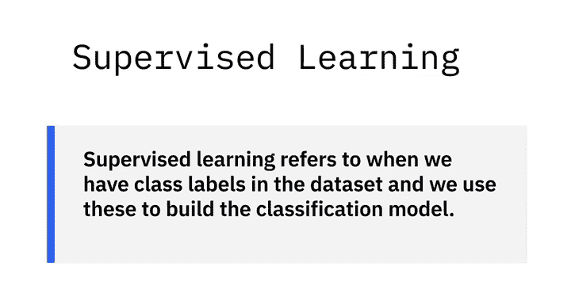

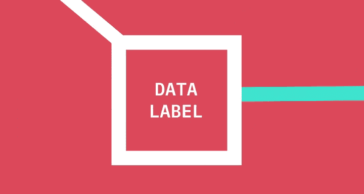

**监督学习**指的是数据集中包含类别标签，我们利用这些标签来构建分类模型。这意味着我们接收到的数据带有说明数据含义的标签。

在一个先前的例子中，我们有一个包含“年龄”或“性别”等标签的表格。

**无监督学习**则没有类别标签，我们必须从非结构化数据中发现类别标签。这可能涉及深度学习等技术，例如通过查看图片来训练模型。

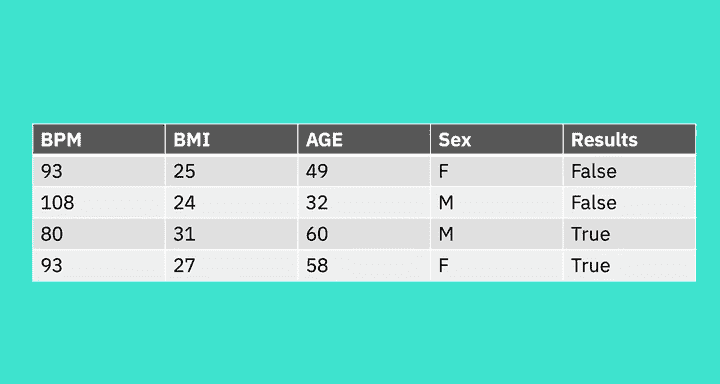

这类任务通常通过**聚类**来完成。

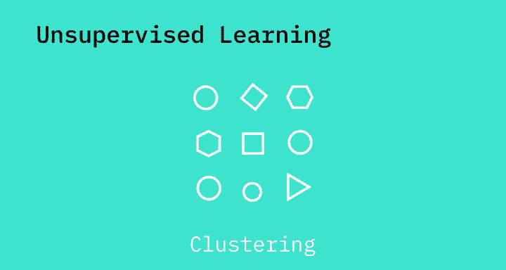

**强化学习**是一个不同的子集，它使用奖励函数来惩罚不良行为或奖励良好行为。

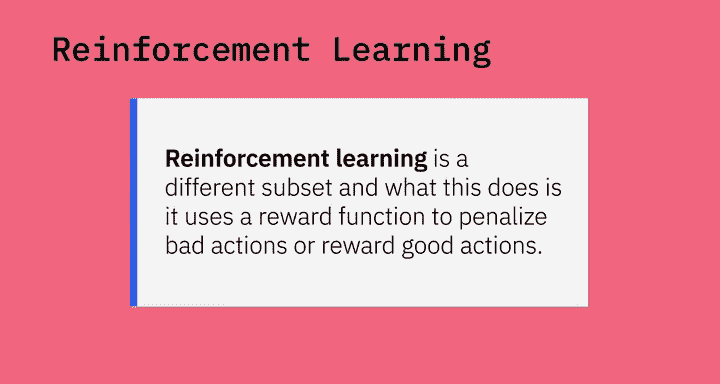

---

## 监督学习的细分：回归、分类与神经网络

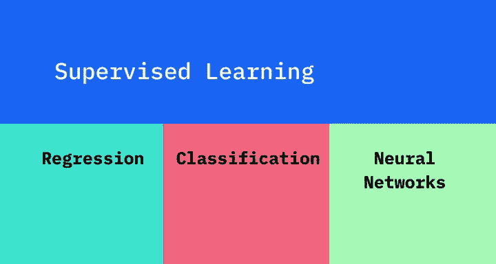

了解了三大类别后，我们聚焦于监督学习。监督学习可以进一步细分为三个子类别：回归、分类和神经网络。

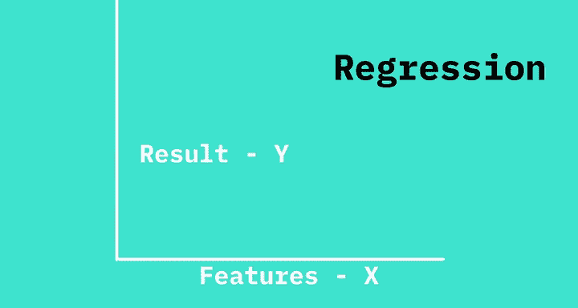

**回归模型**通过观察特征 **X** 与结果 **Y** 之间的关系来构建，其中 **Y** 是一个连续变量。

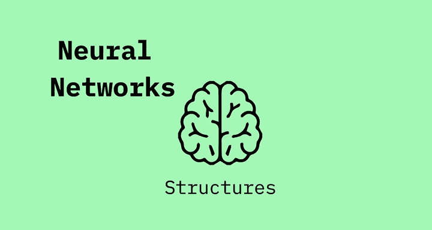

本质上，回归用于估计连续值。

**神经网络**指的是模仿人脑结构的模型。

---

## 🎼 分类：聚焦于离散值

与回归不同，**分类**专注于识别离散值。我们可以根据多个输入特征 **X** 来分配离散的类别标签 **Y**。

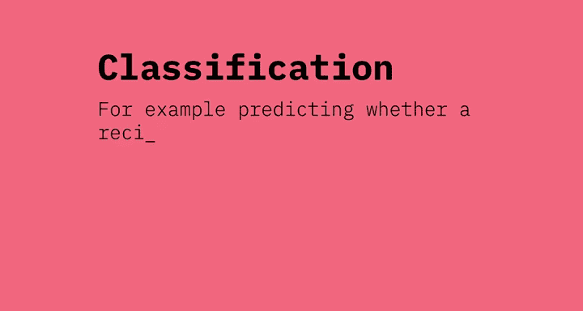

在一个先前的例子中，给定一组特征 **X**，如每分钟心跳次数、身体质量指数、年龄和性别，算法将输出 **Y** 分类为两个类别：真或假，以预测心脏是否会衰竭。

在其他分类模型中，我们可以将结果分为两个以上的类别。例如，预测一个菜谱是属于印度菜、中国菜、日本菜还是泰国菜。

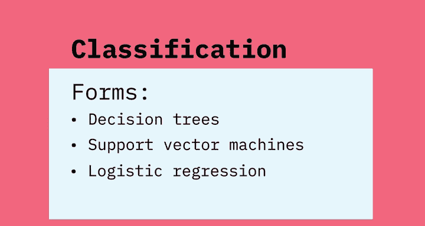

以下是几种常见的分类形式：
*   决策树
*   支持向量机
*   逻辑回归
*   随机森林

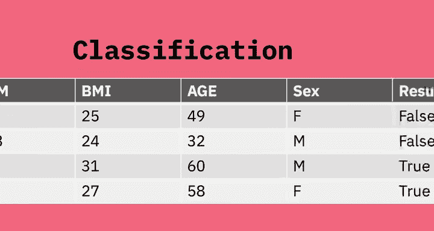

---

## 特征与分类过程

在分类任务中，我们需要从数据中提取**特征**。在这个例子中，特征就是每分钟心跳次数或年龄。

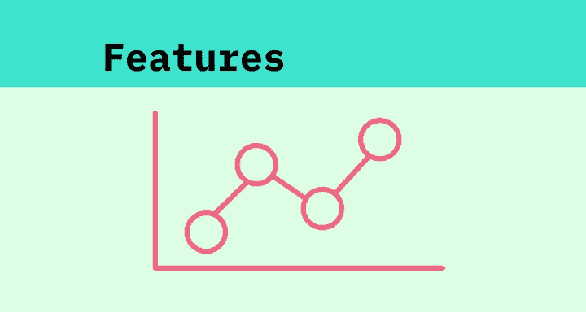

**特征**是输入模式的独特属性，有助于确定输出的类别。每一列是一个特征，每一行是一个数据点。

**分类**是预测给定数据点类别的过程。我们的分类器使用一些训练数据来理解给定的输入变量与该类别之间的关系。

---

## 🎼 模型训练详解

那么，“训练”究竟是什么意思呢？训练指的是使用学习算法来确定和开发模型的参数。虽然有许多算法可以实现这一点，但通俗地说，如果你正在训练一个模型来预测心脏是否会衰竭（即真或假值），你会向算法展示一些标记为“真”的真实数据，然后再向算法展示一些标记为“假”的数据。你将重复这个过程，使用带有真或假值（即心脏实际是否衰竭）的数据。

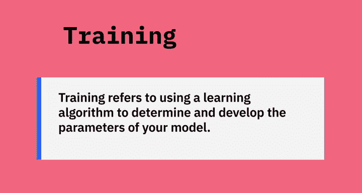

算法会不断修改其内部值，直到学会从指示心脏衰竭（真）或未衰竭（假）的数据中进行区分。

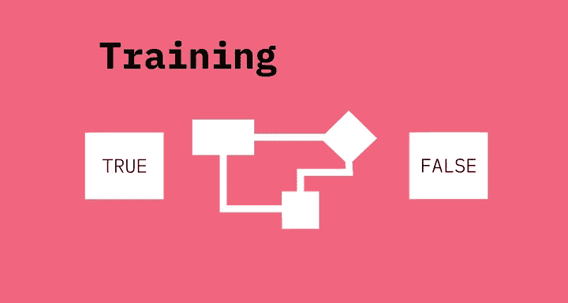

---

## 数据集划分与模型评估

在机器学习中，我们通常将一个数据集分成三个子集：训练集、验证集和测试集。

以下是每个子集的作用：
*   **训练子集**：用于训练算法的数据。
*   **验证子集**：用于验证结果并微调算法参数的数据。
*   **测试数据**：模型从未见过的数据，用于评估模型的性能。

然后，我们可以使用准确率、精确率和召回率等术语来表明模型的好坏。

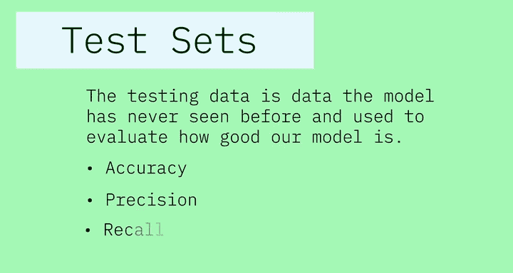

---

本节课中我们一起学习了机器学习的主要分类（监督、无监督、强化学习），深入探讨了监督学习下的回归、分类和神经网络任务，并详细解释了特征提取、模型训练的过程以及如何通过划分数据集来训练和评估模型。理解这些基础概念是进一步学习生成式人工智能工程的重要基石。