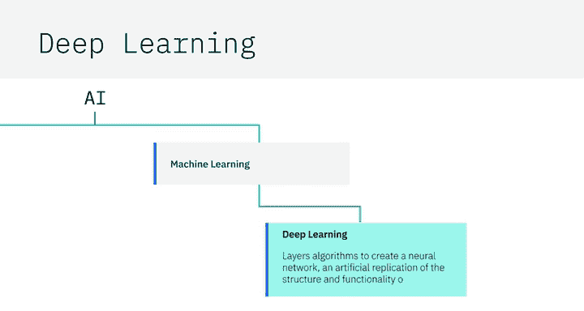
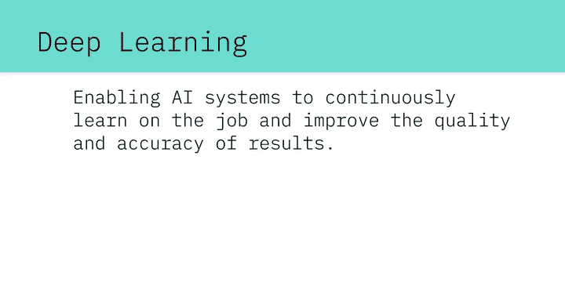
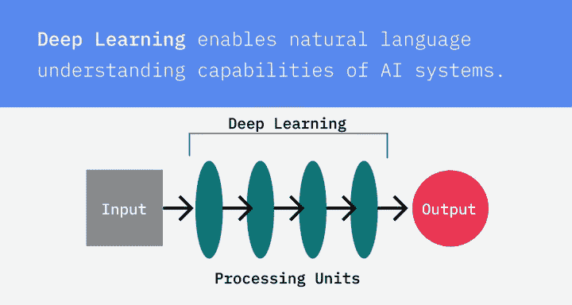
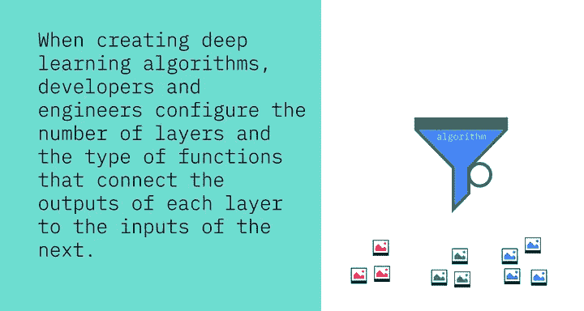
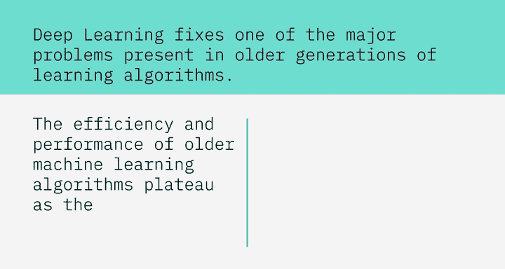
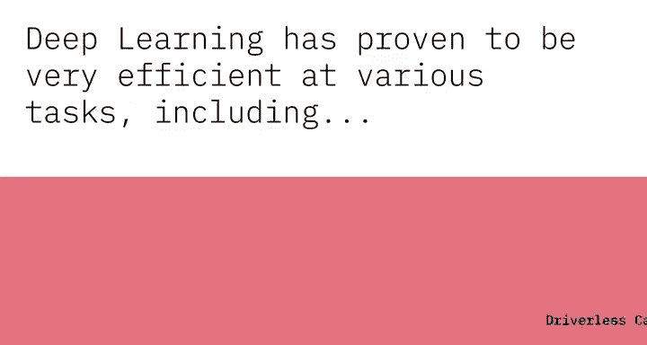

# 016：深度学习

## 概述

在本节课中，我们将要学习深度学习的基本概念。我们将了解深度学习与机器学习的关系、其核心工作原理、训练过程以及它的主要优势和应用领域。

## 深度学习：人工智能的专门子集

机器学习是人工智能的一个子集，而深度学习则是机器学习的一个专门子集。

深度学习通过将算法分层来创建神经网络，这是一种对大脑结构和功能的人工模拟。这种结构使得人工智能系统能够在工作中持续学习，并提高结果的质量和准确性。正是这种能力，使得系统能够从照片、视频和音频文件等非结构化数据中学习。

## 深度学习的核心：分层处理与上下文理解

例如，深度学习赋予了人工智能系统自然语言理解的能力，使它们能够推断出所传达信息的上下文和意图。

深度学习算法并不直接将输入映射到输出。相反，它们依赖于多个处理单元层。每一层将其输出传递给下一层，下一层进行处理后再传递给更下一层。正是由于这许多层次，它才被称为“深度”学习。

在创建深度学习算法时，开发人员和工程师需要配置**层数**以及连接每层输出与下一层输入的函数类型。

## 深度学习的训练过程

上一节我们介绍了深度学习的结构，本节中我们来看看它是如何被训练的。

然后，他们通过提供大量带标注的样本来训练模型。例如，你给一个深度学习算法成千上万张图片以及对应每张图片内容的标签。该算法会将这些样本通过其分层的神经网络运行，并调整神经网络每一层中变量的**权重**，以便能够检测出定义具有相似标签的图像的共同模式。

## 深度学习的核心优势：数据规模效应

深度学习解决了早期学习算法中存在的一个主要问题。当数据集增长时，机器学习算法的效率和性能会达到瓶颈，而深度学习算法随着被输入更多数据会持续改进。

## 深度学习的应用领域

深度学习已被证明在各种任务中非常高效，以下是其主要应用领域：

*   **图像描述**
*   **语音识别与转录**
*   **面部识别**
*   **医学影像分析**
*   **语言翻译**

此外，深度学习也是无人驾驶汽车的主要组成部分之一。

## 总结

本节课中我们一起学习了深度学习。我们明确了它是机器学习的一个专门分支，其核心是模仿人脑的分层神经网络结构。我们了解了它通过调整权重从标注数据中学习模式的过程，并认识到其性能会随着数据量的增加而持续提升。最后，我们列举了深度学习在图像、语音、医疗和自动驾驶等多个领域的强大应用。