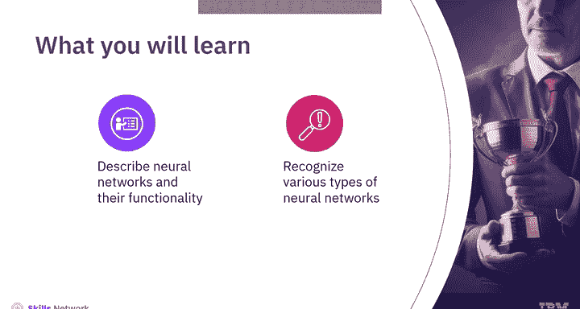
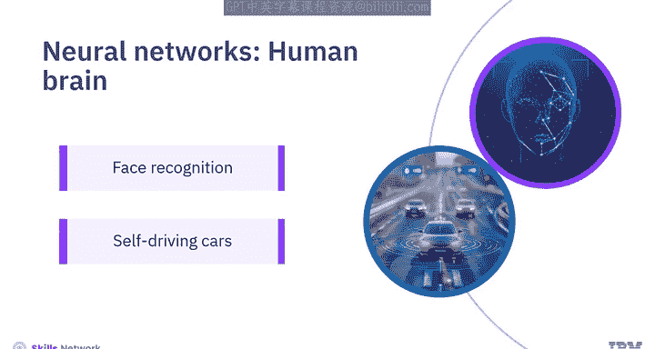
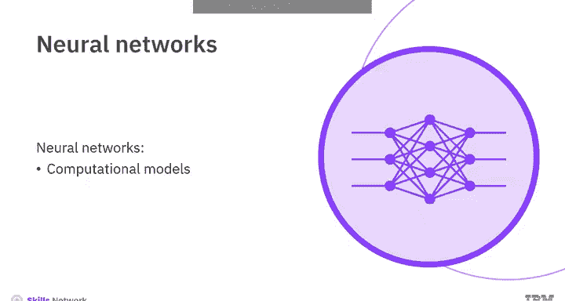
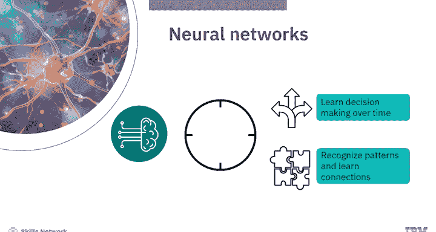
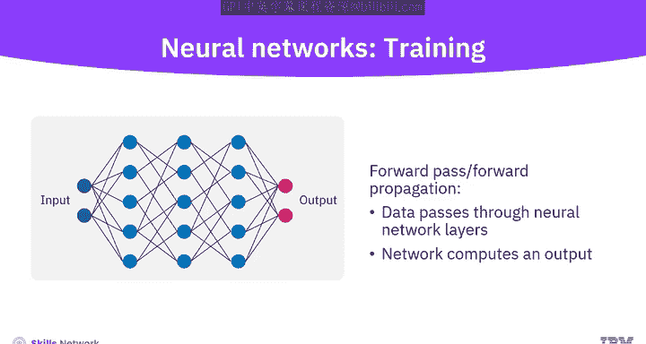
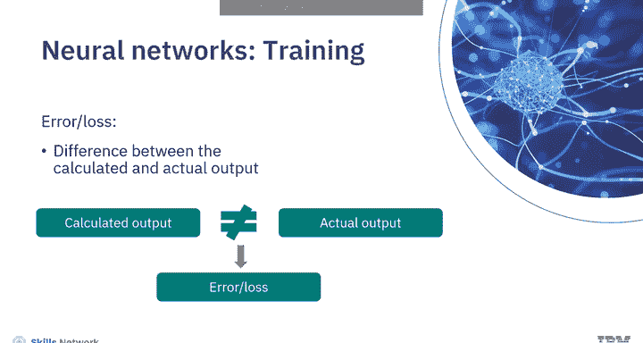
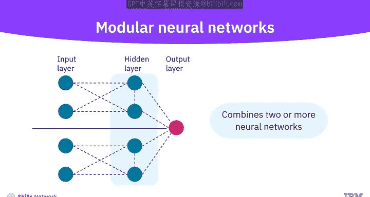
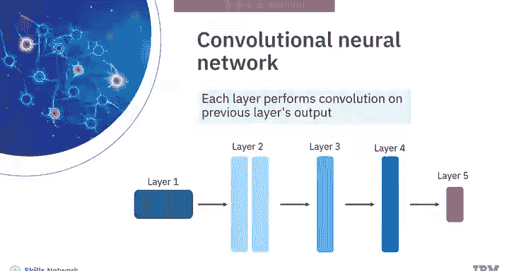
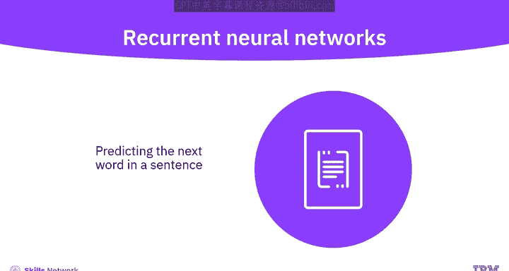
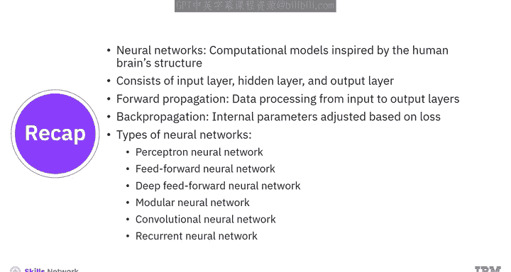

# 017：神经网络 🧠

在本节课中，我们将要学习神经网络的基本概念、工作原理以及主要类型。神经网络是人工智能系统的核心构建模块，其设计灵感来源于人脑的神经结构。通过学习，你将能够描述神经网络及其功能，并识别不同类型的神经网络。

---

## 神经网络简介

想象一下，教会一台机器像人脑一样学习，例如识别人脸和图像，或者独立驾驶汽车。这种非凡能力背后的机制就存在于神经网络之中。

神经网络是一种受人类大脑神经结构影响的计算模型。

---

## 神经网络的结构与工作原理

一个人工神经网络由相互连接的节点（称为神经元）组成。这些神经元接收输入数据，就像人脑的神经网络一样，并随着时间学习如何做出决策。通过向网络提供数据（例如猫和狗的图片），它可以学习识别模式并建立联系。网络接触的数据越多，学习效果就越好。

一个神经网络包含一个输入层和一个输出层，还可以包含一个或多个隐藏层。

*   **输入层**接收数据。例如，在图像识别任务中，输入层会接收图像的像素值。
*   **隐藏层**处理数据。每个隐藏层通过应用**激活函数**来转换输入数据。激活函数是数学函数，允许网络学习复杂的模式。
*   **输出层**产生网络处理的最终结果。

需要注意的是，当网络包含更多隐藏层时，它就变得更深，这就是“深度学习”一词的由来。

---

### 神经网络的训练过程

神经网络通过一个称为“训练”的过程进行学习。我们来理解一下这个过程的步骤。

首先，在**前向传播**步骤中，数据会通过神经网络的各层。在此步骤中，网络会计算出一个输出。

这个输出会与正确答案进行比较，以计算差异，这个差异称为**误差**或**损失**。这一步显示了网络的预测与实际结果的匹配程度。

接着，在**反向传播**步骤中，这个误差会被送回网络，以调整内部参数，例如**权重**和**偏置**。这种调整旨在减少未来预测的误差。

前向传播、误差计算和反向传播会使用不同的数据集重复多次，直到神经网络能够持续做出准确的预测。

---

## 神经网络的类型

上一节我们介绍了神经网络的基本训练过程，本节中我们来看看几种主要的神经网络类型。以下是几种常见的神经网络：

*   **感知机神经网络**：这是最简单的人工神经网络类型，仅包含输入层和输出层。
*   **前馈神经网络**：在这种网络中，信息单向流动（即向前）。每一层的神经元接收来自前一层的输入，然后将其输出传递给下一层的神经元。
*   **深度前馈神经网络**：与前馈网络类似，但包含不止一个隐藏层。
*   **模块化神经网络**：这种网络结合了两个或更多的神经网络来得出输出。
*   **卷积神经网络**：CNN是一种特别适合分析视觉数据的神经网络。“卷积”一词指的是一个数学运算，其中一个函数应用于另一个函数，结果是两个函数的混合。在CNN中，这个过程通过多个层进行，每一层对前一层的输出执行卷积操作。
*   **循环神经网络**：在RNN中，隐藏层中的每个神经元都会接收一个带有特定时间延迟的输入。这使得RNN能够考虑输入的上下文。你可以在需要访问当前迭代中先前信息的地方使用这种神经网络，例如，在预测句子中的下一个单词时，因为它会考虑对话的上下文和流程。

---

## 总结

本节课中，我们一起学习了神经网络。我们了解到，神经网络是受人类大脑结构启发的AI系统构建模块。神经网络由层组成，包括输入层、一个或多个隐藏层以及输出层。神经网络依靠前向传播来处理从输入层到输出层的数据，而反向传播则根据前向传播期间计算的损失来调整内部参数。我们还介绍了多种类型的神经网络，包括感知机神经网络、前馈神经网络、深度前馈神经网络、模块化神经网络、卷积神经网络和循环神经网络。