# 019：自然语言处理、语音与计算机视觉 👁️🗨️

在本节课中，我们将学习人工智能最常见的三个应用领域：自然语言处理、语音技术和计算机视觉。我们将逐一探讨它们的基本概念、工作原理以及实际应用。

---

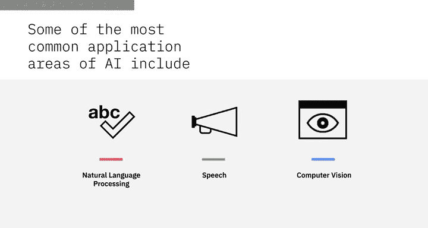

## 自然语言处理：让计算机理解人类语言 🗣️

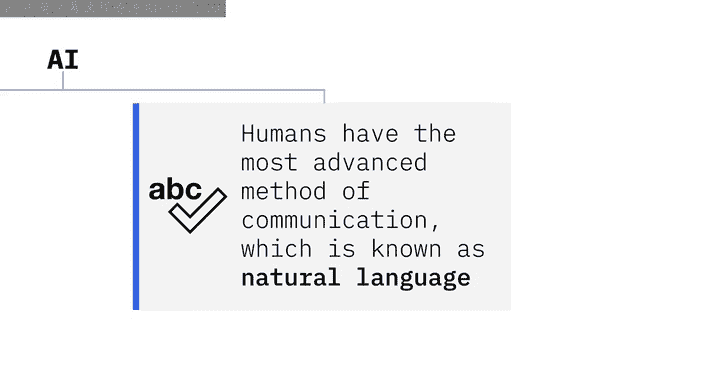

人类拥有最先进的交流方式，即自然语言。虽然人类可以使用计算机互相发送语音和文本信息，但计算机本身并不具备处理自然语言的能力。

自然语言处理是人工智能的一个子集，它使计算机能够理解人类语言的含义。NLP利用机器学习和深度学习算法来辨别词语的语义。

**核心公式/概念**：
- **NLP = 理解人类语言**
- 它通过语法、关系和结构上解构句子，并理解使用语境来实现。

例如，根据对话的上下文，NLP可以判断“cloud”一词是指“云计算”还是指“天空中漂浮的大量凝结水蒸气”。NLP系统还能理解意图和情感，例如判断一个问题是出于沮丧、讽刺还是恼怒。为了理解用户语言的真实意图，NLP系统通过一系列广泛的语言模型和算法进行推理。

自然语言处理被细分为许多与音频和视觉任务相关的子类别。

---

## 语音技术：语音与文本的转换 🔊

为了让计算机能用自然语言交流，它们需要能够将语音转换为文本，使交流更自然、易于处理；同时也需要能够将文本转换为语音，使用户无需盯着屏幕即可与计算机交互。

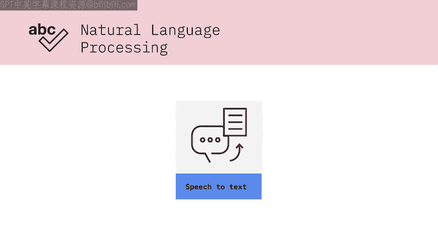

上一节我们介绍了自然语言处理，本节中我们来看看实现人机自然交互的关键技术：语音转换。

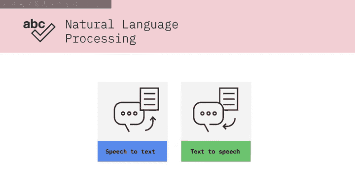

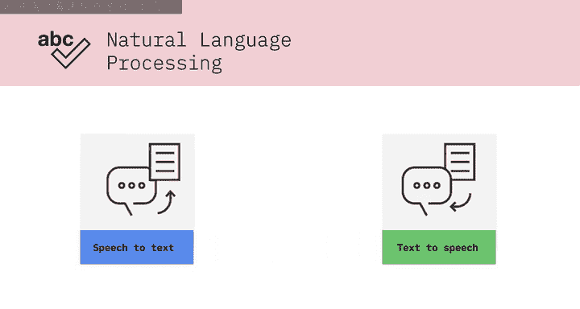

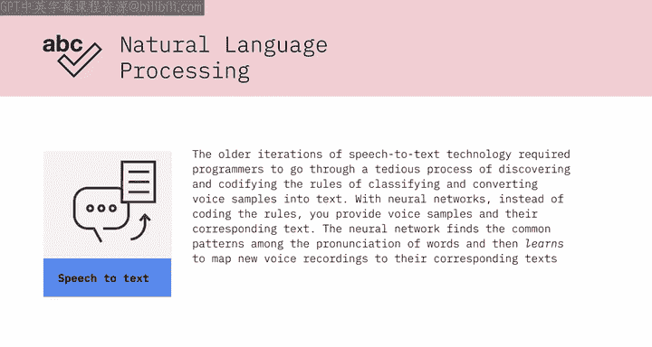

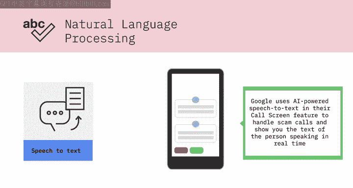

### 语音转文本

早期的语音转文本技术需要程序员经历一个繁琐的过程，即发现并编码规则，以对语音样本进行分类和转换。而借助神经网络，你只需提供语音样本及其对应的文本，无需编码规则。神经网络会找出单词发音之间的共同模式，然后学习将新的录音映射到对应的文本。

语音转文本技术的这些进步，是我们拥有实时转录功能的原因。以下是其应用实例：
*   **谷歌**在其“来电筛选”功能中使用AI驱动的语音转文本来处理诈骗电话并向你显示文字。
*   **YouTube**使用此技术提供自动隐藏式字幕。

### 文本转语音

语音转文本的反面是文本转语音，也称为语音合成。过去，创建一个语音模型需要数百小时的编码工作。现在，在神经网络的帮助下，合成人声已成为可能。其过程通常涉及两个神经网络：
1.  第一个神经网络（分类器）摄入一个人大量的语音样本，直到它能判断一个新的语音样本是否属于同一个人。
2.  第二个神经网络（生成器）生成音频数据，并将其通过第一个网络，看其是否验证为属于目标人物。如果不通过，生成器会修正其样本并再次通过分类器运行。两个网络重复此过程，直到生成听起来自然的样本。

以下是文本转语音的应用：
*   **公司**使用AI驱动的语音合成来提升客户体验，并赋予其品牌独特的声音。
*   **在医疗领域**，这项技术正在帮助肌萎缩侧索硬化症患者重获他们真实的声音，而不是使用计算机合成的声音。

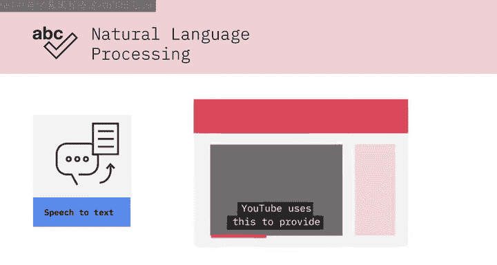

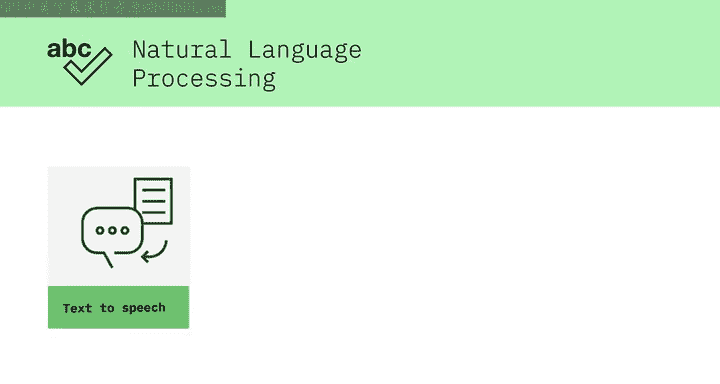

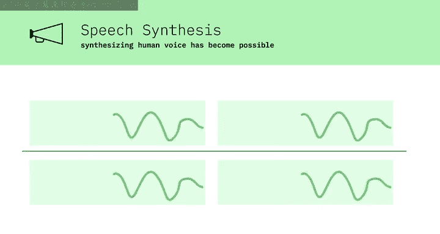

---

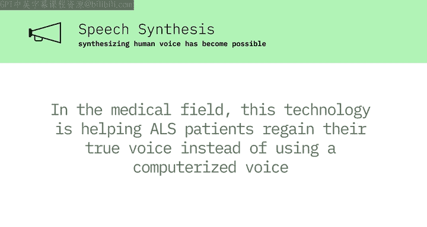

## 计算机视觉：让计算机“看见”世界 👁️

计算机视觉领域专注于复制人类视觉系统的部分复杂性，并使计算机能够像人类一样识别和处理图像及视频中的物体。计算机视觉是使数字世界能够与物理世界交互的技术之一。

近年来，由于深度学习和神经网络的进步，计算机视觉领域取得了巨大飞跃，在检测和标记物体等相关任务上甚至超越了人类。

以下是计算机视觉的关键应用：
*   **自动驾驶汽车**：这项技术使自动驾驶汽车能够理解周围环境。
*   **人脸识别**：它在人脸识别应用中扮演着至关重要的角色，使计算机能够将人脸图像与其身份匹配。
*   **增强现实与混合现实**：这项技术允许智能手机、平板电脑和智能眼镜等计算机设备在真实世界图像上叠加和嵌入虚拟物体。
*   **在线图片库**：像Google相册这样的在线图片库使用计算机视觉来检测物体，并按其所含内容的类型对图像进行分类。

---

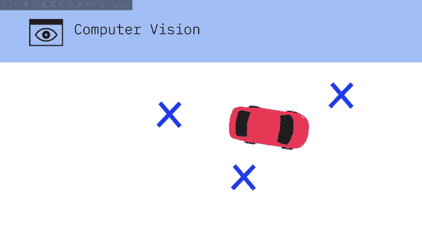

## 总结 📝

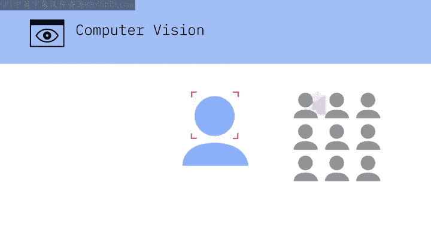

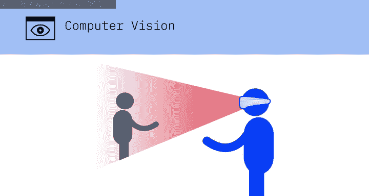

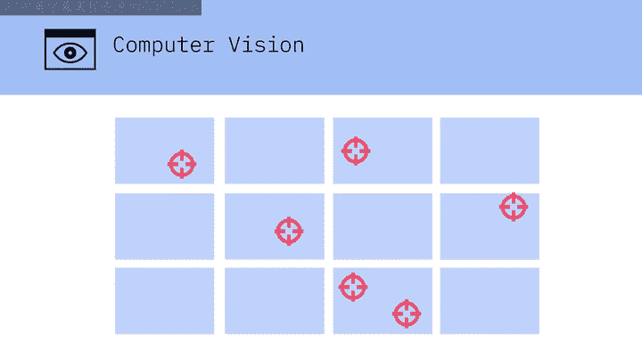

本节课中，我们一起学习了人工智能的三个核心应用领域。**自然语言处理**使计算机能够理解和处理人类语言；**语音技术**实现了语音与文本之间的双向转换，为人机交互提供了更自然的接口；**计算机视觉**则赋予计算机“看”和理解视觉世界的能力。这些技术共同构成了当今许多智能系统的基础，从虚拟助手到自动驾驶汽车，深刻改变着我们的生活和工作方式。