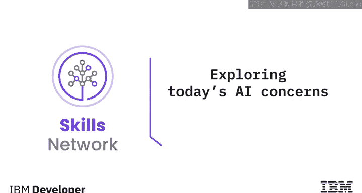
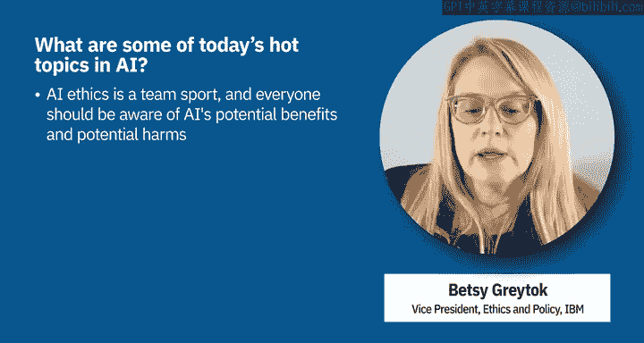
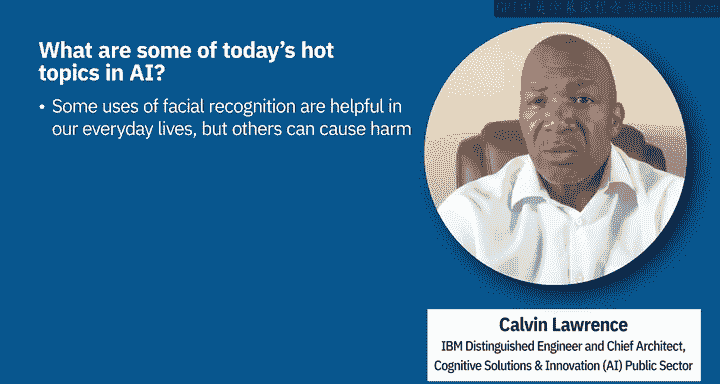
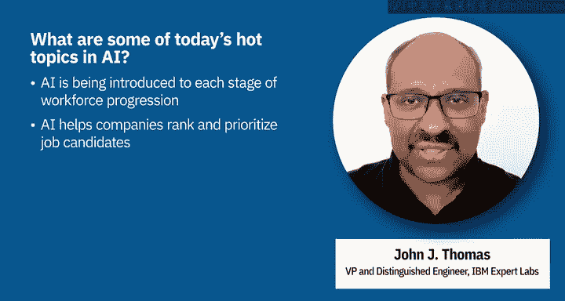
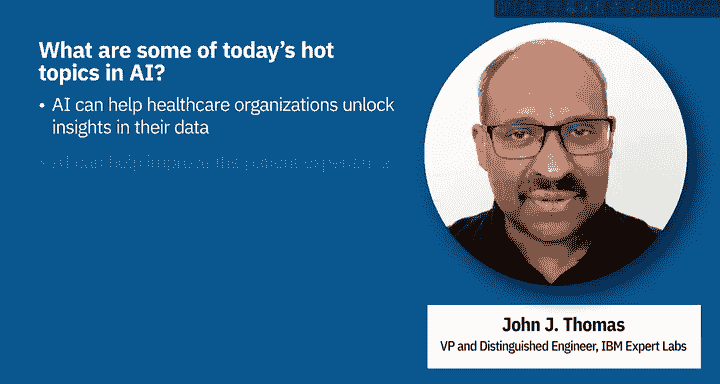

# 021：探索当今AI的担忧 🔍

在本节课中，我们将要学习当今人工智能领域的一些热点话题与担忧。我们将探讨可信AI的重要性，并深入了解AI在面部识别、招聘、社交媒体营销以及医疗保健等具体应用场景中引发的伦理与社会问题。

---

## 可信AI：当今AI的核心议题 🎯

上一节我们介绍了课程概述，本节中我们来看看当前AI领域的核心议题。人们经常问我当前AI的热点话题是什么。我的回答是，今天给出的答案很可能在下周甚至明天就会不同。AI世界极具活力，这是一件好事。它是一项新兴技术，拥有惊人的可能性，并有潜力以远超我们此前想象的速度解决诸多问题。然而，正如我们所看到的，在某些情况下，它也可能产生有害的后果。因此，我认为AI的热点议题是：我们如何负责任地运用它？

IBM提出了五大支柱来解决这个问题，概括了负责任AI的理念，即可解释性、透明度、稳健性、隐私性和公平性。我们可以更深入地探讨这些主题。但我想在此强调两点。

第一，这不是一项一劳永逸的工作。如果你打算使用AI，如果我们打算将其应用于社会，这不是你仅仅在开始或结束时才需要处理的事情。你必须在AI的整个生命周期中持续关注这些问题。无论你是在规划阶段、设计AI、训练AI、部署AI，还是作为与AI交互的最终用户，都需要不断思考这五大支柱。

第二，我认为更重要的是，这是一项团队运动。我们都需要意识到AI带来的潜在好处和潜在危害，并鼓励每个人提出问题，为人们保持对AI工作原理及其行为的好奇心留出空间。只有这样，我们才能真正利用它来解决有益的问题，取得卓越的成果，并减轻任何潜在的危害。

所以，请保持好奇心。

---

## 面部识别技术：潜力与风险 👁️

上一节我们探讨了可信AI的框架，本节中我们来看看AI在面部识别技术中的应用。在设计围绕人工智能的解决方案时，面部识别已成为一个突出的用例。

以下是正在设计的模型和算法的三种典型类别：

*   **面部检测**：仅检测一个物体是否是人脸，而不是狗或猫等。这种面部识别不会唯一地识别该面孔可能属于谁。
*   **面部认证**：你可能使用这种面部识别来解锁你的iPhone或Android设备。在这种情况下，我们通过将面部图像的特征与之前存储的单一图像进行比较，提供一对一的认证。这意味着你实际上只将图像与iPhone或Android设备所有者的特定图像进行比较。
*   **面部匹配**：在这种情况下，我们将图像与其他图像的数据库进行比较。这与前一种情况不同，模型试图将个人的面部与属于其他人的图像或照片数据库进行匹配。

面部识别有许多不同的例子，其中许多无疑你已经在你日常活动中体验过。有些已被证明是有帮助的，而另一些则被证明不那么有帮助，还有一些则被证明本质上是直接有害的，某些人群因使用这些面部识别系统而受到了伤害。

我们看到，AI系统中的面部识别解决方案在诸如机场导航、通过安检线，或者使用我们之前讨论过的例子（如使用面部识别解锁iPhone、家门或汽车门）等场景中提供了重要价值。这些都是面部识别技术的有益用途。

但也存在一些必须禁止的明确案例和用途。这些可能包括未经本人明确许可在人群中识别个人，或对个人或群体进行大规模监控。这类技术应用引发了重要的隐私、公民权利和人权关切。

当被错误的人以错误的方式使用时，面部识别技术无疑可以被用来压制异议、侵犯少数群体的权利，或者仅仅抹去你对隐私的基本期望。

---

## AI在招聘中的应用：效率与偏见 ⚖️

上一节我们讨论了面部识别技术的双面性，本节中我们来看看AI在招聘流程中的应用。AI正被越来越多地引入到职业发展的各个阶段：招聘、入职、职业发展（包括晋升和奖励）、处理人员流失等。

以筛选招聘为例。考虑一个收到成千上万份工作申请的组织，人们申请各种工作：前台、后台、季节性、永久性等。AI可以帮助你对申请者进行排名和优先级排序，针对目标职位空缺，向招聘经理呈现一份顶级候选人名单，而不是让庞大的团队坐下来筛选所有这些申请。AI解决方案可以处理简历中的文本，并将其与其他结构化数据结合，以辅助决策。

现在，我们需要谨慎地设置防护措施。我们需要确保AI在招聘中的使用不会在性别、种族等敏感属性上产生偏见。即使这些属性没有被AI直接使用，也可能通过代理属性（如邮政编码或之前从事的工作类型）悄然渗入。

---

## 社交媒体营销：精准与伦理 📱

上一节我们探讨了招聘中的AI偏见风险，本节中我们来看看AI在社交媒体营销中的应用。这是当今AI的热点话题之一，它彻底改变了品牌在TikTok、LinkedIn、Twitter、Instagram、Facebook等社交媒体平台上与受众互动的方式。

当今的AI可以为你创建广告，为你创建社交媒体帖子，帮助你精准定位这些广告，并可以使用情感分析为你识别新的受众。所有这些都为营销人员带来了惊人的效果，提高了营销活动的有效性，同时降低了运行这些活动的成本。

然而，AI为在社交媒体平台上进行营销所提供的这些技术和能力，也引发了一些伦理问题。营销之所以成功，很大程度上归功于社交媒体平台从其用户那里收集的所有数据。表面上，收集这些数据是为了为最终用户提供更个性化的体验。但收集了哪些数据以及你是否同意他们使用这些数据，并不总是明确的。

现在，这些对品牌营销活动如此有效的技术，同样可以应用于生成错误信息、阴谋论，无论是政治还是科学方面的错误信息。这对我们的整个社会产生了可怕的影响。这就是为什么所有企业都必须遵守一些明确的原则，围绕透明度、可解释性、信任和隐私，来规范他们如何使用AI或将AI构建到他们的解决方案和平台中，这一点至关重要。

---

## AI在医疗保健中的应用：预测与公平 🏥

上一节我们审视了社交媒体营销中的伦理挑战，本节中我们来看看AI在医疗保健领域的应用。AI的使用正在所有医疗保健领域（医疗保健提供者、支付方、生命科学等）不断增加。

支付方组织正在使用利用理赔数据的AI和机器学习解决方案，通常将其与健康的社会决定因素等其他数据集相结合。一个顶级用例是用于协调护理的疾病预测。例如，预测会员群体中谁可能在未来三个月内出现不良状况（如急诊就诊），然后提供正确的干预和预防形式。

在这种情况下，公平护理变得非常重要。我们需要确保AI在年龄、性别、种族等所有敏感属性上没有偏见。当然，在所有领域中，对话式AI（虚拟代理以及帮助人类更好地服务会员群体的系统）已成为标配。

在医疗保健中所有这些AI用例中，我们看到了一些共同点：能够从组织拥有的丰富数据集中解锁洞察、改善会员或患者体验，以及设置防护措施以确保AI是可信的。

---

## 总结 📝

本节课中，我们一起学习了当今人工智能领域的主要担忧与应用伦理。我们探讨了构建可信AI的五大支柱，并深入分析了AI在面部识别、招聘、社交媒体营销及医疗保健等具体领域带来的机遇与挑战。关键点在于，AI的应用必须贯穿责任与伦理的考量，在整个生命周期中关注公平、透明与隐私，并鼓励全社会的共同参与和监督，以确保这项强大技术能够造福社会，同时将其潜在危害降至最低。