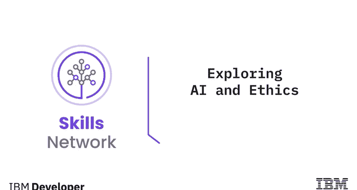
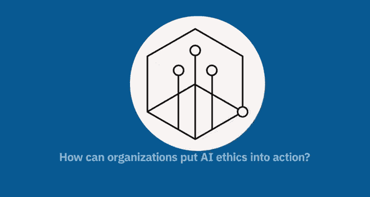
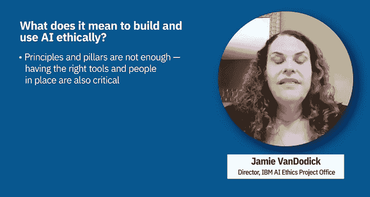
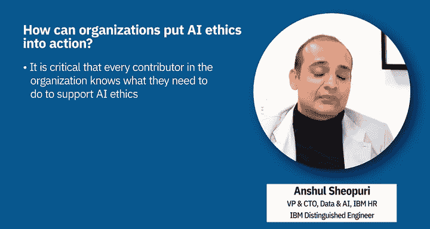

# 022：探索人工智能与伦理 🤖

在本节课中，我们将要学习人工智能伦理的概念、重要性以及如何在组织中付诸实践。我们将探讨人工智能伦理为何是一个社会技术性挑战，以及如何负责任地构建和使用人工智能。

## 人工智能伦理的重要性

人工智能在我们的生活中无处不在。我们在线使用信用卡购物、在网络上搜索信息、在社交平台上发布内容或关注他人，甚至在驾驶时使用基于人工智能的导航和驾驶辅助功能时，都会用到它。

这种普遍性给我们的生活以及社会结构和平衡带来了快速而重大的转变。因此，人工智能不仅是一门技术和科学学科，也具有非常重大的社会影响。这引发了许多伦理问题，涉及人工智能应如何设计、开发、部署、使用和监管。

## 人工智能的社会技术维度

人工智能的社会技术维度要求我们努力识别所有利益相关者，这远远超出了技术专家的范畴，还包括社会学家、哲学家、经济学家、政策制定者以及受该技术部署影响的所有社群。

在定义生态系统、在人工智能开发和部署的所有阶段、以及在人工智能对部署场景的影响中，包容性都是必要的。没有包容性，我们就有风险只为部分人创造人工智能，而将许多其他人置于不利地位。每个人都需要参与定义我们想要利用人工智能和其他技术（作为手段而非目的）构建的未来愿景。

为了实现这一愿景，需要适当的指导方针来引导人工智能的创造和使用朝着正确的方向发展。技术工具是有用且必要的，但它们应辅以原则、保障措施、定义明确的流程和有效的治理。

我们不应认为所有这些会减缓创新速度。

## 伦理作为创新的加速器

想想交通规则。交通信号灯、先行权规则、停车标志和速度限制似乎会让我们减速。然而，如果没有它们，我们并不会开得更快，反而会因为对其他车辆和行人的状态完全不确定而开得更慢。

人工智能伦理识别并解决这项技术引发的社会技术问题，确保支持并促进正确的创新，从而使通往我们期望的未来的道路更快。

正如IBM首席执行官所言，信任是我们运营的许可证。我们通过负责任地使用技术的政策、计划、合作伙伴关系和倡导赢得了这种信任。一百多年来，IBM一直处于创新的前沿，为我们的客户和社会带来利益。

这种方法绝对适用于人工智能的开发、使用和部署。因此，伦理应嵌入到设计和开发流程的生命周期中。

## 构建值得信赖的人工智能

伦理决策不仅仅是一种技术问题解决方法。相反，应基于原则、价值观、标准、法律和对社会的利益，采取一种伦理的、社会学的、技术的和以人为本的方法。因此，拥有这个基础是重要且必要的，但从哪里开始呢？

一个很好的起点是一套指导原则。在IBM，我们称我们的原则为“信任与透明原则”，共有三条：
1.  **人工智能的目的是增强而非取代人类智能。**
2.  **数据和洞察力属于其创造者。**
3.  **包括人工智能系统在内的新技术必须透明且可解释。**

最后一条原则建立在我们的五大支柱之上：
*   **透明**：通过分享人工智能的用途和运作方式来增强信任。
*   **可解释**：系统应能解释其决策。
*   **公平**：当系统经过适当校准时，它应能协助做出更好的选择，并确保公平性。
*   **健壮**：意味着系统应该是安全的。
*   **隐私保护**：保障隐私和权利。

我们知道仅有原则和支柱是不够的。我们拥有一套广泛的工具和才华横溢的从业者，可以帮助诊断、监控、促进我们所有的支柱，并进行持续监控以减轻风险和意外后果。

## 将人工智能伦理付诸实践

将人工智能伦理付诸实践的第一步，与任何事情一样，是关于建立理解和意识。这是为了让您的团队能够思考人工智能伦理，以及将其付诸实践意味着什么。

无论您正在构建和部署什么解决方案，让我们举个例子：如果您正在构建一个学习解决方案并将其部署在公司内部。负责此事的HR负责人应该思考：这个解决方案是否以用户为中心设计？我们是否与用户共同创建了解决方案？它如何确保不同群体的所有员工都能平等获得机会？

对人工智能伦理的深刻理解，并持续反思这些问题，是将人工智能伦理付诸实践的关键基础。

将人工智能伦理付诸实践的第二步，是在建立了理解和意识、并且每个人都在反思这个话题之后，建立一个治理结构。这里的关键点是，这是一个为了规模化实践人工智能伦理的治理结构。它不是指在某个市场或业务单元中孤立地进行一次，而是指一个能够大规模运作的治理结构。

因此，我们讨论了作为基础的理解和意识，以及作为领导者责任的第二步——治理结构。一旦具备了这两个要素，第三步就是**操作化**。

您如何确保在马来西亚或波兰的开发人员、数据科学家或供应商知道如何将人工智能伦理付诸实践，这对他们意味着什么？在全球层面建立结构是一回事，但如何确保它在各个市场以及每个用户、每个数据科学家、每个开发人员那里都能大规模地操作化？

## 明确操作化支柱

这一切都关乎于明确值得信赖的人工智能支柱。对IBM而言，它们是：透明、可解释、公平、健壮和隐私保护。

让我们回到学习解决方案的例子。您是以用户为中心设计的吗？想想我们认为一流的透明推荐系统，比如您最喜欢的电影流媒体服务或打车服务。它透明吗？它可解释吗？它是否告诉您推荐内容是什么以及为什么做出这些推荐，同时也告诉您作为用户，最终决定权在您手中？

公平性在于通过确保不同群体不仅采用流程，也获得结果，从而给予每个人平等的机会。健壮性、隐私保护……每个数据科学家、开发人员和每个供应商都需要以非常操作化的方式理解这些对我们意味着什么。

---

在本节课中，我们一起学习了人工智能伦理的核心概念及其重要性。我们了解到人工智能伦理是一个需要多方参与的社会技术挑战，并探讨了构建值得信赖人工智能的三大原则与五大支柱。最后，我们明确了将伦理付诸实践的三个关键步骤：建立理解与意识、设立治理结构以及实现具体操作化。遵循这些指导，可以帮助组织负责任地开发和部署人工智能技术。