# 023：定义AI伦理 🤖⚖️

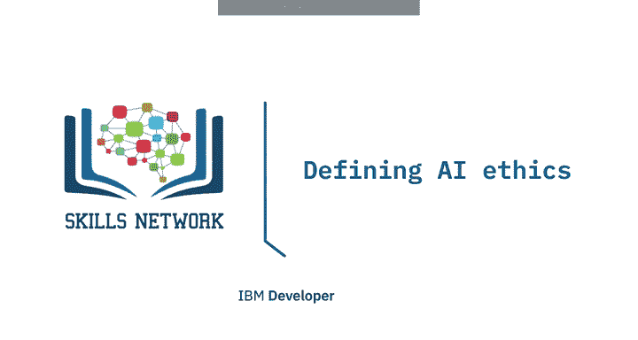

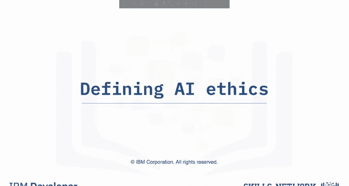

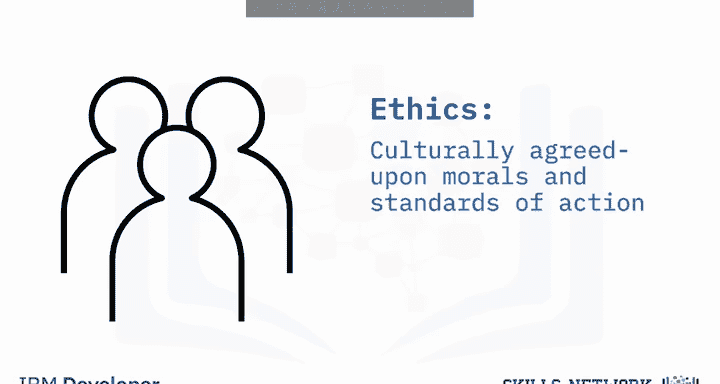

在本节课中，我们将要学习人工智能伦理的定义及其核心支柱。我们将探讨为何在构建和使用AI时，将伦理置于核心至关重要，并详细解析构成AI伦理基础的五个关键方面。

人类依赖文化上公认的道德和行为标准，即伦理，来指导其决策过程，特别是那些影响他人的决策。

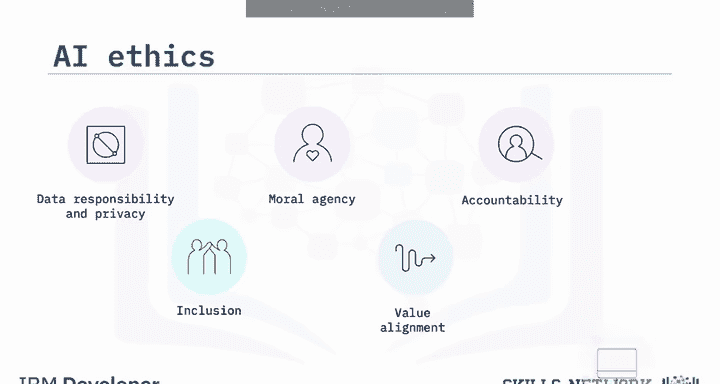

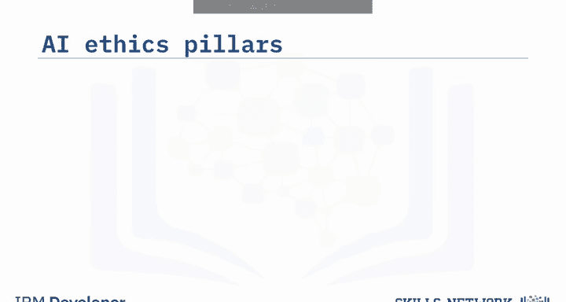

随着人工智能越来越多地被用于自动化和增强决策，将伦理置于AI构建的核心变得至关重要，以确保其结果符合人类的伦理和期望。

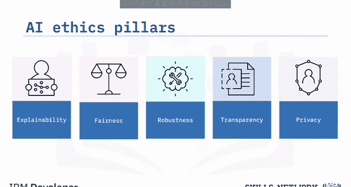

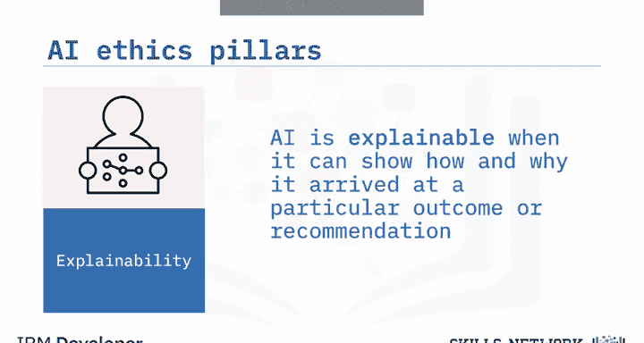

AI伦理是一个多学科领域，旨在研究如何最大化AI的积极影响，同时减少其风险和负面影响。它探讨诸如数据责任与隐私、包容性、道德主体性、价值对齐、问责制和技术滥用等问题，以理解如何以符合人类伦理和期望的方式构建和使用AI。

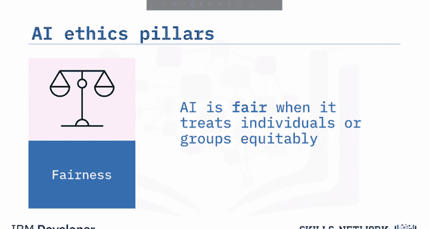

上一节我们介绍了AI伦理的重要性与定义，本节中我们来看看构成AI伦理的五个核心支柱。

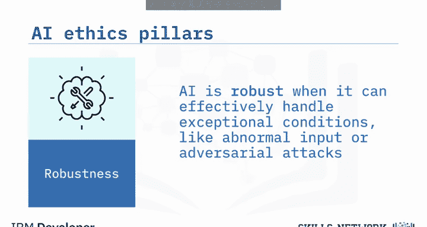

以下是AI伦理的五大支柱：**可解释性**、**公平性**、**鲁棒性**、**透明性**和**隐私性**。

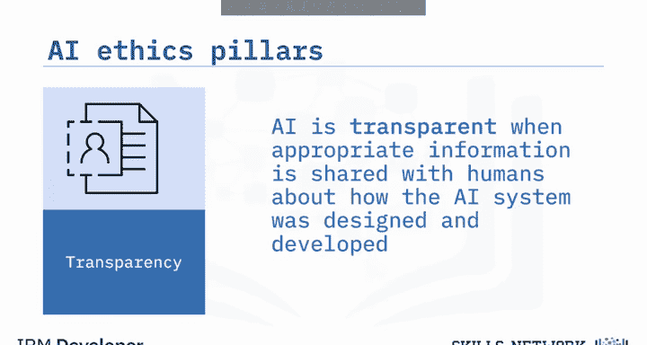

这些支柱是帮助我们**将伦理原则嵌入AI系统**的重点关注领域。

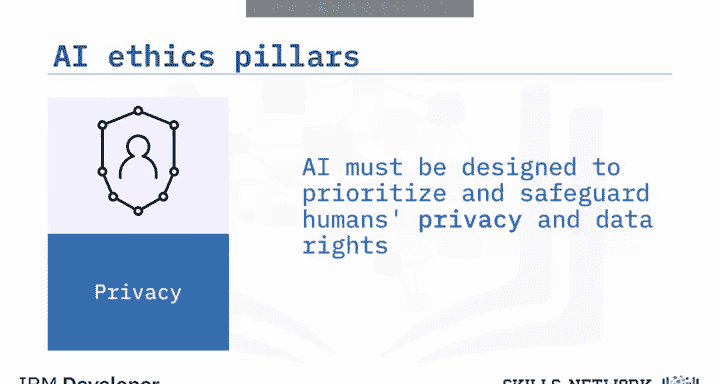

*   **可解释性**：当AI能够展示其如何以及为何得出特定结果或建议时，它就是可解释的。你可以将可解释性理解为AI系统在“展示其工作过程”。
*   **公平性**：当AI公平地对待个人或群体时，它就是公平的。AI可以通过抵消人类偏见来帮助人类做出更公平的选择。但需注意，偏见也可能存在于AI中，因此必须采取措施来减轻它。
*   **鲁棒性**：当AI能够有效处理异常情况（如异常输入或对抗性攻击）时，它就是鲁棒的。鲁棒的AI旨在能够承受有意和无意的干扰。
*   **透明性**：当关于AI系统如何设计和开发的适当信息与人类共享时，AI就是透明的。透明性意味着人类能够获取相关信息，例如用于训练AI系统的数据是什么、系统如何收集和存储数据，以及谁有权访问系统收集的数据。
*   **隐私性**：由于AI会摄入大量数据，其设计必须优先考虑并保护人类的隐私和数据权利。为尊重隐私而构建的AI仅收集和存储其运行所需的最少量数据，并且在未经用户同意等考虑下，收集的数据绝不应被挪作他用。

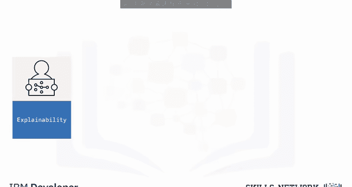

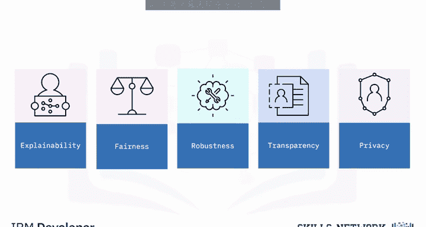

本节课中我们一起学习了AI伦理的定义及其五大支柱。总而言之，**可解释性、公平性、鲁棒性、透明性和隐私性**这五大支柱共同帮助我们更合乎伦理地设计、开发、部署和使用AI，并理解如何以符合人类伦理和期望的方式构建和使用AI。