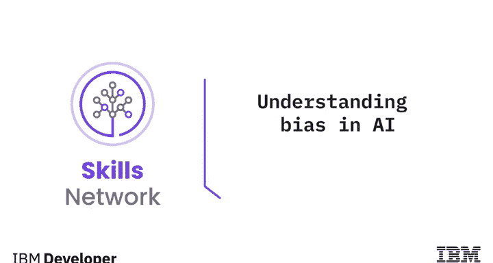
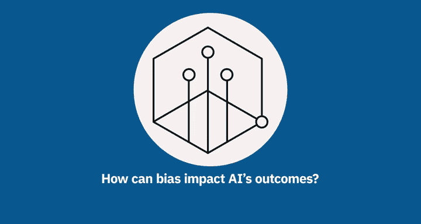
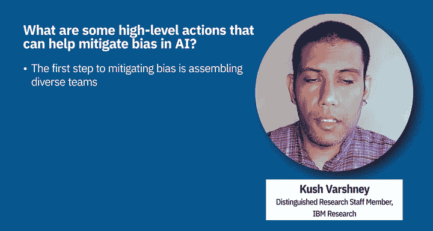
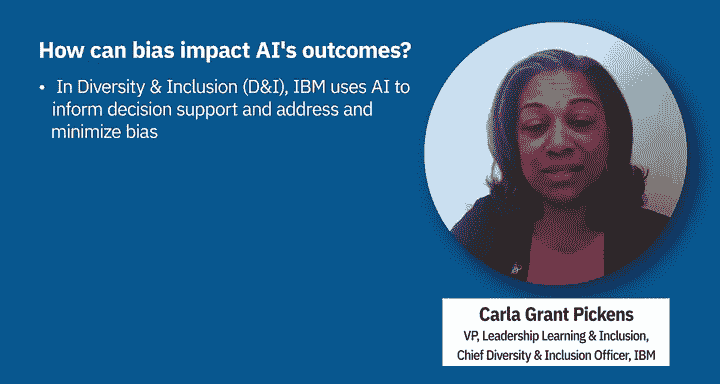

# 024：理解人工智能中的偏见 🧠

在本节课中，我们将要学习人工智能（AI）领域中的一个核心议题：偏见。我们将探讨偏见如何在AI系统中产生，它可能带来的影响，以及如何开始着手缓解这些偏见。

## 偏见在人工智能中的定义与影响

上一节我们介绍了课程主题，本节中我们来看看偏见的具体含义。人工智能中的偏见，指的是在关键决策任务中，AI系统表现出不受欢迎的行为，对某些群体或个人造成系统性不利影响。这些任务可能涉及贷款审批、招聘，甚至刑事司法。

例如，一个帮助决定谁应获得额外预防性医疗保健的AI系统，如果分配给白人的资源多于黑人，就体现了偏见。另一个例子是招聘算法，如果AI系统给予符合条件的男性比符合条件的女性更多的面试机会，这也是一种偏见。

## 偏见的来源 📊

理解了偏见的表现后，我们需要探究其根源。AI或机器学习系统是基于人类决策者过去所做的历史决策进行训练的。因此，过去的决策者自身可能存在的显性或隐性偏见，会通过**偏见数据**反映在训练数据中。

以下是偏见产生的几个主要来源：

*   **历史数据中的偏见**：训练数据本身记录了人类过去的偏见决策。
*   **数据采样偏差**：在特定数据集中，某些群体可能被**过度代表**或**代表不足**。
*   **数据处理引入的偏差**：在数据科学项目的数据准备阶段，即使是特征工程这样的步骤也可能引入新的偏差。例如，在医疗保健案例中，如果将住院、门诊和急诊费用合并为一个单一特征，可能会比对非裔美国人产生更多偏见；而将它们作为独立特征处理，引入的偏见则少得多。
*   **问题定义偏差**：对问题本身的定义可能就有偏差。例如，试图预测“犯罪性”或“未来犯罪”，但使用“逮捕次数”作为指标是不合适的，因为警察在某些社区的巡逻更频繁，且被逮捕不等于有罪。

## 如何缓解偏见 ⚖️

既然我们讨论了偏见的多种来源，就需要采取行动来消除这些源头。缓解偏见是一个多层面的过程。

首先，**认识到偏见的存在**至关重要。组建一个拥有多元生活经验的团队，有助于识别可能存在的危害和偏见。

其次，**寻找偏见较少的数据集**是另一种有效方法。

最后，还存在**技术性方法**。如果我们在有偏见的数据上训练机器学习模型，可以引入额外的约束或其他统计度量来减轻偏见。IBM已经开发了多种此类算法，其中许多已在开源工具包“AI Fairness 360”中提供。

## IBM的实践与承诺 🛡️

为了确保技术对社会产生积极影响，IBM设立了AI伦理委员会，致力于通过“Good Tech”实现有意识的包容。该委员会由多元化的IBM员工组成，专注于研究消除偏见，并在此领域建立标准。

IBM在多个内部领域运用AI和数据技能来应对偏见：

*   **技术开发**：利用技术开发资产以解决偏见问题，并关注包容性语言和技术术语（如“语言至关重要”倡议）。
*   **解决方案测试**：确保对解决方案进行测试，以降低偏见出现的概率和可能性。
*   **多元化与包容性（D&I）**：使用AI和数据分析来为决策提供支持，同时最小化偏见的潜在影响。
*   **人力资源（HR）**：在薪酬、留任、招聘和晋升决策中，利用AI和数据洞察来增强决策支持，这有助于满足全球合规要求并采取主动行动。

## 总结

本节课中，我们一起学习了人工智能中偏见的核心概念。我们明确了偏见是指在AI决策中对特定群体产生系统性不利影响的行为。我们探讨了偏见产生的多个来源，包括历史数据偏见、采样偏差、数据处理偏差以及问题定义偏差。最后，我们了解了缓解偏见的几种途径，包括提高意识、选择更好的数据以及采用技术工具，并看到了IBM在这些方面的具体实践。理解并应对偏见，对于构建负责任、公平的人工智能系统至关重要。