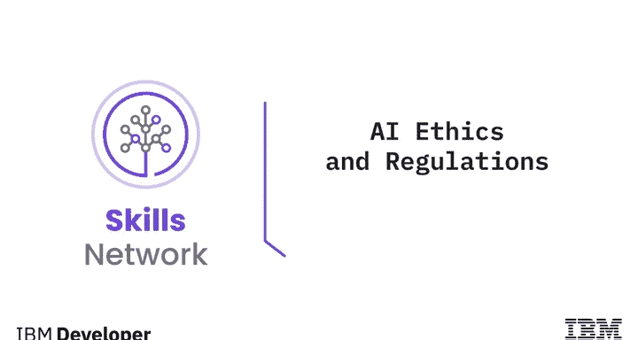
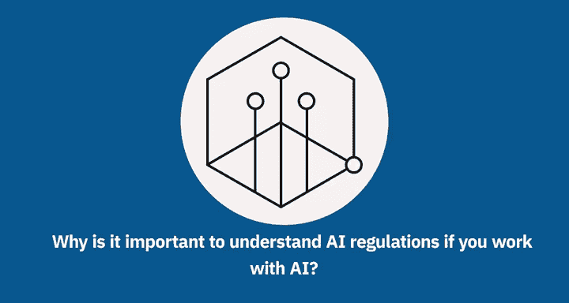
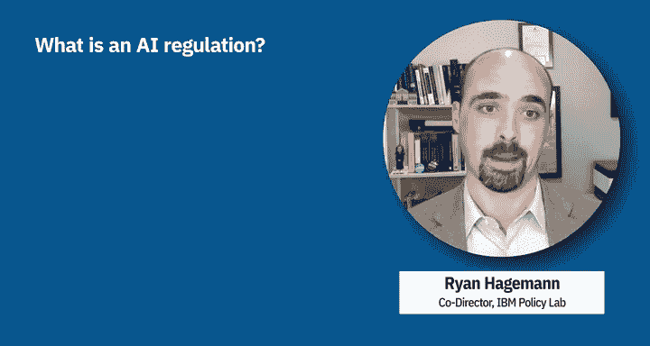
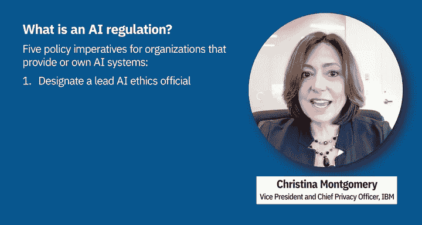

# 025：AI伦理和法规 📜

在本节课中，我们将要学习人工智能的法规是什么，AI法规如何与AI伦理相关联，以及为什么对于从事AI相关工作的人来说，理解AI法规至关重要。

## 什么是AI法规？⚖️

上一节我们介绍了课程主题，本节中我们来看看AI法规的具体定义。

法规是由政府制定、可通过法律强制执行的规则。围绕人工智能的法规环境正在迅速发展。为了在法律和伦理的框架下设计、开发、部署和使用AI，理解关键的法规内容非常重要。

## IBM的立场与精准监管框架 🎯

理解了法规的基本概念后，我们来看看行业内的具体主张。IBM的立场是呼吁对人工智能进行精准监管，并支持那些旨在增加公司开发与运营可信赖AI的责任的针对性政策。

**精准监管**指的是基于风险、结合具体情境，并将责任分配给最接近风险一方的监管方式，这种责任方可能在AI生命周期的不同阶段发生变化。

具体而言，IBM提出了一个精准监管框架，该框架为提供和/或使用AI系统的组织包含了五项政策要务。

以下是这五项要务的详细列表：

*   **指定AI伦理官员**：任命一名负责确保符合可信赖AI标准的首席官员。
*   **针对不同风险制定不同规则**：换言之，根据具体情境监管AI，而非监管技术本身。
*   **不要隐藏你的AI**：使其透明化。
*   **解释你的AI**：换言之，使其可解释，而非一个“黑箱”决策。
*   **测试你的AI是否存在偏见**。

## 总结 📝

本节课中我们一起学习了人工智能法规的基础知识。我们了解到法规是具有法律强制力的政府规则，其环境在快速变化。IBM倡导对AI实施精准监管，并提出了一个包含五项核心政策的框架，旨在通过明确责任、区分风险、提升透明度和可解释性，以及测试偏见，来推动可信赖AI的发展。理解这些法规和伦理原则，对于负责任地开发和应用AI技术至关重要。