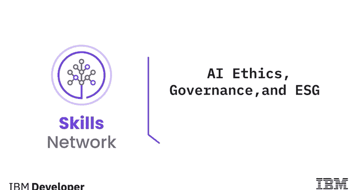
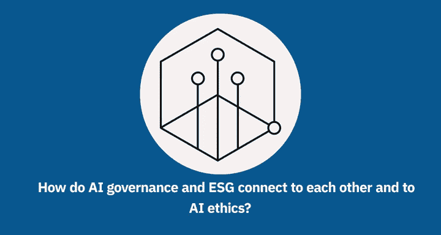
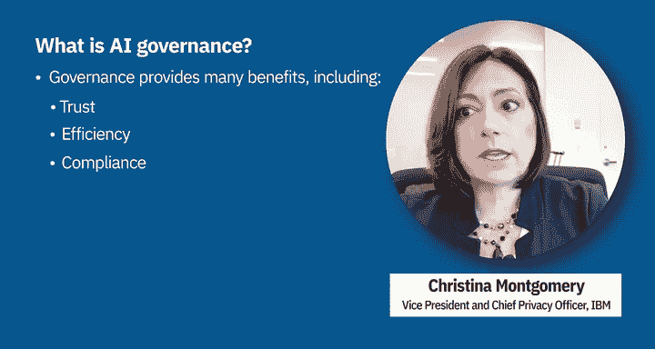
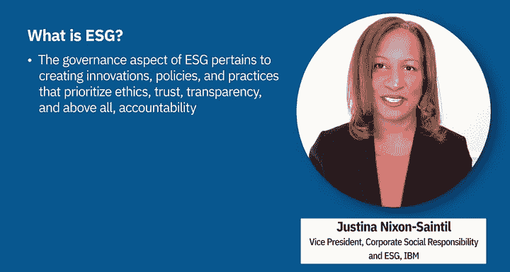
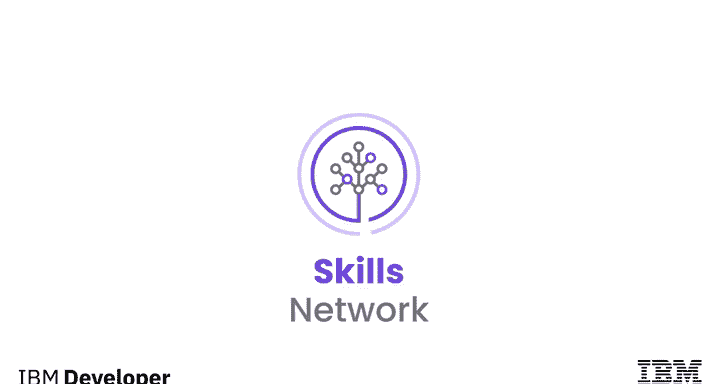

# 026：AI伦理治理与ESG 👨‍⚖️🌱

在本节课中，我们将要学习人工智能治理（AI Governance）与环境、社会和治理（ESG）框架的基本概念，并探讨它们如何与AI伦理紧密相连。我们将了解治理的目标、ESG的三大支柱，以及IBM如何将这些理念融入其战略。

---

## 什么是AI治理？🎯

上一节我们介绍了课程主题，本节中我们来看看AI治理的具体定义。治理是指组织通过其公司指令、员工、流程和系统进行管理的行为，旨在指导、评估、监控并在整个AI生命周期中采取纠正措施，以确保AI系统的运行符合组织的意图、利益相关者的期望以及相关法规的要求。

治理的目标是通过建立问责制、责任和监督的要求，来提供值得信赖的AI。治理能带来诸多益处，以下是几个关键好处：

*   **信任**：当AI活动与价值观保持一致时，组织可以构建透明、公平且值得信赖的系统，从而提升客户满意度和品牌声誉。
*   **效率**：当AI活动被标准化和优化时，开发可以更高效地进行，从而加速产品上市时间。
*   **合规**：当AI活动已得到管理和监控时，调整它们以符合新的和即将出台的行业法规及法律要求会变得不那么繁琐。

---

## 成功的治理计划包含哪些要素？🔧

了解了治理的定义和好处后，我们来看看一个成功的治理计划由哪些核心要素构成。一个成功的治理计划需要考虑人员、流程和工具。

它明确定义了人员在构建和管理可信AI中的角色和职责，包括将制定政策并建立问责制的领导者。它建立了用于构建、管理、监控和沟通AI的流程，并利用工具在整个AI生命周期中获得对AI系统性能更高的可见性和一致性。

---

## 什么是ESG？🌍

在探讨了AI治理的构成后，我们转向一个更广泛的框架——ESG。ESG代表环境、社会和治理，这些是用于衡量公司所有非财务风险和机会的因素。

在IBM，这转化为“IBM影响力”（IBM Impact），即我们在ESG方面的战略和理念。IBM影响力由三大支柱组成，我们相信这些支柱将创造一个更可持续的未来。

以下是这三大支柱：

*   **环境影响**：致力于对环境产生积极影响。
*   **公平影响**：致力于在社会中创造公平的机会和结果。
*   **伦理影响**：致力于在商业道德和社区中践行伦理。

我们通过在世界、商业道德、环境以及我们工作和生活的社区中产生持久的积极影响来实现这一目标。ESG中的治理方面涉及创建优先考虑道德、信任、透明度，尤其是问责制的创新、政策和实践。

---

## AI伦理与治理如何关联？⚖️

最后，我们来看看AI伦理在治理和ESG框架中的位置。AI伦理是我们治理计划的一个重要方面。

例如，在2022年，我们的目标是让1000个生态系统合作伙伴接受科技伦理培训。这个目标很重要，因为我们相信AI的益处应该惠及大众，而不仅仅是少数人，并且培养可信AI的文化必须无处不在，而不仅仅是在IBM内部。

我们正引领AI伦理的发展，致力于创造一个更合乎伦理的未来。

---

## 总结 📝

本节课中我们一起学习了AI治理的核心定义、目标及其带来的信任、效率与合规等好处。我们探讨了成功治理计划所需的人员、流程和工具三大要素。接着，我们了解了ESG（环境、社会和治理）框架及其三大支柱，并看到了IBM如何将其融入“IBM影响力”战略。最后，我们明确了AI伦理是治理和ESG倡议中的关键组成部分，对于构建普惠、可信的人工智能未来至关重要。