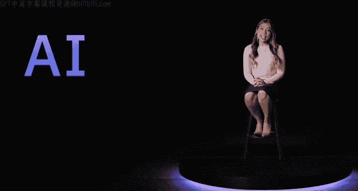
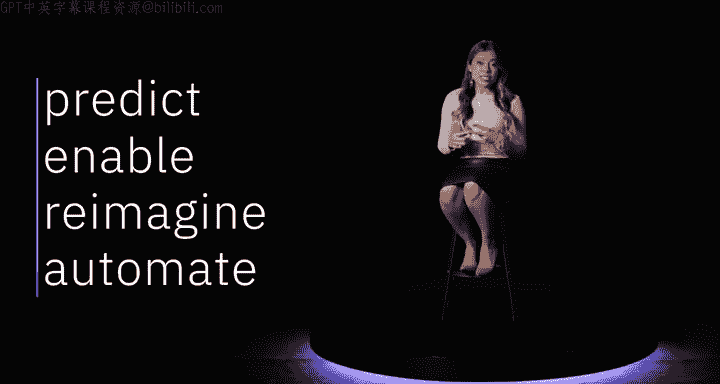
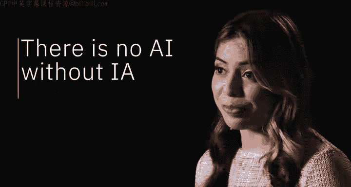
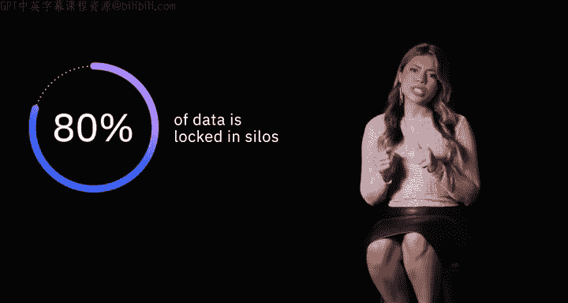
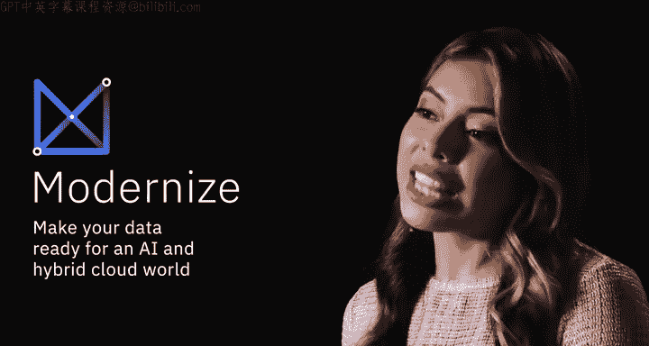
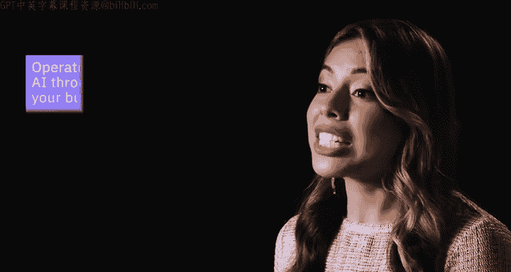
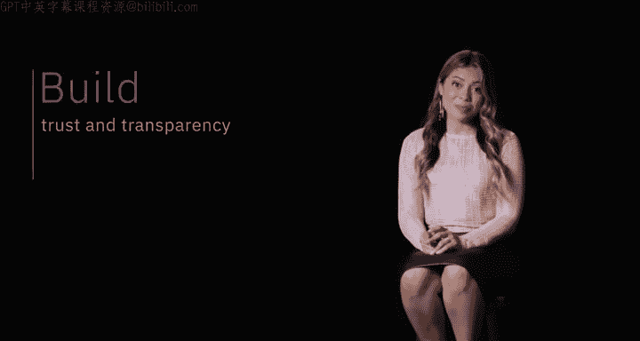
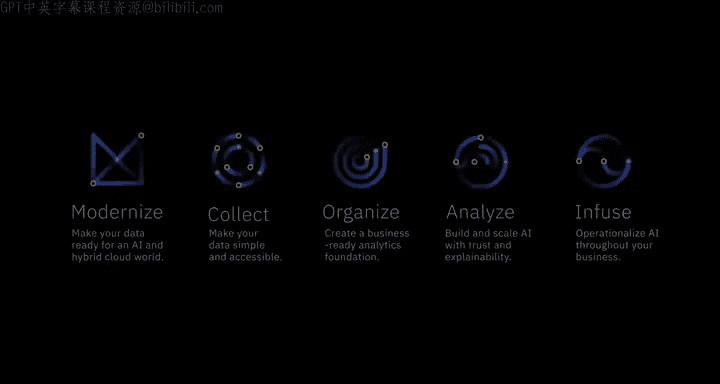

# 029：成功采用AI的旅程 🪜

在本节课中，我们将学习企业如何通过一个系统化的步骤——“AI阶梯”，来成功采用人工智能技术，将数据转化为业务价值。

在一个经历剧烈数字化转型的世界里，企业正寻求借助人工智能来塑造未来的工作方式。

人工智能能够预测并告知未来的结果，它使人们能够在企业中从事更高价值的工作，并构想新的业务模式。

它可以自动化决策、流程和体验，但人工智能并非魔法。

事实是，没有信息架构（IA），就没有人工智能（AI）。

然而，许多组织难以起步，因为其80%的数据被锁在孤岛中，无法直接用于业务。

那么，如何将抱负转化为实际成果呢？

答案是通过一套规范性的步骤，我们称之为“AI阶梯”。

旅程始于将所有数据现代化，并统一到一个可在任何云上运行的单一平台上。

在阶梯本身，包含四个关键步骤。

以下是AI阶梯的四个核心步骤：

1.  **收集数据**：使数据变得简单且易于访问。认真思考你需要训练哪些模型。
2.  **组织数据**：为那些AI模型创建一个业务就绪的分析基础。
3.  **分析数据**：在信任和透明的基础上进行分析。因为如果你无法解释结果、防止偏见或证明其准确性，那么应用和扩展人工智能就毫无意义。
4.  **注入价值**：一旦你真正信任你的数据和你部署的人工智能，你就可以在控制日常工作的应用程序和流程中实现其全部价值。

换句话说，最后一步是“注入”。或者说，你开始在整个业务中实现人工智能的运营化。

我们通过在这个人工智能和多云世界中释放其数据的价值，帮助了成千上万的企业将人工智能投入工作。

我们通过为员工提供合适的技能组合，以及在人工智能中建立信任和透明度来实现这一目标。

这就是AI阶梯的概要，让我们开始攀登吧。

本节课中，我们一起学习了“AI阶梯”框架。该框架强调，成功采用AI始于坚实的数据基础（信息架构IA），并遵循**收集 → 组织 → 分析 → 注入**四个步骤。这个过程旨在帮助企业系统化地解锁数据价值，将AI抱负转化为可信任、可运营的实际成果，从而塑造未来的工作方式。