# 034：0_课程介绍 🚀

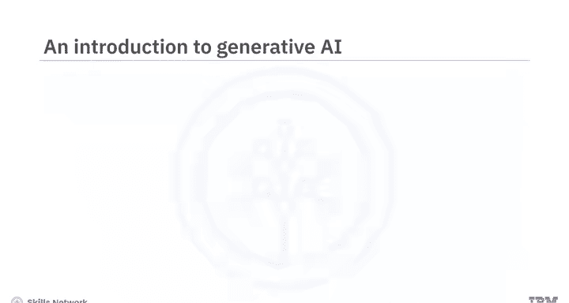

在本节课中，我们将要学习生成式人工智能的入门知识，了解其核心概念、应用领域以及本课程的结构与学习目标。

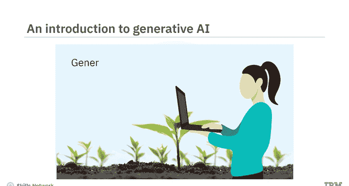

想象一个由人工智能驱动的世界，它将使我们工作更高效、寿命更长、能源更清洁。这个世界已经到来。生成式人工智能已经深刻改变了我们的生活方式。

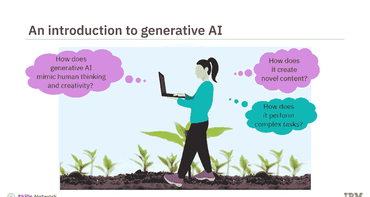

生成式人工智能模型能够模仿人类的思维和创造力，以生成新颖的内容并执行复杂的任务。组织可以利用生成式人工智能来提高生产力和盈利能力。个人可以使用生成式人工智能工具来提升效率、为工作增添实际价值、节省成本并最大化品牌价值。

如果你尚未涉足此领域，本课程正适合你。我们欢迎所有对快速发展的生成式人工智能领域抱有真诚兴趣的专业人士、爱好者、从业者和学生。无论你的背景或经验如何，这是一门面向所有人的课程。

## 课程目标 🎯

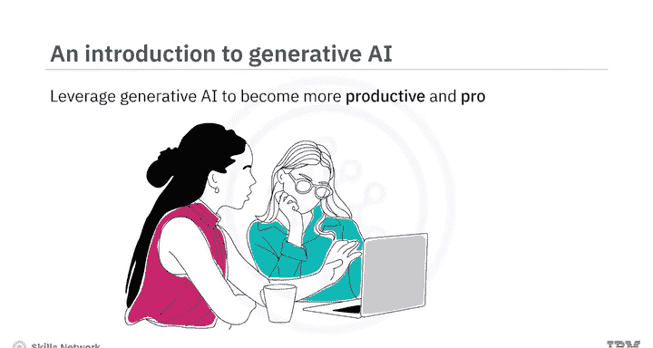

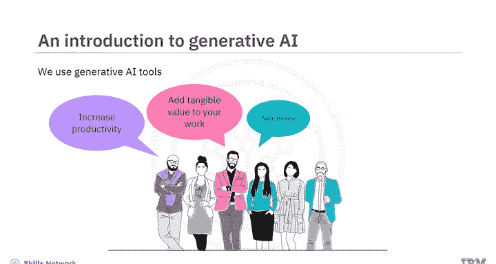

本课程旨在让你对生成式人工智能的能力、应用以及常见模型和工具有一个扎实的理解。在本课程结束时，你将能够：
*   描述生成式人工智能的能力及其在现实世界中的用例。
*   识别生成式人工智能在不同领域和行业中的应用。
*   探索常见的生成式人工智能模型和工具。

## 课程结构 📚

这是一门由三个模块组成的精炼课程。预计每个模块需要花费一到两个小时来完成。

### 模块一：核心概念与应用

在课程的第一个模块中，你将学习生成式人工智能的核心概念，了解其在不同领域的应用案例，并理解其在生成文本、图像、代码、音频和视频方面的能力。

### 模块二：行业应用与工具

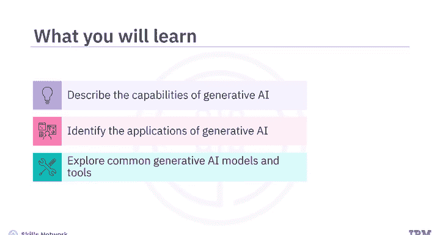

在第二个模块中，你将探索信息技术、娱乐、教育、金融和医疗保健等不同行业如何利用生成式人工智能。此外，在本模块中，你将学习用于生成文本、图像、代码、音频和视频的常见模型和工具（如 **ChatGPT**、**DALL-E** 和 **Synthesia**）的能力与特性。

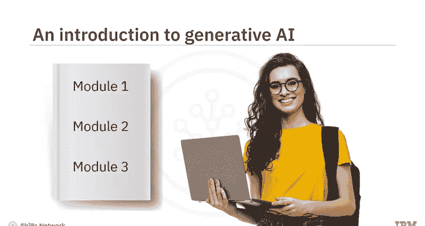

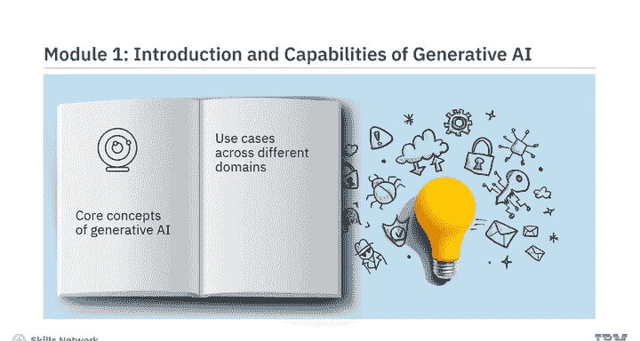

### 模块三：实践与评估

模块三要求你参与一个最终项目，并完成一个计分测验，以检验你对课程概念的理解。你也可以访问课程术语表，并获得关于后续学习路径的指导。

## 学习资源与活动 💡

本课程融合了概念讲解视频和辅助阅读材料。观看所有视频以充分掌握学习材料的潜力。

你将体验到动手实验和一个最终项目，这些活动展示了生成式人工智能在多个领域的常见用例。每节课末尾都有练习测验，帮助你巩固所学知识。课程结束时，你还需要完成一个计分测验。

课程还提供了讨论论坛，方便你与课程工作人员联系并与同伴交流。最有趣的是，通过专家观点视频，你将听到经验丰富的从业者分享他们对生成式人工智能不同方面的见解。

## 总结与展望 🌟

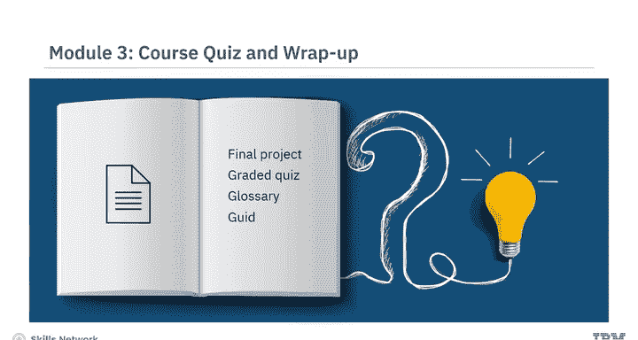

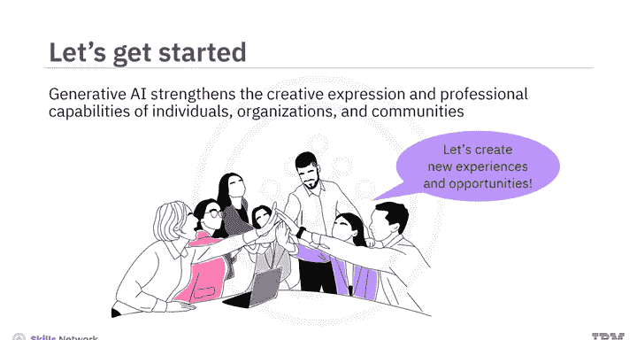

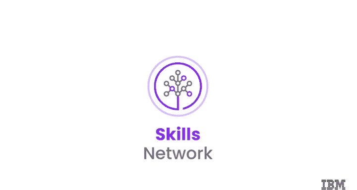

本节课中，我们一起学习了生成式人工智能的初步介绍、课程目标与结构。当生成式人工智能正在全球范围内增强个人、组织和社区的创造力与专业能力时，本课程为你提供了一个创造新体验的绝佳机会。