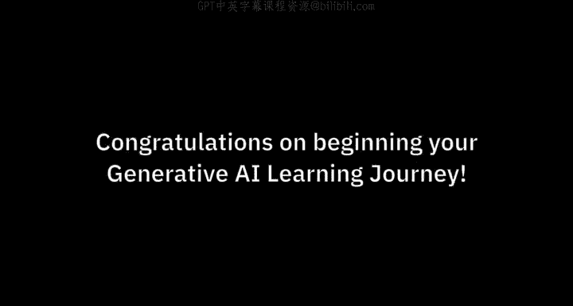
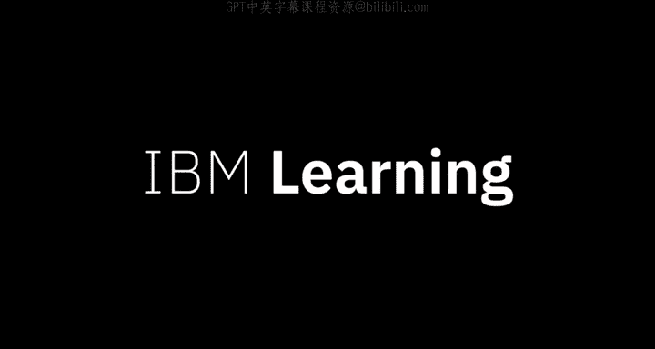

生成式人工智能工程：P35：为什么学习生成式AI与IBM

在本节课中，我们将探讨生成式人工智能（Generative AI）为何成为当前技术浪潮的核心，以及为何掌握相关技能对个人职业发展至关重要。我们将了解生成式AI的广泛影响、企业应用需求，以及IBM在推动负责任AI实践中的角色。

---

生成式人工智能正受到每一位领导者、每一个组织、企业或政府的关注。伴随关注而来的是机遇。各组织正在寻找理解这项技术，并且**最重要的是，具备应用该技术技能**的人才。

与以往许多趋势性技术不同，生成式人工智能几乎触及了每个行业中的每一个岗位。生成式AI技能预计将变得非常重要，不仅对计算机科学家如此，**对所有人都是如此**。这些技能将变得像文字处理、电子表格甚至基本商业素养一样必不可少。这正是“生成式AI普及化”课程项目设立的原因。

目前，人工智能领域正涌现大量新的关注点。企业正将目光超越消费级AI应用。聊天机器人界面是展示生成式AI潜力的绝佳方式，而现实用例则是将生成式AI嵌入现有流程，使其成为几乎每个业务工作流程中不可或缺的功能。

IBM很自豪能够帮助企业将生成式AI整合到其运营中。通过这些课程项目，你将获得的技能应能助力你的职业生涯，并可以立即应用到你的工作中。

企业对生成式AI的潜力感到兴奋，但同时也对其潜在风险感到担忧。这些课程项目将赋予你处理AI伦理问题的技能，这些技能根植于IBM开创的负责任方法。

---

本节课中，我们一起学习了生成式AI的普遍重要性及其对各类职业的影响。我们了解到，掌握生成式AI技能正成为一项基础能力，而企业不仅关注其应用潜力，也重视以负责任的方式部署它。IBM提供的学习路径旨在帮助学习者获得可直接应用的实用技能，并为应对相关的伦理挑战做好准备。