# 036：生成式AI基础专业课程介绍 🚀

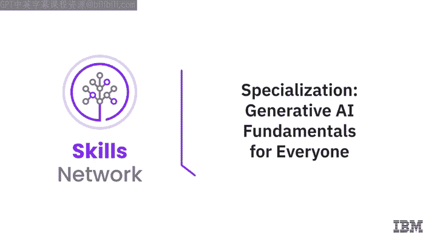

在本节课中，我们将介绍IBM的《生成式人工智能工程》专业课程。该课程旨在帮助初学者全面了解生成式AI的核心概念、工具和应用，无需任何技术背景。通过学习，你将掌握如何利用生成式AI提升个人技能与职业发展。

---

你是否知道，全球的营销人员已经在使用生成式AI来创作内容、撰写文案、激发创意、分析市场数据以及生成图像？

根据彭博社的预测，到2032年，生成式AI市场的规模预计将达到**1.3万亿美元**。

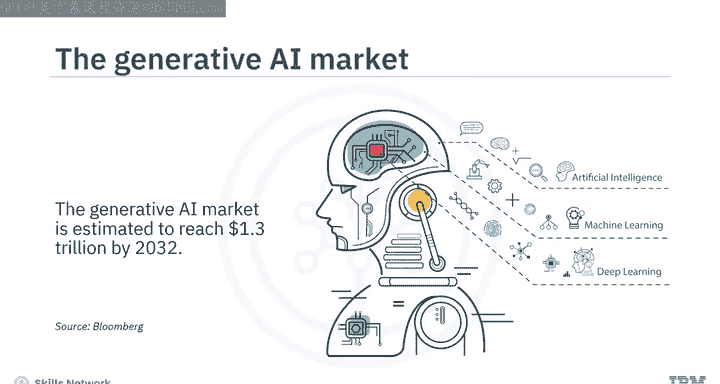

因此，深入了解生成式AI对你而言至关重要。

---

那么，生成式AI适合所有人学习吗？答案是肯定的。

你可以利用其潜力，为自己创造更好的职业前景和生活。

本专业课程面向所有对探索生成式AI力量充满热情的人，**无需具备先前的AI技术知识或背景**。

即使是初学者也能从中受益，因为它全面涵盖了生成式AI的基本概念、模型、工具和应用。

在本课程结束时，你将能够：
*   解释生成式AI基础模型的基本概念、能力、模型、工具、应用和平台。
*   讨论提示工程，并应用强大的提示工程技术来编写有效的提示，从而从AI模型中生成期望的结果。
*   讨论生成式AI的局限性，并解释其伦理关切及负责任使用的考量。
*   认识到生成式AI在提升你职业生涯和帮助改进工作场所方面的能力。

---

## 课程结构 📚

本专业课程包含五门精心设计的自定进度课程，每门课程需要**3到5小时**完成。

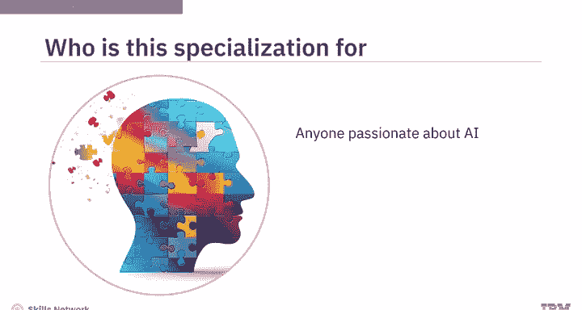

### 课程1：生成式AI导论与应用 🌐

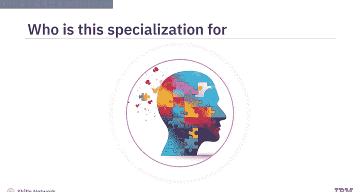

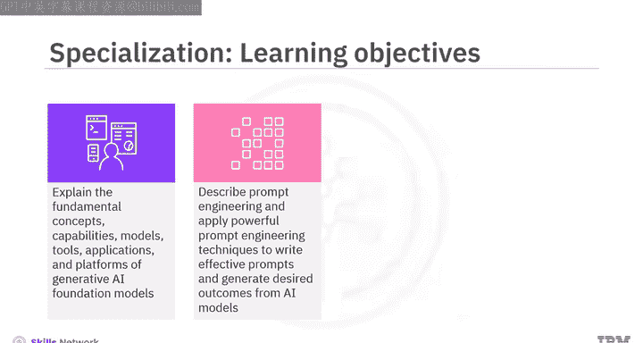

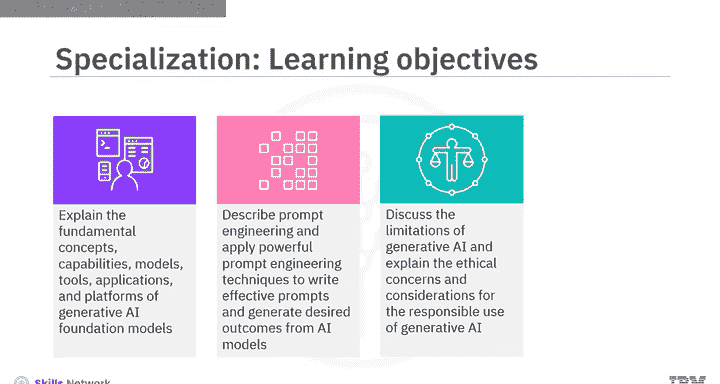

上一节我们概述了课程目标，本节中我们来看看第一门课的具体内容。

课程1是你理解生成式AI能力的第一步，其能力涵盖文本、图像、音频、视频、虚拟世界、代码和数据等多个领域。

你将了解不同行业如何应用常见的生成式AI模型和工具，例如：
*   **GPT**
*   **DALL-E**
*   **Stable Diffusion**
*   **IBM Granite**
*   **Synthesia**

### 课程2：提示工程精要 ✍️

在了解了生成式AI的广泛应用后，接下来我们将学习如何有效地与AI交互。

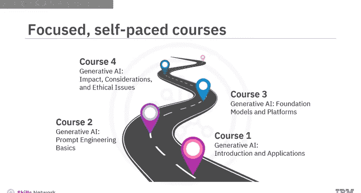

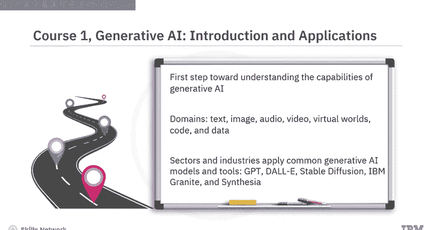

课程2介绍了提示工程的概念，以及它如何帮助你释放如ChatGPT这类生成式AI工具的全部潜力。

你将探索开发有效提示的技术、方法和最佳实践，并使用以下常用工具：
*   **IBM Watsonx Prompt Lab**
*   **Spellbook**
*   **Dust**

### 课程3：生成式AI的核心构建模块 ⚙️

掌握了与AI对话的技巧后，我们需要深入理解其背后的原理。

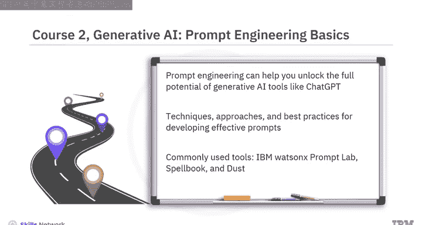

课程3专注于生成式AI的核心概念和构建模块，例如：
*   **深度学习**
*   **基于Transformer架构的大语言模型**
*   **扩散模型**
*   **基础模型**

你还将了解不同的生成式AI平台，如**IBM Watsonx.ai**和**Hugging Face**。

### 课程4：生成式AI的伦理与局限 ⚖️

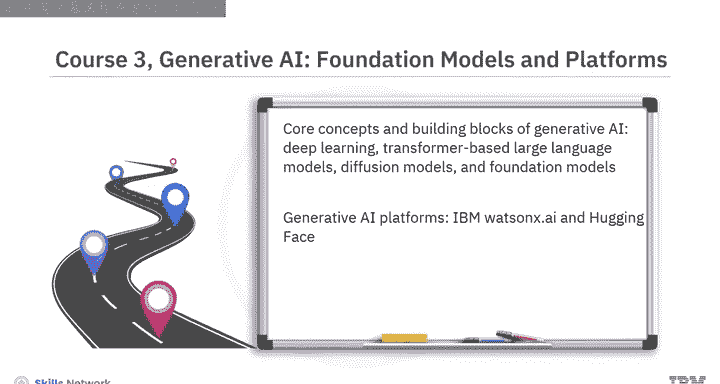

理解了技术原理，我们还需审视其带来的社会影响。

在课程4中，你将探讨与生成式AI相关的伦理考量。例如：
*   它对数据隐私和安全、版权侵权、劳动力以及环境有何影响？
*   你将描述其局限性，例如**数据偏见**、缺乏可解释性、透明度和可理解性。
*   识别生成式AI的常见滥用，如**深度伪造**和**幻觉**。

### 课程5：生成式AI的未来与你的职业 🚀

探讨了挑战之后，让我们展望未来，看看生成式AI将如何塑造新的机遇。

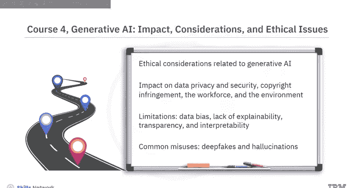

最后，课程5讨论了生成式AI的未来。你难道不想知道在那个未来里，你的职业机会有哪些吗？

你将学习生成式AI如何影响和增强不同行业中的现有职能、技能和工作角色，以及如何利用生成式AI构建自己的应用程序，创造新的商业机会。

本专业课程的内容旨在吸引并赋能你。

---

## 学习方法与实践 🛠️

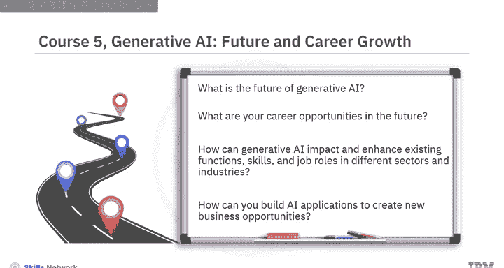

通过观看精选的概念视频、聆听AI专家分享他们的见解和技巧，以及在实践实验室和项目中练习技术，你将在日常生活中使用生成式AI工具和应用程序时感到更加自信。

目前，**65%** 的生成式AI用户是千禧一代或Z世代，**72%** 是在职人士。通过本专业课程的学习，你将准备好加入生成式AI变革者的行列。

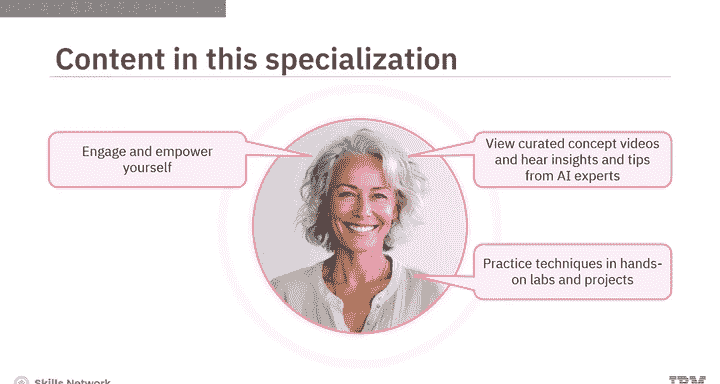

生成式AI，适合每一个人。

---

## 总结

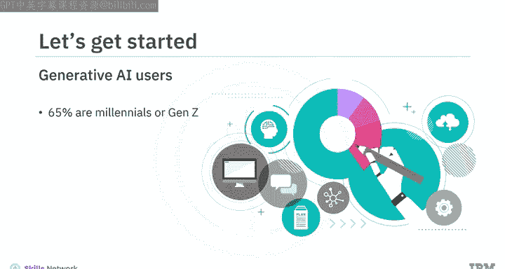

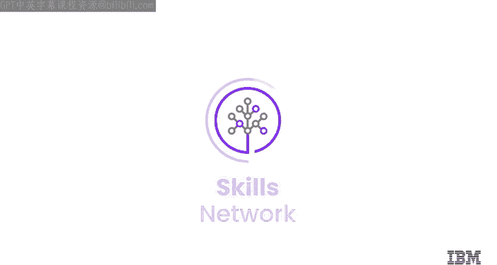

本节课中，我们一起学习了IBM《生成式人工智能工程》专业课程的完整介绍。该课程共分为五个部分，从应用入门、提示工程、核心技术、伦理考量到未来展望，为初学者提供了一条清晰的学习路径。课程强调实践与理论结合，旨在帮助学习者自信地掌握并应用生成式AI技术，把握未来的职业发展机遇。