# 037：生成式AI简介 🧠

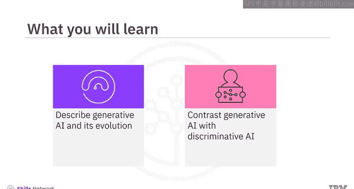

在本节课中，我们将要学习生成式人工智能的基本概念、其发展历程，以及它与判别式人工智能的区别。我们将从人工智能的基础定义开始，逐步深入到生成式AI的核心模型和应用。

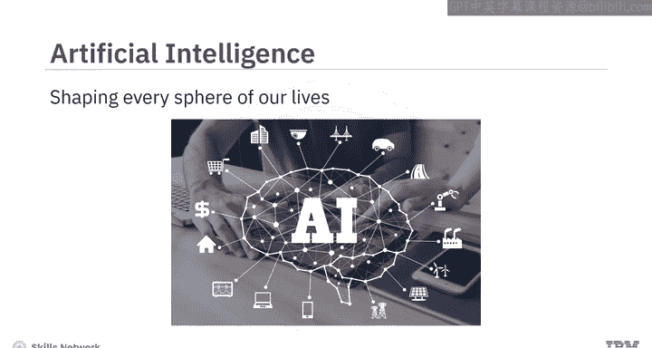

---

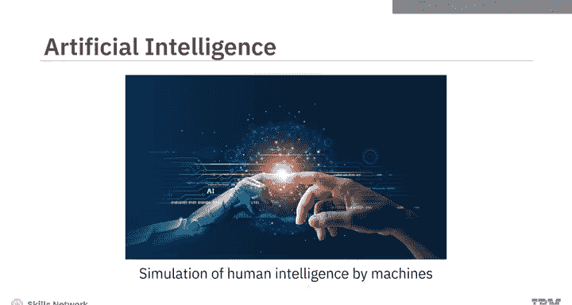

## 概述

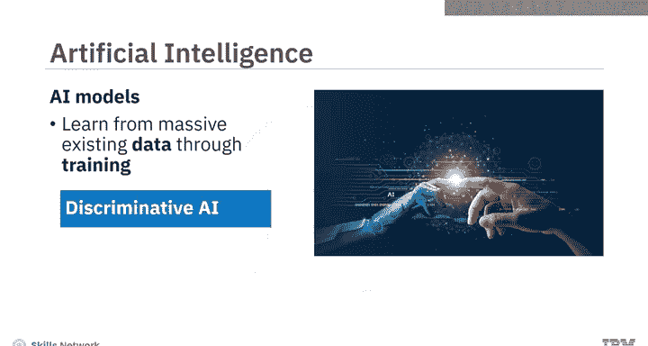

人工智能已经存在多年，它塑造了我们生活的方方面面，并彻底改变了我们的工作和生活方式。其核心定义是机器对人类智能的模拟。AI模型从海量现有数据中学习，这个过程被称为训练。人工智能主要有两种基本方法：判别式AI和生成式AI。

---

## 判别式人工智能

判别式AI是一种学习区分不同数据类别的方法。它通过分析带有标签的训练数据来学习模式，并用于对新数据进行分类或预测。

以下是判别式AI的工作原理：
*   **训练过程**：模型接收一组训练数据，其中每个数据点都带有其所属类别的标签。
*   **决策边界**：模型学习在数据特征空间中划分不同类别的“决策边界”。
*   **预测**：对于新的数据点，模型通过判断其落在决策边界的哪一侧来预测其类别。

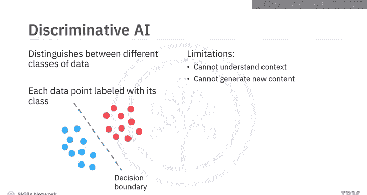

判别式AI模型利用高级算法来区分、分类、识别模式，并根据训练数据得出结论。一个典型的例子是电子邮件垃圾邮件过滤器，它可以区分垃圾邮件和非垃圾邮件。

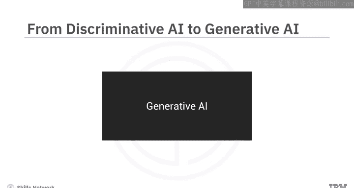

判别式AI模型最适合应用于分类任务。然而，它们无法理解上下文，也无法基于对训练数据的上下文理解来生成新的内容。

---

## 生成式人工智能

上一节我们介绍了判别式AI的分类能力，本节中我们来看看生成式AI如何更进一步。生成式AI模型学习基于训练数据生成全新的内容。它们能够捕捉训练数据的底层分布，并生成新颖的数据实例。

生成式AI的工作流程始于一个“提示”。这个提示可以是文本、图像、视频或模型能够处理的任何其他输入。作为输出，模型会生成新的内容，包括文本、图像、音频、视频、代码和数据。

生成式AI的输出形式可以与提示相同，例如“文本到文本”；也可以与提示不同，例如“文本到图像”或“图像到视频”。

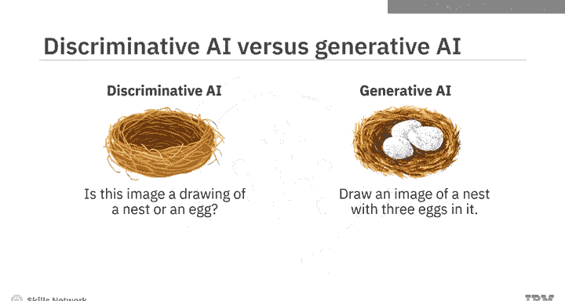

这里有一个简单的例子来理解判别式AI和生成式AI的区别：
*   **判别式AI** 最适合回答诸如“这张图片画的是鸟巢还是蛋？”这类问题。
*   **生成式AI** 则会响应诸如“画一张里面有三个蛋的鸟巢图像”这样的提示。

如果说判别式AI模仿了我们的分析和预测能力，那么生成式AI则更进一步，模仿了我们的创造能力。正如《哈佛商业评论》的评论所暗示的：AI不仅可以提升我们的分析和决策能力，还可以增强创造力。

---

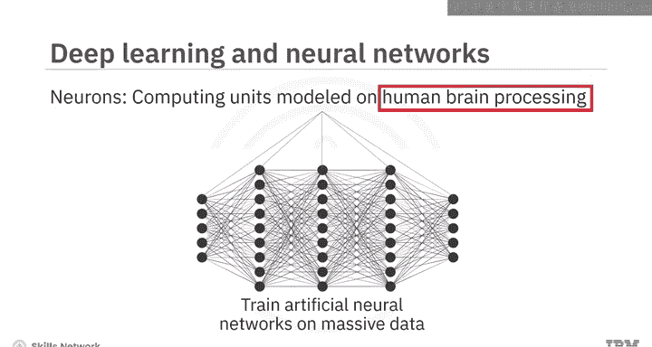

## 生成式AI的模型基础

生成式AI的创造能力来源于其核心模型。这些模型可以被视为生成式AI的构建模块。

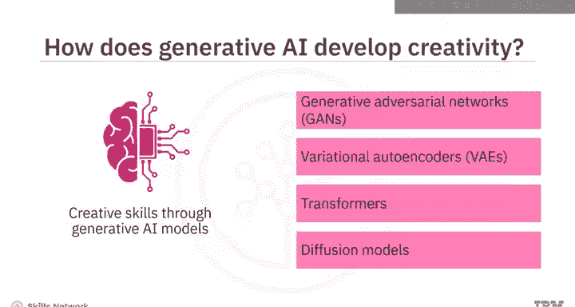

以下是几种关键的生成式AI模型：
*   **生成对抗网络**：包含一个生成器和一个判别器相互竞争学习的框架。
*   **变分自编码器**：通过学习数据的压缩表示来生成新数据。
*   **Transformer模型**：基于自注意力机制，擅长处理序列数据，是大型语言模型的基础。
*   **扩散模型**：通过逐步去噪过程从随机噪声中生成高质量图像。

判别式模型和生成式模型都是使用深度学习技术创建的。深度学习涉及训练人工神经网络从海量数据中学习。人工神经网络是由称为神经元的较小计算单元组成的集合，其建模方式类似于人脑处理信息的过程。

---

## 生成式AI的演进

生成式AI并非一个新概念，其根源可追溯到机器学习的起源。在20世纪50年代末，科学家们提出机器学习时，就探索了使用算法创建新数据。到了20世纪90年代，神经网络的兴起为生成式AI注入了新的进展。

进入21世纪10年代初，在大型数据集和增强计算能力的支持下，深度学习进一步推动了生成式AI的发展。2014年，随着伊恩·古德费洛及其同事引入GANs，生成式AI发生了变革。GANs以及VAEs、Transformers等模型为生成式AI的增长以及基础模型和工具的开发奠定了基础。

**基础模型**是具有广泛能力的AI模型，可以被调整以创建针对特定用例的、更专业的模型或工具。其中一类特定的基础模型称为**大型语言模型**，它们经过训练以理解人类语言，并能处理和生成文本。

2018年，OpenAI推出了基于Transformer的LLM，称为生成式预训练Transformer。多年来，不同的LLM，如GPT系列中的GPT-3和GPT-4、Google的PaLM、Meta的Llama等，显著增强了生成式AI生成连贯且相关文本的能力。在其他用例的模型方面也有类似的发展，例如用于图像生成的Stable Diffusion和DALL-E模型。

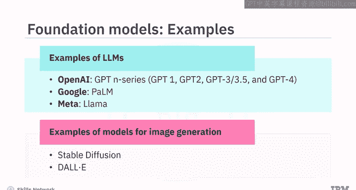

---

## 应用与影响

多种生成式模型的发展，催生了针对不同用例的生成式AI工具市场的增长。

以下是不同领域的生成式AI工具示例：
*   **文本生成**：ChatGPT, Bard
*   **图像生成**：DALL-E 2, Midjourney
*   **视频生成**：Synthesia
*   **代码生成**：GitHub Copilot, AlphaCode

快速涌现的模型和工具为生成式AI在各个领域的应用开辟了广阔的空间。引用麦肯锡关于生成式AI经济潜力的报告：“生成式AI有潜力改变工作的结构，通过自动化部分个人活动来增强个体工人的能力。”该报告还预测，生成式AI对生产力的影响可能为全球经济增加数万亿美元的价值。

---

## 总结

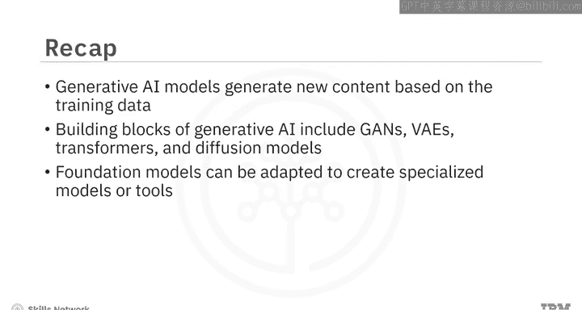

本节课中我们一起学习了生成式AI的核心知识。我们了解到，生成式AI模型能够基于其训练数据生成全新的内容。此外，生成式AI的创造能力建立在诸如GANs、VAEs、Transformers和扩散模型等模型之上。基础模型可以被调整以创建针对特定用例的专业模型或工具。最后，我们认识到生成式AI模型和工具在不同领域和行业中拥有广泛的应用前景。