生成式人工智能工程：P38：生成式AI的能力 🚀

在本节课中，我们将学习生成式人工智能（Generative AI）的核心能力，并探讨这些能力在现实世界中的应用场景。生成式AI能够创造全新的内容，其应用范围广泛，潜力巨大。

---

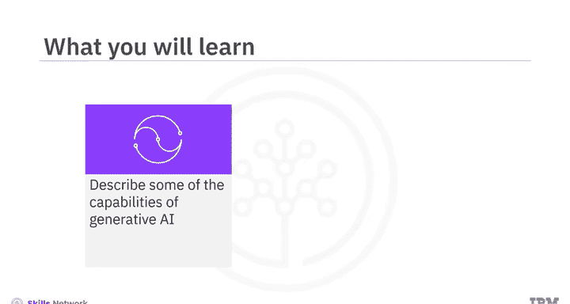

### 文本生成能力 📝

上一节我们概述了生成式AI的多种能力，本节中我们首先来看看其文本生成能力。这是指AI生成清晰、流畅且符合上下文语境的文本回复的能力。

生成式AI文本生成能力的核心是先进的大型语言模型（LLMs）。这些模型在大型数据集上进行训练，能够学习数据中的模式和结构，从而生成连贯且相关的文本。

以下是LLMs能够执行的一些主要任务：
*   **文本补全**：根据已有内容续写文本。
*   **摘要**：将长文本浓缩为简短摘要。
*   **问答**：根据给定信息回答问题。
*   **翻译**：在不同语言之间进行翻译。
*   **代码生成**：根据描述生成代码片段。
*   **图文配对**：理解图像内容并生成描述文本，或根据文本生成图像。

一些知名的LLMs包括OpenAI的**GPT**（Generative Pre-trained Transformer）和Google的**PaLM**（Pathways Language Model）。它们为聊天机器人、虚拟助手等提供了强大的对话交互能力。

---

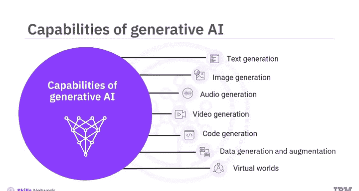

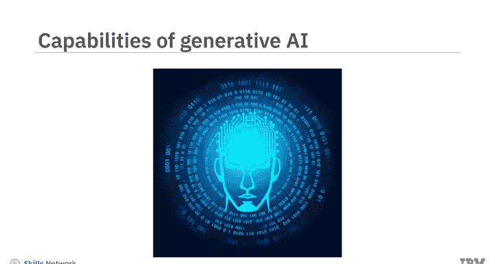

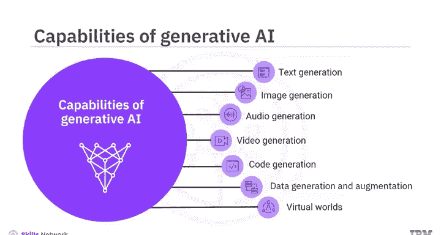

### 图像生成能力 🎨

接下来，我们探讨生成式AI的图像生成能力。这指的是AI能够合成具有艺术感且逼真的图像，这些图像与真实照片非常相似。

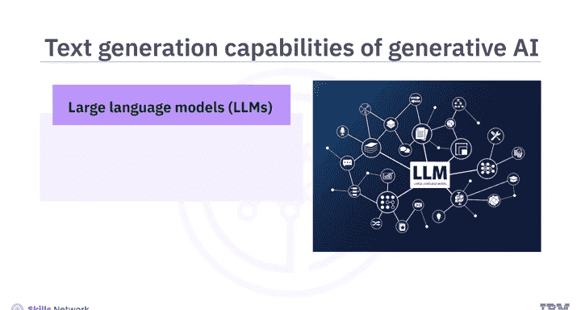

生成式模型基于深度学习技术（如生成对抗网络和变分自编码器）来生成高质量的图像。生成的图像展现出逼真的纹理、自然的色彩和精细的细节，给人以真实拍摄的印象。

以下是几个应用实例：
*   **StyleGAN**：可以生成高质量、高分辨率的虚构人脸、动物或自然景观图像。
*   **DeepArt**：能够根据简单的草图创作出完整的艺术作品。
*   **DALL-E**：可以根据用户的文字描述生成全新的图像。

除了艺术、设计、娱乐和游戏领域，生成图像还可用于增强训练数据集，并辅助医学成像和科学可视化研究。

---

### 音频生成能力 🎵

现在，让我们看看生成式AI在音频领域的生成能力。生成式模型可以创作新的音乐作品，使用文本转语音技术将文本转换为音频，并创造合成语音及自然的人声。

这些模型能够转换、修改、净化人声，降低噪音并提升音频质量。它们还能相当逼真地模仿人类声音。

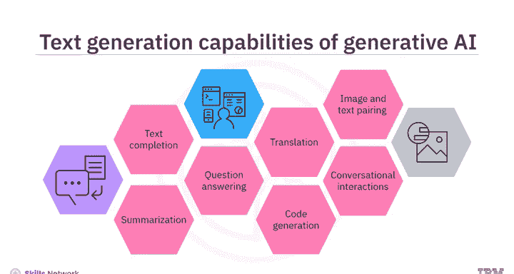

以下是几个具体应用：
*   **WaveGAN**：可以生成新的、逼真的原始音频波形，包括语音、音乐和自然声音。
*   **MuseNet**：能够结合多种乐器、风格和流派，生成新颖的音乐作品。
*   **Tacotron 2** 和 **Mozilla TTS**：使用先进的TTS系统创建合成语音，模仿人类的音调、音高、节奏和表达。

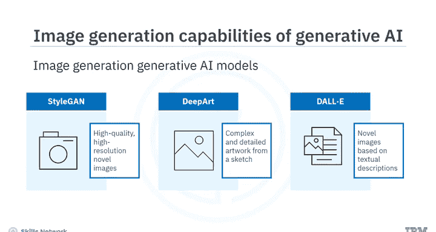

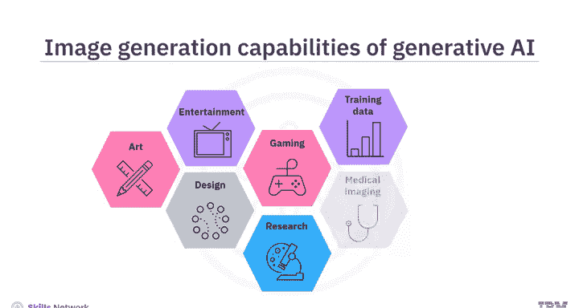

AI生成的音频在媒体创作、娱乐、教育培训、游戏及虚拟现实等多个领域都有广泛应用。

---

### 视频生成能力 🎬

上一节我们介绍了音频生成，本节中我们来看看视频生成能力。生成式AI模型能够创建动态、清晰的视频，范围从基础动画到复杂场景。

这些模型通过结合时间连贯性和自然语言处理技术，将图像转化为动态视频。时间连贯性确保了视频在时间维度上意义和上下文的一致性，从而使得视频中的运动平滑、过渡自然。

例如，**VideoGPT**模型可以根据用户提供的文字提示生成新视频。用户可以指定期望的内容来引导视频生成过程，包括视频补全、编辑、合成、预测和风格迁移等。

生成的视频可应用于艺术、娱乐、教育、游戏、医学及研究等多个领域。

---

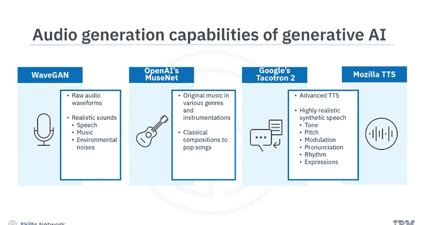

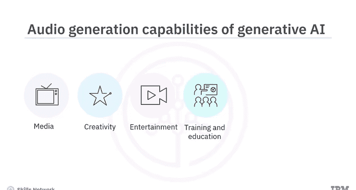

### 代码生成能力 💻

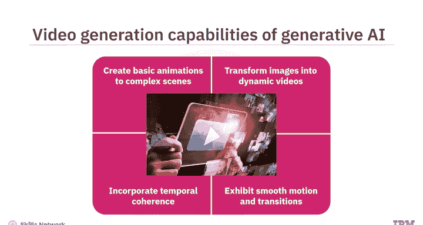

生成式AI不仅能生成多媒体内容，还能生成代码。接下来，我们探讨其代码生成能力。生成式模型可以根据所需功能，生成新的代码片段、函数或完整程序。

这些模型在现有代码库上进行训练，能够完成或创建代码、重构代码、识别并修复代码错误、测试软件以及生成包括注释、函数描述和使用示例在内的文档。

例如，**GitHub Copilot** 和 **IBM Watson Code Assistant** 都是基于AI的编程助手，可以帮助自动补全代码、处理复杂任务，并根据输入生成代码。

AI生成的代码可用于软件开发、机器学习、数据分析、机器人自动化以及游戏和AR/VR环境开发等领域。开发者可以利用代码生成能力来更高效地编写、调试和测试代码。

---

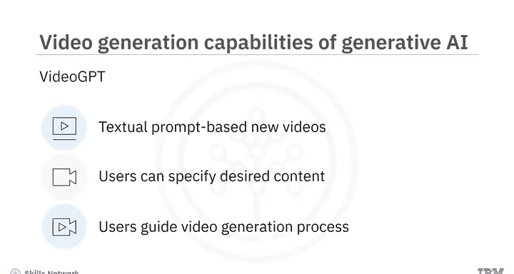

### 数据生成与增强能力 📊

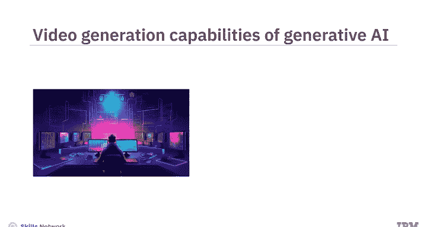

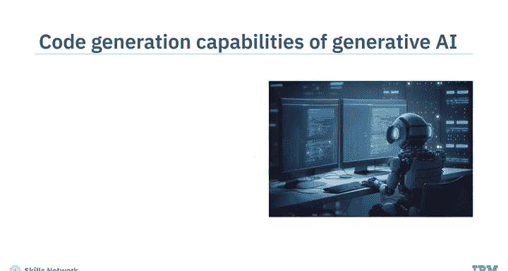

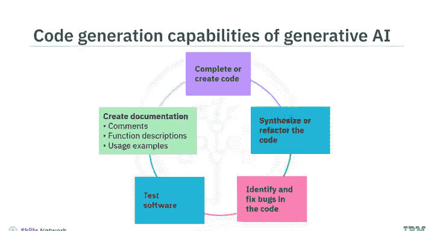

除了生成代码，生成式AI还能生成和增强数据。现在，让我们探索其数据生成与增强能力。生成式模型可以生成新数据并扩展现有数据集。

生成合成数据集有助于增加数据的多样性和可变性，从而带来更稳健、更有效的模型性能。

这些模型可以为图像、文本、语音、表格数据、时间序列数据等多种类型生成新样本并增强数据集。

数据生成与增强能力在医疗健康、游戏、教育培训、艺术创作以及自动驾驶等众多领域都有重要应用。

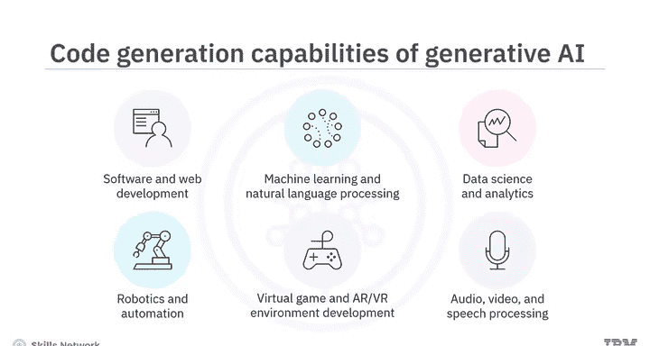

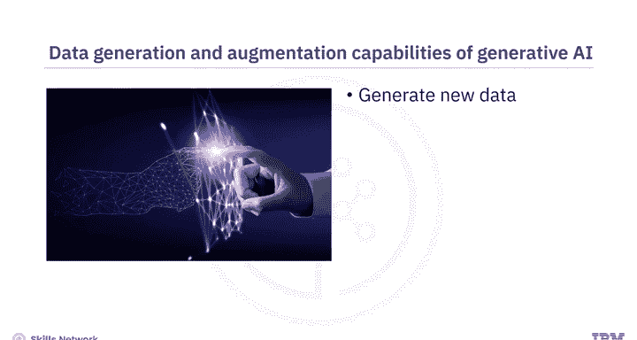

---

### 虚拟世界创造能力 🌐

生成式AI另一个强大的能力是创造高度逼真且复杂的虚拟世界。你可以创建模拟真实行为、表情、对话甚至决策的虚拟化身。

你还可以创建具有逼真纹理、声音和物体的复杂虚拟环境，这些环境遵循物理世界的规律。元宇宙平台利用生成式模型为用户创造独特且个性化的体验。

生成式AI还能创造具有独特个性的虚拟身份，为虚拟化身赋予特定的个人特质，并体现在其行为和对话中。

虚拟世界创造能力在游戏、娱乐、教育、增强/虚拟现实、元宇宙平台以及虚拟偶像和数字人格等领域有着广泛的应用前景。

---

### 总结 📚

本节课中，我们一起学习了生成式人工智能模型的多种核心能力及其在现实世界中的应用。

生成式AI能够：
1.  生成连贯且符合语境的文本内容。
2.  创造逼真的高质量图像。
3.  合成语音、创作新音频和动态视频。
4.  生成和补全代码。
5.  合成新数据以增强现有数据集。
6.  创造高度逼真和复杂的虚拟世界，包括虚拟化身和数字人格。

这些能力共同构成了生成式AI强大的创造力基础，并正在不断拓展其应用边界。