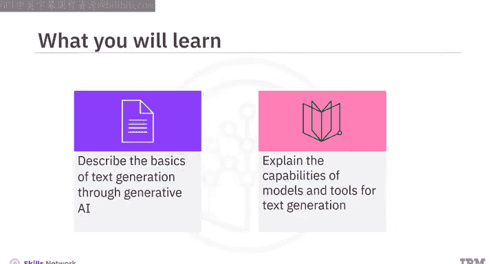
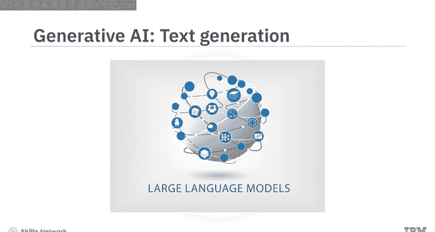
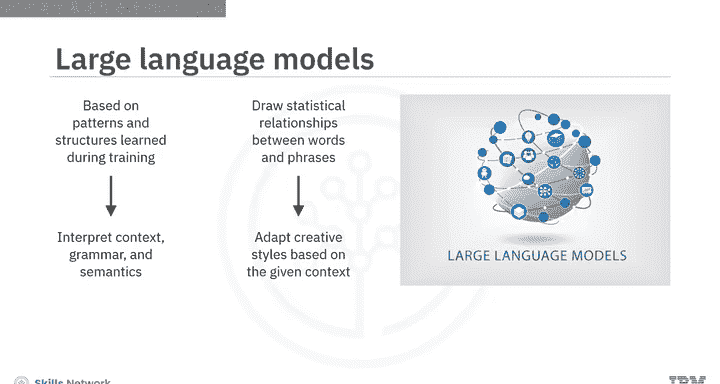
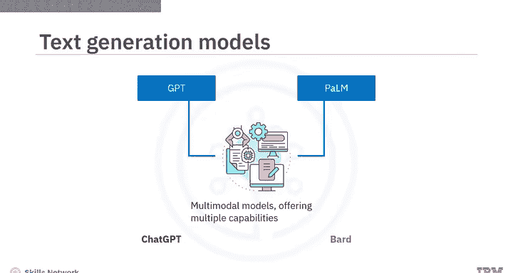
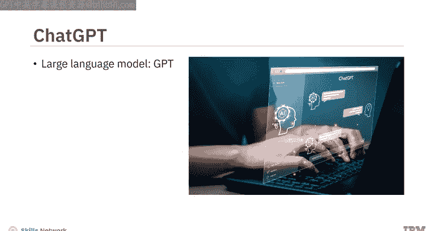
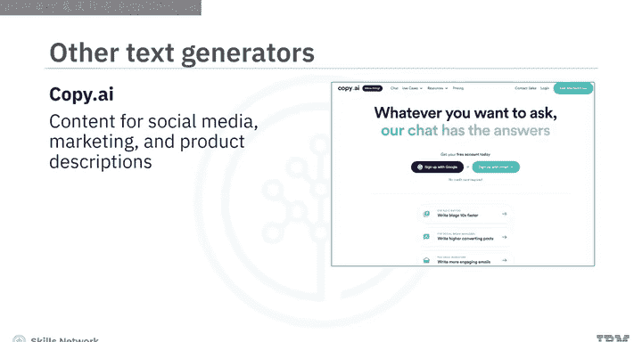
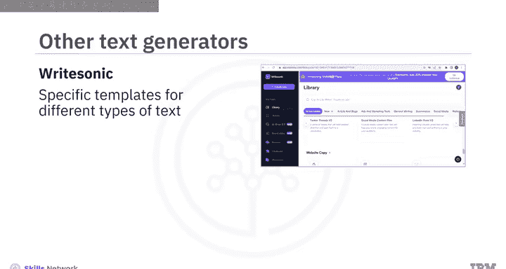

# 040：6_文本生成工具 📝

在本节课中，我们将要学习生成式人工智能在文本生成方面的基础知识，了解核心模型的能力，并介绍几种流行的文本生成工具。

## 概述

文本生成是生成式人工智能的核心应用之一。其核心是大型语言模型，它们通过学习海量数据中的模式和结构，能够理解上下文、语法和语义，从而生成连贯且符合语境的文本。本节我们将探讨这些模型的基本原理，并介绍包括ChatGPT和Bard在内的多种实用工具。

## 文本生成的基础：大型语言模型（LLMs）

上一节我们介绍了生成式AI的概览，本节中我们来看看其文本生成能力的核心——大型语言模型。

基于在训练期间学习到的模式和结构，LLMs能够解释**上下文**、**语法**和**语义**，以生成连贯且符合语境的文本。通过分析词语和短语之间的**统计关系**，LLMs能够为任何给定的语境调整出富有创造性的写作风格。

LLMs是许多文本生成模型的基础，其中两个著名的例子是：
*   **生成式预训练变换器（GPT）**
*   **PaLM（Pathways Language Model）**

这些模型已经进化为**多模态模型**，提供了多种能力。

## 流行的文本生成工具

了解了LLMs的基础后，我们通过两个流行的工具来具体了解这些模型的能力。

### ChatGPT 🤖

ChatGPT基于GPT系列大型语言模型，并使用了先进的自然语言处理技术。虽然最初ChatGPT仅接受文本提示作为输入来生成新内容，但在新版本中，它已能同时接受图像和文本输入。ChatGPT为文本生成提供了多样化的能力。

以下是ChatGPT的一些核心能力：

*   **上下文对话**：能够进行流畅且基于上下文的对话。
*   **创意任务协助**：可以帮助完成各种创意任务，例如生成演示文稿大纲。
*   **多语言支持**：虽然最擅长英语，但能理解并响应多种其他语言。
*   **学习辅助**：可以作为学习新语言或任何科目的有用工具。

例如，你可以输入提示：“帮我创建一个展示学习平台功能的幻灯片”，ChatGPT会为特定幻灯片提供标题、内容和视觉元素的建议。

### Google Bard 🎭

另一个流行的文本生成工具是Google Bard。它基于Google的先进语言模型PaLM。PaLM是Transformer模型与Google Pathways AI平台的结合。Pathways AI基于“路径”架构，即负责特定任务（如NLP或机器翻译）的专用模块。除了庞大的文本和代码训练数据集，它还能从互联网上的资源中提取信息来响应提示。

以下是尝试使用Bard探索其能力的示例：

*   **信息总结**：尝试使用提示来获取某个主题的最新新闻摘要，例如“提供关于乌克兰战争的最新新闻摘要”。它会提供多个草稿作为响应，你可以选择其一或重新生成。
*   **创意生成与问题解决**：提示它“为推广一个时尚品牌提供数字营销活动的策略”，它会提供该营销活动的分步方法。

## 其他文本生成工具与用例

除了ChatGPT和Bard，文本生成工具还能应用于其他有价值的场景。

以下是它们的一些扩展应用：

*   **数学与问题解决**：可以帮助处理基础数学、统计和通过这些科目解决问题。
*   **金融分析**：精通金融分析、投资研究、预算制定等。
*   **代码生成**：可以生成代码并跨各种编程语言和框架执行代码相关任务。

在与ChatGPT和Bard互动后，你会发现：ChatGPT在生成动态响应和维持对话流方面更有效；而Bard由于能通过Google搜索和Google学术访问网络资源，在研究某个主题的最新新闻或信息时可能是更好的选择。

需要意识到，包括GPT和PaLM在内的生成式AI模型正在不断进化，因此它们的能力和特性可能会发生变化。

## 专用文本生成工具

除了通用工具，还有针对特定用途的文本生成工具。

以下是几个例子：

*   **Jasper**：生成符合品牌声音的、任意长度的高质量营销内容。
*   **Writesonic**：为不同类型的文本（如文章、博客、广告和营销文案）提供特定模板。
*   **Copy.ai**：擅长创建社交媒体、营销和产品描述的内容。

此外，还有用于特定用例的工具：

*   **摘要工具**：例如`resumer`，通过提取关键思想或概念来生成文本摘要。
*   **分类工具**：例如`youclassifier`，用于为一段文本分配一个或多个类别。
*   **情感分析工具**：例如Brand24和Repustate，用于生成反映人类语言中所表达的基础情感的文本。
*   **多语言翻译工具**：例如Language Weaver和Yandex Translate。

## 隐私考量与开源替代方案

一个重要注意事项是，许多开源的生成式AI工具会收集和审查与其共享的数据以改进其系统。这是与这些工具交互时的一个重要考虑因素，以避免共享任何机密或敏感信息。

那么，我们是否有开源且保护隐私的替代方案？答案是肯定的。

以下是几个例子：

*   **GPT4All**：可以安装在你的机器上，作为无需互联网或图形处理单元的、具有隐私意识的聊天机器人运行。
*   **H2O AI** 和 **PrivateGPT**：这些聊天机器人旨在通过在没有互联网连接的情况下在本地机器上运行（利用LLMs的能力）来保护用户隐私。

不仅如此，你还可以通过将这些工具链接到你组织的文档和数据库，来定制它们以在特定组织内部使用。

## 文本生成工具的优势

生成式AI文本生成工具提供了多项好处：

*   **学习辅助**：提供分步解释，是良好的学习助手。
*   **提升效率**：能够快速生成不同形式的文本，为作者和创作者提高效率。
*   **激发创意**：增强创造力并激发新想法。
*   **虚拟助手**：通过实现引人入胜的互动对话，可用作虚拟助手和聊天机器人。
*   **提高生产力**：通过自动化重复性写作任务，可以提高组织的生产力。
*   **促进全球化沟通**：通过多语言支持，实现全球受众的沟通和内容本地化。

## 总结

本节课中我们一起学习了：
1.  LLMs通过解释**上下文**、**语法**和**语义**来生成连贯且符合语境的文本，它们是许多文本生成工具的基础。
2.  两个流行的文本生成工具是OpenAI的**ChatGPT**（基于GPT）和Google的**Bard**（基于PaLM）。两者都能生成不同类型的文本、翻译语言并以互动和信息丰富的方式回答问题。
3.  我们还讨论了其他工具，如**Jasper**、**Copy.ai**、**Writesonic**。
4.  开源的、保护隐私的文本生成器包括**GPT4All**、**H2O AI**和**PrivateGPT**。

通过理解这些工具的基本原理和应用，你可以开始利用生成式AI的强大能力来辅助写作、学习、创作和解决各种问题。