# 041：图像生成工具 🖼️

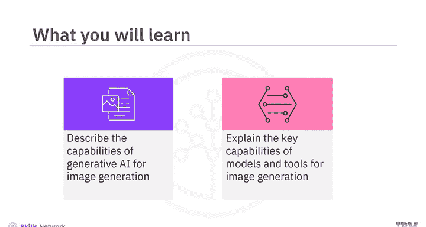

在本节课中，我们将学习生成式人工智能在图像生成领域的基本能力，并介绍几种主流的图像生成模型与工具。通过本课，你将能够描述这些模型的核心功能，并了解如何利用它们来创建和修改图像。

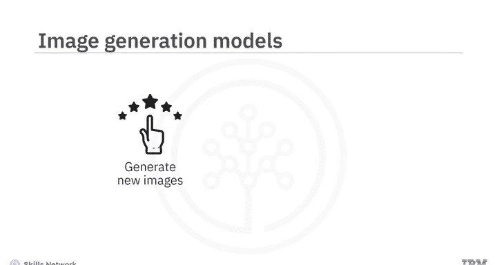

## 概述

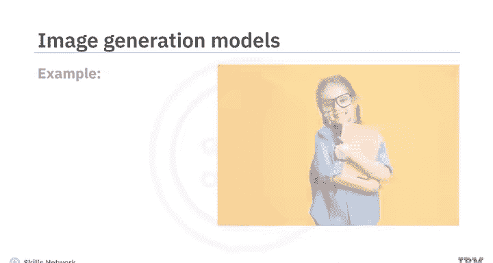

生成式AI图像生成模型能够根据文本描述创建全新的图像，并能对真实或生成的图像进行定制化修改，以获得期望的输出。例如，你可以生成一个“戴着帽子、手里拿着书的小孩”的图像，随后还可以更改书中封面的颜色。

## 文本到图像生成

上一节我们概述了图像生成的基本概念，本节中我们来看看如何通过文本提示来生成图像。

你可以使用免费的AI图像生成器（例如FreePik）来创建图像。操作时，需要输入一段描述你想要的图像的文本提示。提示词描述的准确性和用词会直接影响生成图像的质量。

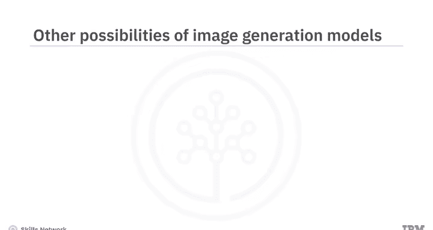

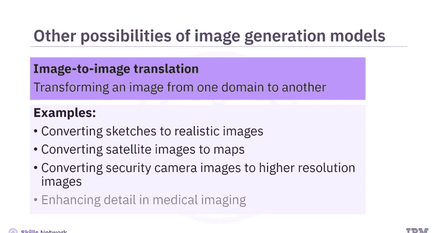

例如，输入提示词：“一艘船在日落时分的平静湖面上航行，周围是郁郁葱葱的绿植和宁静的天空”。选择风格后，即可生成图像。工具通常会生成多个版本供你选择、下载，你也可以通过修改提示词来生成其他图像。

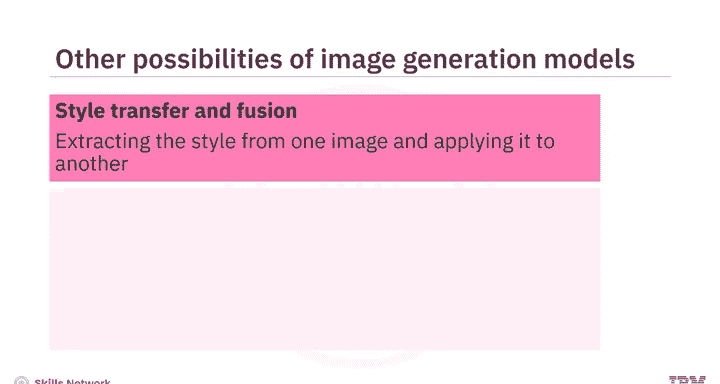

## 图像生成模型的更多可能性

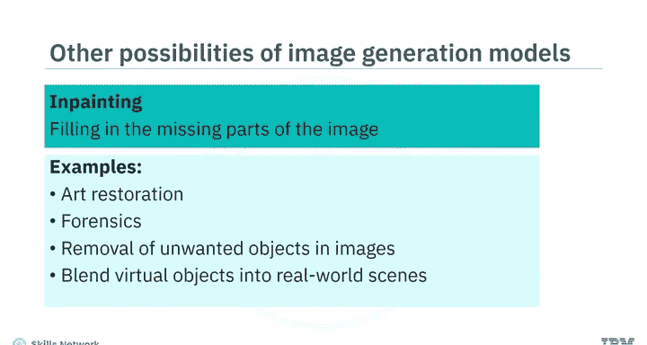

除了基础的文本生成图像，图像生成模型还具备多种高级功能。

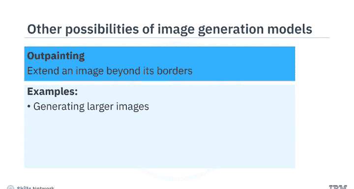

以下是几种关键的图像处理能力：

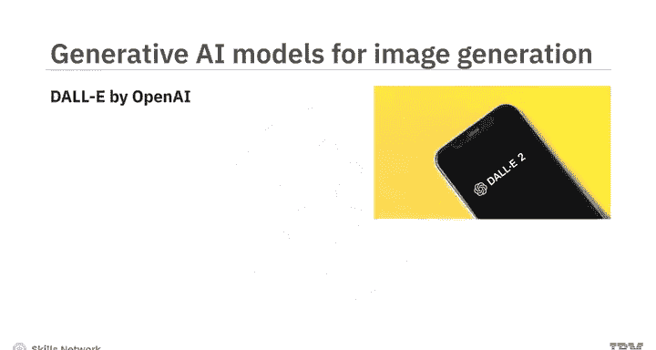

*   **图像到图像转换**：指将图像从一个领域转换到另一个领域，同时保留原始内容和风格。例如：
    *   将草图转换为逼真图像。
    *   将卫星图像转换为地图。
    *   提升安防摄像头图像的分辨率和细节。
    *   应用于医学影像增强。
*   **风格迁移与融合**：提取一张图像的风格，并将其应用到另一张图像上，从而创建混合或融合图像。例如，将一幅画作的风格应用到一张照片上。
*   **图像修复**：重建图像中缺失或损坏的部分，使其变得完整。可用于：
    *   艺术品修复。
    *   取证分析。
    *   移除图像中不需要的物体，同时保持画面的连续性和上下文。
    *   将虚拟物体融合到真实场景中（增强现实）。
*   **图像外绘**：通过生成与原始图像连贯的新部分来扩展原始图像。可用于：
    *   生成更大尺寸的图像。
    *   提升图像分辨率。
    *   创建全景视图。

## 主流图像生成模型

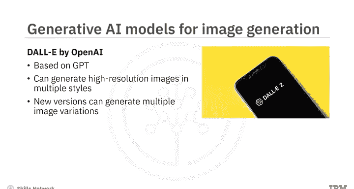

图像生成和修改能力的演进，离不开背后驱动模型的不断发展。

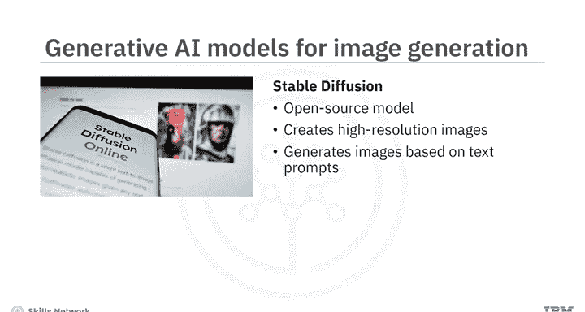

以下是几个重要的图像生成模型：

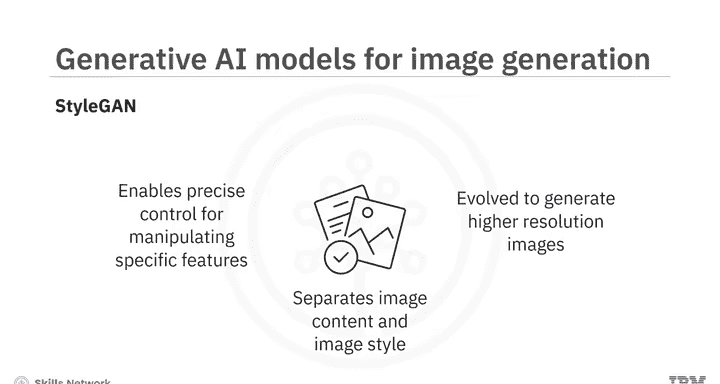

1.  **OpenAI的DALL-E** 🎨
    *   基于GPT模型，在大型图像及其文本描述数据集上训练而成。
    *   能够生成多种风格的高分辨率图像，包括逼真的照片和绘画。
    *   新版DALL-E提供了生成多种图像变体以及通过图像修复和外绘进行图像转换的能力。
2.  **Stable Diffusion** 🌊
    *   一个开源的“文本到图像”扩散模型。
    *   扩散模型是一种能创建高分辨率图像的生成模型。
    *   核心功能是基于文本提示生成图像，但也可用于图像到图像转换、修复和外绘。
3.  **NVIDIA的StyleGAN** 👾
    *   该模型将图像内容建模和图像风格建模分离开，从而能精确控制风格，并操纵特定特征（如姿势或面部表情）。
    *   已演进到能生成具有更逼真细节的更高分辨率图像。

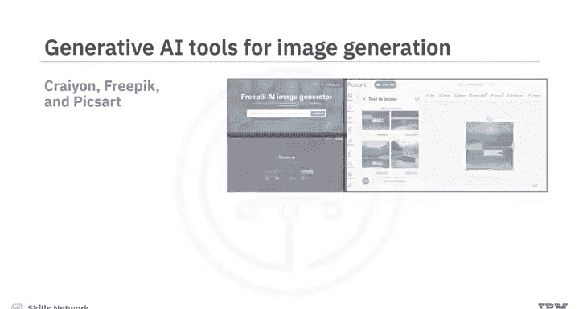

## 可用的图像生成工具

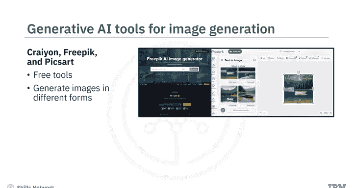

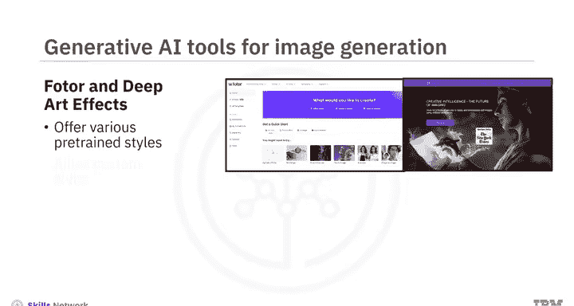

了解了核心模型后，我们来看看一些可供使用的具体工具。

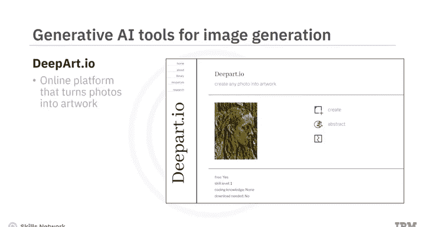

你可以使用Crayon、FreePik和Pixlr等免费工具来探索生成式AI的文本到图像生成能力，这些工具能以不同的形式和风格生成图像。

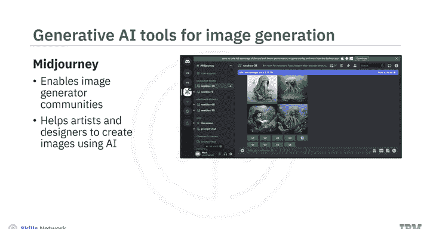

此外，还有一些专注于艺术风格的工具：

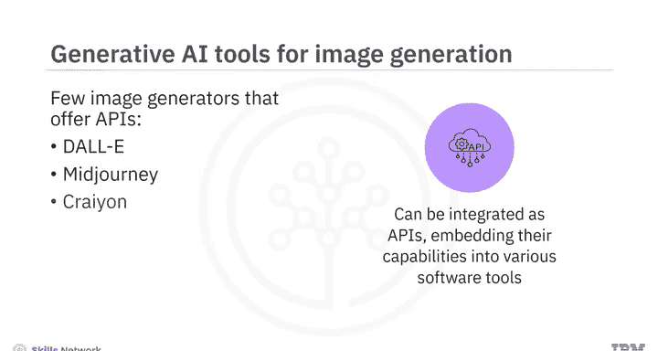

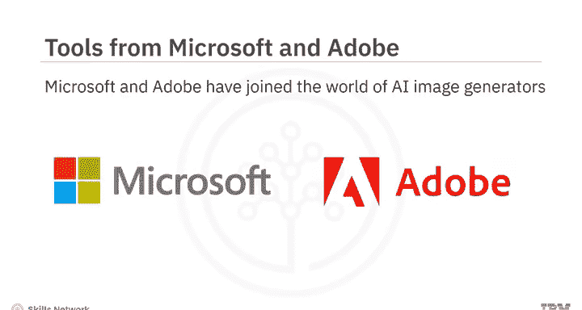

*   **DeepArt.io** 是一个在线平台，可以将照片转化为不同艺术风格的作品。
*   **MidJourney** 是一个平台，它构建了一个图像生成者社区，帮助艺术家和设计师使用AI创作图像，并探索彼此的作品。

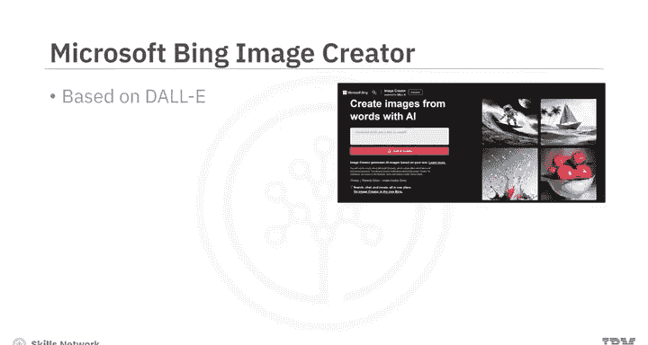

许多生成式AI图像生成器还提供**API接口**，允许将它们的功能集成到不同的软件程序和工具中。一些提供API的流行图像生成器包括DALL-E、MidJourney和Crayon。

## 科技巨头的参与

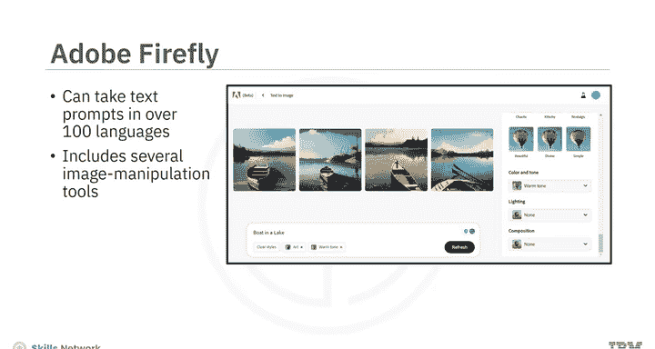

技术巨头如微软和Adobe也已涉足AI图像生成器领域。

*   **Microsoft Bing Image Creator** 🖥️
    *   基于DALL-E模型。
    *   你可以通过访问Bing.com/create或通过Microsoft Edge浏览器使用该工具，这使得Microsoft Edge成为首个集成AI图像生成器的浏览器。
*   **Adobe Firefly** 🔥
    *   这是一系列生成式AI工具，旨在与Adobe Creative Cloud应用程序（如Photoshop和Illustrator）集成。
    *   Firefly使用Adobe Stock图片、开源许可内容和公共领域内容进行训练。
    *   它能接受超过100种语言的文本提示，并包含多种工具，允许你操控颜色、色调、光照、构图，以及使用生成式填充、文本效果、生成式重新着色、3D转图像和图像扩展等功能。

## 总结

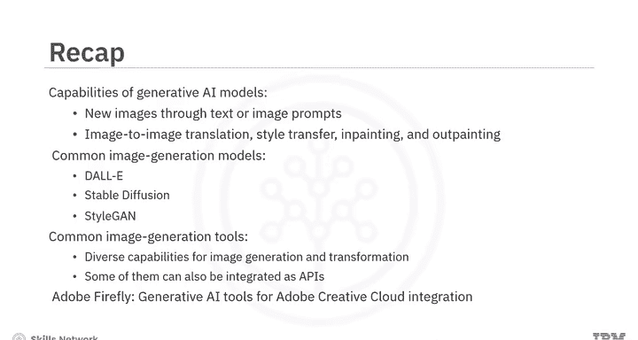

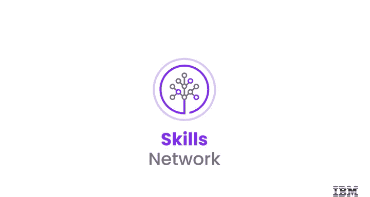

本节课中，我们一起学习了生成式AI模型和工具如何通过文本和图像提示来生成新图像。它们还提供了图像到图像转换、风格迁移、图像修复和外绘等能力。几个著名的图像生成模型包括DALL-E、Stable Diffusion和StyleGAN。目前有多种图像生成工具可用，提供多样化的图像生成和转换功能，其中一些还能通过API进行集成。我们还了解到，Adobe Firefly是一个旨在与Adobe创意云应用程序集成的生成式AI工具家族。