# 042：音频和视频生成工具 🎵🎬

在本节课中，我们将学习生成式人工智能在音频和视频领域的应用工具。我们将了解这些工具如何创建有影响力的媒体内容，并探索它们重新构想虚拟世界的能力。

---

## 市场前景与概述

根据Market US的估计，生成式AI音乐市场在2022年价值2.29亿美元，预计将以28.6%的高复合年增长率增长，到2032年将达到26.6亿美元。生成式AI音乐正是利用生成式AI的音频能力创造的。近年来，这些能力正在帮助公司和个人，无论是新手还是经验丰富者，简化流程，将他们复杂的构想变为现实。

想象一下，如果你一直拖延开始制作播客，或者想为你的混音添加一些音效，那么你将会爱上生成式AI音频工具。

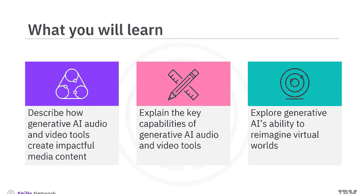

---

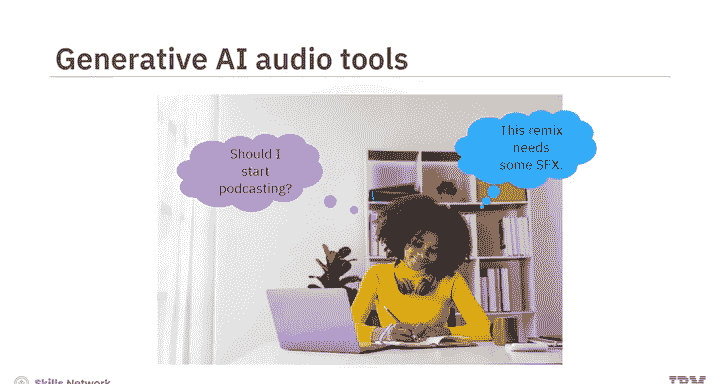

## 音频生成工具 🎤

生成式AI音频工具主要分为三类：语音生成工具、音乐创作工具以及音频质量增强工具。

### 语音生成工具

语音生成工具主要是**文本转语音**工具，它们将文本转换为音频。虽然朗读技术并非全新，但生成式AI架构升级了这项技术的工作方式。

以下是其工作原理：
1.  **深度学习算法**在大量人类语音数据集上进行反复训练。
2.  这使得算法能够分解并高效复制**发音、语速、情感和语调**等声音特征。
3.  因此，生成式AI TTS工具能创造出更准确、更自然的语音，这对有视觉障碍、语言障碍或其他阅读困难的人士尤其有帮助。

从趣味性角度看，这些工具可以帮助你“听”文章、反馈和笔记，这可能比阅读更轻松。它们也能帮助你更好地沟通。

如果你想以一种出众的方式为你的演示文稿配音，你可以登录诸如 **LOvo、Cynthsia、Merrf.ai 或 Listener** 等平台。这些工具提供了庞大的AI语音库、多种语言和情感选择，你甚至可以创建独特的声音或克隆自己的声音。

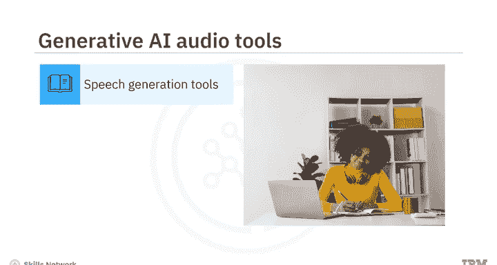

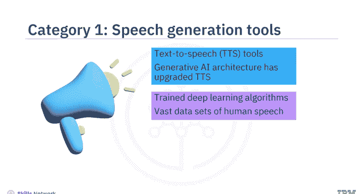

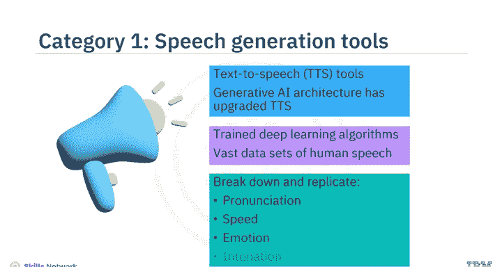

一些工具还允许你编辑音轨、发音、语调和语速，以创造出听起来专业的最终产品。

### 音乐创作工具 🎹

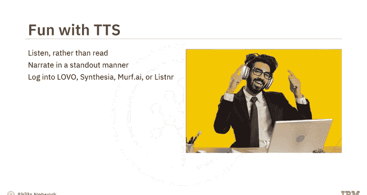

假设在一个阳光明媚的下午，你内心的业余音乐家感到灵感迸发。你可以尝试**Meta的AudioCraft**，这是一个在音效和20,000小时Meta自有或授权音乐上预训练的生成式AI工具。

此外，还有**Shutterstock的Amper Music、AIVA、Soundful、Google的Magenta**以及**G4驱动的Wave工具**。这些工具让你可以从广泛的音乐库、不同的音乐流派、乐器风格和旋律中进行选择。

你只需要输入一个基于你需求的**文本提示**，工具就能：
*   谱写简短的旋律或即兴重复段。
*   建议或添加乐器。
*   创作一首新歌。
*   为你的下一个YouTube或Instagram视频制作配乐。

生成式AI还可以帮助你混音、母带处理，并将最终的音乐作品发布到流行的流媒体平台上。

### 音频增强工具 🔊

你甚至可以使用音频增强工具。这些工具经过预训练，能够识别特定声音，可以为你的音频添加有趣的声音或去除不需要的噪音。

例如：
*   **Descript** 可以帮助你消除背景噪音、增强低质量录音并添加所需的音效。
*   **Adobe AI** 可以清理文件中的 unwanted noise。

许多音乐生成工具也具备音频编辑和增强功能。

---

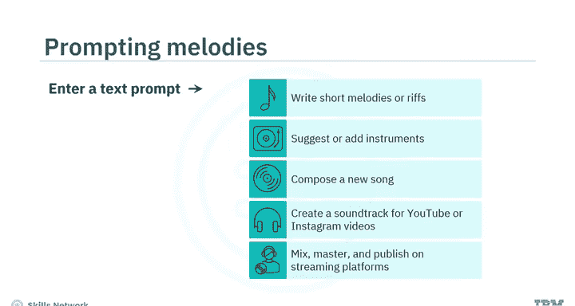

## 视频生成工具 🎥

上一节我们介绍了音频工具，本节中我们来看看视频生成工具。有些项目需要的不仅仅是精选的音效。在2022年，**Runway AI** 就利用生成式AI能力制作了奥斯卡获奖电影《瞬息全宇宙》。

即使你不制作大型电影，也可以在日常生活中使用生成式AI视频工具。

假设你正在制作一部关于你所在城市树木缺乏的纪录片。你可以登录 **Runway的Gen1工具**，它将现有的视频片段转换成不同的风格；或者使用 **Runway的Gen2工具**，通过文本、图像或视频输入来创建视频。

或者，你也可以使用 **E视频工具包** 或 **Synthesia应用**。以下是这些工具的功能：
*   如果你没有任何素材，可以上传照片。
*   使用文本提示来生成你需要的图像。
*   录制旁白。
*   增强你的音频。
*   转换视频文件格式。
*   发布你的视频。

Synthesia甚至允许你创建自定义头像，以增强品牌辨识度。

---

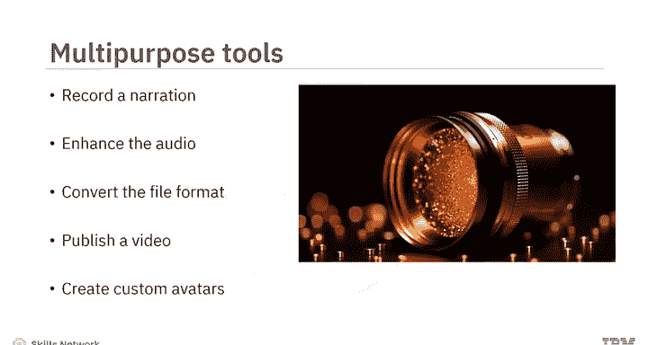

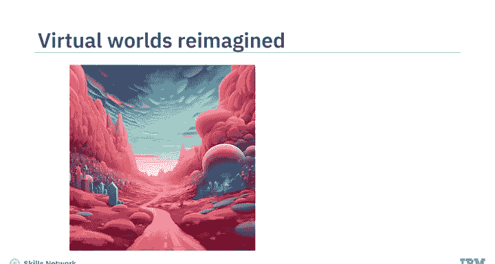

## 重塑虚拟世界 🌐

生成式AI可以增强你的虚拟世界体验。你可以创建具有混合特征和异域景观的独特、富有想象力的虚拟世界。生成模型还能实时响应，提高模拟的准确性。

元宇宙平台利用生成式AI来创造更个性化、更具吸引力的用户体验。游戏元宇宙允许你快速生成3D对象，甚至创建配备特定人格特征的虚拟形象，这些特征会反映在他们的表情、行为和决策中。

例如：
*   **The Sandbox** 是一个元宇宙，用户可以在其中即时构建、拥有并向全球推广他们的游戏。
*   **Scenario AI** 帮助创建和连接定制的移动游戏资产。

---

## 总结 📝

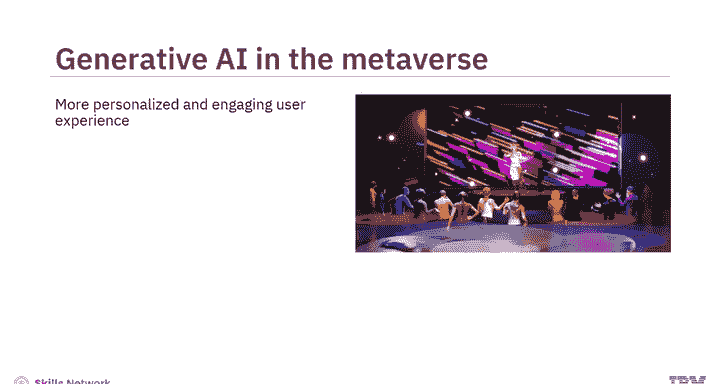

本节课中，我们一起学习了生成式AI音频和视频工具如何产生影响。通过一个简单的**文本提示**，你可以：
*   生成多种语言的人声级语音。
*   录制歌曲。
*   添加音效或去除 unwanted noise。
*   制作视频和动画。
*   构建增强版和充满异域风情的虚拟世界。

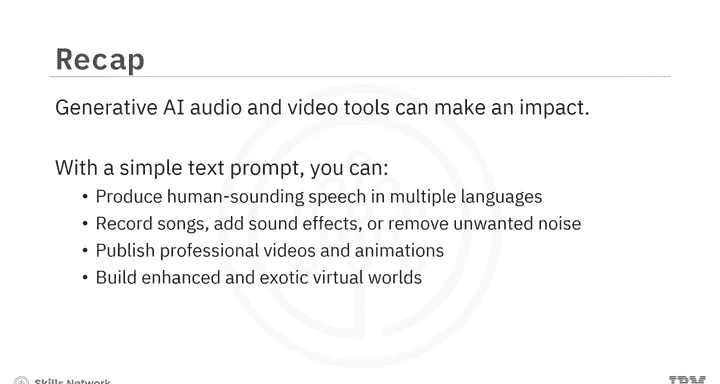

这些工具极大地降低了媒体内容创作的门槛，让每个人都能更轻松地将创意变为现实。