# 043：代码生成工具 🛠️

在本节课中，我们将要学习生成式人工智能在代码生成领域的应用。我们将探讨其基本能力、常用工具的优势与局限，并了解如何利用这些工具来提升开发效率。

---

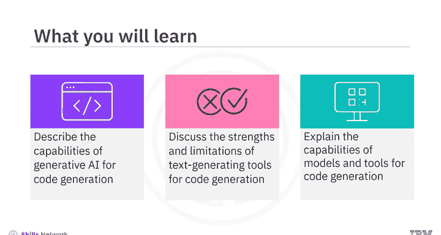

## 概述

生成式人工智能模型和工具能够根据自然语言输入生成代码。这些模型基于深度学习和自然语言处理技术，能够理解上下文并生成符合语境的代码。

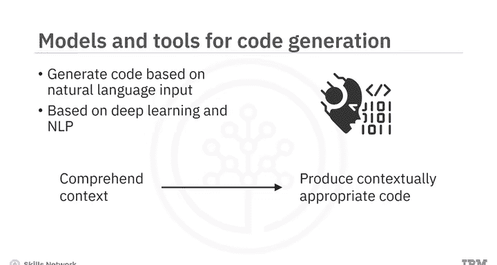

上一节我们介绍了生成式AI的基本概念，本节中我们来看看它在代码生成方面的具体能力。

---

## 代码生成的核心能力

基于深度学习和自然语言处理，代码生成工具具备以下多种能力：

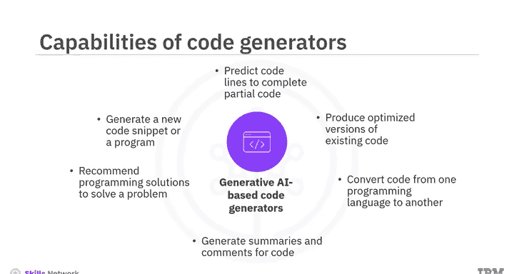

以下是代码生成工具的主要功能列表：

*   **生成新代码**：根据文本提示生成全新的代码片段或完整程序。
*   **代码补全**：预测并补全部分编写的代码片段。
*   **代码优化**：生成现有代码的优化版本。
*   **代码转换**：将代码从一种编程语言转换为另一种。
*   **生成文档**：为代码生成摘要和注释，以改进文档。
*   **提供解决方案**：根据描述的问题，推荐完整的编程解决方案，包括算法、数据结构和编程方法。

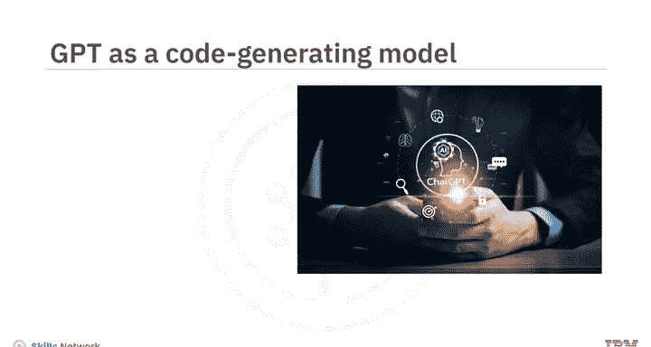

---

## GPT的代码生成能力

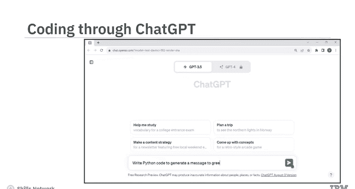

让我们深入探索GPT在代码生成方面的能力。OpenAI的GPT在类人文本生成方面表现出色，在代码创建上也展示了令人印象深刻的能力。

### 生成简单代码

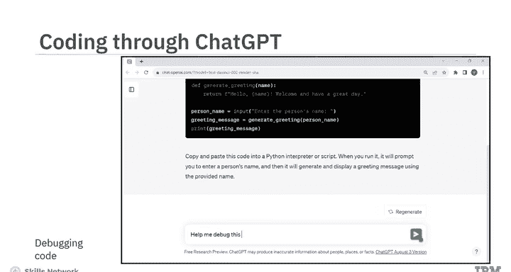

以下是一个通过基于GPT的ChatGPT生成简单Python代码的例子。

当你输入文本提示：“写一个Python代码来生成问候某人的消息”，ChatGPT会生成相应的Python代码。

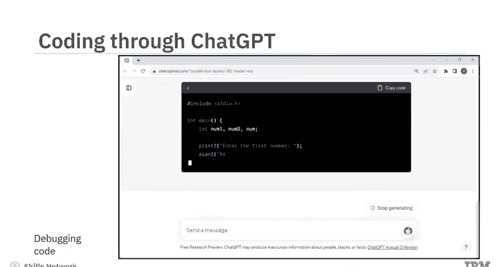

```python
def greet_person(name):
    message = f"Hello, 数据科学与人工智能笔记（一）! Welcome."
    return message

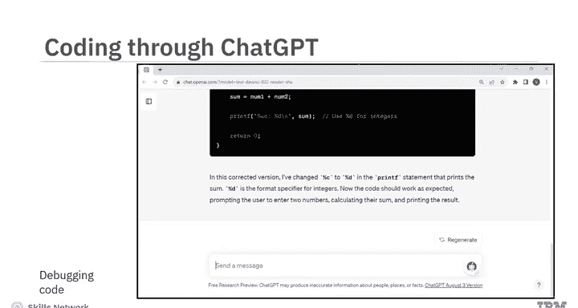

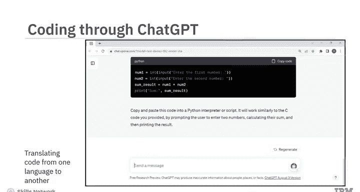

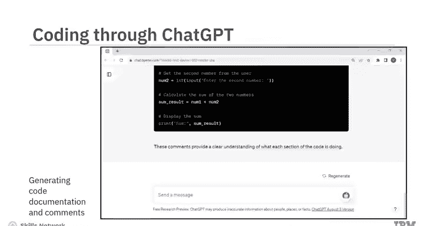

# 示例用法
print(greet_person("Alice"))
```

有趣的是，它还会提供关于如何运行此代码的指导。

### 有效提示的关键

为了生成有效的代码，提供清晰的提示至关重要。你需要**指定编程语言**，并提供其他相关的**要求和约束**。

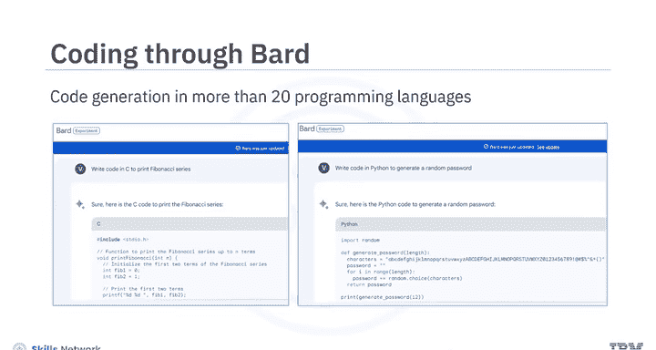

### 调试代码

为了演示GPT如何帮助调试代码，可以在ChatGPT中输入一段错误的代码作为文本提示。

当一段错误的代码和文本被提示给ChatGPT时，它会提供正确的代码并解释所做的修正。

### 其他能力

GPT还能够实现代码的跨语言翻译，并生成代码文档和注释以提高可读性。

---

## 工具的演进与局限

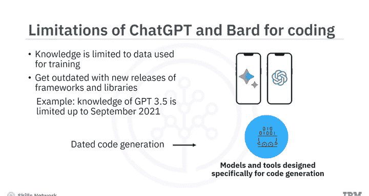

基于GPT的模型和工具已经发展到能够生成更长、更准确的代码。这使得开发者可以利用这些模型和工具来开发应用程序、网站和插件。

此外，GPT的演进使得从图像生成代码成为可能。例如，你可以输入一个课程大纲的图像，来为一个功能完整的应用程序生成代码。

Google Bard也提供了代码生成和调试能力，支持超过20种编程语言。

### 优势与适用场景

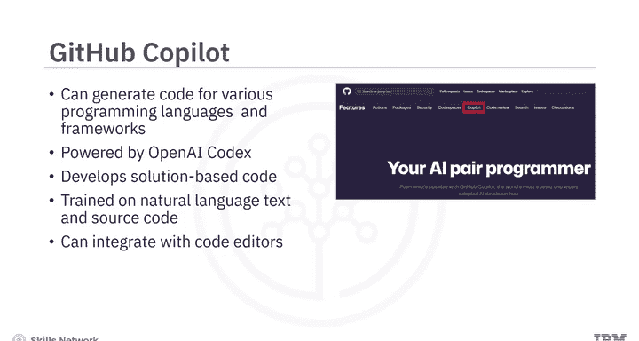

ChatGPT和Bard是学习新编程语言的宝贵工具，因为它们能提供**逐步的、详细的解释**，有助于更好地理解。

它们在生成具有基本逻辑和编程概念的代码方面表现出色。

### 局限性

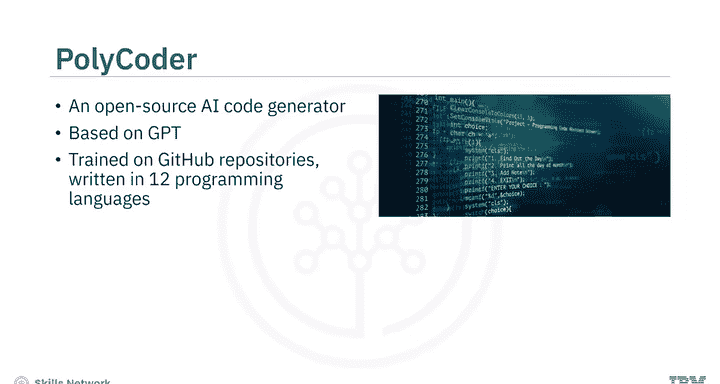

然而，这些工具可能无法从零开始生成大型或复杂的代码。

虽然这些工具理解编程概念和语法，但它们可能无法完全理解语义。因此，生成的代码可能在技术上是准确的，但仍可能无法按预期运行。

需要注意的是，这些模型的知识受限于其训练数据。特定版本的GPT可能不了解其训练之后发布的编程框架和库。例如，GPT-3.5的知识截止日期是2021年9月。

因此，如果你需要生成更新颖的代码，可以考虑使用专门为代码生成设计的模型和工具。

---

## 专用代码生成工具

不同的代码生成器提供特定的功能和特性。然而，当需求是让混合云开发者能为多样化需求编写代码时，IBM Watson Code Assistant是一个选择。

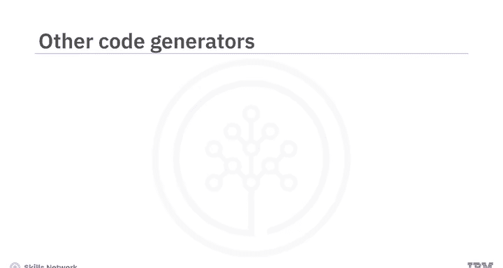

以下是几款主流的专用代码生成工具：

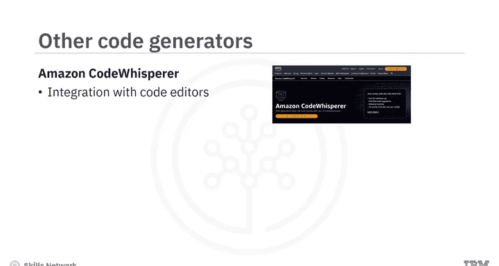

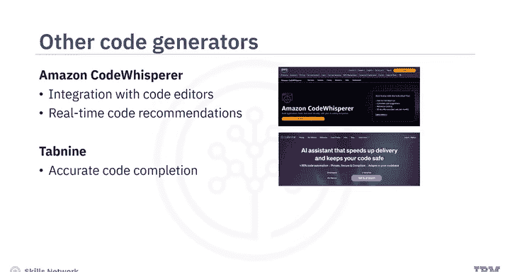

*   **GitHub Copilot**：由OpenAI Codex驱动，这是一个生成式预训练语言模型。它帮助开发者生成基于解决方案的代码。Copilot在自然语言文本和公开可用的源代码（包括GitHub仓库）上进行了训练。它可以作为扩展集成到流行的代码编辑器（如Visual Studio）中。它能生成遵循最佳实践和行业标准的代码片段。
*   **Polycoder**：一个开源的AI代码生成器。它基于GPT模型，并在用12种编程语言编写的各种GitHub仓库数据上进行了训练。它在编写C语言代码方面特别准确。Polycoder提供了一个广泛的内置模板库，可作为各种用例代码生成的蓝图。Polycoder可以帮助精确地创建、审查和优化符合要求的代码片段。
*   **IBM Watson Code Assistant**：建立在IBM watsonx.ai基础模型之上，适用于任何技能水平的开发者。你可以将Watson Code Assistant与代码编辑器集成。它使开发者能够通过实时推荐、自动完成功能和代码重构辅助，准确高效地编写代码。此外，你可以将代码或项目文件输入Watson Code Assistant进行分析。它能识别模式、提出改进建议并生成代码片段或模板。开发者可以根据特定项目需求自定义生成的代码。

还有许多其他AI驱动的代码生成器和代码助手工具可用于帮助开发者更快地编写准确的代码。

例如，**Amazon Code Whisperer**可以集成到代码编辑器中，并提供实时代码推荐。**Tabnine**有助于实现准确的代码补全。**Replit**是一个平台，为用户提供编码、学习和协作的交互空间。

---

## 优势与注意事项

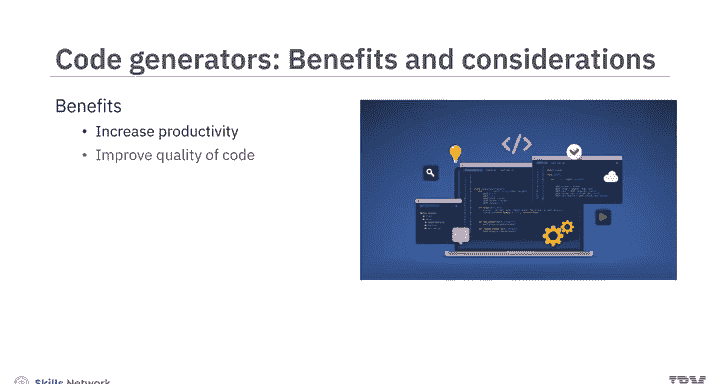

具有自动代码编写和优化功能的基于AI的代码生成器，帮助开发者提高了生产力和代码质量。它们支持快速原型设计以迭代设计想法。这些工具还通过支持多语言代码翻译，有助于实现跨平台兼容性和迁移。

基于AI的代码生成器遵循一致的模式和编码标准。它们可以建议重构模式以遵循最佳实践。

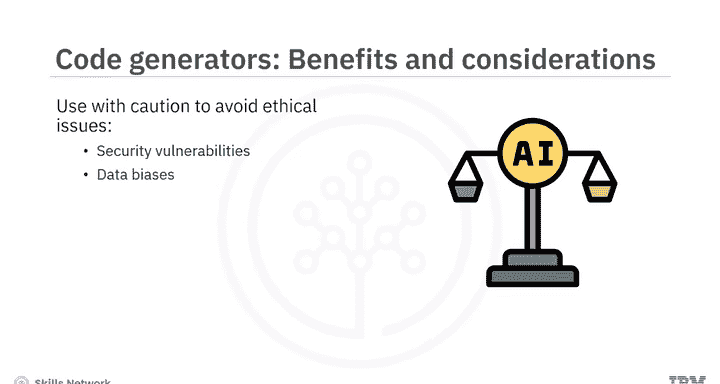

然而，应谨慎使用这些工具，以确保AI生成的代码不会导致伦理问题。例如，安全漏洞，因为这些工具可能被用于生成恶意代码，或者基于训练数据产生数据偏见。

---

## 总结

本节课中我们一起学习了基于生成式AI的模型和工具可以从文本和图像提示生成新代码、优化现有代码并生成基于解决方案的代码。ChatGPT和Bard适用于简单的代码生成、调试和学习编程。

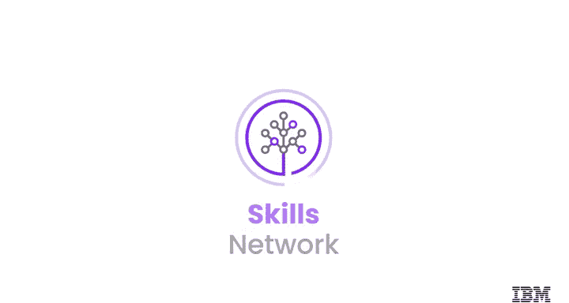

GitHub Copilot、Polycoder和IBM Watson Code Assistant等主流代码生成器提供了多样化的功能，如实时推荐、代码重构和解决方案模板。总的来说，代码生成器提高了生产力，加速了开发周期，促进了编码最佳实践，并培养了统一的编码标准。