# 044：课程介绍 🎬

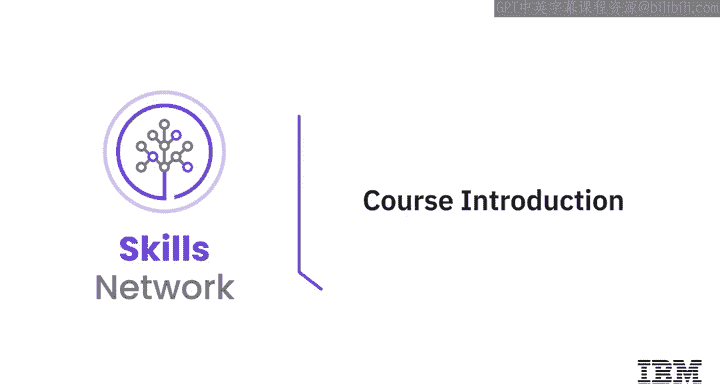

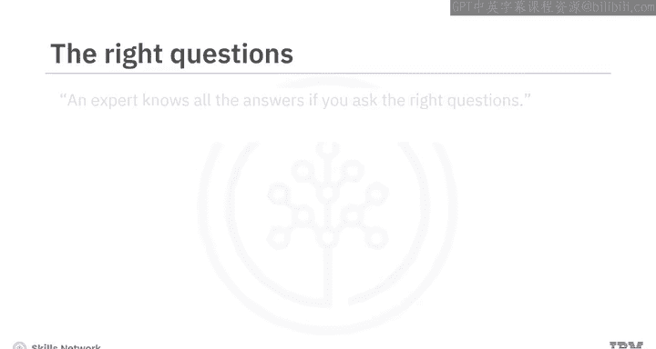

在本节课中，我们将要学习提示工程的基础知识，并了解本课程的整体结构、学习目标以及你将掌握的核心技能。

## 概述

一位专家，如果你问对问题，他就能给出所有答案。有趣的是，这正是我们为生成式人工智能模型设计提示词所遵循的原则。我们使用这些提示词来查询和提问人工智能应用，例如聊天机器人、图像、音频或视频生成工具，甚至虚拟世界。提示词能够优化生成式人工智能模型的响应。其力量在于你所提出的问题。知道如何编写有效且直接的提示词，将使你能够生成更精确、更相关的内容。

现在，一个好问题是：完成本课程后，我能做什么？

## 课程目标

本课程面向所有初学者，无论是专业人士、爱好者、从业者还是学生，只要对学习如何编写有效提示词抱有真诚的兴趣。这是一门面向所有人的课程，无论你的背景或经验如何。

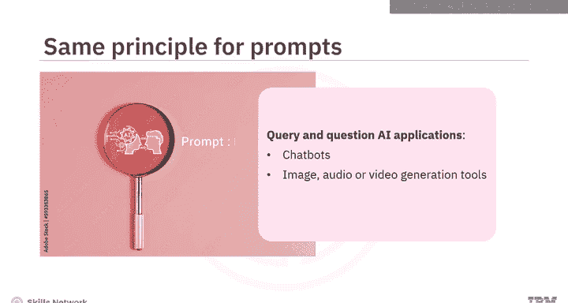

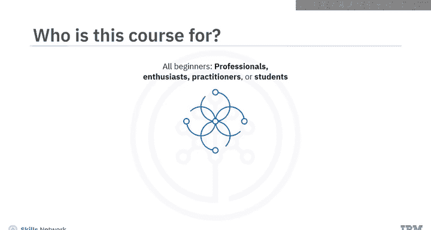

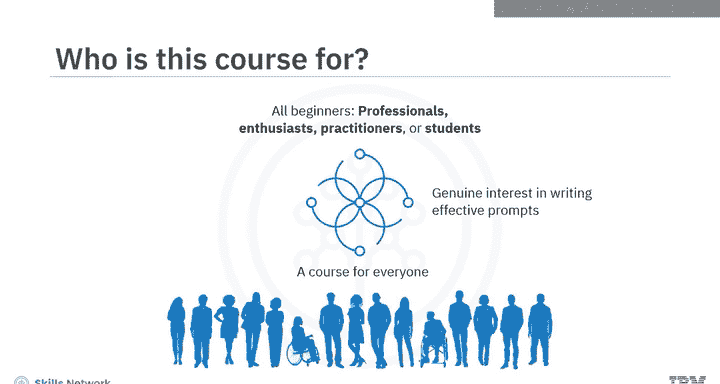

在本课程结束时，你将能够：
*   解释提示工程在生成式人工智能模型中的概念和重要性。
*   应用创建提示词的最佳实践。
*   评估常用的提示工程工具。
*   应用常见的提示工程技术和方法来编写有效的提示词。

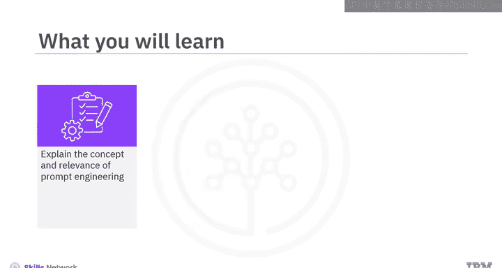

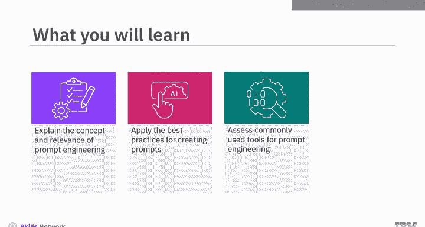

## 课程结构

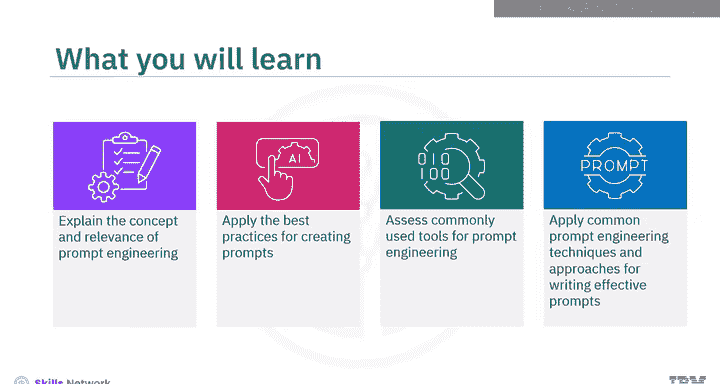

这是一门精炼的课程，包含三个模块，每个模块需要一到两个小时完成。

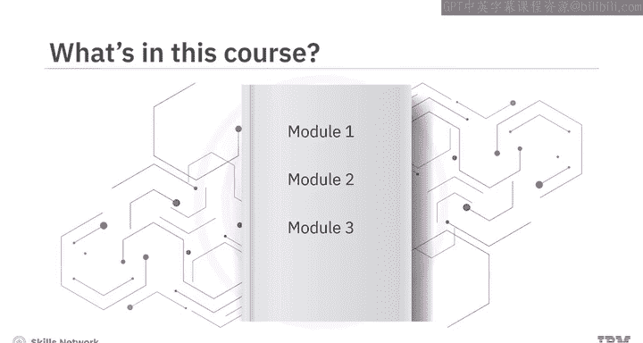

以下是课程模块的详细内容：

**模块一：提示工程基础**
在课程的第一个模块中，你将学习提示工程的概念，从如何定义提示词及其构成元素开始。你将学习应用编写有效提示词的最佳实践，并评估常见的提示工程工具，例如 IBM Watson X Prompt Lab、Spellbook 和 Dust。

**模块二：提示工程方法与技术**
在模块二中，你将学习各种提示工程方法，例如访谈模式、思维链和思维树。你将发现巧妙设计提示词的技术，例如 **零样本** 和 **少样本**，以产生精确且相关的响应。

**模块三：实践与评估**
模块三要求你参与一个最终项目，并提供一个计分测验来检验你对课程概念的理解。你还可以访问课程术语表，并获得关于后续学习步骤的指导。

## 学习资源与活动

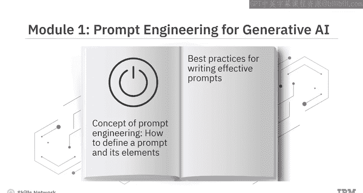

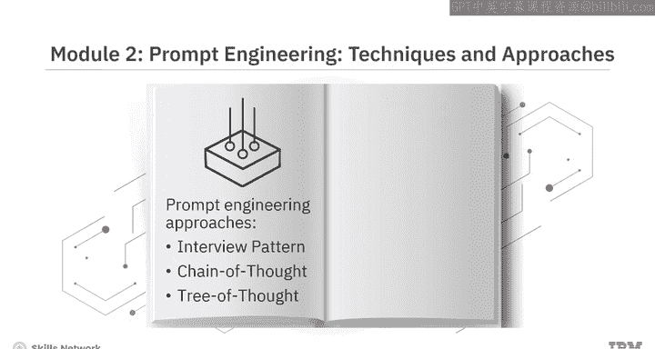

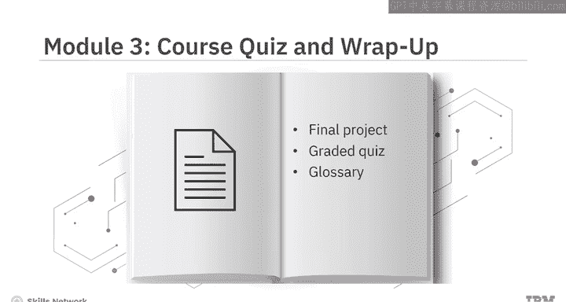

本课程精心编排了概念视频和辅助阅读材料。观看所有视频以充分掌握学习材料的潜力。

你将享受实践实验室和最终项目，这些活动展示了如何在 IBM 生成式人工智能教室中通过创建有效的提示词来优化结果。课程包含练习测验，帮助你巩固学习。课程结束时，你还需要完成一个计分测验。

课程还提供了讨论论坛，方便你与课程工作人员联系并与同伴互动。最有趣的是，通过专家观点视频，你将听到经验丰富的从业者分享他们对提示工程中使用的工具、方法以及编写有效提示词的艺术的见解。

## 总结

本节课中，我们一起学习了本课程的概览。我们了解到，提示工程的核心在于提出正确的问题以引导AI生成最佳答案。本课程旨在帮助你掌握定义提示词、应用最佳实践、使用工具以及实施高级技术的能力。课程通过模块化的结构、丰富的实践项目和专家见解，为你提供了全面的学习路径。

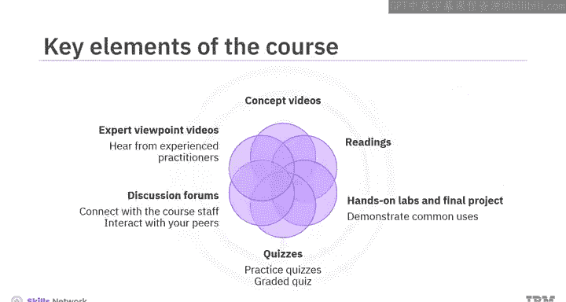

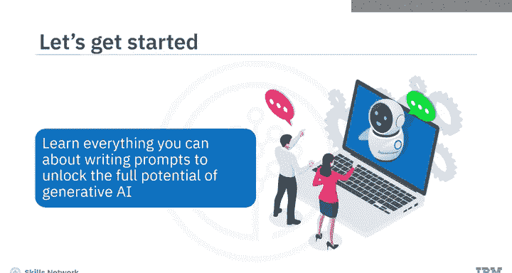

你准备好学习关于编写提示词的一切知识，以释放生成式人工智能的全部潜力了吗？让我们开始吧。