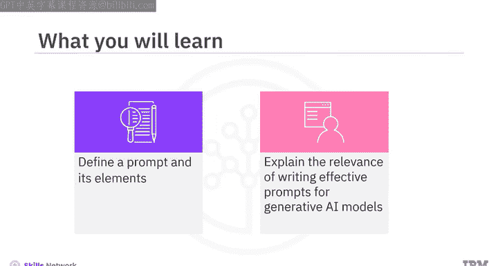
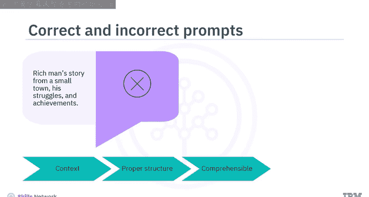
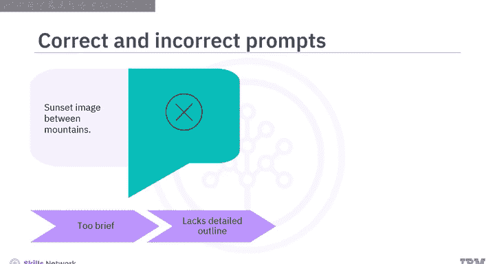
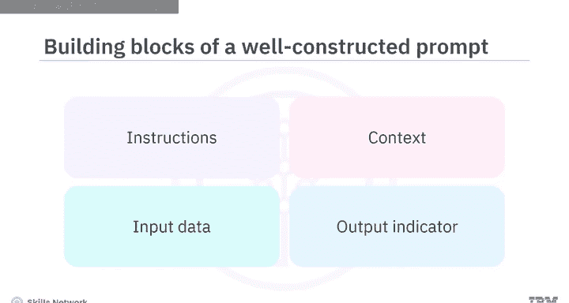
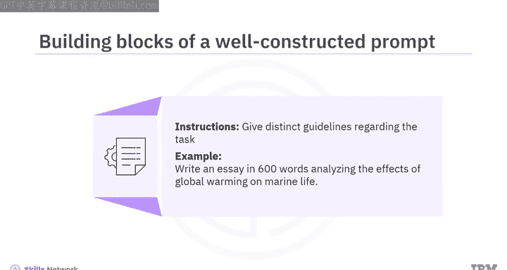
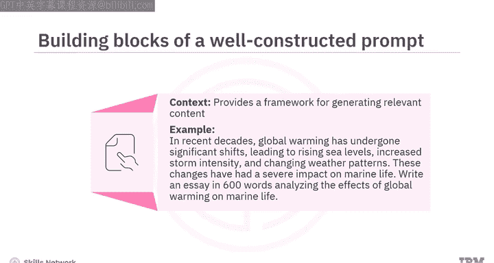
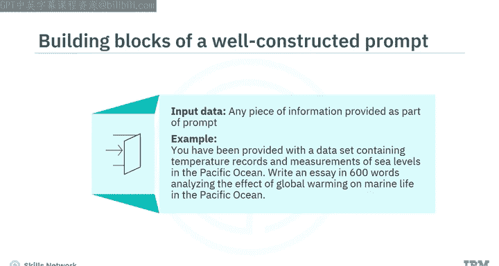
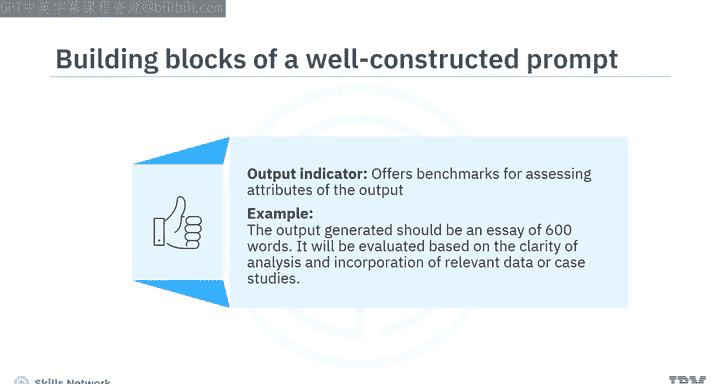
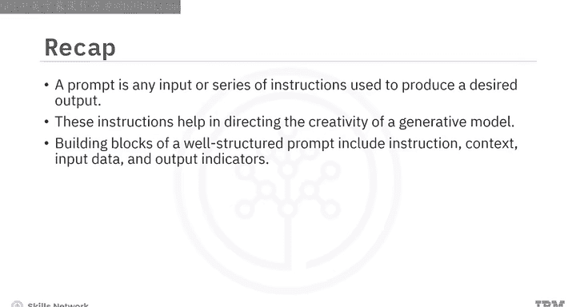

生成式人工智能工程：P45：什么是提示

在本节课中，我们将学习提示（Prompt）的基本概念及其构成要素。理解如何编写有效的提示对于引导生成式AI模型产生期望的输出至关重要。

生成式AI模型的一个重要能力是其输出与人类创作的内容高度相似：相关、符合语境、富有想象力、细致入微且语言准确。而生成这种输出的关键因素之一就是提示。

那么，什么是提示？提示是你提供给生成式模型的任何输入，用以产生期望的输出。你可以将其视为给模型的指令。例如：
*   `写一小段文字描述你最喜欢的度假胜地。`
*   `编写HTML代码，为在线表单生成一个城市下拉选择框。`

这些都是用于产生特定输出的直接提示。提示也可以是一系列逐步细化输出的指令，以达到期望的结果。例如：
*   `写一个关于火星上学生生活的短篇故事。`
*   `他在研究期间面临了哪些挑战？`

从这些例子可以看出，提示包含问题、上下文文本、引导模式或示例，以及基于这些自然语言请求为模型提供的部分输入。生成式AI模型根据这些提示收集信息、进行推理并提供创造性的解决方案。这些指令帮助模型基于提供的输入，产生相关且合乎逻辑的回应或输出。

为了更好理解，让我们看更多例子。

假设你希望模型写一个关于农民在10年内成为成功商人的奋斗与成就的短篇故事。如果你的提示是“来自小镇的富人故事，他的奋斗与成就”，它会产生一个通用的输出。这被称为**朴素提示**，即以最简单的方式向模型提问。

为了向模型传达你的意图，你可以进行简单的调整，从而显著改善结果。你的提示需要包含上下文、恰当的结构，并且易于理解。

因此，你可以将提示重写为：
`写一个关于农民在10年内成为富有且有影响力的商人的奋斗与成就的短篇故事。`

再看另一个例子，你想让模型生成你想象中的日落风景图像。将提示写为“山间的日落图像”可能无法给出期望的输出。这个提示过于简短，缺乏对你脑海中图像的详细描述。

你可以将提示重写为：
`生成一幅描绘宁静日落的图像，场景是坐落在群山之间的河谷。`

要掌握编写有效提示的艺术，让我们逐一理解一个结构良好的提示的构成要素。

以下是构成一个结构良好提示的核心要素：

1.  **指令**
    为模型提供关于你希望执行任务的明确指导，引导生成式AI模型的行为，以影响其回应的形成。
    例如：`写一篇600字的文章，分析全球变暖对海洋生物的影响。`

2.  **上下文**
    上下文有助于建立构成指令背景的环境，并为生成相关内容提供框架。
    为了理解这一点，让我们为上一个例子中的提示添加一些上下文：
    `近几十年来，全球变暖发生了显著变化，导致海平面上升、风暴强度增加和天气模式改变。这些变化对海洋生物产生了严重影响。写一篇600字的文章，分析全球变暖对海洋生物的影响。`
    这个提示将帮助模型生成与上下文一致的输出。

3.  **输入数据**
    这是你作为提示的一部分提供的任何信息。生成式模型可以将其用作参考，以获得包含特定细节或想法的回应。
    为了提供输入数据，同一个提示可以重构如下：
    `你已获得一个包含太平洋温度记录和海平面测量的数据集。写一篇600字的文章，分析全球变暖对太平洋海洋生物的影响。`

4.  **输出指示器**
    输出指示器为评估模型生成输出的属性提供了基准。它可以概述你期望输出具备的语气、风格、长度和其他品质。
    在提示“写一篇600字的文章，分析全球变暖对海洋生物的影响”中，输出指示器指定生成的输出应为一篇600字的文章。它将根据分析的清晰度以及相关数据或案例研究的纳入情况进行评估。

这些要素中的每一个都在帮助生成式AI模型理解你的需求并给出期望的输出方面发挥着作用。

本节课中，我们一起学习了提示是提供给生成式模型以产生期望输出的任何输入或一系列指令。这些指令有助于引导模型的创造力，并协助产生相关且合乎逻辑的回应。一个结构良好的提示的构成要素包括指令、上下文、输入数据和输出指示器。这些要素帮助模型理解我们的需求并生成相关的回应。