# 046：什么是提示工程 🧠

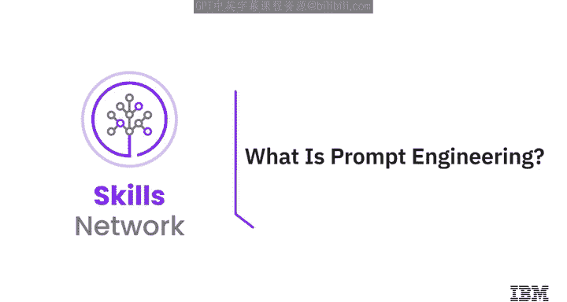

在本节课中，我们将学习提示工程的定义、重要性以及如何通过一个结构化的流程来设计有效的提示，以引导生成式AI模型产生更相关、更准确的输出。

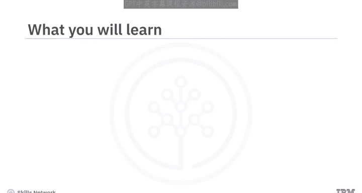

## 概述

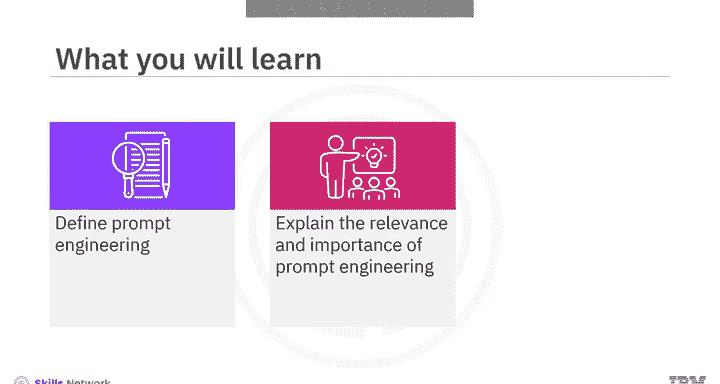

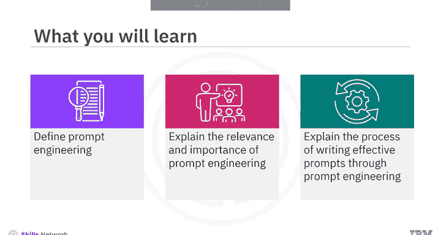

提示工程是设计有效提示的过程，旨在引导生成式AI模型生成更优质、更符合预期的回答。它结合了批判性分析、创造力和技术敏锐度。如果提示不够精确，模型可能会产生不充分甚至错误的结果。

## 提示工程的过程

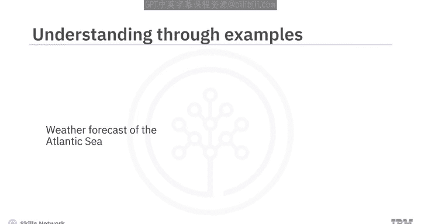

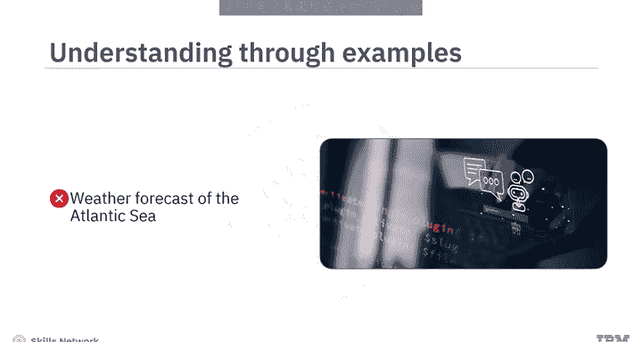

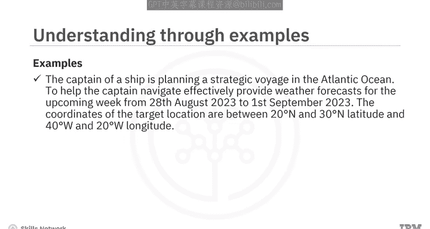

上一节我们介绍了提示工程的基本概念，本节中我们来看看如何通过一个迭代的、结构化的流程来创建有效的提示。

以下是创建有效提示的逐步流程：

1.  **定义目标**
    流程的第一步是确立一个清晰的目标。你必须明确希望模型生成什么内容。
    *   **示例目标**：概述人工智能在汽车领域的益处与风险。

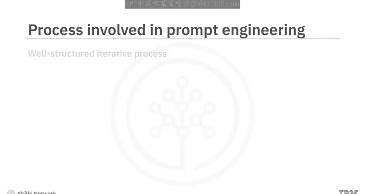

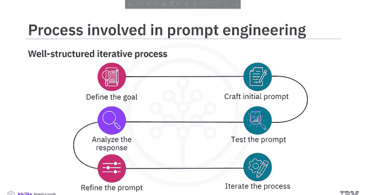

2.  **创建初始提示**
    根据定义的目标，现在是时候创建初始提示了。它可以是一个问题、一个指令或一个场景。
    *   **示例初始提示**：`写一篇分析人工智能融入汽车行业所带来的益处和缺点的文章。`

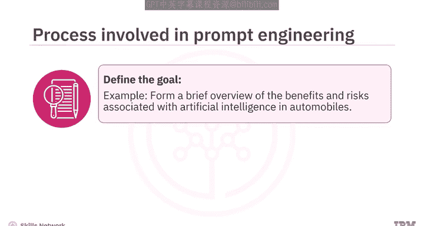

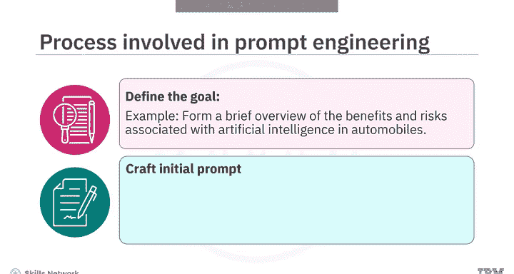

3.  **测试提示**
    接下来，需要测试你创建的提示并分析其响应。响应可能相关，但可能缺乏你所追求的特定视角。
    *   **示例分析**：对初始提示的响应直接列出了人工智能在汽车行业的益处和缺点，但未强调可能出现的伦理问题，也没有讨论其正面和负面影响。

4.  **分析响应**
    你必须仔细审查响应，检查其是否符合你的目标。如果不符合，请记下不足之处。
    *   **示例不足**：初始提示未能全面涵盖人工智能在汽车行业相关的益处和风险范围。

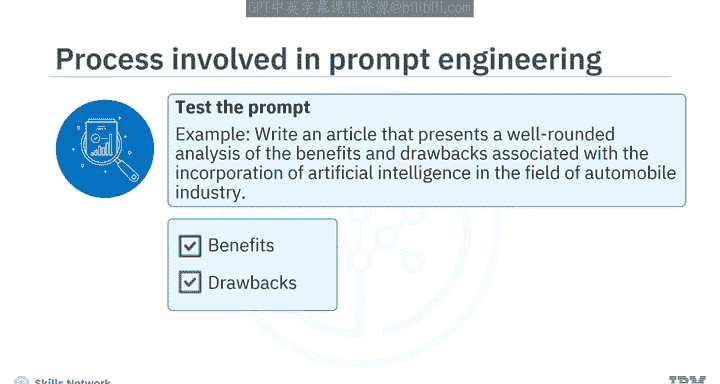

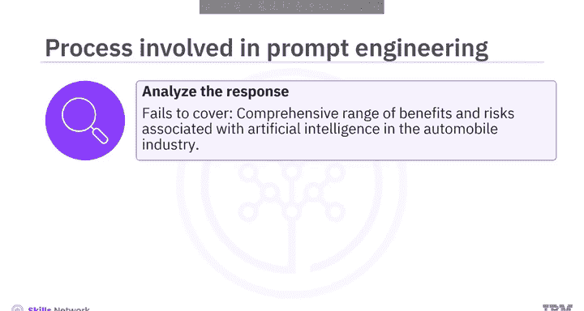

5.  **优化提示**
    利用通过测试和分析获得的知识，现在可以修改提示了。这可能包括增强其特异性、添加上下文或重新措辞。
    *   **示例优化提示**：
        ```
        写一篇信息性文章，讨论人工智能在革新汽车行业中的作用。需涉及关键方面，如益处、缺点、伦理考量以及正面和负面影响。涵盖特定领域，如自动驾驶和实时交通分析，同时审视潜在挑战，如技术复杂性和网络安全问题。
        ```

6.  **迭代流程**
    最后三个步骤（测试、分析、优化）需要重复进行，直到你对模型的响应感到满意为止。
    *   **示例最终提示**：
        ```
        写一篇文章，重点阐述人工智能如何重塑汽车行业。聚焦于自动驾驶和实时交通分析等领域的积极进展，同时深入探讨与复杂技术方面相关的担忧，例如决策算法和潜在的网络安全漏洞。强调这些担忧可能对车辆安全产生的影响。确保分析透彻、有实例支撑并能引发批判性思考。
        ```

## 提示工程的重要性与相关性

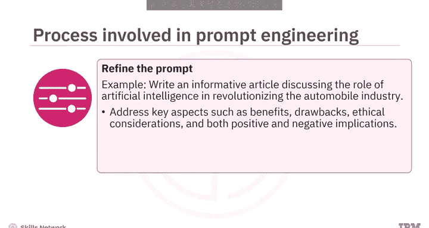

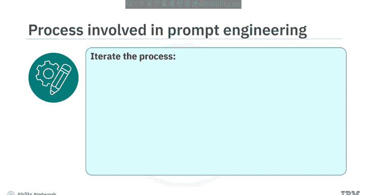

了解了提示工程的流程后，我们来看看它在生成式AI模型应用中的核心价值。

*   **优化模型效率**：提示工程有助于设计智能提示，让用户无需大量重新训练即可充分利用模型的能力。
*   **提升特定任务性能**：提示工程使生成式AI模型能够生成细致入微且符合上下文的响应，从而在特定任务中更加有效。
*   **理解模型限制**：通过每次迭代优化提示并研究模型的相应响应，可以帮助我们理解其优势和弱点。这些知识可以进一步指导未来的功能增强或模型整体开发。
*   **增强模型安全性**：熟练的提示工程可以防止因提示设计不当而导致生成有害内容的问题，从而增强模型使用的安全性。

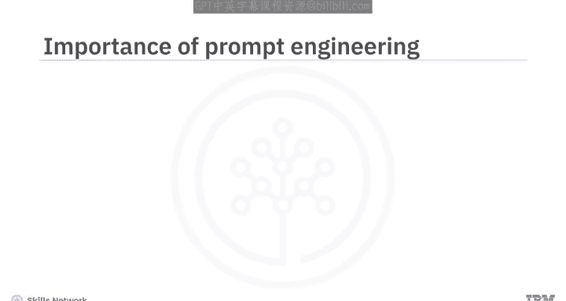

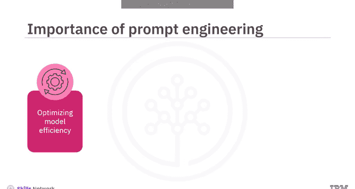

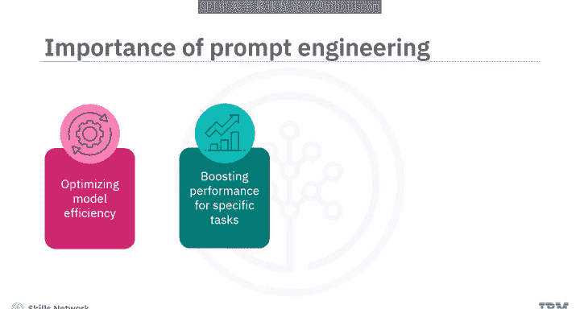

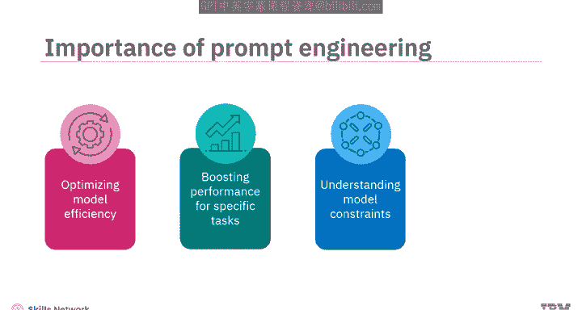

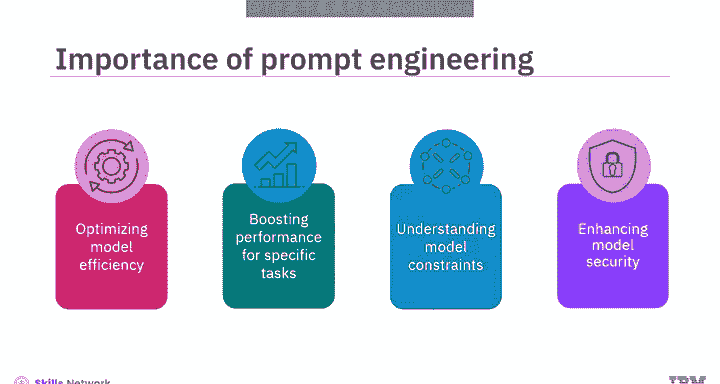

## 总结

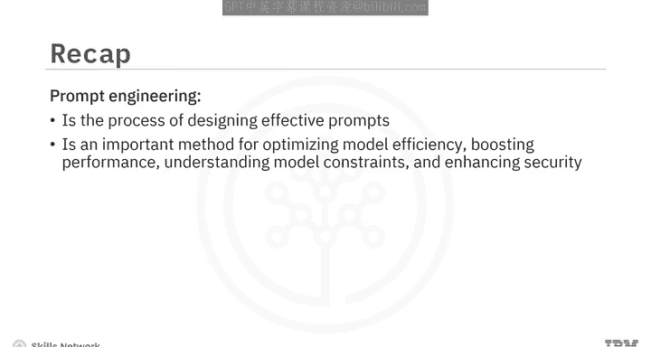


本节课中我们一起学习了提示工程的核心内容。我们了解到，提示工程是设计有效提示以充分利用生成式AI模型能力、产生最佳响应的过程。我们还学习了通过定义目标、创建提示、测试、分析、优化和迭代来优化提示的流程。最后，我们探讨了提示工程在优化模型效率、提升任务性能、理解模型限制和增强安全性方面的重要性。