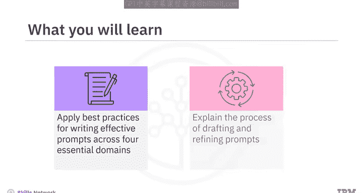
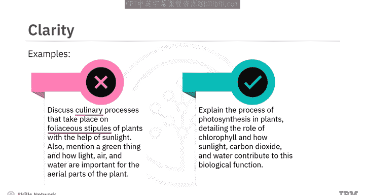
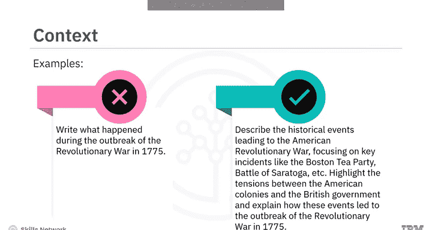
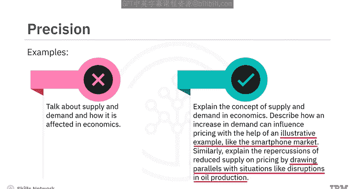
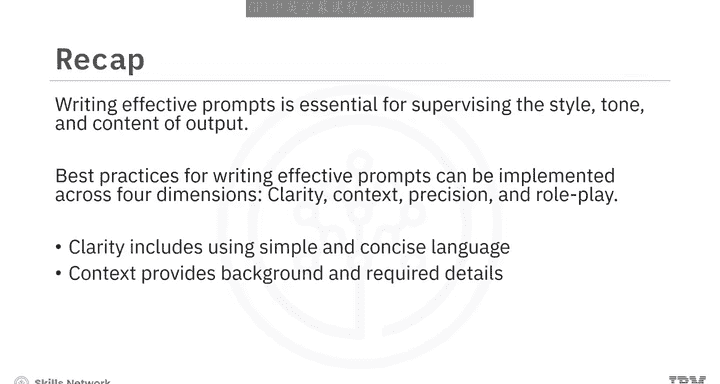

# 047：提示创建的最佳实践 🎯

在本节课中，我们将学习如何应用最佳实践来创建有效的提示，并通过多个示例解释起草和优化提示的过程。

撰写有效的提示对于充分发挥生成式人工智能模型的潜力、生成相关且准确的回应至关重要。通过应用创建有效提示的最佳实践，你可以监督生成输出的风格、语气和内容。这些最佳实践主要围绕四个核心维度展开：**清晰度**、**上下文**、**精确度**以及**角色扮演或人物模式**。

---

## 清晰度 ✨

上一节我们介绍了创建有效提示的四个维度。本节中，我们首先来看看**清晰度**。清晰的提示有助于模型准确理解你的意图。

为了确保提示的清晰度，请记住以下几点：

*   **使用简单直接的语言**：简单明了的语言可以轻松传达指令。因此，应撰写明确且易于理解的提示。
*   **避免专业术语**：特殊术语可能会使模型或用户感到困惑。因此，应使用能被广泛受众理解的简单词汇来撰写提示。
*   **明确任务描述**：模糊的提示可能导致回应与你的意图不符。因此，你必须清晰地描述模型需要执行的任务。

让我们通过一个例子来理解这一点。

**原始提示**：
> 讨论在植物完全无叶柄的托叶上借助阳光发生的烹饪过程。同时提及一种绿色的东西，以及光、空气和水对植物地上部分的重要性。

这个提示存在许多问题。它没有明确提及你想要讨论的过程，包含了复杂的术语使其难以理解，同时也非常模糊，没有清晰地描述手头的任务。

**优化后的提示**：
> 解释植物光合作用的过程，详细说明叶绿素的作用，以及阳光、二氧化碳和水如何促成这一生物功能。

优化后的提示使用了**简单、清晰、简洁的语言**，并明确表示你想要讨论植物光合作用的过程。

---

## 上下文 📖

接下来，我们探讨第二个重要维度：**上下文**。上下文总是能帮助模型理解情境或主题。

这可以涉及对需要回应的环境进行简要介绍或解释。相关的信息或具体细节，如人物、地点、事件或概念，有助于引导模型的理解。因此，在撰写提示时，融入这些细节非常重要。

例如，以下提示没有包含足够的上下文和具体细节来引导模型的理解：

**原始提示**：
> 写下1775年革命战争爆发期间发生了什么。

为了建立正确的上下文并包含相关信息，我们可以这样改写：

**优化后的提示**：
> 描述导致美国革命战争的历史事件，重点关注波士顿倾茶事件、萨拉托加战役等关键事件。强调美洲殖民地与英国政府之间的紧张关系，并解释这些事件如何导致了1775年革命战争的爆发。

---

## 精确度 🎯

创建有效提示的另一个重要维度是**精确度**。精确度有助于在提示中勾勒出你的请求。

如果你在寻找特定类型的回应，请清晰地表达出来。在提示中**融入示例**可以帮助模型理解你期望何种回应，并引导其思考过程。

例如，在以下提示中，没有精确地勾勒出特定类型的回应，也没有提供示例：

**原始提示**：
> 谈谈经济学中的供求关系及其影响。

为了确保精确度，我们可以这样改写：

**优化后的提示**：
> 解释经济学中的供求概念。描述需求增加如何影响价格，并借助一个说明性示例，例如智能手机市场。同样，通过类比石油生产中断等情况，解释供应减少对价格的影响。

这个提示清晰地表达了你想借助示例来解释一个概念。

---

## 角色扮演 👤

最后，我们来讨论最后一个维度：**角色扮演或人物模式**。从特定角色或人物视角撰写的提示，可以帮助模型生成与该视角一致的回应。

必要的上下文细节使模型能够有效地扮演特定角色。因此，如果你要求模型从历史人物、虚构角色或特定职业的角度进行回复，那么请提供相关的上下文细节。

让我们看这个例子：

**原始提示**：
> 写一篇日志，描述一个未知外星行星上奇特的动植物。

这个提示只会给出关于外星行星的科学细节，而不会从专业人士的角度解释其答案。

你可以这样改写提示：

**优化后的提示**：
> 假设你是一名刚刚降落在一个未知外星行星上的宇航员。写一篇日志，描述你遇到的奇特动植物，例如天空的颜色和回荡在外星景观中的陌生声音。表达你在记录这段非凡旅程时的兴奋、好奇以及一丝忧虑。

在这个例子中，你明确给出了上下文细节，并假设自己是一名宇航员。因此，这个提示将生成与宇航员视角一致的回应。

---

## 总结 📝

本节课中，我们一起学习了为生成式人工智能模型撰写有效提示的重要性，它能帮助我们监督输出的风格、语气和内容。撰写有效提示的最佳实践可以在四个维度上实施：**清晰度**、**上下文**、**精确度**和**角色扮演**。

*   **清晰度**包括使用简单、简洁的语言。
*   **上下文**提供背景和所需细节。
*   **精确度**意味着具体化并提供示例。
*   **角色扮演**可以通过假设一个人物角色并提供相关上下文来增强回应。

这些实践可以根据具体需求进行调整，以获得最佳结果。