生成式人工智能工程：P48：常见的提示工程工具 🛠️

在本节课中，我们将要学习常见的提示工程工具。你将能够描述这些工具的通用功能，并解释几种常见工具的具体能力。

提示工程是设计精确且符合上下文的提示词，以与生成式AI模型交互，从而生成相关且准确输出的过程。为了辅助这一过程，存在多种提示工程工具。这些工具提供了丰富的功能和特性，旨在优化提示词的创建，以获得期望的结果。它们对于可能不精通自然语言处理技术，但又希望在使用生成式AI模型时达成特定目标的用户尤为有用。

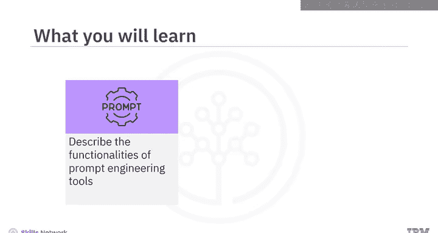

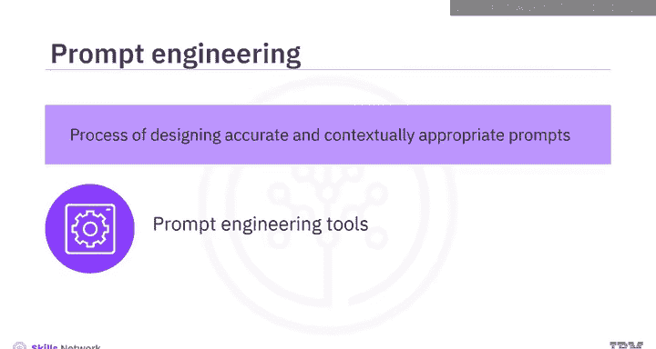

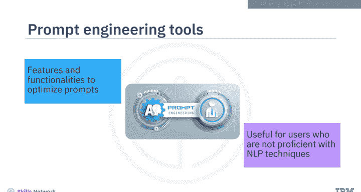

### 通用功能介绍

让我们先来探索各类提示工程工具提供的通用功能。

以下是这些工具通常具备的核心功能：

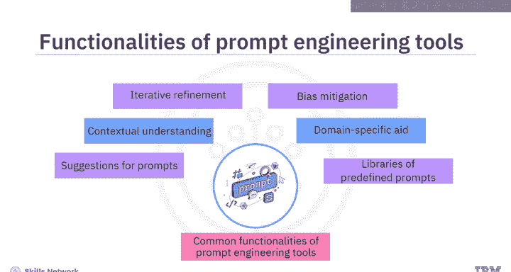

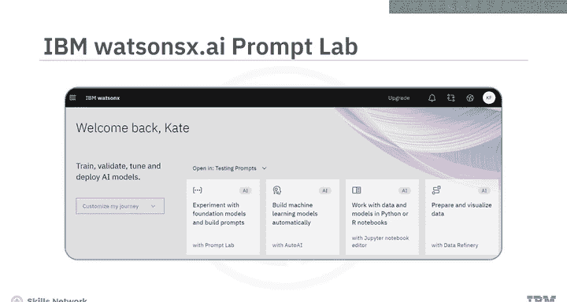

*   **提示建议**：许多工具能够根据给定的输入或期望的输出，为用户提供提示词建议。
*   **结构优化**：这些工具可以建议如何构建提示词，以实现更好的上下文沟通，帮助用户设计出能让模型充分理解用户意图的提示。
*   **迭代精炼**：用户可以根据工具的初始响应，迭代式地优化提示词，以找到最有效的版本。
*   **偏见缓解**：提示工程工具可能提供功能，帮助减轻生成式AI模型响应中的偏见。它们可以指导用户如何设计提示词，以减少产生偏见或不恰当输出的可能性。
*   **领域适配**：这些工具可以帮助创建针对特定领域（如法律、医疗或技术）的提示词。
*   **预设库**：一些工具提供了针对各种用例的预定义提示词库，用户可以根据具体需求进行定制。

上一节我们介绍了提示工程工具的通用功能，本节中我们来看看几个具体的工具实例。

### 常见工具详解

以下是几个在提示工程领域较为常见的工具：

1.  **IBM Watson X AI Prompt Lab**
    *   **描述**：这是IBM Watson X AI平台中的一个集成工具。该平台包含一系列工具，用于轻松训练、调优、部署和管理基础模型。
    *   **核心功能**：Prompt Lab 使用户能够基于不同的基础模型进行提示词实验，并根据需求构建提示词。它提供了针对不同用例（如摘要、分类、生成和提取）的示例提示，帮助用户快速上手。用户可以通过添加指令和示例来训练模型，展示模型应如何响应输入。

2.  **Spellbook (by Scale AI)**
    *   **描述**：这是一个集成开发环境。
    *   **核心功能**：使用Spellbook，用户可以基于大语言模型构建应用程序，并为各种用例（如文本生成、提取、分类、问答、自动补全和摘要）进行提示词实验。它包含一个提示编辑器，允许用户编辑和测试提示词。用户可以利用提示模板来使用结构化提示生成文本，也可以访问预构建的提示作为示例。

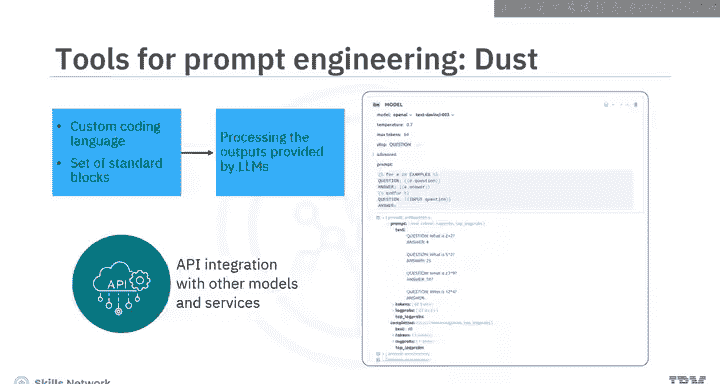

3.  **Dust**
    *   **描述**：一个提供Web用户界面的工具。
    *   **核心功能**：它用于编写提示词并将它们链接在一起。用户可以管理不同版本的链式提示。Dust还提供了一种自定义编码语言和一组标准模块，用于处理LLM提供的输出。此外，它还支持集成其他模型和服务。

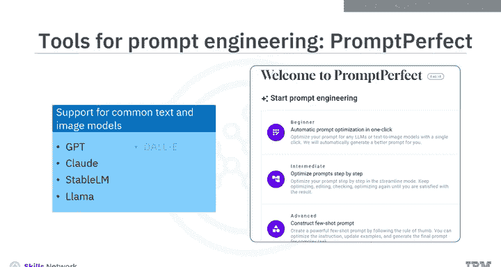

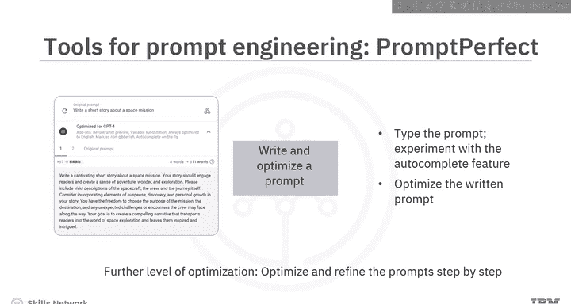

4.  **Prompt Perfect**
    *   **描述**：一个用于优化提示词的工具。
    *   **核心功能**：可用于为不同的大语言模型或文生图模型优化提示。它支持常见的文本模型（如GPT、Stable LM、LLaMA）和图像模型（如DALL-E、Stable Diffusion）。优化时，用户首先需要选择要为其优化提示的相关模型，因为不同模型有不同的优化策略。用户还可以选择与预览质量、语言和审核相关的插件。在编写提示时，可以尝试自动补全功能。工具会展示用户编写的原始提示和由Prompt Perfect生成的优化后提示。在“Streamline”模式下，用户可以逐步优化和精炼提示词：编写 -> 优化 -> 再次编辑 -> 再优化，直到满意为止。

除了上述专用工具，一些其他流行的平台和接口也提供了提示工程资源或实验环境。

以下是其他有用的资源与平台：

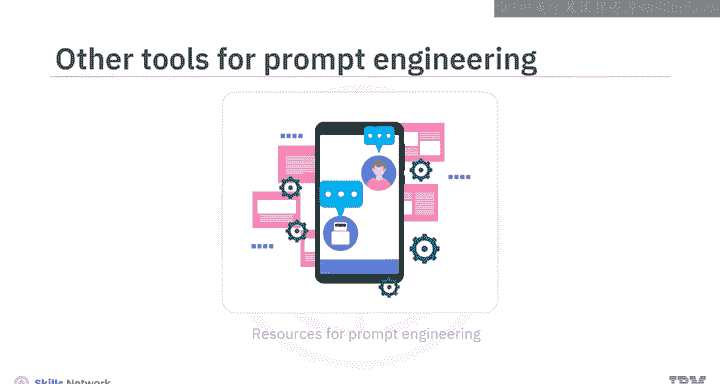

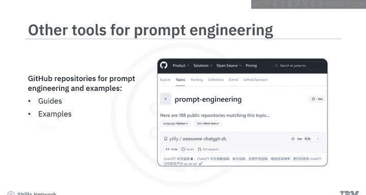

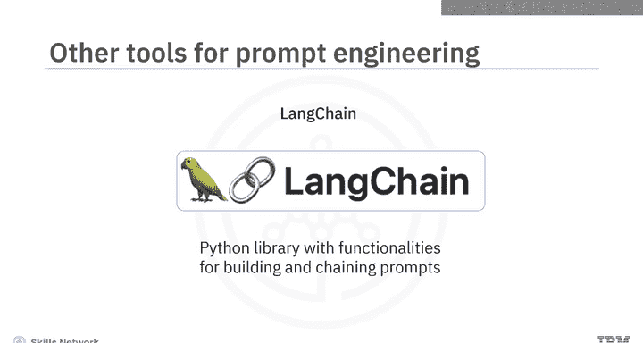

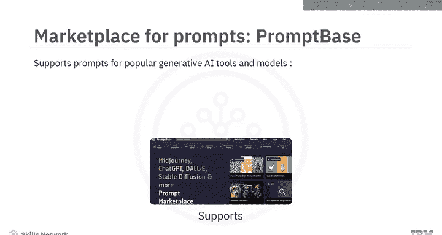

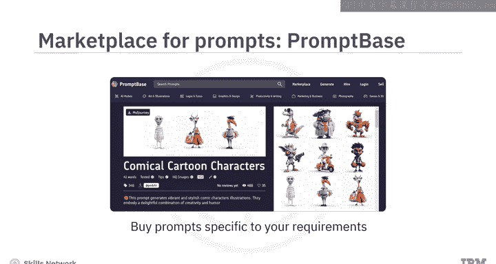

*   **GitHub**：拥有大量关于提示工程和LLM的代码仓库。这些仓库中提供的指南、示例和工具有助于提升提示工程技能。
*   **OpenAI Playground**：一个基于Web的工具，帮助用户使用OpenAI的各种模型（如GPT系列）来实验和测试提示词。
*   **Playground AI**：一个平台，帮助用户使用Stable Diffusion模型实验文本提示以生成图像。
*   **LangChain**：一个Python库，提供了构建和链接提示词的功能。
*   **提示词市场 (如 PromptBase)**：有趣的是，提示词也可以进行买卖。PromptBase就是一个例子，它支持为流行的生成式AI工具和模型（如Midjourney、ChatGPT、DALL-E、Stable Diffusion和LLaMA）买卖提示词。用户可以根据自己的需求购买针对特定模型或工具的提示词（例如，购买一个用于在Midjourney中生成漫画角色的提示词）。如果用户拥有出色的提示词编写技能，也可以上传并出售提示词。该平台还支持直接在其平台上编写提示词并在其市场上出售。

### 总结

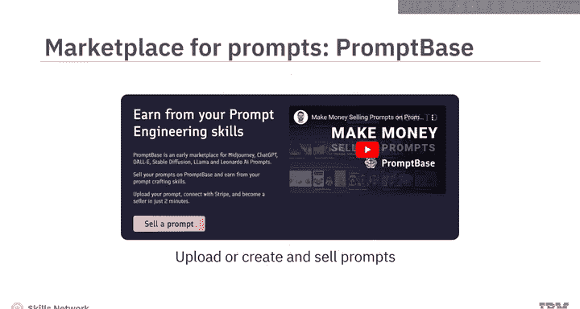

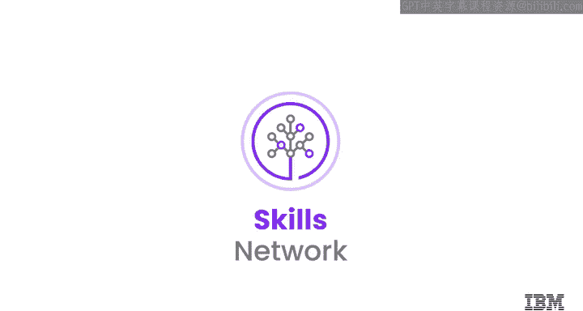

本节课中，我们一起学习了提示工程工具。我们了解到，这些工具提供了多种特性和功能来优化提示词，包括提供建议、优化结构、支持迭代精炼、缓解偏见、适配特定领域以及提供预设提示库。我们还介绍了几种常见的工具和平台，例如IBM Watson X AI Prompt Lab、Spellbook、Dust和Prompt Perfect，以及其他有用的资源和市场。掌握这些工具将帮助你更高效地与生成式AI模型进行交互。