# 049：文本到文本的提示技术 📝

在本节课中，我们将学习如何通过文本提示技术来提升大型语言模型的可靠性与输出质量。我们将探讨多种核心提示技巧，并了解有效使用文本提示所带来的益处。

近年来，自然语言处理领域因大型语言模型的应用而取得了显著进步。然而，随着模型规模和复杂度的持续增长，关于其可靠性、安全性和潜在偏见的担忧也随之浮现。有效使用文本提示是应对这些关切的一种有前景的解决方案。文本提示是精心设计的指令，用于引导大型语言模型的行为以生成期望的输出。但生成内容的质量和相关性，取决于提示的有效性以及模型本身的能力。

接下来，让我们深入探讨那些能使文本提示更有效、并能提升大型语言模型输出可靠性的具体技术。

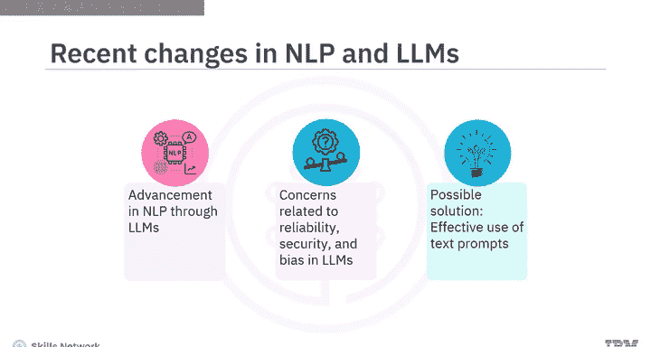

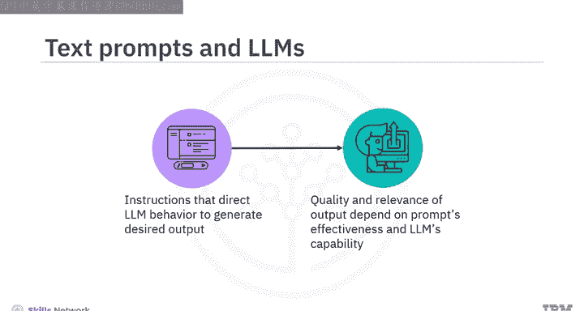

## 任务明确化 🎯

文本提示应明确地向大型语言模型指定目标，以提高回答的准确性。例如，提示“将这句英文翻译成法语”就是一个实现任务的清晰指令。

## 上下文引导 🧭

这是一种通过文本提示为大型语言模型提供具体指令以生成相关输出的技术。例如，如果你希望模型生成一篇关于纽约市地标的短文，一个像“写一段关于纽约市的短文”这样的提示可能会得到一个笼统的回应，可能无法涵盖你想要的内容。另一方面，一个更具体的提示，如“写一段关于纽约市的短文，重点介绍其标志性地标”，由于提示中包含了上下文，将能生成更合适的输出。

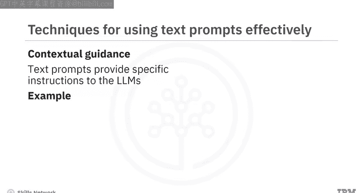

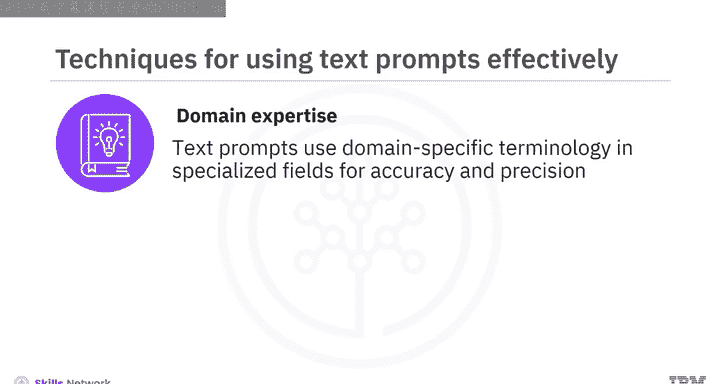

## 领域专业知识 ⚕️

当需要大型语言模型在专业领域（如医学、法律或工程学）生成内容时，领域专业知识对于提升模型的可靠性至关重要。在这些领域，准确性和精确性至关重要。文本提示可以使用特定领域的术语。例如，假设你想获取关于甲状腺功能减退症的医学信息，你的提示可以这样写：“请解释甲状腺功能减退症的病因、症状和治疗方法，包括最新的研究和医学指南。”

## 偏见缓解 ⚖️

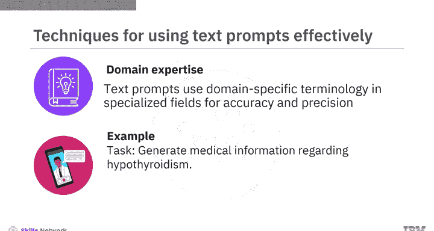

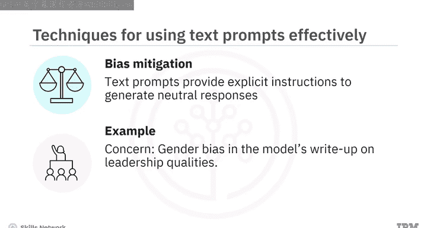

这是一种通过文本提示提供明确指令以生成中性回应的技术。例如，假设你担心模型在回应关于领导力特质的写作提示时存在性别偏见。为了解决这个问题，你可以使用这样的文本提示：“写一段100字的关于领导力特质的段落，不偏向任何性别。提供来自所有性别的平等特质示例。”

## 框架设定 📐

这是另一种通过文本提示引导大型语言模型在所需边界内生成回应的技术。假设你希望模型总结一篇关于气候变化的冗长文章，你的文本提示可以是：“提供一篇关于气候变化文章的100字摘要，重点关注其主要发现和建议。”

你知道吗？如今，经过海量数据训练并被调整以遵循指令的大型语言模型，可以执行零样本学习任务。

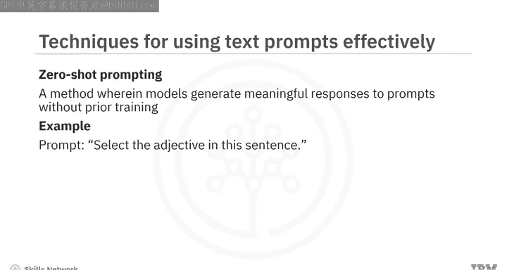

## 零样本提示 🚀

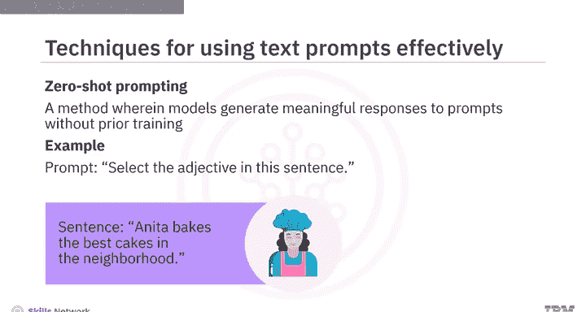

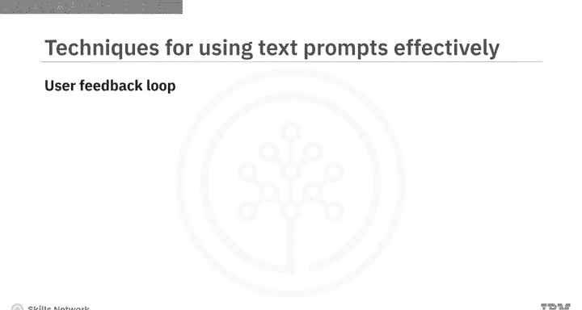

零样本提示是一种方法，生成式人工智能模型无需针对这些特定提示进行先验训练，即可对提示生成有意义的回应。例如，提示可以是：“选出这句话中的形容词。句子是：Anita bakes the best cakes in the neighborhood。” 这里的输出将是“best”。

然而，通常你无法通过一次提示就获得理想的回应，可能需要迭代。这就引出了用户反馈循环技术。

## 用户反馈循环 🔄

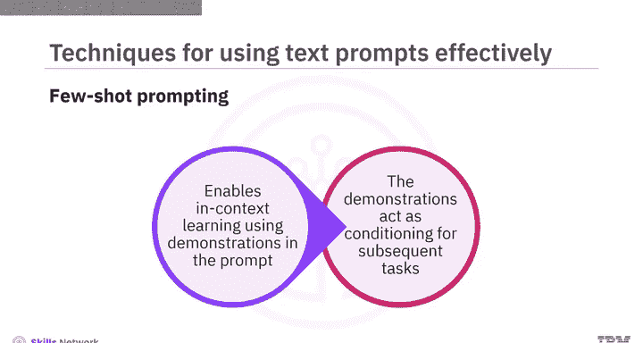

在这种技术中，用户对文本提示提供反馈，并根据大型语言模型生成的回应迭代地优化提示。这个循环允许用户逐步改进模型的输出质量，直到达到期望的状态。例如，用户通过文本提示要求模型写一首诗。大型语言模型生成了一首诗。用户说：“让它更有趣一些。” 大型语言模型调整诗歌以包含更多幽默元素。用户认可了修改后的诗歌。

类似地，对于复杂的任务，当你无法清晰描述需求时，会使用一种称为少样本提示的技术。

## 少样本提示 📚

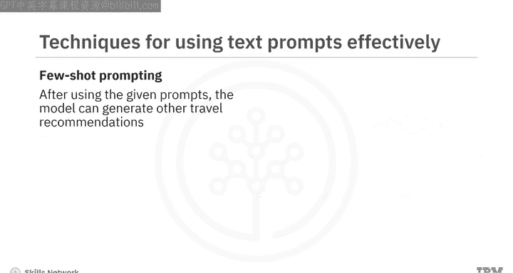

少样本提示支持上下文学习，即在提示中提供示范，以引导模型获得更好的性能。这些示范作为后续示例的条件，在这些示例中你希望模型生成回应。例如，假设模型的任务是生成简短的旅行推荐。作为少样本提示，你为模型提供以下引导性上下文：“推荐一个以美丽海滩闻名的夏季旅行目的地。推荐一个以美丽秋叶闻名的秋季旅行目的地。” 在使用这些少样本提示后，模型可以为其他类型的假期生成旅行推荐。例如，如果任务是“推荐一个值得探索的城市”，模型将生成答案：“考虑参观像巴黎这样充满活力的城市，以其丰富的历史、艺术和标志性地标而闻名。” 这就是模型如何基于少样本提示中提供的最少训练数据，为不同类型的假期生成旅行推荐。

使用我们刚刚讨论的方法将文本提示与大型语言模型结合使用，会带来诸多好处。让我们看看其中一些。

## 使用文本提示的好处 ✨

大型语言模型的可解释性得到增强。可解释性指的是用户理解和解释模型决策过程及其生成输出背后原因的程度。可解释性帮助用户、开发者和利益相关者理解模型如何工作、为何做出某些预测或生成特定文本，以及它在各种应用中是否值得信赖。可解释性对于解决与人工智能相关的伦理问题至关重要。它帮助所有利益相关者评估并确保大型语言模型的行为符合特定领域的伦理准则和法律要求。

除了提高大型语言模型的可靠性和可解释性之外，有效的文本提示还能在用户和大型语言模型之间建立信任。当用户能够理解大型语言模型的工作原理，并看到他们的指令对模型行为的直接影响时，就会在用户和大型语言模型之间促成透明且有意义的互动。

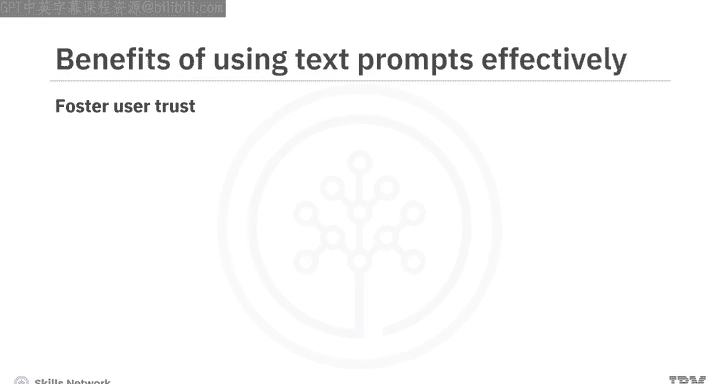

## 总结 📋

本节课中，我们一起学习了各种可以通过文本提示提升大型语言模型可靠性和质量的技术。具体来说，我们探讨了任务明确化、上下文引导、领域专业知识、偏见缓解、框架设定和用户反馈循环。我们还学习了零样本和少样本提示技术。最后，我们了解了有效使用文本提示与大型语言模型的若干好处，例如增强模型的可解释性、解决伦理考量以及建立用户信任。