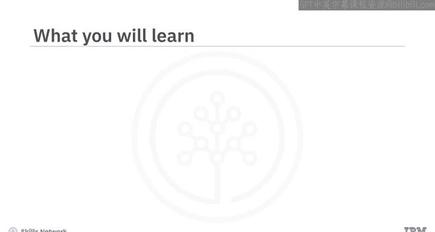
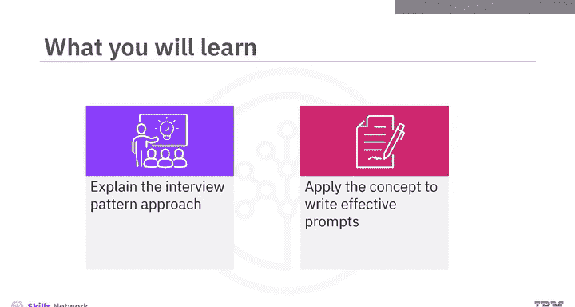
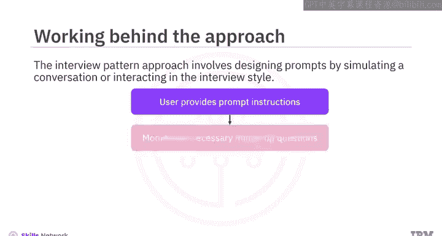
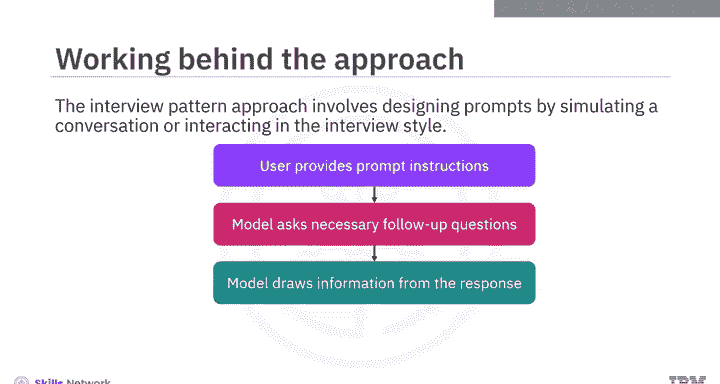
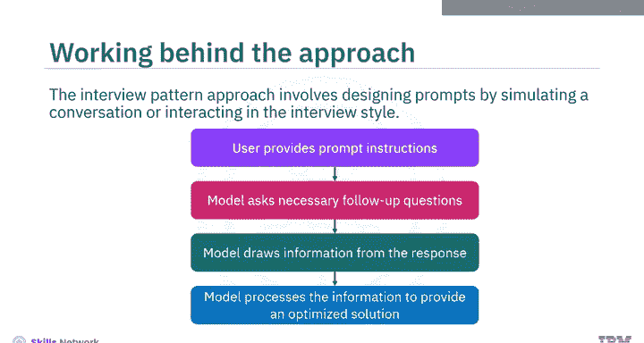
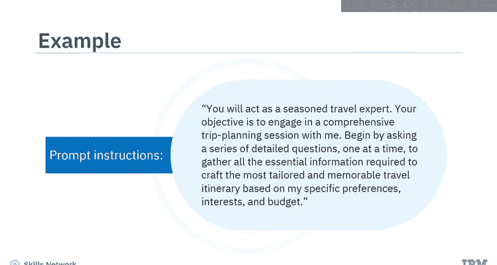
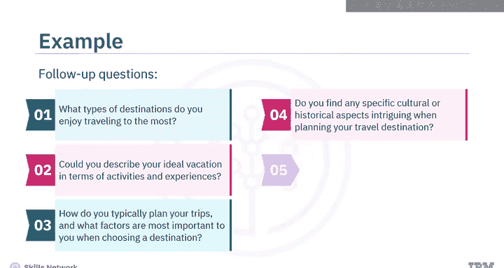
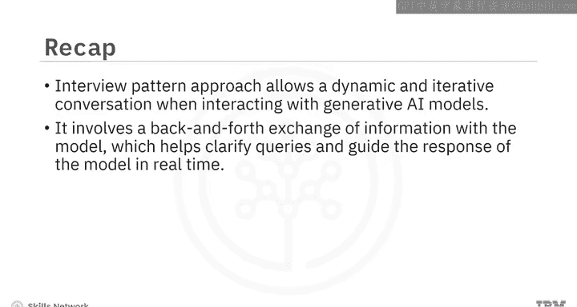

# 050：面试模式方法 🎤

在本节课中，我们将学习提示工程中的“面试模式方法”。这是一种通过模拟对话或访谈风格与模型互动来设计提示词的策略，旨在引导生成式AI模型产生更具体、更符合需求的回答。

## 概述





上一节我们介绍了提示工程的基本概念，本节中我们来看看一种更高级的交互策略——面试模式方法。这种方法的核心在于通过一系列精心设计的问答，引导模型逐步深入理解用户需求，从而生成高度优化的响应。

## 面试模式方法的工作原理

面试模式方法要求对提示词进行细致的优化，以确保模型生成的回答能精确满足你的目标。其典型流程如下：

1.  **用户提供初始指令**：你首先向模型提供一个明确的角色和任务指令。
2.  **模型发起追问**：模型根据你的指令，开始向你提出一系列必要的后续问题。
3.  **用户回答问题**：你逐一回答模型提出的问题，提供更多细节。
4.  **模型处理并生成最终响应**：模型根据你提供的所有信息，进行处理和整合，最终生成一个高度优化的回答。

**核心公式**可以概括为：
`最终响应 = 模型处理(初始指令 + 用户对追问的回答)`



你提供的信息越详细、越具体，最终得到的结果就越好。





## 应用示例：旅行顾问

为了更好地理解，我们来看一个具体的例子。假设你希望模型扮演一位旅行顾问，为你规划一次假期的旅行行程。



以下是你可以给模型的初始提示指令：

```text
你将扮演一位经验丰富的旅行专家。你的目标是与我进行一次全面的旅行规划对话。请首先提出一系列详细的问题（一次一个），以收集所有必要信息，从而根据我的具体偏好、兴趣和预算，制定出最量身定制且令人难忘的旅行行程。
```

在收到这个指令后，模型会开始提出一系列后续问题，例如：

*   你最喜欢去哪种类型的旅行目的地？
*   你能描述一下你理想假期的活动和体验吗？
*   你通常如何规划旅行？在选择目的地时，哪些因素对你最重要？
*   在规划旅行目的地时，你是否对特定的文化或历史方面感兴趣？
*   旅行时你偏好哪种住宿选择？为什么？
*   你如何平衡预算考虑与获得难忘旅行体验的愿望？

在这个例子中，每个问题都建立在前一个问题的基础上，形成了一场关于旅行偏好的结构化、信息丰富的对话。根据你对这些问题的回答，模型将规划出一个符合你偏好和需求的、令人难忘的旅行行程。

## 面试模式方法的优势

通过本视频的学习，我们了解到面试模式方法优于传统的单次提示方法，因为它允许在与生成式AI模型互动时进行更动态、更迭代的对话。



与提供单一的静态提示不同，面试模式涉及与模型进行来回的信息交换。这有助于实时澄清疑问并引导模型的响应方向，从而增强了用户优化结果的能力。

## 总结



本节课中，我们一起学习了提示工程中的面试模式方法。我们了解了它的工作原理，即通过模拟访谈式的问答互动，逐步引导模型获取详细信息以生成精准响应。我们还通过一个旅行规划的例子，具体演示了如何应用这种方法。最后，我们总结了该方法的优势在于其动态交互性，能够显著提升生成结果的针对性和质量。