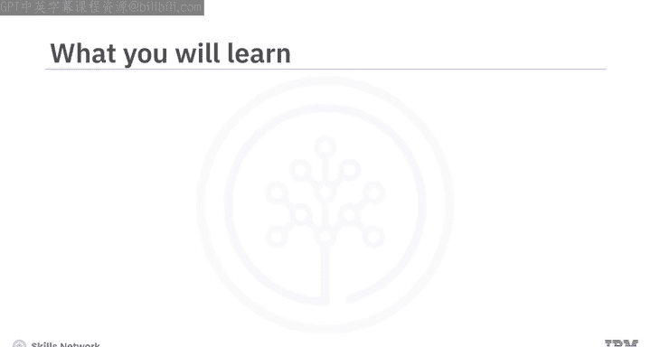
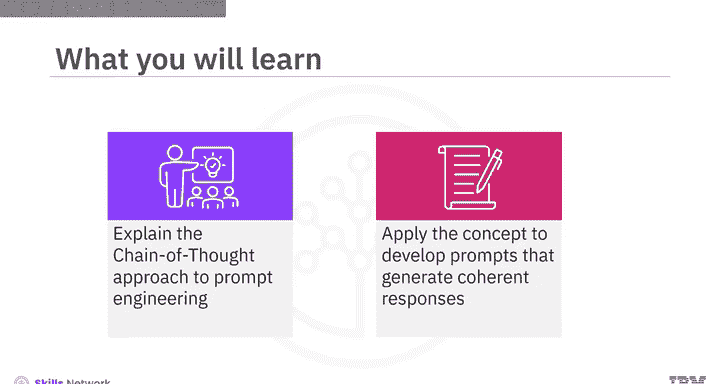
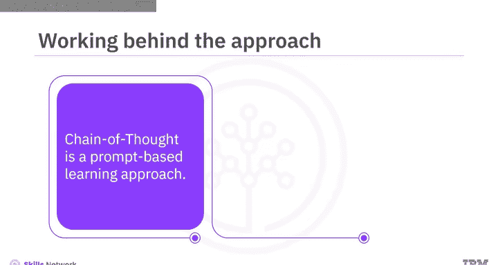
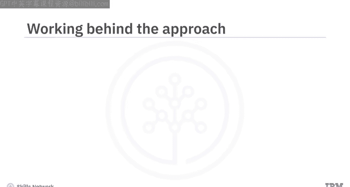
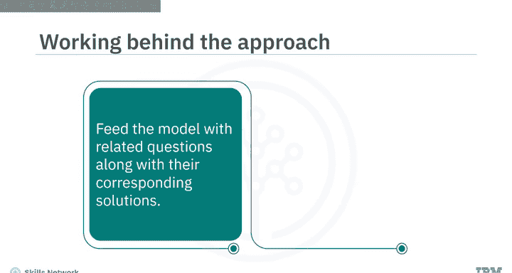
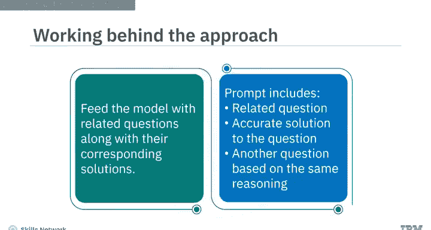
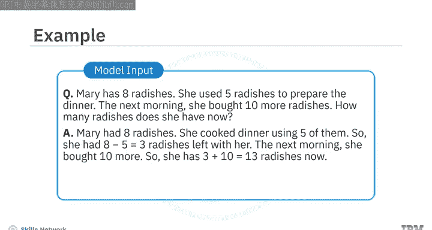

**生成式人工智能工程：P51：思维链方法** 🧠

在本节课中，我们将学习一种名为“思维链”的提示工程方法。这种方法通过构建一系列提示来引导生成式AI模型，使其能够理解复杂任务的逻辑，并生成连贯、准确的回答。

---



思维链是一种基于提示的学习方法。它通过构建一系列提示或问题，来引导模型生成期望的回应。使用这种方法，可以展示生成式AI模型的认知能力，并更好地解释其推理过程。



它涉及将复杂任务分解为更小、更简单的步骤，通过一系列更直接的提示来实现。每个提示都建立在前一个提示的基础上，共同引导模型走向预期的结果。

在直接向模型提问之前，你需要先向它提供一系列相关的问题及其对应的解决方案。这一连串的提示有助于模型思考问题，并运用相同的策略来正确回答更多类似问题。简单来说，提示中需要包含一个问题及其准确答案，以便为模型提供所需的上下文和逐步推理过程。然后，再提出一个不同的问题，要求模型使用相同的推理思路来解答。



为了更好地理解，我们来看一个例子。

---

### 思维链应用示例

假设你向模型提出一个数学问题：“马修有6个鸡蛋。他又买了两盘鸡蛋，每盘有12个。他现在有多少个鸡蛋？”对于复杂问题，模型的逻辑可能会出错。

为了训练模型掌握解决此类问题所需的适当推理，你可以先构建一个类似的问题作为示例：“玛丽有8个萝卜。她用了5个萝卜做晚餐。第二天早上，她又买了10个萝卜。她现在有多少个萝卜？”

**关键点在于，你必须同时提供正确的逻辑解决方案：**



1.  玛丽最初有8个萝卜。
2.  她用掉了5个，所以剩下 `8 - 5 = 3` 个萝卜。
3.  第二天她又买了10个，所以现在总共有 `3 + 10 = 13` 个萝卜。



这将帮助模型理解其中涉及的逻辑，从而得出正确的解决方案。

因此，你最终的提示应包含以下内容：
*   一个相关的问题及其适当的解决方案。
*   然后，提出另一个可以用相同逻辑或推理来解决的问题。

在这个提示中，你可以看到有一个问题、该问题的逻辑解决方案，以及另一个可以用相同逻辑解决的新问题。

---

### 构建思维链提示的步骤




以下是构建有效思维链提示的关键步骤：

1.  **选择示例问题**：挑选一个与你的目标问题在结构和逻辑上相似的问题。
2.  **提供逐步解答**：为示例问题写出清晰、逐步的推理过程和最终答案。
3.  **提出目标问题**：在示例之后，提出你真正希望模型解答的问题。
4.  **引导应用逻辑**：明确或隐含地指示模型使用从示例中学到的推理方式来解答新问题。

一个典型的思维链提示结构如下：
```
问题：[示例问题]
解答：[逐步推理] 因此，答案是 [答案]。

问题：[你的目标问题]
解答：
```

---

### 思维链的优势



上一节我们介绍了思维链的具体构建方法，本节我们来看看这种方法带来的主要好处。

*   **提升推理透明度**：模型被迫展示其思考步骤，而不仅仅是给出最终答案，这使得其输出更易于理解和验证。
*   **提高复杂问题准确率**：对于需要多步推理的数学、逻辑或规划问题，思维链能显著提升答案的正确性。
*   **引导模型思考方式**：通过提供推理范例，你实际上是在“教”模型如何像人类一样一步步地解决问题。

---


本节课中，我们一起学习了“思维链”提示工程方法。我们了解到，这种方法通过为模型提供相关示例问题及其分步解决方案，来强化生成式AI模型的认知能力，并引导其进行逐步思考。其核心在于训练模型掌握解决某类问题的底层逻辑，从而能够将相同的逻辑应用于解决更多类似的问题。掌握思维链技巧，是构建高效、可靠AI提示的关键一步。