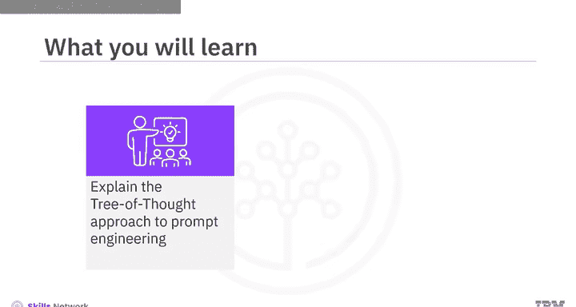
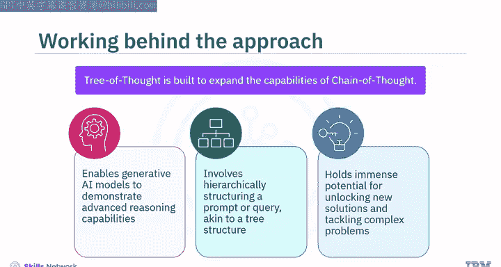

# 052：思维树方法 🌳

在本节课中，我们将学习一种创新的提示工程技术——思维树方法。我们将了解其基本原理、运作方式，并通过一个具体示例学习如何应用它来生成更精准、更具逻辑性的AI回复。

思维树方法是一种旨在扩展“思维链”提示法能力的创新技术。它使生成式AI模型能够展现出更高级的推理能力。该方法涉及将提示或查询分层构建，类似于树状结构，以指定模型所需的思考或推理路径。当您需要向模型提供明确的指令或约束，以确保其生成期望的输出时，这种方法尤其有用。此方法在解锁新解决方案和解决复杂问题方面具有巨大潜力。

上一节我们介绍了思维树方法的基本概念，本节中我们来看看它的具体工作原理。





思维树方法的工作原理是生成多条思考路径，类似于决策树，以探索不同的可能性和想法。与传统的线性方法不同，该技术允许模型同时评估并探索多条路径。每个想法或思路会像树枝一样分叉，形成一个相互关联的思考树状结构。模型通过评估每条可能的路径，根据其对结果的预测分配数值，并剔除前景较小的思路，最终确定最有利的选择。

为了更好地理解，我们将通过一个示例来说明。

假设您希望模型为一家电子商务企业设计吸引和留住熟练远程员工的招聘与保留策略，并要求模型运用思维树方法来完成。

您可以向模型提供以下提示指令：


```
想象三位不同的专家来回答这个问题。
所有专家都会写下他们思考的一个步骤，然后与小组分享。
然后所有专家继续进行下一步，依此类推。
如果有任何专家在任何时候意识到自己错了，那么他们就会退出。
```

除了上述提示指令，您还需要给出原始问题提示：

```
扮演人力资源专家的角色，为一家电子商务企业设计一个招聘与保留策略，重点是吸引和留住熟练的远程员工。
```

构建这样的提示指令将使生成式AI模型能够考虑一个逐步的过程并进行逻辑思考。它还会让模型考虑中间想法，在此基础上进行构建，并探索可能通向不同结果的“分支”。这种做法将最大化模型的使用和潜力，从而产生更有用的结果。


本节课中我们一起学习了思维树方法。这是一种在思维链方法基础上发展起来的创新技术，它涉及将提示分层构建成类似树状的结构，以指导模型的推理和输出生成。当需要明确的指令或约束来获得期望的输出时，这种方法尤其有价值。它使模型能够同时探索各种可能性和想法，像决策树一样分叉展开。