# 053：文本到图像的提示技术 🎨

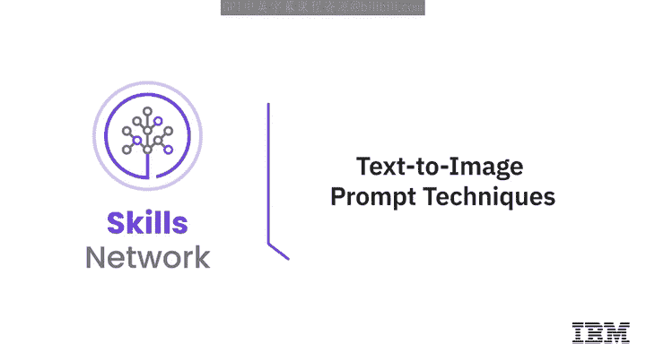

在本节课中，我们将要学习如何通过特定的文本提示技术，来提升生成式AI模型所创建图像的质量和表现力。我们将逐一探讨五种核心的图像提示技术，帮助你写出更有效的图像生成指令。

图像是沟通的重要组成部分，广泛应用于营销、广告、教育、新闻等诸多领域。然而，有些图像在传达情感方面比其他图像更为出色。图像提示就是你希望生成图像的文本描述。它可以简单到一个单词或短语，也可以更详细地描述图像的构图、色彩和氛围。为了增强通过生成式AI模型获得的图像的影响力，使其更具说服力和吸引力，你可以使用图像提示技术。这些技术旨在提升生成式AI模型所产图像的质量、多样性和相关性。

有多种图像提示技术可用于改善图像的影响力。接下来，我们将逐一学习这些技术。

## 风格修饰词 🖌️

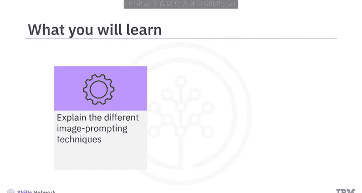

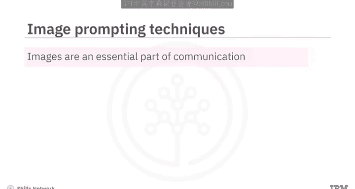

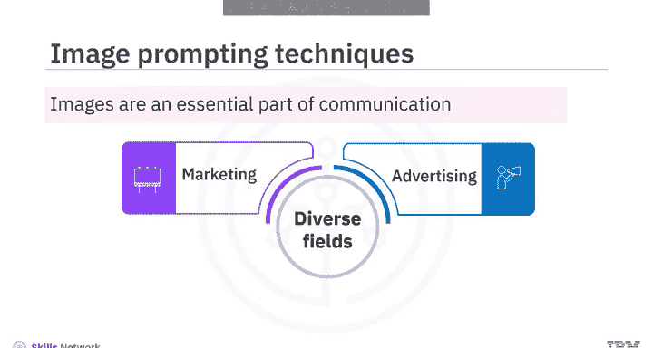

风格修饰词是用于影响生成式AI模型所产图像的艺术风格或视觉属性的描述符。这些描述符可以帮助模型在遵循输入提示结构和内容的同时，产出具有创新风格的图像。

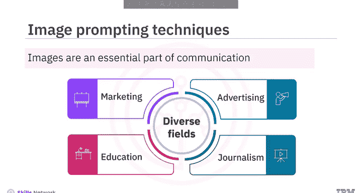

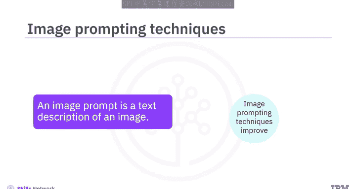

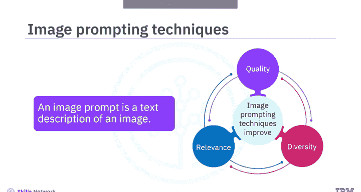

你可以修改图像的各种视觉元素，如颜色、对比度、纹理、形状和大小，从而生成具有美学吸引力、视觉愉悦的输出。你的提示可以包含关于各种艺术风格、艺术时期、摄影技术、所用艺术材料类型，甚至是你希望模型模仿的知名品牌或艺术家特征的信息。所有这些信息都能帮助生成模型理解期望的输出图像外观或风格。

以下是图像提示中使用的风格修饰词示例。这些提示中使用的风格修饰词已被高亮标出。

*   **提示示例 1**: `一只猫，**赛博朋克风格**，霓虹灯，未来城市背景`
*   **提示示例 2**: `宁静的湖泊，**水墨画风格**，山峦倒影`
*   **提示示例 3**: `一幅**梵高风格**的向日葵静物画`

## 质量提升词 📈

高质量图像相比低质量图像更具说服力和可信度。低分辨率图像通常会出现模糊和像素化，使观看者难以辨别其中的细节。另一方面，高分辨率图像保证了基本的可见性和可读性。使用高质量的图形设计可以提升图像的感知价值。

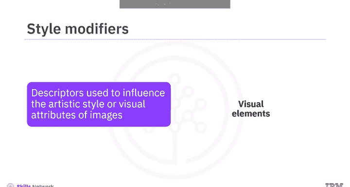

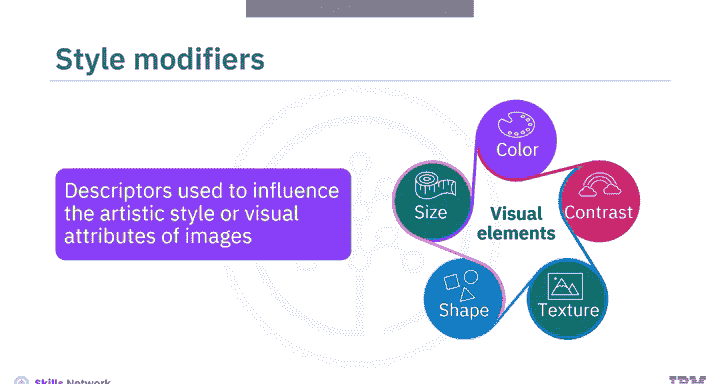

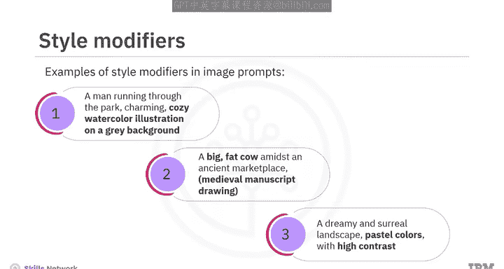

质量提升词是用于图像提示中的术语，旨在增强视觉吸引力，并提高输出的整体保真度和清晰度。这些特定术语可以指导生成式AI模型执行降噪、锐化、色彩校正和分辨率增强等步骤。

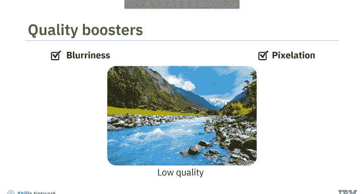

你可以在图像提示中使用诸如`高分辨率`、`超详细`、`锐利`、`互补色`等许多术语作为质量提升词。它们可以增强图像的特定特征，从而产生更连贯的输出。

让我们看一些例子来理解如何在图像提示中使用质量提升词。诸如`突出纹理`、`4K分辨率`、`锐利`、`清晰细节`、`精细线条`、`互补色`、`模糊背景`和`脱颖而出`等术语，就是给定图像提示中使用的质量提升词。

*   **提示示例 1**: `一只老虎的特写，**4K分辨率**，**锐利**，**突出纹理**`
*   **提示示例 2**: `现代客厅，**互补色**，**清晰细节**，**模糊背景**使家具**脱颖而出**`

## 重复强调法 🔁

上一节我们介绍了如何通过质量提升词优化图像细节，本节中我们来看看如何通过重复来强化概念。重复技术利用了迭代采样的原理，以增强模型生成图像的多样性。

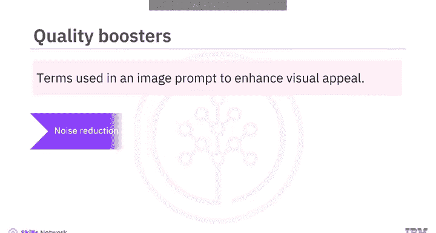

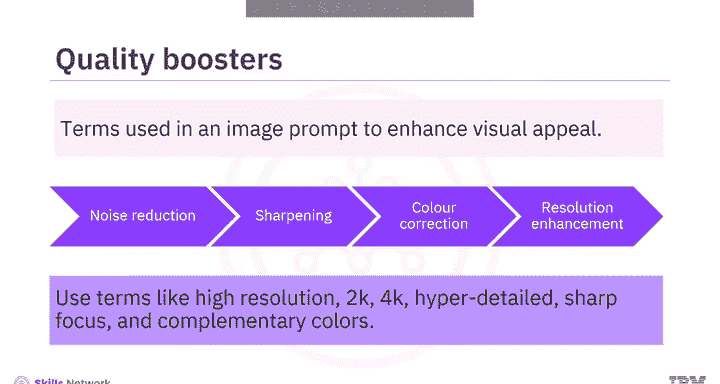

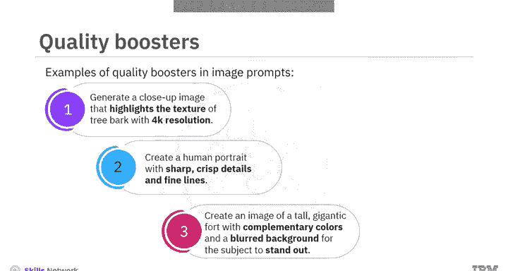

重复涉及在图像中强调特定的视觉元素，为模型创造一种熟悉感，使其能够专注于你想要突出的特定想法或概念。这可以通过在图像提示中重复相同的单词或相似的短语来实现。重复有助于强化通过图像传达的信息，并增加模型对概念的“记忆”。

模型并非仅根据提示生成一张图像，而是生成多张具有细微差别的图像，从而产生一组多样化的潜在输出。当生成模型面对抽象或模糊的提示，而存在多种有效解释可能时，这种技术尤其有价值。

让我们看一些在图像提示中使用重复词的例子。诸如`微小`、`密集`、`巨大`、`广阔`、`宁静`、`清澈`和`茂盛`等词被重复多次，以聚焦于特定的想法。

*   **提示示例**: `一片**茂盛**、**茂盛**、**茂盛**的绿色森林，阳光透过**密集**的树叶`

## 加权术语 ⚖️

加权术语指的是使用那些能够产生强烈情感或心理影响的词语或短语。例如，`免费`、`限时优惠`和`保证`等词常用于广告中，以引发紧迫感、安全感和信任感。同样，`奢华`、`高端`和`独家`等词用于营造专属感和精致感。

生成式AI模型允许你为正则或负则术语赋予权重，以强调或弱化某种情感。在图像提示中使用加权术语有助于创建令人难忘、有说服力的图像，并能引发观众的情感共鸣。

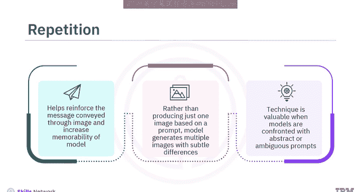

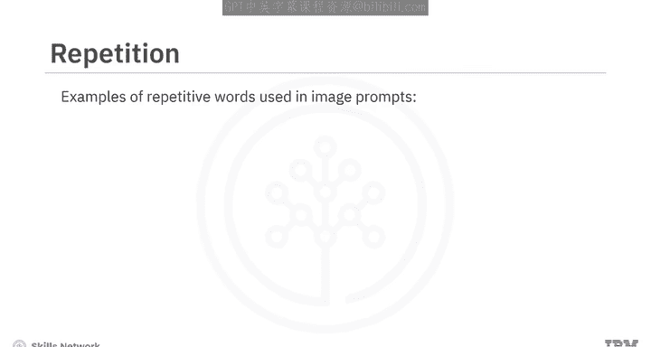

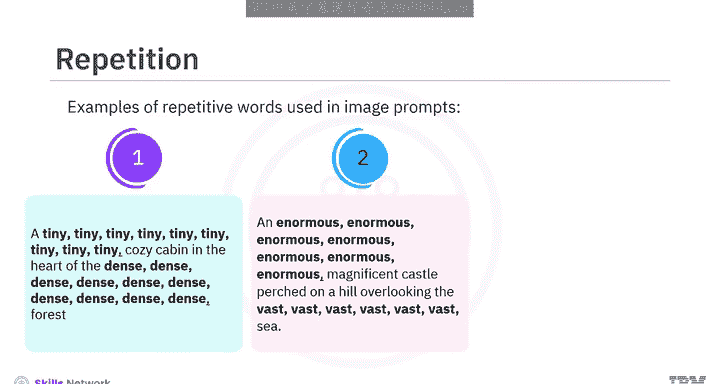

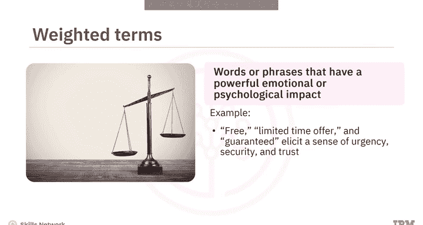

以下是一些在图像提示中使用加权术语的示例。

如你在第一个示例中所见，词语`温暖`被赋予了正权重10，而`噼啪作响`的权重是正8。这意味着生成模型必须更侧重于`温暖`一词，而对`噼啪作响`的关注稍少一些。同样，在第二个示例中，词语`闪烁`被赋予了正6权重，而`霓虹灯照亮`的权重是正8。因此模型应更侧重于`霓虹灯照亮`。在最后一个示例中，词语`彩色`被赋予了负6权重，而`异国情调`被赋予了正10权重。这意味着模型必须强调`异国情调`一词，并弱化`彩色`一词。

*   **提示示例 1**: `(温暖:10) 壁炉，(噼啪作响:8) 的火焰`
*   **提示示例 2**: `雨夜的城市街道，(闪烁:6) 的灯光，(霓虹灯照亮:8) 的招牌`
*   **提示示例 3**: `(彩色:-6) 的羽毛，(异国情调:10) 的鸟`

## 畸形修复提示 🛠️

本节我们将学习最后一种技术，用于处理生成图像中可能出现的缺陷。这种技术用于修改可能影响图像效果的畸形或异常。

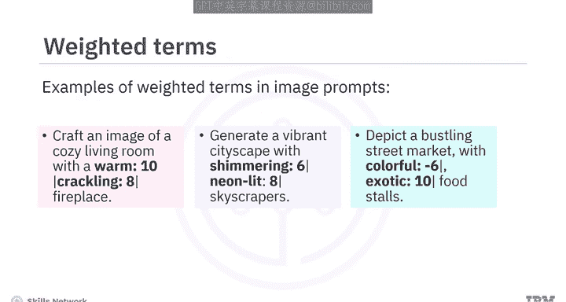

图像中的畸形可能包括扭曲（特别是在人体部位如手或脚上）、像素化或其他会损害视觉吸引力和图像整体质量的问题。这可以通过使用恰当的负面提示在一定程度上得到缓解。

以下是图像提示中使用的畸形修复提示技术示例。你可以看到，在所有这些示例中，都使用了恰当的负面词语来缓解图像畸形问题。

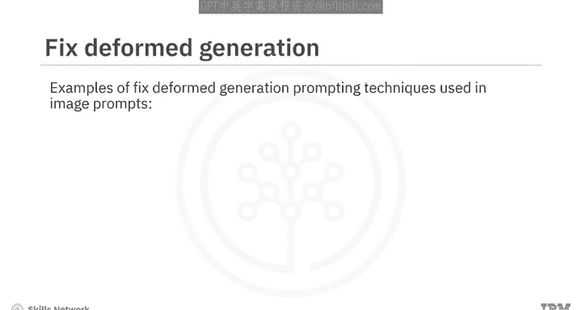

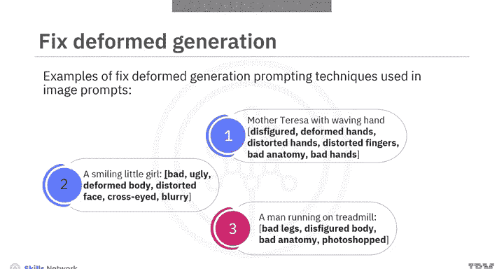

*   **提示示例 1**: `一个美丽的天使，翅膀展开，**避免畸形的手和脚**`
*   **提示示例 2**: `未来主义机器人，金属质感，**无模糊，无像素化**`
*   **提示示例 3**: `人物肖像，面部特写，**避免扭曲的比例，避免奇怪的表情**`

## 总结 📝

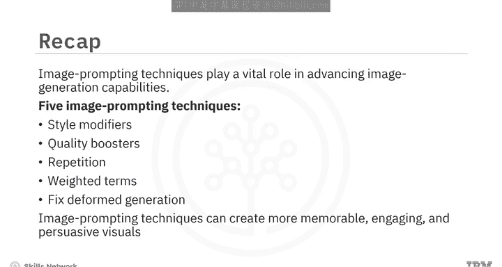

本节课中我们一起学习了图像提示技术在提升生成式AI模型图像生成能力方面起着至关重要的作用。风格修饰词、质量提升词、重复强调法、加权术语和畸形修复提示是五种可用于改善生成图像影响力的技术。通过结合使用这些技术，可以创建更令人难忘、更具吸引力、更有说服力的视觉效果，从而有效地传达预期信息。