# 054：数据类型

## 概述
在本节课中，我们将要学习Python编程语言中的核心概念之一：数据类型。我们将了解Python如何表示不同类型的数据，并探讨几种最常用的数据类型，包括整数、浮点数、字符串和布尔值。

---

## 什么是数据类型？🤔
数据类型是Python用来表示不同种类数据的方式。

在Python中，你可以拥有不同的数据类型。它们可以是像`11`这样的整数，像`21.213`这样的实数，甚至可以是单词。整数、实数和单词都可以表示为不同的数据类型。

以下图表总结了上述示例对应的三种数据类型。第一列表示表达式，第二列表示其数据类型。

我们可以通过使用`type`命令来查看Python中数据的实际类型。

```python
# 使用type()函数查看数据类型
print(type(11))      # 输出: <class 'int'>
print(type(21.213))  # 输出: <class 'float'>
print(type("Hello")) # 输出: <class 'str'>
```

---

## 整数类型 (int) 🔢
整数可以是负数或正数。需要注意的是，整数有一个有限的范围，但这个范围非常大。

以下是一些整数的例子：
*   `5`
*   `-10`
*   `0`
*   `1000`

---

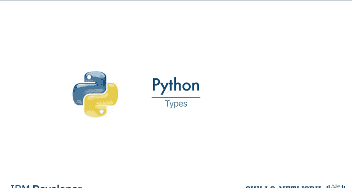

## 浮点数类型 (float) 📊
浮点数代表实数。它们不仅包括整数，还包括整数之间的数字。

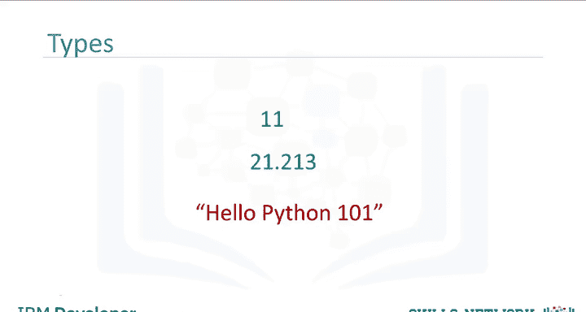

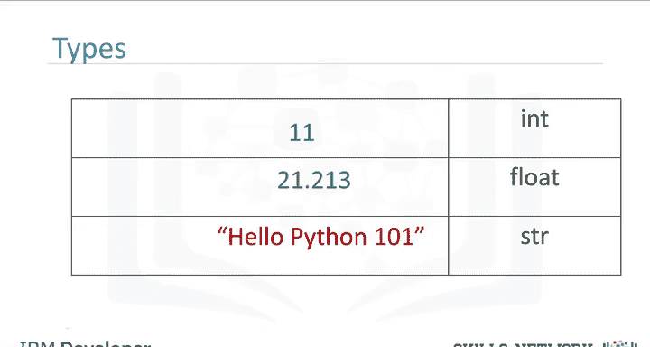

考虑0和1之间的数字。我们可以选择它们之间的数字，这些数字就是浮点数。同样地，考虑0.5和0.6之间的数字，我们也可以选择它们之间的数字，这些也是浮点数。

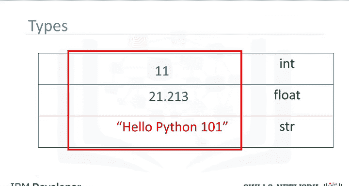

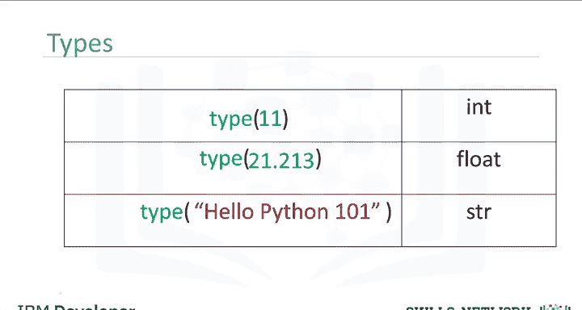

我们可以继续这个过程，为不同的数字进行“放大”观察。当然，这个过程存在精度限制，但这个限制非常小。

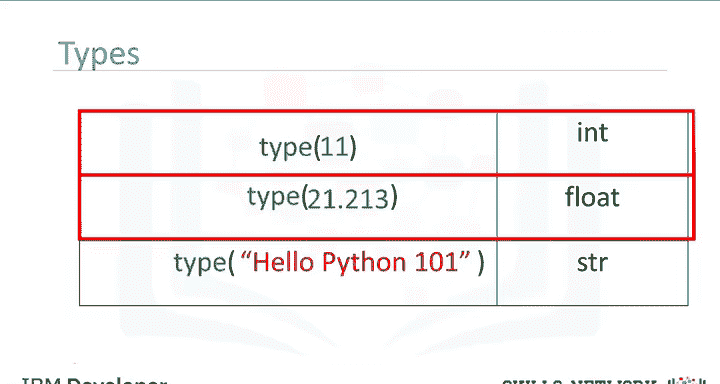

---

## 类型转换 (Type Casting) 🔄
你可以在Python中改变表达式的类型，这被称为**类型转换**。

你可以将一个整数转换为浮点数。例如，你可以将整数`2`转换或“强制转换”为浮点数`2.0`。这本质上没有改变数值。

```python
# 将整数转换为浮点数
int_num = 2
float_num = float(int_num)
print(float_num) # 输出: 2.0
print(type(float_num)) # 输出: <class 'float'>
```

但是，如果你将一个浮点数转换为整数，则必须小心。例如，如果你将浮点数`1.1`转换为整数`1`，你会丢失小数部分的信息。

```python
# 浮点数转整数会丢失小数部分
float_num = 1.1
int_num = int(float_num)
print(int_num) # 输出: 1
```

如果一个字符串包含一个整数值，你可以将其转换为`int`类型。

```python
# 包含整数的字符串可以转换为int
str_num = "123"
int_num = int(str_num)
print(int_num) # 输出: 123
```

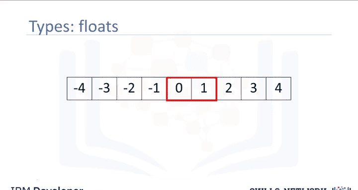

如果我们尝试转换一个包含非整数值的字符串，将会得到一个错误。

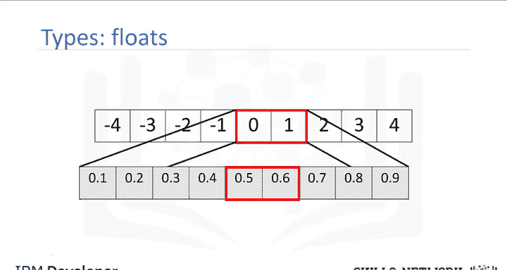

```python
# 包含非整数的字符串转换会报错
# str_num = "123.4"
# int_num = int(str_num) # 这会引发 ValueError
```

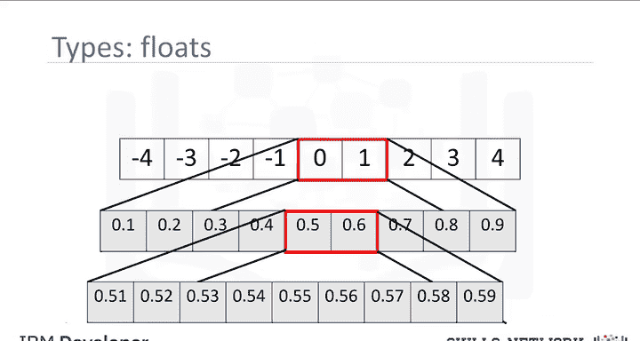

你也可以将一个整数或浮点数转换为字符串。

```python
# 将数字转换为字符串
int_to_str = str(456)
float_to_str = str(78.9)
print(type(int_to_str))   # 输出: <class 'str'>
print(type(float_to_str)) # 输出: <class 'str'>
```

---

## 布尔类型 (bool) ✅❌
布尔值是Python中另一个重要的数据类型。一个布尔值可以取两个值。

第一个值是`True`（请注意，我们使用大写字母T）。布尔值也可以是`False`（使用大写字母F）。

使用`type`命令查看布尔值，我们会得到`bool`，这是`boolean`的缩写。

```python
# 布尔类型
print(type(True))  # 输出: <class 'bool'>
print(type(False)) # 输出: <class 'bool'>
```

如果我们把布尔值`True`转换为整数或浮点数，会得到`1`。

```python
# 布尔值转数字
print(int(True))   # 输出: 1
print(float(True)) # 输出: 1.0
```

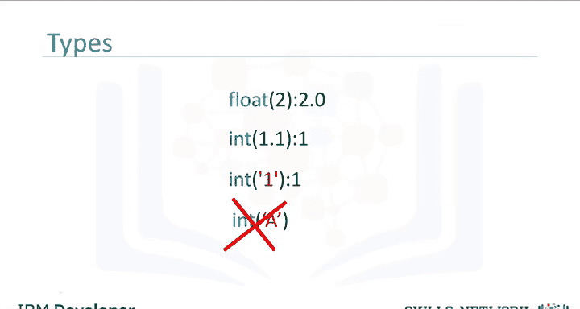

如果我们把布尔值`False`转换为整数或浮点数，会得到`0`。

```python
# 布尔值转数字
print(int(False))   # 输出: 0
print(float(False)) # 输出: 0.0
```

反之，如果你将数字`1`转换为布尔值，会得到`True`。类似地，如果将数字`0`转换为布尔值，会得到`False`。

```python
# 数字转布尔值
print(bool(1)) # 输出: True
print(bool(0)) # 输出: False
```

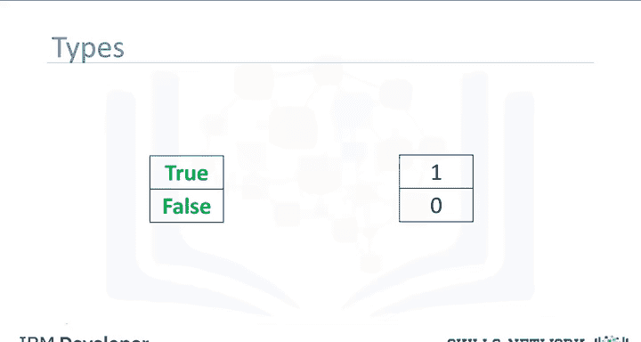

---

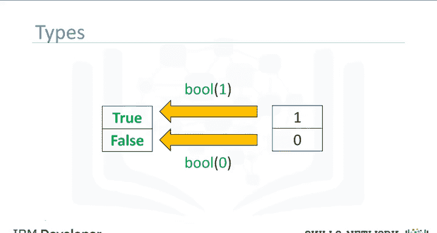

## 总结
本节课中，我们一起学习了Python中的基本数据类型。我们了解了**整数(int)**、**浮点数(float)**、**字符串(str)** 和**布尔值(bool)** 这四种核心类型，并掌握了如何使用`type()`函数查看类型，以及如何进行安全的**类型转换**。理解数据类型是编写正确、高效Python代码的基础。建议通过实验练习更多例子，或查阅Python官方文档以了解Python支持的其他数据类型。