# 055：表达式与变量 🧮

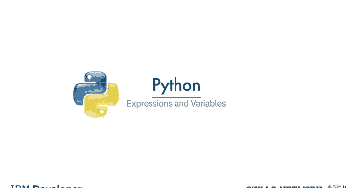

在本节课中，我们将学习Python编程中的两个基础概念：**表达式**和**变量**。理解它们是编写任何程序的第一步。


## 概述

表达式是计算机执行的操作描述，而变量则用于存储数据值。我们将从基本的算术运算开始，逐步了解如何使用变量来保存和操作这些运算的结果。

---

## 什么是表达式？ ➕➖✖️➗

表达式描述了计算机执行的一种操作类型。在Python中，表达式就是程序执行的各种运算。

例如，基本的算术运算，如将多个数字相加：
```python
40 + 50 + 70
```
在这个例子中，结果是160。我们称这些数字为**操作数**，而加号（`+`）这样的符号称为**运算符**。

我们可以使用减号（`-`）执行减法运算：
```python
4 - 6
```
在这种情况下，结果是一个负数（-2）。

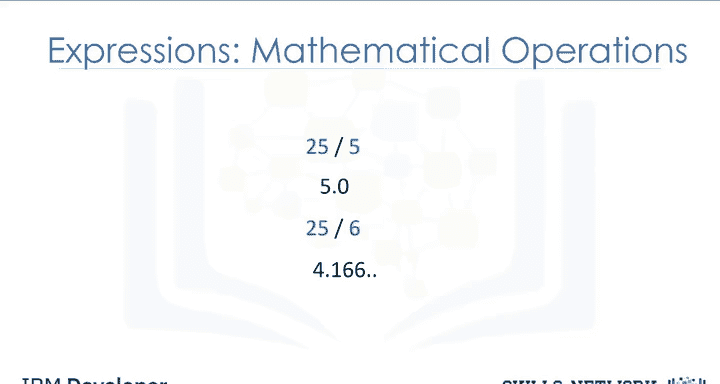

我们可以使用星号（`*`）执行乘法运算：
```python
5 * 5
```
结果是25。这里的运算符是星号（`*`）。

我们还可以使用正斜杠（`/`）执行除法运算：
```python
25 / 5
```
25除以5等于5。
```python
25 / 6
```
25除以6约等于4.167。在本课程使用的Python 3版本中，这两种除法运算的结果都是**浮点数**。

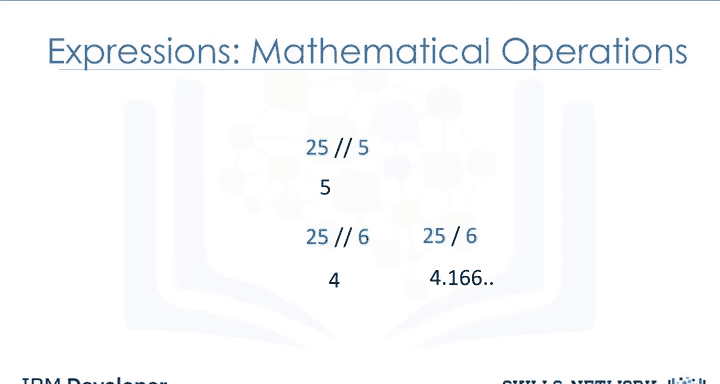

我们可以使用双斜杠（`//`）进行**整数除法**，结果会被取整：
```python
25 // 6
```
结果是4。

请注意，在某些情况下，整数除法的结果与常规除法不同。

---

## 运算顺序 📐

Python在执行数学表达式时遵循数学惯例（先乘除，后加减）。以下两个表达式展示了不同的运算顺序：
```python
2 + 3 * 6
(2 + 3) * 6
```
在第一种情况下，Python先执行乘法（`3 * 6`），然后加上2，得到结果20。
在第二种情况下，括号内的表达式（`2 + 3`）先执行，得到5，然后乘以6，得到结果30。

Python可以进行更多种类的运算，实验部分提供了更多示例。我们也会在课程中涵盖更复杂的操作。

---

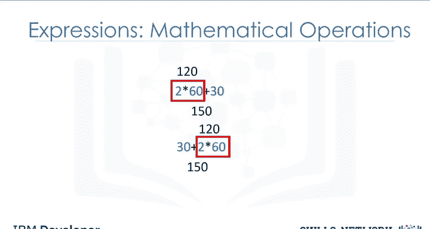

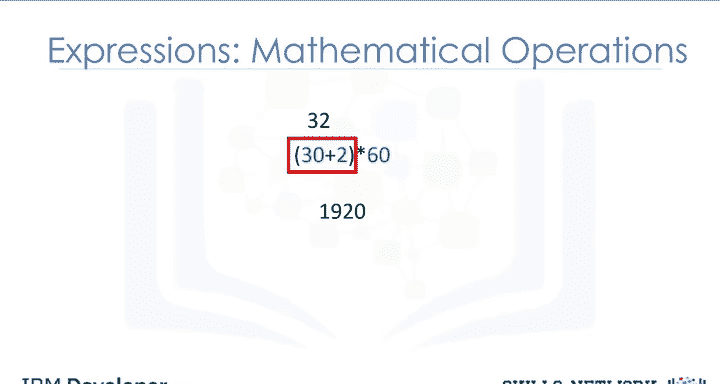

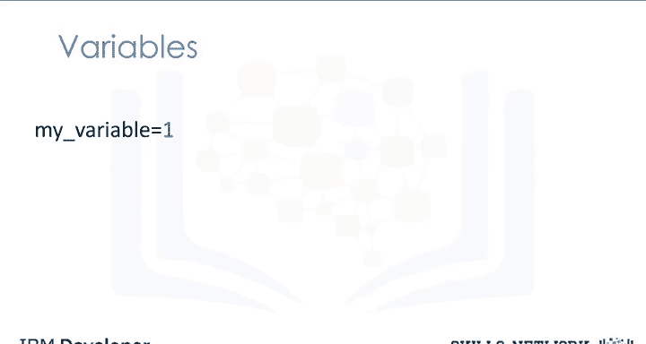

## 引入变量 📦

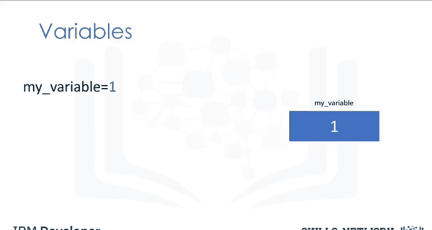

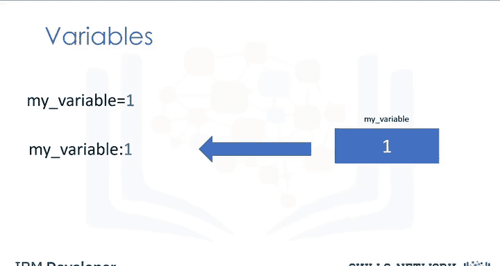

上一节我们介绍了表达式，本节中我们来看看如何使用变量来存储值。

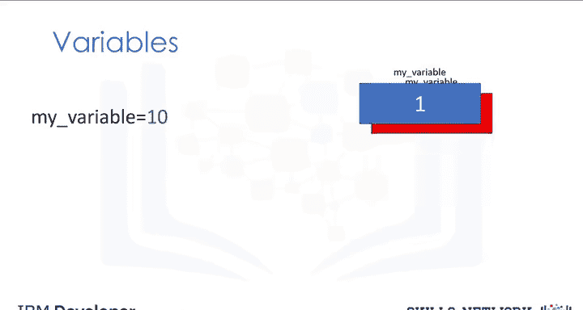

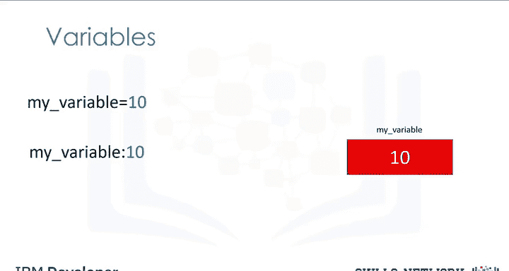

我们可以使用变量来存储值。例如，我们使用赋值运算符（即等号 `=`）将值1赋给变量 `my_variable`：
```python
my_variable = 1
```
然后，我们可以在代码的其他地方通过输入变量的确切名称来使用这个值。我们使用冒号来表示变量的值。

我们可以使用赋值运算符为 `my_variable` 赋予一个新值：
```python
my_variable = 10
```
现在，该变量的值为10。变量的旧值不再重要。

---

## 变量与表达式结合使用 🔄

我们可以存储表达式的结果。例如，我们将几个值相加，并将结果赋给变量 `X`：
```python
X = 40 + 50 + 70
```
现在 `X` 存储了结果（160）。

我们也可以对 `X` 执行操作，并将结果赋给一个新变量 `Y`：
```python
Y = X / 60
```
现在 `Y` 的值为2.666...。

我们还可以对 `X` 执行操作，并将新值重新赋给 `X` 本身：
```python
X = X / 60
```
变量 `X` 现在的值是2.666...。和之前一样，`X` 的旧值不再重要。

我们也可以在变量上使用 `type()` 命令来查看其数据类型。

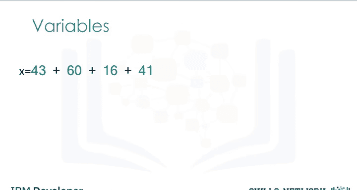

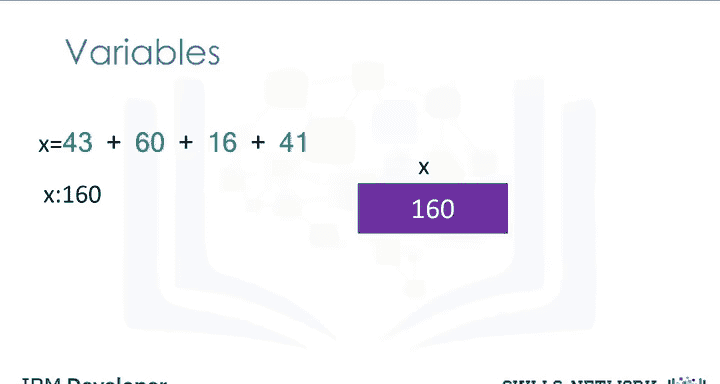


---

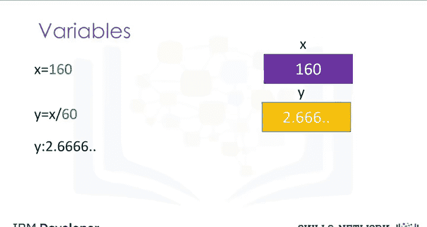

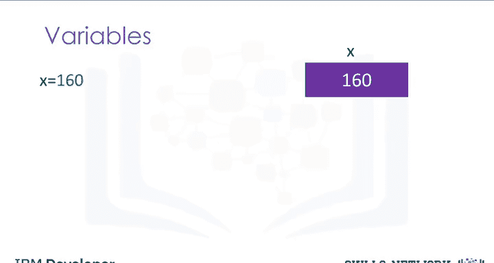

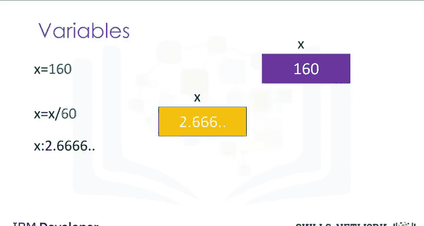

## 变量命名最佳实践 ✨

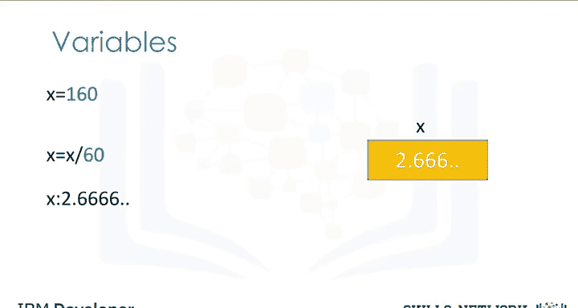

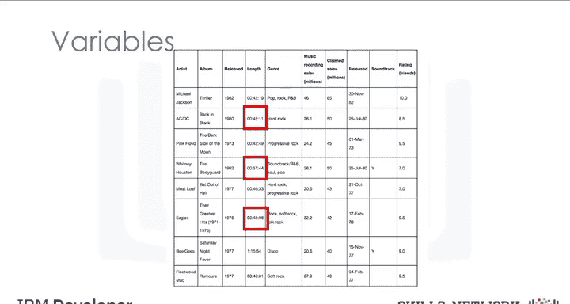

为变量使用有意义的名称是一种良好实践，这样你就不必费力记住每个变量的用途。

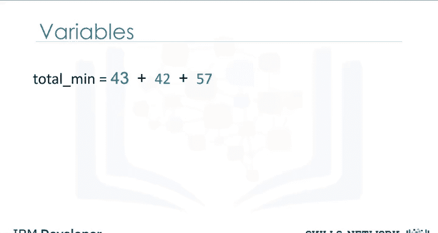

假设我们想将以下音乐数据集中高亮示例的分钟数转换为小时数。我们称包含总分钟数的变量为 `total_min`。通常使用下划线来分隔单词：
```python
total_min = 40 + 50 + 70
```
你也可以使用大写字母来开始新单词（驼峰命名法），但下划线风格（蛇形命名法）在Python中更常见。

我们称包含总小时数的变量为 `total_hour`。我们可以通过将 `total_min` 除以60来获得总小时数：
```python
total_hour = total_min / 60
```
结果大约是2.367小时。

如果我们修改第一个变量（`total_min`）的值，那么依赖于它的变量（`total_hour`）的值也会相应改变。我们无需修改代码的其他部分，这体现了使用变量的优势。

---

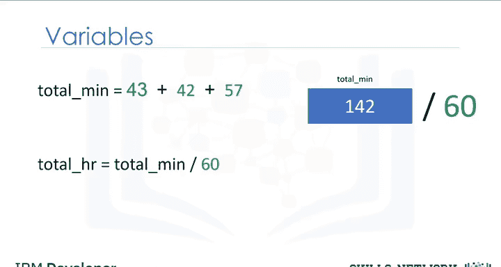

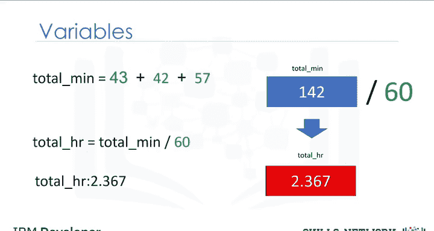

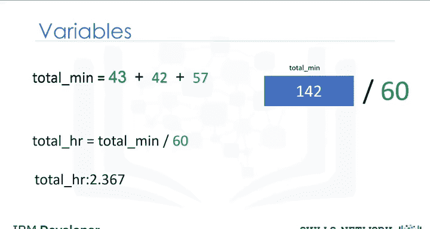

## 总结

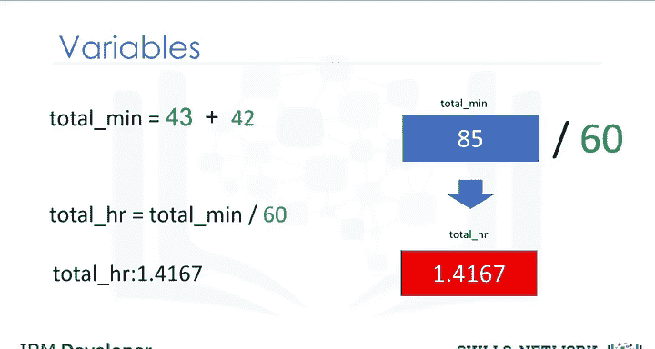

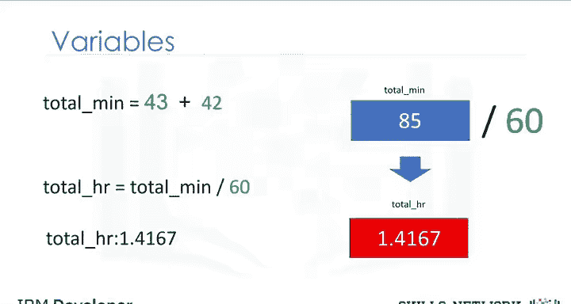

本节课中，我们一起学习了Python中**表达式**和**变量**的核心概念。表达式是执行计算的指令，而变量是存储这些计算结果的容器。我们了解了基本的算术运算符、运算顺序、如何给变量赋值和重新赋值，以及为变量选择有意义名称的重要性。掌握这些基础知识是进行更复杂编程的基石。