# 056：字符串操作 🧵

在本节课中，我们将要学习Python中字符串的基本概念和操作方法。字符串是编程中最常用的数据类型之一，理解如何创建、访问和修改字符串是学习Python的重要一步。

## 什么是字符串？

在Python中，字符串是一个字符序列。字符串被包含在两个引号内。

您也可以使用单引号。字符串可以是空格或数字。

字符串也可以是特殊字符。我们可以将字符串绑定或赋值给另一个变量。

将字符串视为一个有序序列有助于理解它。

序列中的每个元素都可以使用由数字数组表示的索引来访问。

## 访问字符串元素

上一节我们介绍了字符串是一个有序序列，本节中我们来看看如何访问其中的元素。

第一个索引可以按如下方式访问。我们可以访问索引6。此外，我们还可以访问第13个索引。

我们也可以对字符串使用负索引。最后一个元素由索引负一给出。

第一个元素可以通过索引负十五获得，依此类推。

我们可以将一个字符串赋值给另一个变量。将字符串视为列表或元组是有帮助的。

我们可以将字符串作为序列处理并执行序列操作。

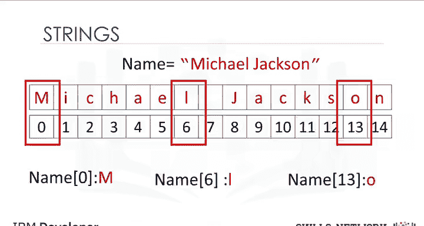

我们还可以输入一个步长值，如下所示。我们选择的两个索引是每隔一个变量。

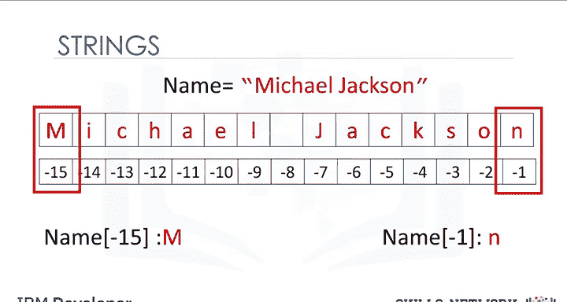

我们也可以结合切片。在这种情况下，我们返回直到索引4的每隔一个值。

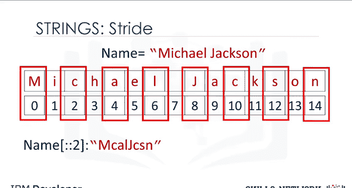

我们可以使用`len`命令来获取字符串的长度。因为这里有15个元素，结果是15。

以下是访问字符串元素的几种方式：
*   使用正索引访问特定位置，例如 `string[0]`。
*   使用负索引从末尾开始访问，例如 `string[-1]`。
*   使用切片获取子串，例如 `string[0:4]`。
*   使用带步长的切片，例如 `string[0:10:2]`。

## 字符串操作

了解了如何访问字符串后，我们来看看如何对字符串进行基本的操作。

我们可以连接或组合字符串。我们使用加号符号。

结果是一个结合了两者的新字符串。我们可以复制字符串的值。

我们只需将字符串乘以我们想要复制的次数。在这个例子中是3。

结果是一个新字符串。这个新字符串由原始字符串的三个副本组成。

这意味着您不能更改字符串的值，但可以创建一个新字符串。例如，您可以通过将其设置为原始变量并与一个新字符串连接来创建一个新字符串。

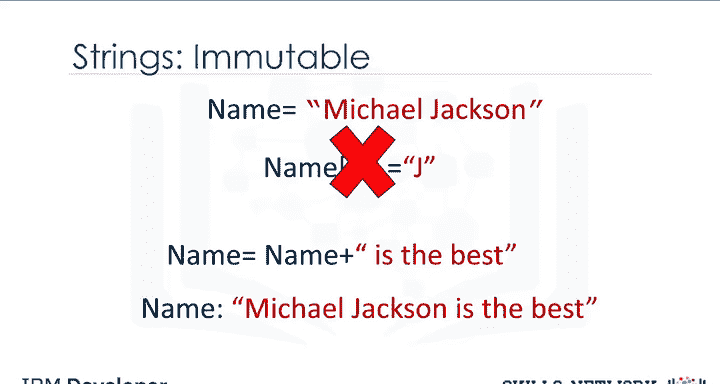

结果是一个从“Michael Jackson”变为“Michael Jackson is the best”的新字符串。

以下是字符串的基本操作：
*   **连接**：使用 `+` 运算符，例如 `"Hello" + " " + "World"`。
*   **复制**：使用 `*` 运算符，例如 `"Hi" * 3`。
*   **不可变性**：字符串创建后不能修改，任何操作都会生成新字符串。

## 转义序列

字符串是不可变的。反斜杠表示转义序列的开始。

转义序列表示可能难以输入的字符串。例如，反斜杠N表示换行。

输出是在遇到反斜杠N后换行。类似地，反斜杠T表示制表符。

输出是在反斜杠T的位置给出一个制表符。

如果您想在字符串中放置一个反斜杠，请使用双反斜杠。

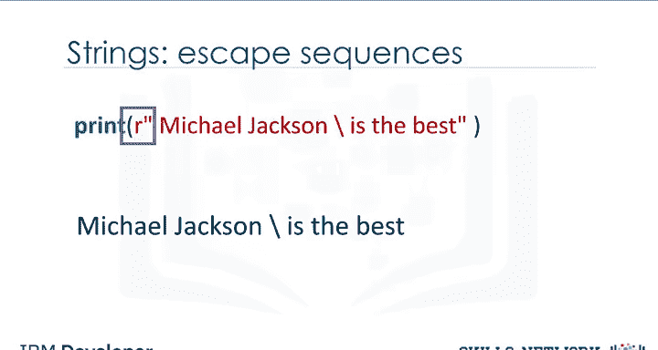

结果是转义序列后的一个反斜杠。

我们也可以在字符串前面放一个R。

以下是常见的转义序列：
*   `\n`：换行符。
*   `\t`：制表符。
*   `\\`：表示一个反斜杠字符本身。
*   在字符串前加 `r` 可以创建原始字符串，忽略转义，例如 `r"C:\new_folder"`。

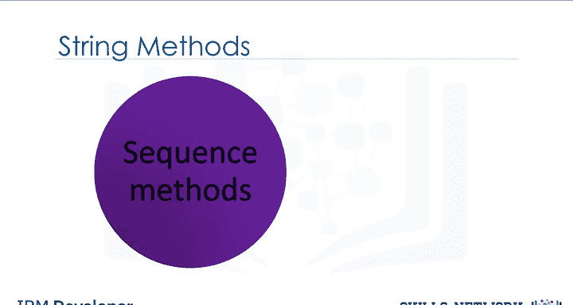

## 字符串方法

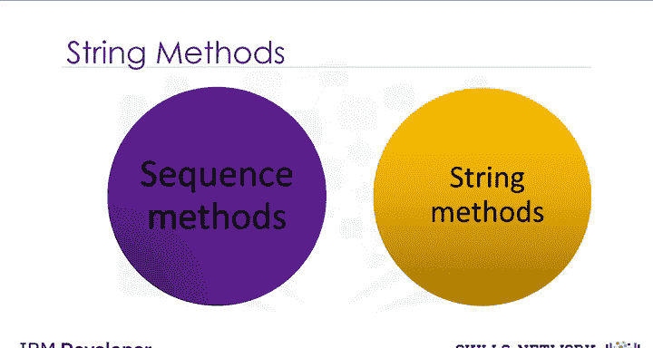

现在让我们看看字符串方法。字符串是序列，因此具有适用于列表和元组的方法。

字符串还有第二组专门用于字符串的方法。

当我们对字符串A应用一个方法时，我们会得到一个与A不同的新字符串B。

让我们看一些例子。让我们尝试`upper`方法。

此方法将小写字符转换为大写字符。在这个例子中，我们将变量A设置为以下值。我们应用`upper`方法并将其设置为等于B。

B的值与A相似，但所有字符都是大写的。

`replace`方法替换字符串的一个片段（即子字符串）为一个新字符串。

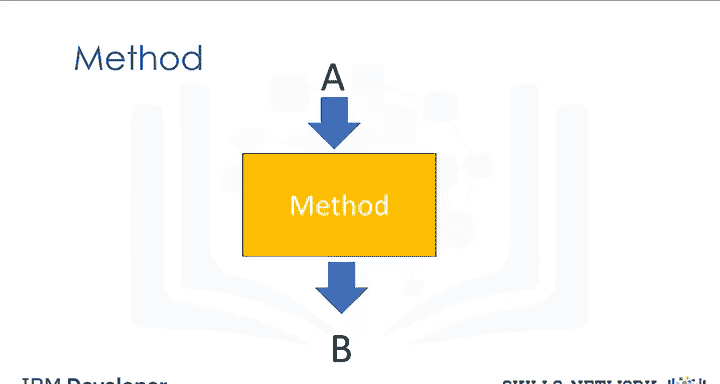

我们输入想要更改的字符串部分。第二个参数是我们想要用其替换该片段的内容。

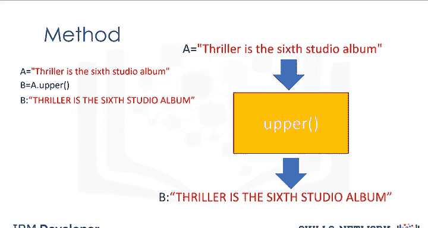

结果是一个片段被更改的新字符串。

`find`方法查找子字符串。参数是您想要查找的子字符串。

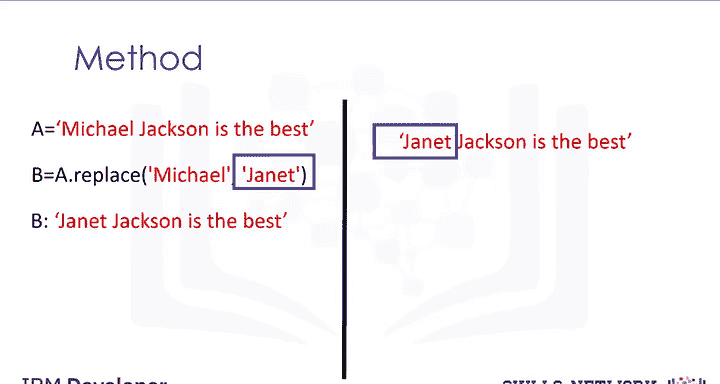

输出是该序列的第一个索引。我们可以查找子字符串“jack”。

如果子字符串不在字符串中，则输出为负1。请查看实验部分以获取更多示例。

以下是几个核心的字符串方法：
*   **`.upper()`**：将字符串中的所有字符转换为大写。
*   **`.replace(old, new)`**：将字符串中的 `old` 子串替换为 `new` 子串。
*   **`.find(sub)`**：查找子串 `sub` 在字符串中第一次出现的索引，如果未找到则返回 `-1`。

## 总结

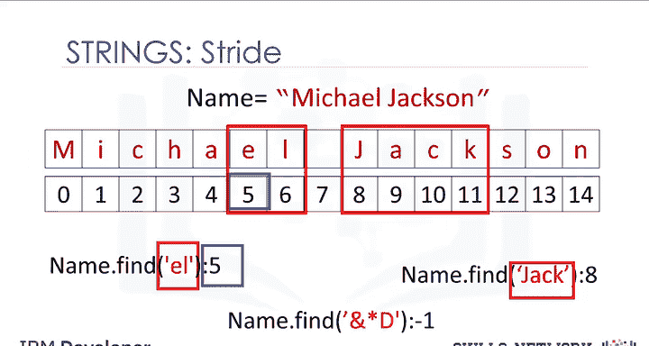

本节课中我们一起学习了Python字符串的基础知识。我们了解了字符串的定义、如何通过索引和切片访问其中的字符，以及字符串的不可变性。我们还学习了字符串的基本操作，如连接和复制，认识了转义序列的用途，并实践了几个常用的字符串方法，如`upper()`、`replace()`和`find()`。掌握这些内容是进行更复杂文本处理的基础。