# 057：列表和元组 📚

在本节课中，我们将要学习Python中的两种复合数据类型：列表和元组。它们是Python中关键的数据结构，用于存储有序的元素集合。

## 元组 📦

元组是一种有序序列。以下是创建一个名为`ratings`的元组的示例。

元组表示为括号内用逗号分隔的元素。括号内的这些值就是元组的元素。

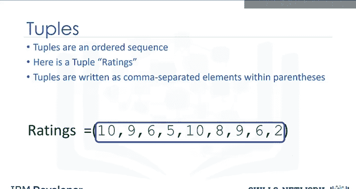

```python
ratings = (1, 2, 3, 4, 5)
```

在Python中，有不同类型的数据，如字符串、整数、浮点数。它们都可以包含在一个元组中。但变量本身的类型是`tuple`。

### 访问元组元素

元组的每个元素可以通过索引来访问。下表展示了索引与元组中元素的关系。

| 索引 | 元素 |
| :--- | :--- |
| 0    | 1    |
| 1    | 2    |
| 2    | 3    |
| 3    | 4    |
| 4    | 5    |

第一个元素可以通过元组名称后跟一个方括号和索引号来访问，索引从0开始。

```python
first_element = ratings[0]  # 结果为 1
```

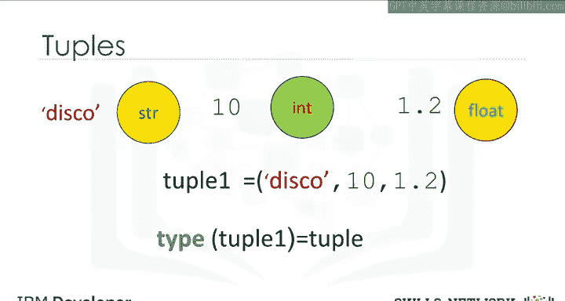

我们可以如下访问第二个元素。

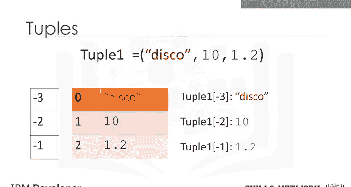

```python
second_element = ratings[1]  # 结果为 2
```

我们也可以访问最后一个元素。在Python中，我们可以使用负索引。关系如下表所示。

| 索引  | 元素 |
| :---- | :--- |
| -5    | 1    |
| -4    | 2    |
| -3    | 3    |
| -2    | 4    |
| -1    | 5    ```

对应的访问方式如下。

```python
last_element = ratings[-1]  # 结果为 5
```

### 元组的操作

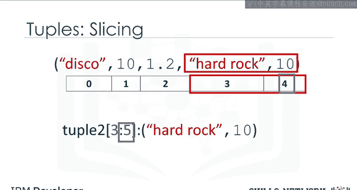

我们可以通过相加来连接或组合元组。结果如下。

```python
tuple1 = (1, 2, 3)
tuple2 = (4, 5, 6)
combined_tuple = tuple1 + tuple2  # 结果为 (1, 2, 3, 4, 5, 6)
```

新元组的索引如下。

如果我们想从元组中获取多个元素，我们也可以对元组进行切片。例如，如果我们想要前三个元素，我们使用以下命令。切片时，结束索引是你想要的最后一个元素的索引加一。

```python
first_three = ratings[0:3]  # 结果为 (1, 2, 3)
```

类似地，如果我们想要最后两个元素，我们使用以下命令。注意，结束索引是元组最后一个元素的索引加一。

```python
last_two = ratings[-2:]  # 结果为 (4, 5)
```

我们可以使用`len`命令来获取元组的长度。由于有五个元素，结果是五。

```python
length = len(ratings)  # 结果为 5
```

### 元组的不可变性

元组是不可变的，这意味着我们不能改变它们。为了理解为什么这很重要，让我们看看当我们将变量`ratings1`设置为`ratings`时会发生什么。

```python
ratings = (1, 2, 3, 4, 5)
ratings1 = ratings
```

每个变量并不包含一个元组，而是引用同一个不可变的元组对象。关于对象的更多信息，请参见对象和类模块。

假设我们想更改索引2处的元素，因为元组是不可变的，我们不能这样做。

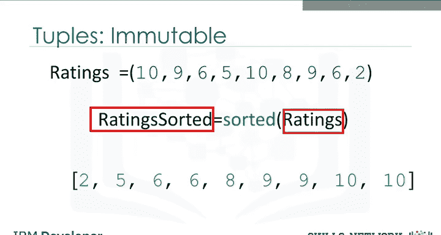

```python
# ratings[2] = 10  # 这行代码会引发 TypeError
```

因此，`ratings1`不会因为`ratings`的改变而受到影响，因为元组是不可变的。也就是说，我们不能改变它。

我们可以为`ratings`变量分配一个不同的元组。变量`ratings`现在引用另一个元组。

```python
ratings = (10, 20, 30)
```

作为不可变性的结果，如果我们想要操作一个元组，我们必须创建一个新的元组。例如，如果我们想对一个元组排序，我们使用`sorted`函数。输入是原始元组，输出是一个新的已排序列表。关于函数的更多信息，请参见我们关于函数的视频。

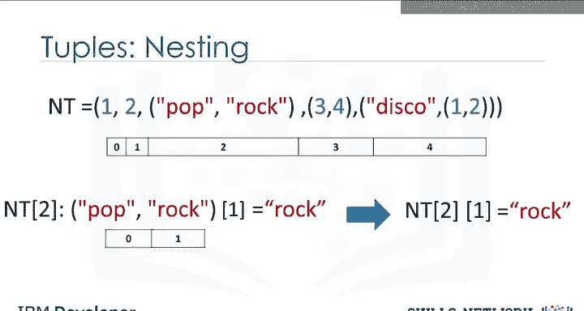

```python
sorted_ratings = sorted(ratings)  # 返回一个新的列表 [10, 20, 30]
```

### 嵌套元组

一个元组可以包含其他元组，以及其他复杂的数据类型。这被称为嵌套。我们可以使用标准的索引方法来访问这些元素。

如果我们选择一个包含元组的索引，同样的索引约定适用。然后我们可以访问该元组中的值。例如，我们可以访问第二个元素。

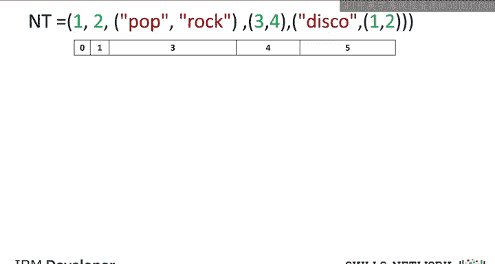

```python
nested_tuple = ((1, 2), (3, 4), (5, 6))
second_element_of_first_tuple = nested_tuple[0][1]  # 结果为 2
```

我们可以直接将此索引应用于元组变量`NT`。将其可视化为一棵树会很有帮助。

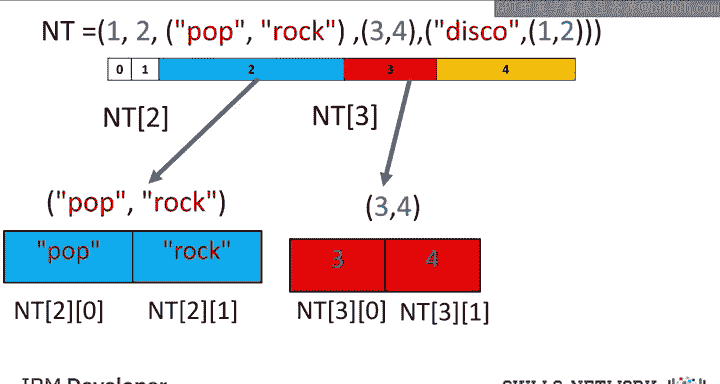

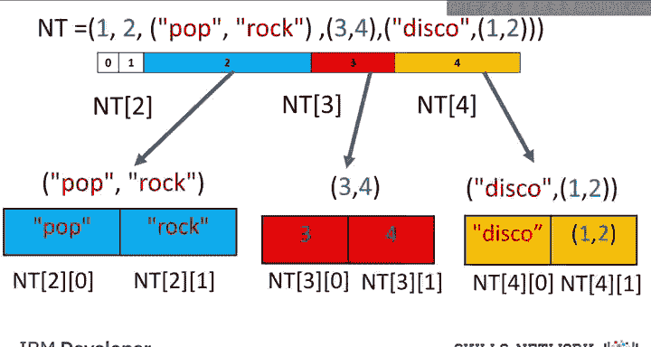

我们可以将这种嵌套可视化为一棵树。元组有以下索引。如果我们考虑包含其他元组的索引，我们看到索引2包含一个有两个元素的元组。我们可以访问那两个索引。

```python
complex_nested = (1, 2, (3, 4), (5, (6, 7)))
element = complex_nested[3][1][0]  # 结果为 6
```

同样的约定适用于索引3。我们也可以访问那些元组中的元素。我们可以继续这个过程。

我们甚至可以通过添加另一个方括号来访问树的更深层次。我们可以访问字符串中的不同字符或第一个列表中包含的第二个元组中的各种元素。

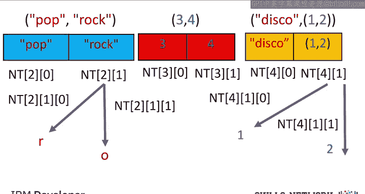

---

上一节我们介绍了元组，本节中我们来看看列表。

## 列表 📝

列表也是Python中一种流行的数据结构。列表同样是一个有序序列。

```python
L = ["hard rock", 10, 1.2]
```

列表用方括号表示。在许多方面，列表类似于元组。一个关键区别是它们是可变的。列表可以包含字符串、浮点数、整数。我们可以嵌套其他列表。我们也可以嵌套元组和其他数据结构。对于嵌套，应用相同的索引约定。

像元组一样，列表的每个元素都可以通过索引访问。下表代表了索引与列表中元素的关系。

| 索引 | 元素       |
| :--- | :--------- |
| 0    | "hard rock" |
| 1    | 10         |
| 2    | 1.2        |

第一个元素可以通过列表名称后跟一个方括号和索引号来访问，在这种情况下是0。

```python
first_element = L[0]  # 结果为 "hard rock"
```

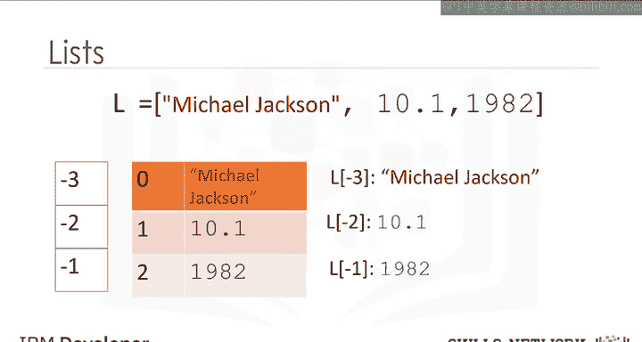

我们可以如下访问第二个元素。

```python
second_element = L[1]  # 结果为 10
```

我们也可以访问最后一个元素。在Python中，我们可以使用负索引。关系如下。

| 索引  | 元素       |
| :---- | :--------- |
| -3    | "hard rock" |
| -2    | 10         |
| -1    | 1.2        ```

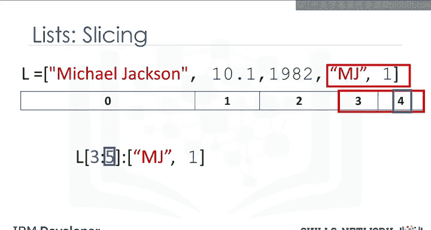

对应的索引如下。

我们也可以在列表中进行切片。例如，如果我们想要这个列表中的最后两个元素，我们使用以下命令。注意，结束索引比列表的长度大一。

```python
last_two_elements = L[-2:]  # 结果为 [10, 1.2]
```

列表和元组的索引约定是相同的。请查看实验部分以获取更多示例。

### 列表的操作

我们可以通过相加来连接或组合列表。结果如下。

```python
list1 = [1, 2, 3]
list2 = [4, 5, 6]
combined_list = list1 + list2  # 结果为 [1, 2, 3, 4, 5, 6]
```

新列表具有以下索引。

列表是可变的。因此，我们可以改变它们。例如，我们应用`extend`方法，通过添加一个点后跟方法名，然后是括号。括号内的参数是我们要连接到原始列表的新列表。

```python
L = ["hard rock", 10, 1.2]
L.extend([4, 5])  # L 变为 ['hard rock', 10, 1.2, 4, 5]
```

在这种情况下，不是创建一个新列表`L1`，原始列表`L`通过添加两个新元素被修改。要了解更多关于方法的信息，请查看我们关于对象和类的视频。

另一个类似的方法是`append`。如果我们应用`append`而不是`extend`，我们向列表添加一个元素。

```python
L.append(6)  # L 变为 ['hard rock', 10, 1.2, 4, 5, 6]
```

如果我们查看索引，现在只多了一个元素。索引5包含我们追加的元素。每次我们应用一个方法，列表都会改变。

如果我们应用`extend`，我们向列表添加两个新元素。列表`L`通过添加两个新元素被修改。如果我们追加字符串"A"，我们进一步改变列表，添加字符串"A"。

由于列表是可变的，我们可以改变它们。例如，我们可以如下更改第一个元素。

```python
L[0] = "banana"  # L 变为 ['banana', 10, 1.2, 4, 5, 6, 'A']
```

我们可以使用`del`命令删除列表的一个元素。我们只需将要删除的列表项作为参数指示出来。例如，如果我们想删除第一个元素，结果变为`[10, 1.2, 4, 5, 6, 'A']`。

```python
del L[0]
```

我们可以删除第二个元素。此操作从列表中移除第二个元素。

```python
del L[1]  # 假设 L 现在是 [10, 1.2, 4, 5, 6, 'A']，删除后变为 [10, 4, 5, 6, 'A']
```

我们可以使用`split`将字符串转换为列表。例如，`split`方法将以空格分隔的每组字符转换为列表的一个元素。

```python
string = "A,B,C"
list_from_string = string.split(',')  # 结果为 ['A', 'B', 'C']
```

我们可以使用`split`函数在特定字符（称为分隔符）上分隔字符串。我们只需传递我们想要分割的分隔符作为参数。在这种情况下，是一个逗号。结果是一个列表。每个元素对应一组被逗号分隔的字符。

### 别名与克隆

当我们设置一个变量`B`等于`A`时，`A`和`B`都引用同一个列表。多个名称引用同一个对象被称为别名。

```python
A = ["hard rock", 10, 1.2]
B = A
```

从列表的幻灯片中我们知道，`B`中的第一个元素被设置为"hard rock"。如果我们把`A`中的第一个元素改为"banana"，我们会得到一个副作用。`B`的值也会因此改变。`A`和`B`引用同一个列表；因此，如果我们改变`A`，列表`B`也会改变。如果在改变列表`A`后检查`B`的第一个元素，我们得到的是"banana"而不是"hard rock"。

你可以使用以下语法克隆列表`A`。变量`A`引用一个列表，变量`B`引用原始列表的一个新副本或克隆。现在，如果你改变`A`，`B`不会改变。

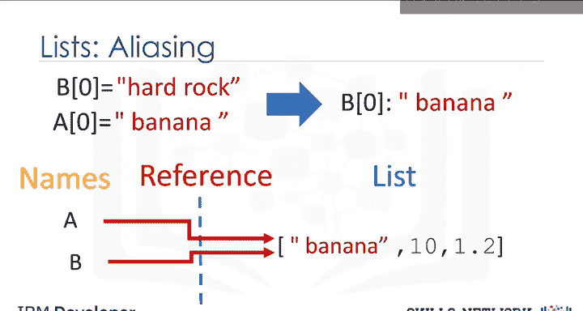

```python
A = ["hard rock", 10, 1.2]
B = A[:]  # 或者 B = A.copy()
A[0] = "banana"
# 现在 A 是 ['banana', 10, 1.2]， B 仍然是 ['hard rock', 10, 1.2]
```

我们可以使用`help`命令获取关于列表、元组和Python中许多其他对象的更多信息。只需传入列表、元组或任何其他Python对象。

```python
help(list)
```

请查看实验部分，了解你可以用列表做的更多事情。

---

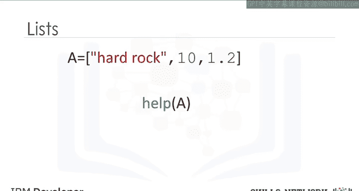

本节课中我们一起学习了Python中的列表和元组。我们了解了它们的定义、创建方法、如何访问和操作其中的元素，以及它们的关键区别——元组的不可变性与列表的可变性。我们还探讨了嵌套结构、切片、连接以及别名与克隆等重要概念。掌握这些基础数据结构是进行有效Python编程的关键一步。