# 058：字典 📚

在本节课中，我们将要学习Python中的一种重要数据结构——字典。我们将了解字典的基本概念、如何创建和操作字典，以及它与列表等其他数据结构的区别。

## 概述

上一节我们介绍了列表，它是一种通过整数索引访问元素的有序集合。本节中我们来看看字典，它是一种通过“键”来访问“值”的无序集合。字典在存储和检索成对关联的数据时非常高效。

## 字典的基本概念

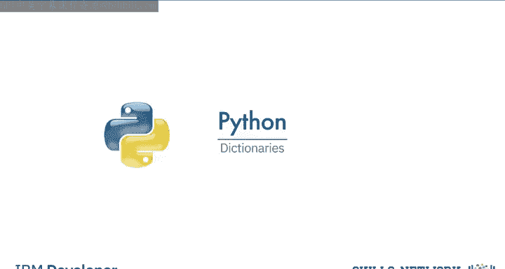

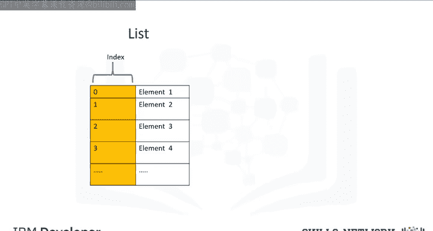

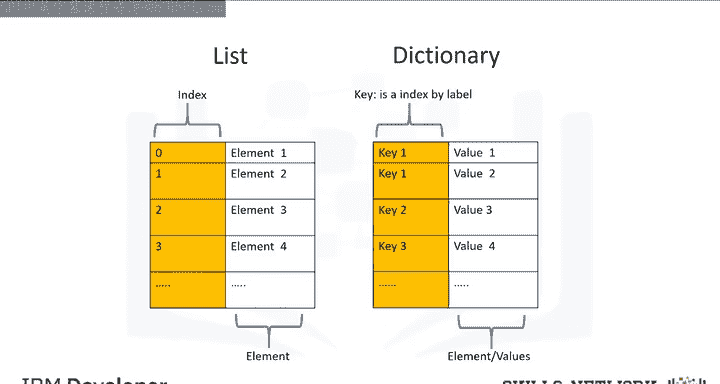

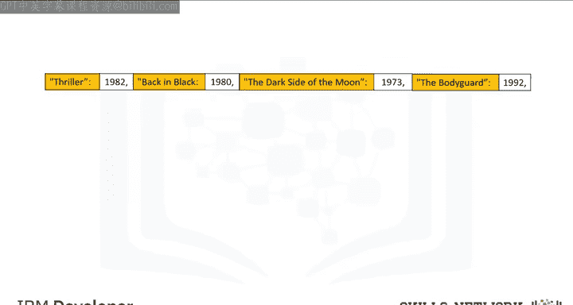

字典是Python中的一种集合类型。列表使用整数索引，这些索引类似于地址。列表包含元素。字典则包含键和值。键类似于索引，也像地址，但键不必是整数，通常是字符或字符串。值类似于列表中的元素，用于存储信息。

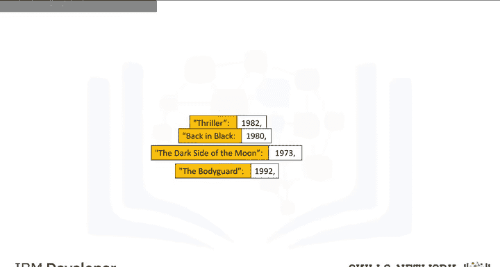

## 创建字典

要创建一个字典，我们使用花括号 `{}`。键是第一个元素，它们必须是**不可变**且**唯一**的。每个键后面跟着一个值，两者之间用冒号 `:` 分隔。值可以是不可变的、可变的，并且允许重复。每个键值对之间用逗号 `,` 分隔。

考虑以下字典示例，其中专辑标题是键，发行日期是值：
```python
{"Back in Black": 1980, "The Dark Side of the Moon": 1973, "The Bodyguard": 1992}
```
我们可以用表格来可视化字典，第一列代表键，第二列代表值。

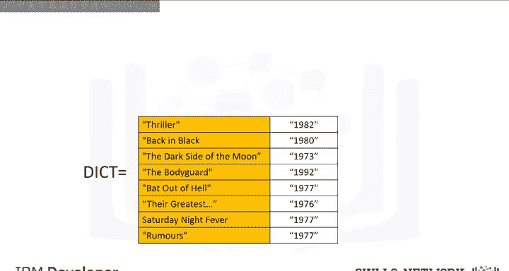

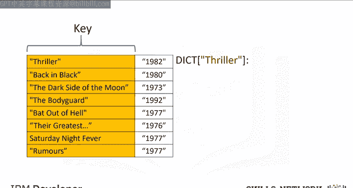

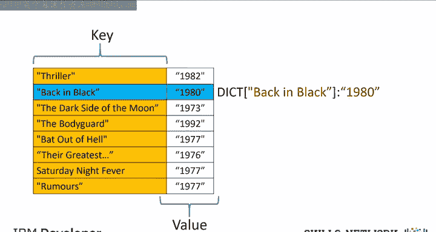

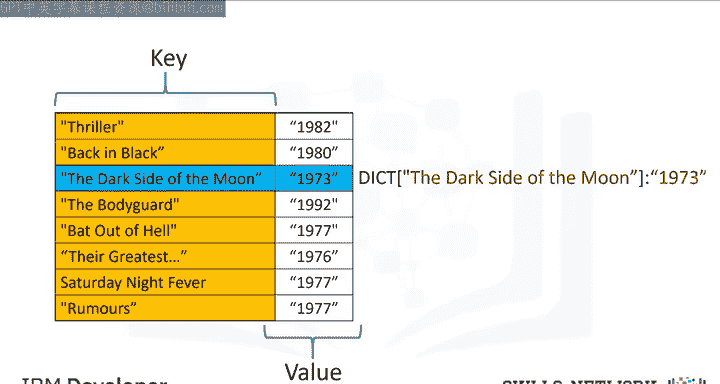

## 字典的基本操作

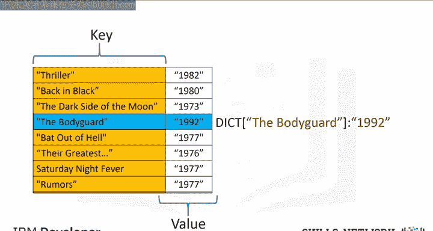

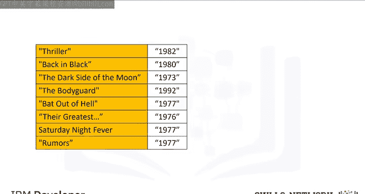

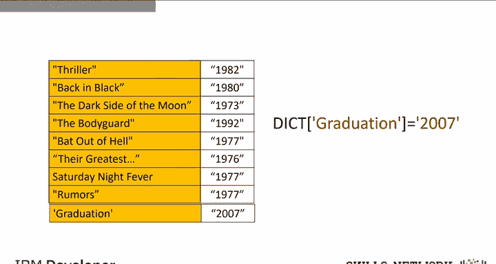

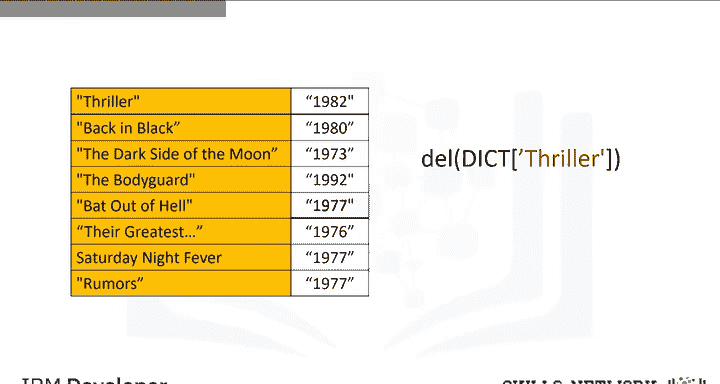

我们可以将字典赋值给一个变量，并使用键来访问对应的值。

以下是字典的基本操作方法：

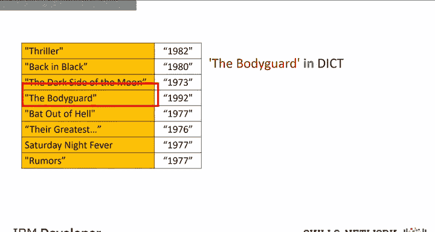

*   **访问值**：使用方括号 `[]`，参数是键。例如 `dict["Back in Black"]` 会返回值 `1980`。
*   **添加新条目**：通过赋值语句 `dict["Graduation"] = 2007`，可以添加一个新的键值对。
*   **删除条目**：使用 `del` 语句，例如 `del dict["Thriller"]` 会删除键 `"Thriller"` 及其对应的值。
*   **检查键是否存在**：使用 `in` 命令，例如 `"Back in Black" in dict`。该命令检查键是否在字典中，存在则返回 `True`，否则返回 `False`。
*   **获取所有键**：使用 `.keys()` 方法，返回一个包含所有键的类列表对象。
*   **获取所有值**：使用 `.values()` 方法，返回一个包含所有值的类列表对象。

## 总结

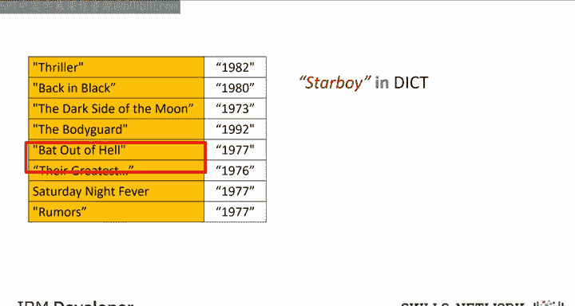

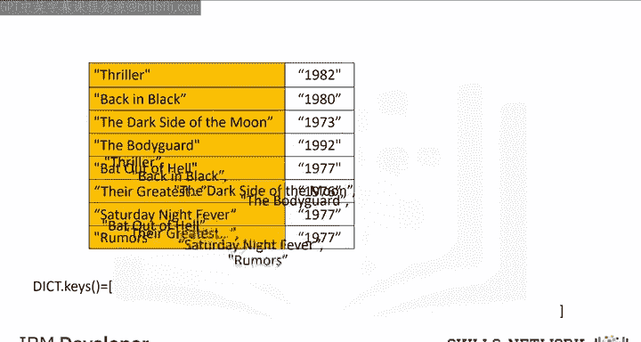

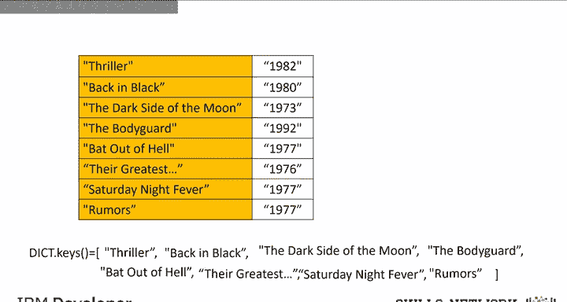

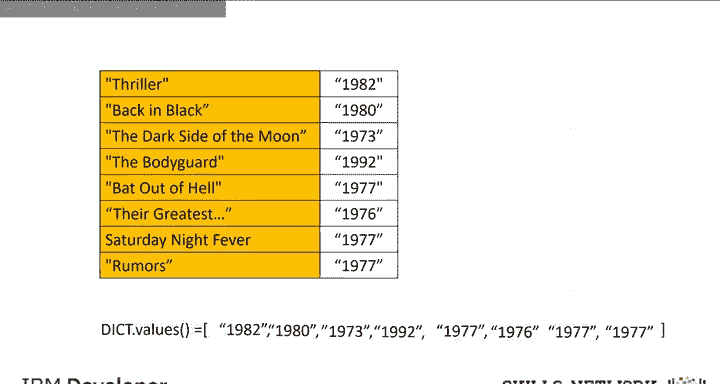

本节课中我们一起学习了Python字典。我们了解了字典由键值对组成，键用于查找对应的值。我们掌握了如何创建字典、如何访问、添加、删除条目，以及如何检查键的存在和获取所有键值。字典是存储关联数据的强大工具，建议通过实验练习来巩固理解。