# 059：集合（Sets）📚

在本节课中，我们将要学习Python中的另一种集合类型——集合（Set）。我们将了解集合的定义、特性、基本操作以及集合间的数学运算。

集合也是一种集合类型。这意味着，与列表（List）和元组（Tuple）类似，你可以向集合中添加不同的Python数据类型。

与列表和元组不同，集合是无序的。这意味着集合不记录元素的位置。

集合只包含唯一的元素。这意味着在同一个集合中，一个特定的元素只会出现一次。

## 定义集合 🔧

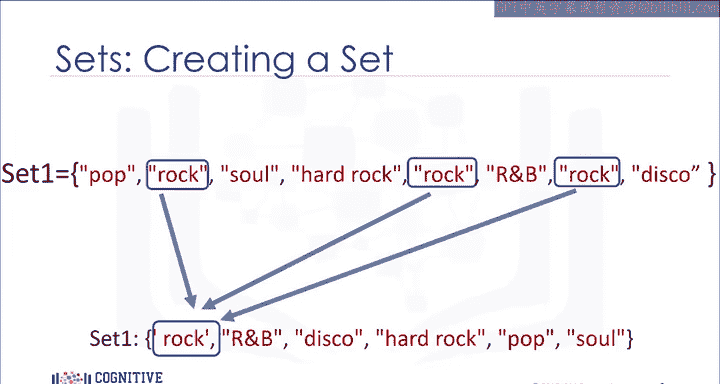

要定义一个集合，你需要使用花括号 `{}`。将集合的元素放在花括号内。

**代码示例：**
```python
my_set = {‘apple‘, ‘banana‘, ‘cherry‘, ‘apple‘}
print(my_set)  # 输出：{‘cherry‘, ‘banana‘, ‘apple‘}
```
你会注意到定义时包含了重复项“apple”。当实际创建集合时，重复的项将不会出现。

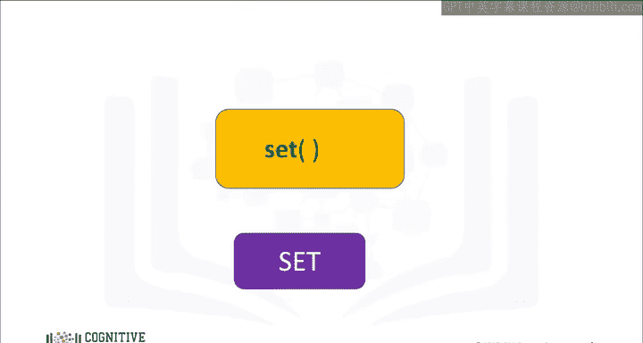

## 列表转换为集合 🔄

你可以使用 `set()` 函数将一个列表转换为集合。这被称为类型转换（Typecasting）。

你只需将列表作为 `set()` 函数的输入参数。结果将是一个由列表转换而来的集合。

**代码示例：**
```python
my_list = [‘apple‘, ‘banana‘, ‘cherry‘, ‘apple‘]
my_set = set(my_list)
print(my_set)  # 输出：{‘cherry‘, ‘banana‘, ‘apple‘}
```

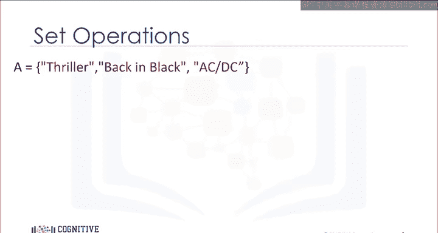

让我们来看一个例子。我们从一个列表开始。我们将这个列表输入到 `set()` 函数中。`set()` 函数返回一个集合。请注意，结果集合中没有重复的元素。

## 集合的基本操作 🛠️

上一节我们介绍了如何创建集合，本节中我们来看看如何修改集合。考虑一个集合A，我们可以用一个圆圈来表示它。如果你熟悉集合论，这可以是维恩图的一部分。

维恩图是一种通常使用形状（如圆圈）来表示集合的工具。

以下是集合的一些基本操作方法：

我们可以使用 `add()` 方法向集合中添加一个项目。我们只需在集合名称后加一个点，然后调用 `add()` 方法。参数是我们要添加的新元素。

**代码示例：**
```python
set_a = {‘AC/DC‘, ‘Back in Black‘, ‘Thriller‘}
set_a.add(‘NSYNC‘)
print(set_a)  # 输出可能包含 ‘NSYNC‘
```
现在集合A包含了‘NSYNC‘这个项目。如果我们尝试添加相同的项目两次，什么也不会发生，因为集合中不能有重复项。

假设我们想从集合A中移除‘NSYNC‘。

我们也可以使用 `remove()` 方法从集合中移除一个项目。我们只需在集合名称后加一个点，然后调用 `remove()` 方法。参数是我们要移除的元素。

**代码示例：**
```python
set_a.remove(‘NSYNC‘)
print(set_a)  # ‘NSYNC‘ 已被移除
```
在 `remove()` 方法应用于集合后，集合A不再包含‘NSYNC‘这个项目。你可以对集合中的任何项目使用此方法。

我们可以使用 `in` 命令来验证一个元素是否在集合中，如下所示。该命令检查特定项目（例如‘AC/DC‘）是否在集合中。如果项目在集合中，则返回 `True`。

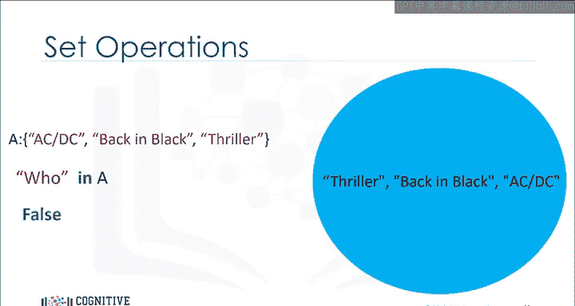

**代码示例：**
```python
print(‘AC/DC‘ in set_a)  # 输出：True
print(‘Who‘ in set_a)    # 输出：False
```
如果我们查找一个不在集合中的项目（例如‘Who‘），由于该项目不在集合中，我们将得到 `False`。

## 集合的数学运算 ➕➖✖️➗

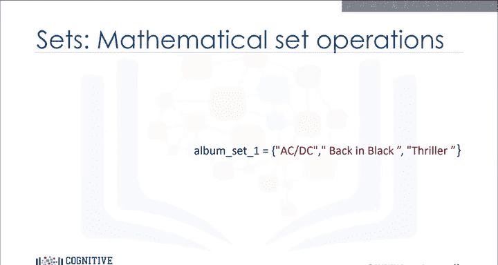

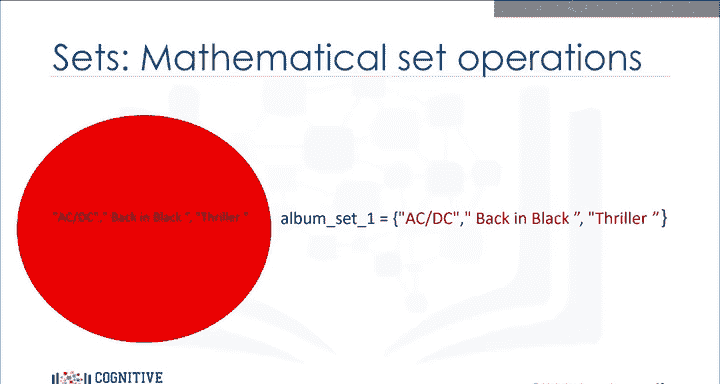

这些是数学集合运算的类型。我们还可以进行其他操作。

我们可以在集合之间进行许多有用的数学运算。

让我们定义集合 `album_set1`。我们可以用一个红色圆圈或维恩图来表示它。

**代码示例：**
```python
album_set1 = {‘AC/DC‘, ‘Back in Black‘, ‘Thriller‘}
```

类似地，我们可以定义集合 `album_set2`。我们也可以用一个蓝色圆圈或维恩图来表示它。

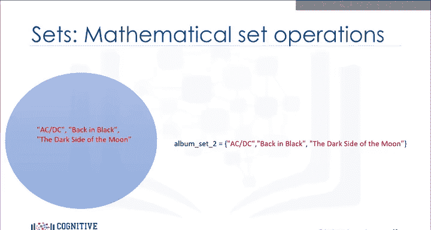

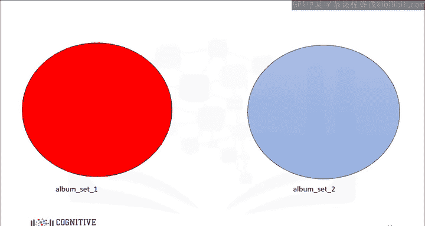

**代码示例：**
```python
album_set2 = {‘AC/DC‘, ‘Back in Black‘, ‘The Dark Side of the Moon‘}
```

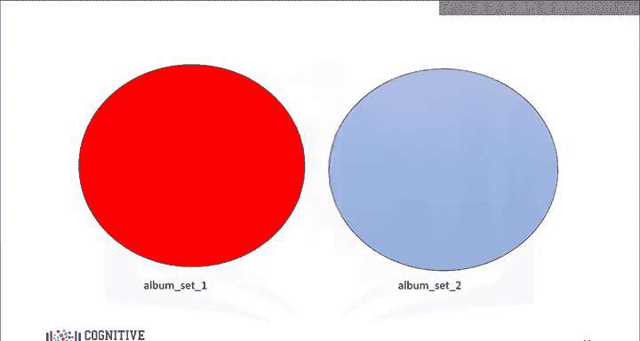

### 交集（Intersection）

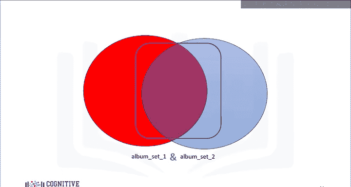

两个集合的交集是一个新的集合，包含同时存在于这两个集合中的元素。使用维恩图会很有帮助。代表两个集合的圆圈相结合，重叠部分代表新的集合。由于重叠部分由红色圆圈和蓝色圆圈共同构成，我们用“且”（and）来定义交集。

在Python中，我们使用符号 `&` 来求两个集合的交集。

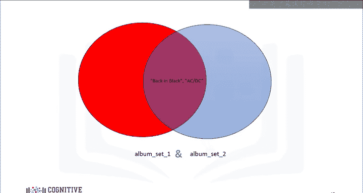

**代码示例：**
```python
album_set3 = album_set1 & album_set2
print(album_set3)  # 输出：{‘AC/DC‘, ‘Back in Black‘}
```
如果我们把集合的值覆盖在圆圈上，将公共元素放在重叠区域，在执行交集操作后，我们看到所有不同时存在于两个集合中的项目都消失了。

我们看到‘AC/DC‘和‘Back in Black‘同时存在于两个集合中。结果是一个新的集合 `album_set3`，包含了 `album_set1` 和 `album_set2` 中的所有公共元素。

### 并集（Union）

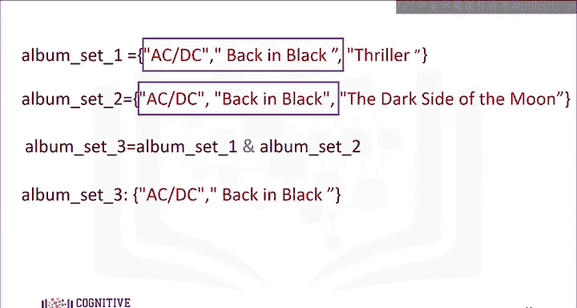

两个集合的并集是一个新的集合，包含两个集合中的所有项目（去重后）。我们可以如下找到集合 `album_set1` 和 `album_set2` 的并集。

在Python中，我们使用 `union()` 方法或 `|` 操作符。

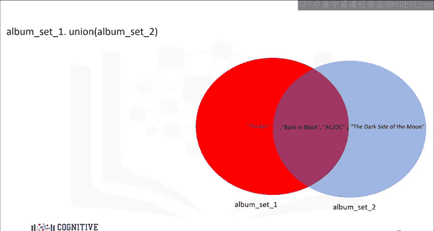

**代码示例：**
```python
album_set_union = album_set1.union(album_set2)
# 或者 album_set_union = album_set1 | album_set2
print(album_set_union)  # 输出：{‘AC/DC‘, ‘Back in Black‘, ‘Thriller‘, ‘The Dark Side of the Moon‘}
```
结果是一个包含 `album_set1` 和 `album_set2` 所有元素的新集合。这个新集合在图中用绿色表示。

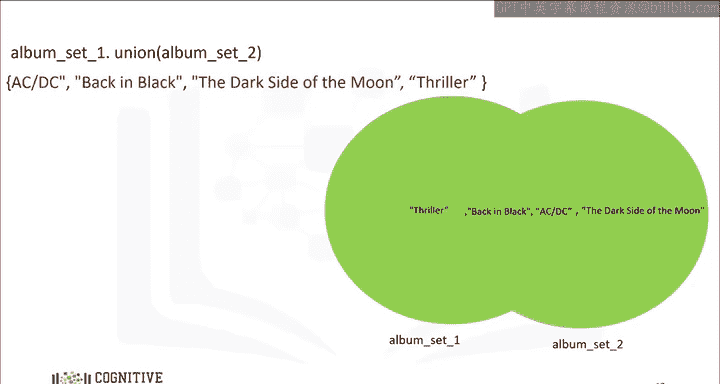

### 子集（Subset）

考虑新的集合 `album_set3`。该集合包含元素‘AC/DC‘和‘Back in Black‘。我们可以用维恩图表示，因为 `album_set3` 中的所有元素都在 `album_set1` 中。代表 `album_set1` 的圆圈包裹着代表 `album_set3` 的圆圈。

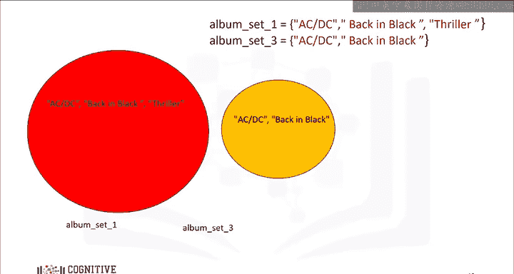

我们可以使用 `issubset()` 方法检查一个集合是否是另一个集合的子集。

**代码示例：**
```python
print(album_set3.issubset(album_set1))  # 输出：True
```
由于 `album_set3` 是 `album_set1` 的子集，结果为 `True`。

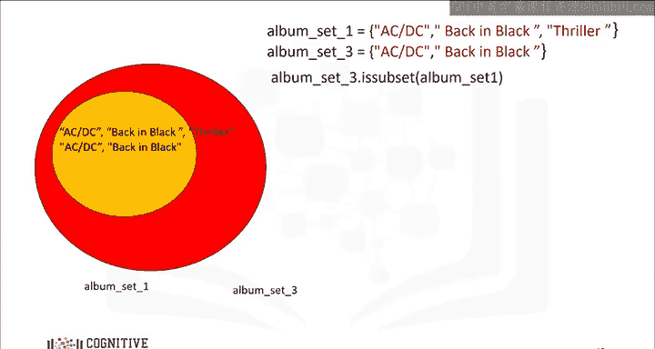

关于集合还有很多可以做的事情。请查看实验部分以获取更多示例。

## 总结 📝

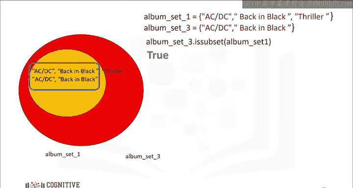

本节课中我们一起学习了Python中的集合。我们了解了集合无序、元素唯一的特性，学习了如何创建集合、将列表转换为集合，以及如何使用 `add()`、`remove()` 和 `in` 进行基本操作。我们还深入探讨了集合间的数学运算，包括交集（`&`）、并集（`.union()` 或 `|`）以及如何检查子集关系（`.issubset()`）。集合是处理唯一项数据集和进行集合论运算的强大工具。