# 060：条件和分支 🧠

在本节课中，我们将要学习编程中的“条件”与“分支”概念。它们是控制程序流程的基础，决定了程序在不同情况下执行不同的代码块。我们将从比较操作开始，逐步深入到 `if`、`else` 和 `elif` 语句，最后学习逻辑运算符。

## 比较操作

上一节我们介绍了课程概述，本节中我们来看看比较操作。比较操作会对比两个值或操作数，然后基于某个条件产生一个布尔值（`True` 或 `False`）。

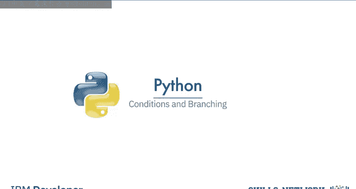

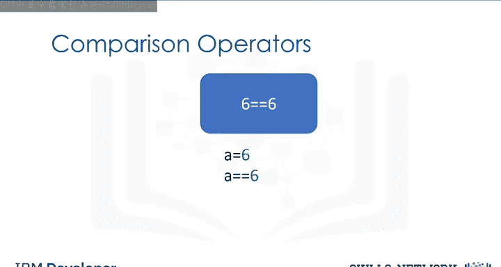

例如，我们给变量 `a` 赋值为 `6`。我们可以使用由两个等号 `==` 表示的相等运算符来判断两个值是否相等。

```python
a = 6
result = (a == 7)  # 判断 a 是否等于 7
print(result)      # 输出：False
```

在这个例子中，由于 `6` 不等于 `7`，结果是 `False`。如果我们判断 `a` 是否等于 `6`，结果将是 `True`。

以下是其他常见的比较运算符：

*   **大于（`>`）**：如果左操作数的值大于右操作数的值，条件为 `True`。
*   **大于等于（`>=`）**：如果左操作数的值大于或等于右操作数的值，条件为 `True`。
*   **小于（`<`）**：如果左操作数的值小于右操作数的值，条件为 `True`。
*   **不等于（`!=`）**：如果两个操作数的值不相等，条件为 `True`。

这些运算符不仅适用于数字，也适用于字符串。例如，比较字符串 `"ACDC"` 和 `"Michael Jackson"` 是否相等会得到 `False`，而判断它们是否不相等则会得到 `True`。

## If 语句

理解了比较操作后，我们就可以利用其结果来控制程序流程了。分支允许我们为不同的输入运行不同的语句。可以把 `if` 语句想象成一个上锁的房间：如果条件为 `True`，你就可以进入房间执行预设的任务；如果条件为 `False`，程序就会跳过这个任务。

考虑一个音乐会场景：蓝色矩形代表一场 ACDC 音乐会。如果个人年龄大于或等于 18 岁，他们可以进入。如果年龄小于 18 岁，则不能进入。

`if` 语句的语法如下：

```python
if condition:
    # 如果条件为 True，则执行这里的代码
```

例如：

```python
age = 17
if age >= 18:
    print(“你可以进入。”)
print(“继续。”)
```

当 `age` 为 `17` 时，条件为 `False`，因此不会执行 `print(“你可以进入。”)` 这行代码，程序直接输出“继续。”。当 `age` 为 `19` 时，条件为 `True`，程序会先输出“你可以进入。”，再输出“继续。”。

## Else 语句

`if` 语句只能处理条件为真的情况。那么条件为假时我们想执行其他操作该怎么办呢？这时就需要 `else` 语句。`else` 语句会在 `if` 条件为 `False` 时运行一个不同的代码块。

继续使用音乐会类比：如果用户 17 岁，他们不能去 ACDC 音乐会，但可以去 Meatloaf 音乐会（用紫色方块表示）。

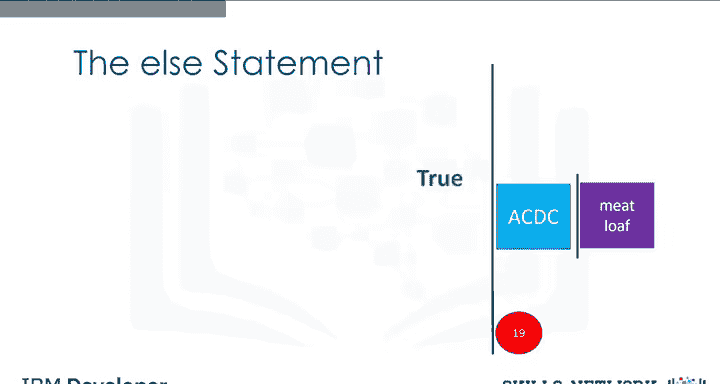

`else` 语句的语法如下：

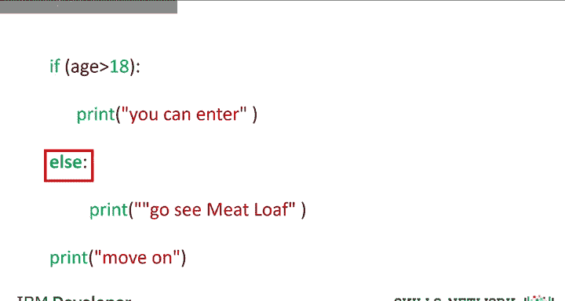

```python
if condition:
    # 如果条件为 True，则执行这里的代码
else:
    # 如果条件为 False，则执行这里的代码
```

例如：

```python
age = 17
if age >= 18:
    print(“你可以进入 ACDC 音乐会。”)
else:
    print(“去看 Meatloaf 音乐会吧。”)
print(“继续。”)
```

当 `age` 为 `17` 时，`if` 条件为 `False`，程序会执行 `else` 块中的代码，输出“去看 Meatloaf 音乐会吧。”。当 `age` 为 `19` 时，`if` 条件为 `True`，程序执行 `if` 块中的代码，输出“你可以进入 ACDC 音乐会。”，并跳过 `else` 块。

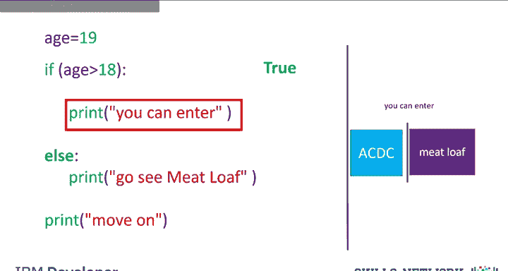

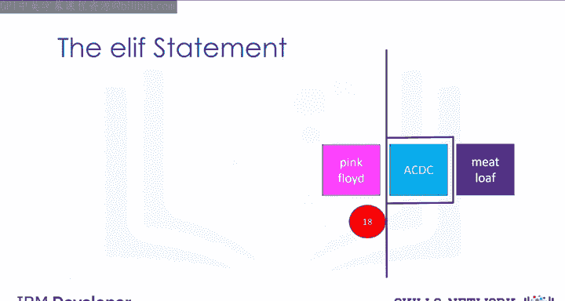

## Elif 语句

有时我们需要检查多个条件。`elif` 是 `else if` 的缩写，它允许我们在前一个条件为 `False` 时检查额外的条件。如果某个 `elif` 条件为 `True`，则执行其对应的代码块。

在音乐会例子中，如果个人刚好 18 岁，他们可以去 Pink Floyd 音乐会，而不是 ACDC 或 Meatloaf 音乐会。

`elif` 语句的语法如下：

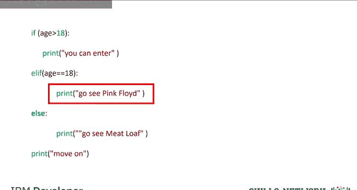

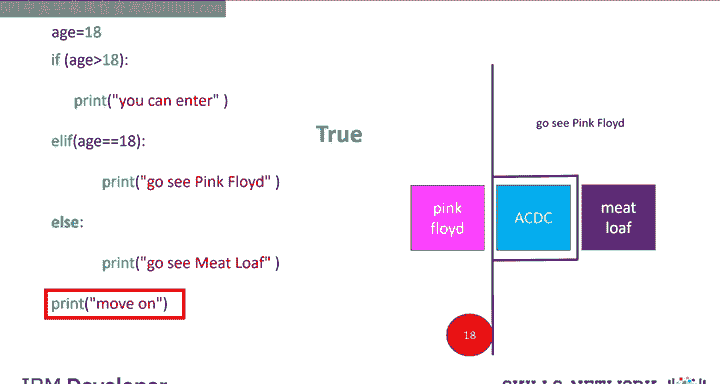

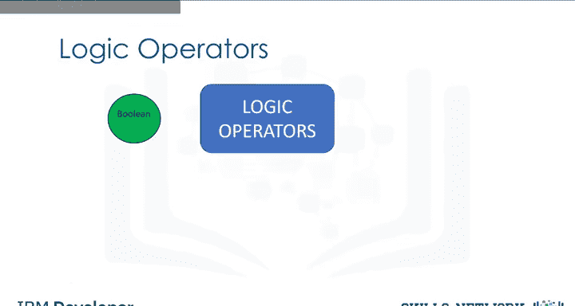

```python
if condition1:
    # 条件1为 True 时执行
elif condition2:
    # 条件1为 False 但条件2为 True 时执行
else:
    # 所有条件都为 False 时执行
```

例如：

```python
age = 18
if age > 18:
    print(“你可以进入 ACDC 音乐会。”)
elif age == 18:
    print(“去看 Pink Floyd 音乐会吧。”)
else:
    print(“去看 Meatloaf 音乐会吧。”)
print(“继续。”)
```

当 `age` 为 `18` 时，第一个条件 `age > 18` 为 `False`，程序检查 `elif` 条件 `age == 18`，该条件为 `True`，因此输出“去看 Pink Floyd 音乐会吧。”。

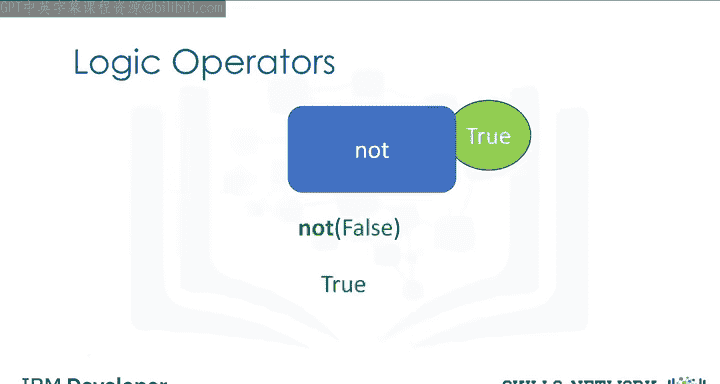

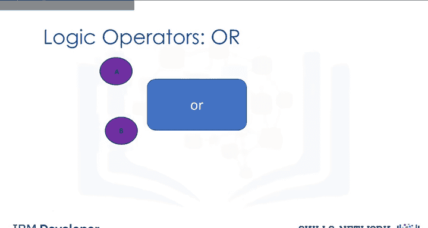

## 逻辑运算符

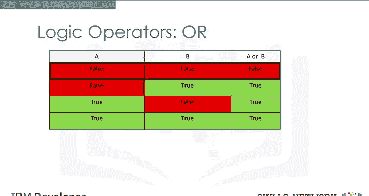

为了构建更复杂的条件，我们需要逻辑运算符。逻辑运算符对布尔值进行运算，并产生新的布尔值。主要有三种：`not`、`or` 和 `and`。

*   **`not` 运算符**：它取反一个布尔值。如果输入是 `True`，结果是 `False`；如果输入是 `False`，结果是 `True`。
*   **`or` 运算符**：它接受两个布尔值。只要其中至少一个为 `True`，结果就为 `True`；只有两者都为 `False` 时，结果才为 `False`。
*   **`and` 运算符**：它接受两个布尔值。只有两者都为 `True` 时，结果才为 `True`；只要其中至少一个为 `False`，结果就为 `False`。

以下是使用逻辑运算符的示例：

```python
# 使用 or 运算符
album_year = 1990
if (album_year < 1980) or (album_year > 1989):
    print(“这张专辑制作于70年代或90年代。”)

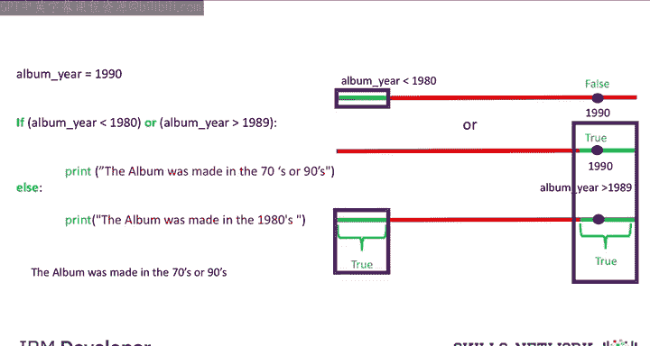

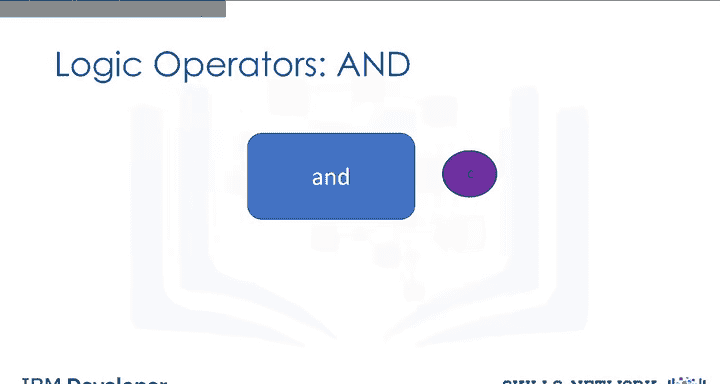

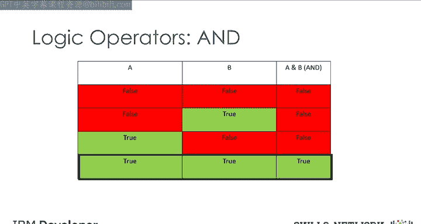

# 使用 and 运算符
album_year = 1983
if (album_year > 1979) and (album_year < 1990):
    print(“这张专辑制作于80年代。”)
```

在第一个例子中，`1990` 不满足第一个条件（`< 1980`），但满足第二个条件（`> 1989`），因此 `or` 运算结果为 `True`，执行打印语句。在第二个例子中，`1983` 同时满足两个条件，因此 `and` 运算结果为 `True`，执行打印语句。

## 总结

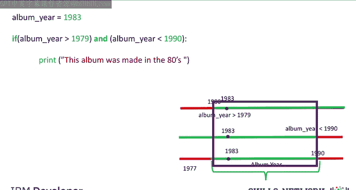

本节课中我们一起学习了程序流程控制的核心概念：条件与分支。我们从**比较操作**开始，学会了如何使用 `==`、`>`、`<` 等运算符产生布尔值。接着，我们深入探讨了**分支语句**：`if` 用于执行条件为真的代码块；`else` 用于处理条件为假的情况；`elif` 则允许我们链式检查多个条件。最后，我们学习了**逻辑运算符** `not`、`or` 和 `and`，它们能帮助我们将简单的条件组合成更复杂的逻辑判断。掌握这些知识是编写能够根据不同情况做出决策的智能程序的基础。