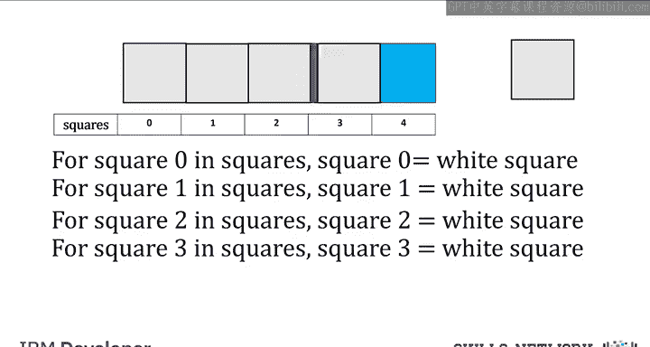
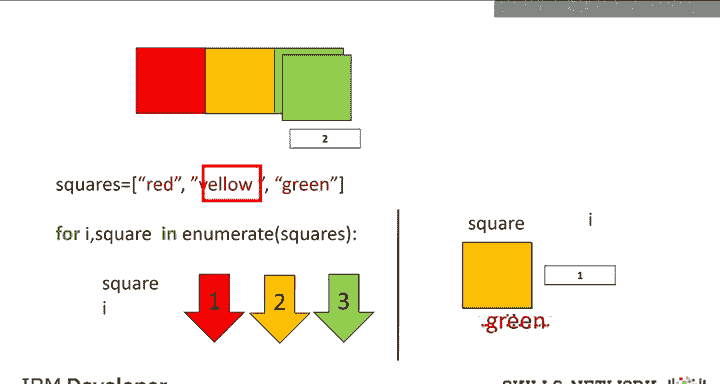
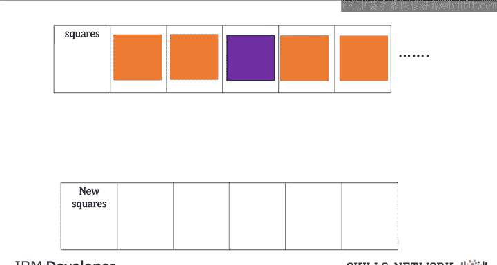
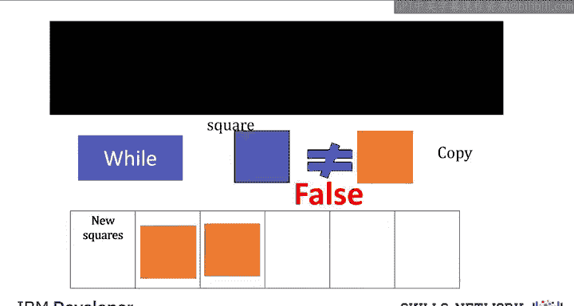
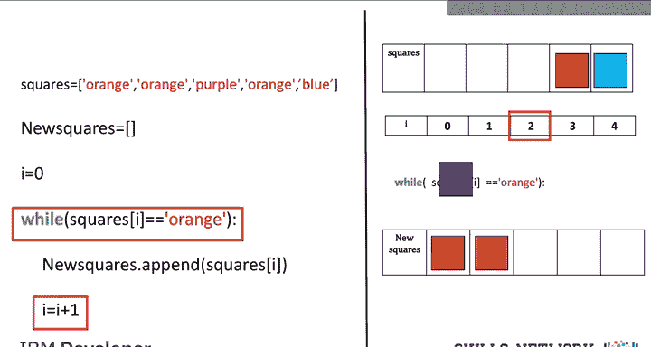

# 061：循环 🔄

在本节课中，我们将要学习循环，特别是 `for` 循环和 `while` 循环。我们将使用大量直观的例子来帮助你理解。关于使用数据的例子，请参考实验部分。

在开始讨论循环之前，我们先来回顾一下 `range` 函数。

## `range` 函数

`range` 函数会输出一个有序序列。如果输入是一个正整数，输出就是一个序列。这个序列包含的元素数量与输入值相同，但**从0开始**。

例如，如果输入是 `3`，输出就是序列 `0, 1, 2`。

如果 `range` 函数有两个输入，并且第一个输入小于第二个输入，那么输出序列将从第一个输入值开始，迭代到**不包含**第二个数字为止。

对于输入 `10` 和 `15`，我们得到以下序列：
```python
range(10, 15)  # 输出：10, 11, 12, 13, 14
```

关于 `range` 函数的更多功能，请参考实验部分。请注意，如果你使用 Python 3，`range` 函数不会像 Python 2 那样显式生成一个列表。



上一节我们介绍了 `range` 函数，本节中我们来看看 `for` 循环。

## `for` 循环

我们将主要关注列表，但许多操作同样适用于元组。循环用于重复执行一项任务。

考虑一组彩色方块。假设我们想把每个彩色方块替换成白色方块。为了简化，我们给每个方块编号，并将这组方块统称为 `squares`。

如果我们想告诉某人将 0 号方块替换为白色方块，我们会说：
```
将 squares[0] 替换为白色方块
```
或者用代码表示：
```python
squares[0] = 'white'
```
类似地，对于下一个方块，我们可以说：
```python
squares[1] = 'white'
```
我们为每个方块重复这个过程。唯一变化的是我们引用的方块索引。

如果要在 Python 中执行类似的任务，我们不能使用实际的方块，所以让我们用一个列表来代表这些盒子。列表中的每个元素都是一个代表颜色的字符串。我们想把每个元素中的颜色名称改为“white”。

以下是 Python 中执行循环的语法：
```python
for i in range(5):
    squares[i] = 'white'
```
注意缩进。`range` 函数会生成一个序列。这段代码会简单地重复缩进块内的所有内容五次。如果你将值改为 `6`，它就会执行六次。然而，每次循环中，变量 `i` 的值都会递增 1。

在这个片段中，我们将列表的第 `i` 个元素更改为字符串 `'white'`。`i` 的值首先被设置为 0。循环的每次迭代都从缩进块的开始处执行。然后我们运行缩进块内的所有内容。列表的第一个元素被设置为 `'white'`。然后我们回到缩进块的开始，逐行向下执行。当我们到达更改列表值的那一行时，我们将索引 1 的值设置为 `'white'`。`i` 的值增加 1。我们为索引 2 重复这个过程。这个过程持续到下一个索引，直到我们处理完最后一个元素。

我们也可以在 Python 中直接遍历列表或元组，甚至不需要使用索引。

以下是列表 `squares`。每次迭代，我们将列表 `squares` 的一个元素传递给变量 `square`。
```python
for square in squares:
    print(square)
```
在这个部分，让我们显示变量 `square` 的值。第一次迭代时，`square` 的值是 `'red'`。然后我们开始第二次迭代，`square` 的值是 `'yellow'`。接着开始第三次迭代，也是最后一次迭代，`square` 的值是 `'green'`。

一个用于迭代数据的有用函数是 `enumerate`。它可以用来获取列表中元素的索引和元素本身。

让我们使用带有数字（代表每个方块的索引）的盒子类比。这是遍历列表并提供每个元素索引的语法：
```python
for i, square in enumerate(squares):
    print(f"Index: {i}, Color: {square}")
```
我们使用列表 `squares`，并用颜色名称来代表彩色方块。函数 `enumerate` 的参数是列表，在这个例子中是 `squares`。变量 `i` 是索引，变量 `square` 是列表中对应的元素。

让我们用屏幕的左侧来显示循环不同迭代中变量 `square` 和 `i` 的值。第一次迭代时，变量 `square` 的值是 `'red'`，对应第 0 个索引，`i` 的值是 0。第二次迭代时，变量 `square` 的值是 `'yellow'`，`i` 的值对应其索引，即 1。我们为最后一个索引重复这个过程。

了解了 `for` 循环后，接下来我们看看 `while` 循环。



## `while` 循环

`while` 循环与 `for` 循环类似，但它不是执行固定次数的语句，而是**仅在满足某个条件时运行**。

假设我们想将列表 `squares` 中所有橙色的方块复制到列表 `new_squares` 中，但**一旦遇到非橙色方块就停止**。我们事先不知道方块的值。只要方块是橙色的，我们就继续这个过程，或者说检查方块是否等于 `'orange'`。如果不是，我们就停止。

对于第一个例子，我们会检查方块是否为橙色。它满足条件，所以我们复制这个方块。我们为第二个方块重复这个过程。条件满足，所以我们复制这个方块。在下一次迭代中，我们遇到了一个紫色方块。条件不满足，因此我们停止这个过程。这本质上就是 `while` 循环的作用。



让我们用左边的图来表示代码。我们将使用一个包含颜色名称的列表来代表不同的方块。

我们创建一个空列表 `new_squares`。实际上，这个列表的大小是不确定的。我们从索引 0 开始。`while` 语句将重复执行缩进块内的语句，直到括号内的条件为假。
```python
new_squares = []
i = 0

while squares[i] == 'orange':
    new_squares.append(squares[i])
    i += 1
```
我们将列表 `squares` 的第一个元素的值追加到列表 `new_squares` 中。我们将 `i` 的值增加 1。我们将列表 `squares` 的第二个元素的值追加到列表 `new_squares` 中。我们再次增加 `i` 的值。现在，数组 `squares` 中的值是 `'purple'`。因此，`while` 语句的条件为假，我们退出循环。



关于循环的更多例子，特别是使用真实数据的例子，请查看实验部分。

## 总结



本节课中我们一起学习了循环。我们首先回顾了用于生成序列的 `range` 函数。然后，我们深入探讨了 `for` 循环，它用于对序列（如列表）中的每个元素重复执行代码块，可以通过索引或直接遍历元素来实现。我们还介绍了 `enumerate` 函数，它可以方便地同时获取元素的索引和值。最后，我们学习了 `while` 循环，它会在指定条件为真时持续执行代码块。掌握这些循环结构是进行有效编程和数据处理的基础。