# 062：函数 🧩

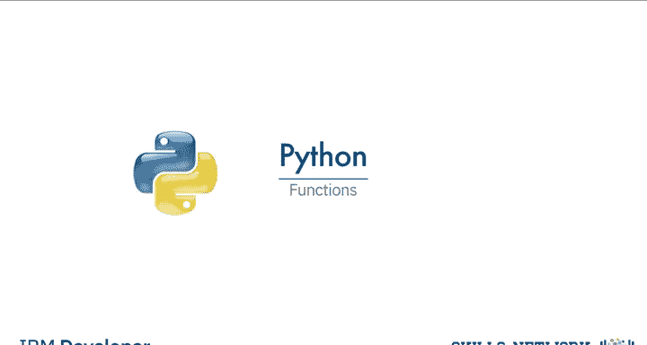

在本节课中，我们将要学习Python中的函数。你将了解如何使用Python的一些内置函数，以及如何构建自己的函数。函数是代码复用的核心，掌握它们能极大地提升你的编程效率。

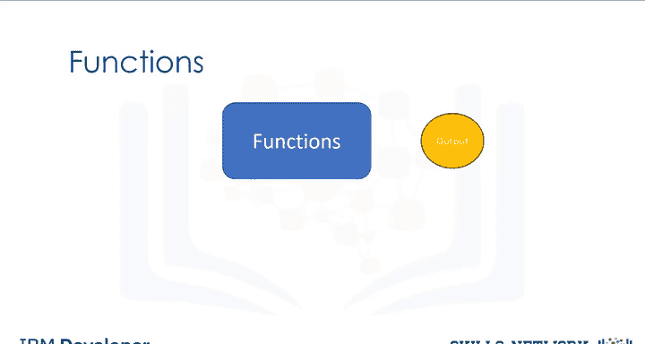

## 什么是函数？🤔

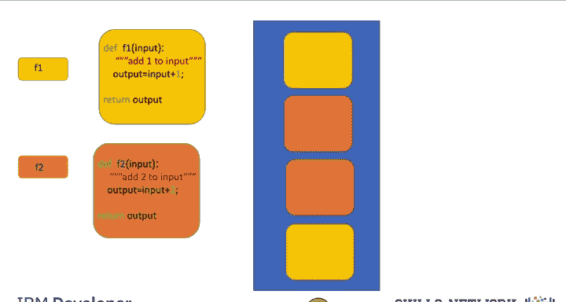

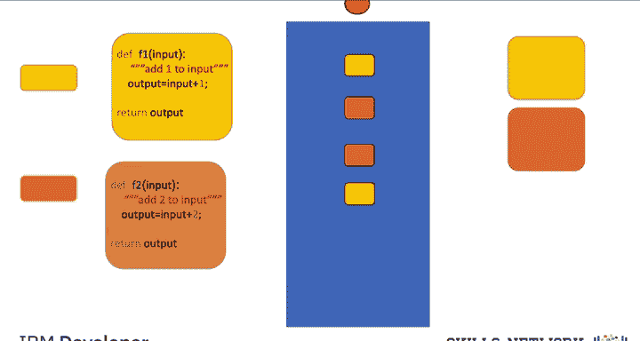

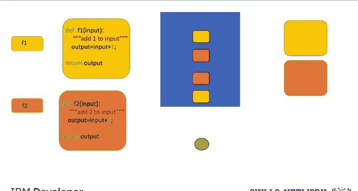

函数接收一些输入，然后产生一些输出或引发某些改变。它本质上是一段可以重复使用的代码。你可以自己实现函数，但在很多情况下，你会使用他人编写的函数。这时，你只需要知道函数的功能以及在某些情况下如何导入它们。

为了更直观地理解，我们可以将橙色和黄色的方块想象成相似的代码块。我们可以运行这些代码，输入一些数据，然后得到一个输出。如果我们定义一个函数来执行这个任务，我们只需要调用这个函数即可。让小的方块代表用于调用函数的代码行。

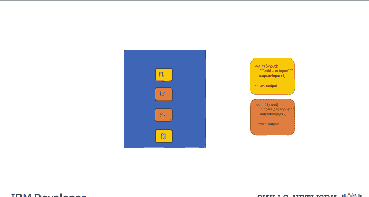

通过调用函数几次，我们可以替换掉这些冗长的代码行。现在，我们的代码变得更短，但执行的任务完全相同。

## 函数的工作原理 🔄

你可以将这个过程想象成这样：当我们调用函数 `F1` 时，我们向函数传递一个输入。这些值会被传递给你编写的所有那些代码行。函数会返回一个值，你可以使用这个值。例如，你可以将这个值作为输入传递给一个新的函数 `F2`。当我们调用这个新函数 `F2` 时，这个值会被传递给另一组代码行。函数返回一个值，这个过程不断重复，将值传递给你调用的函数。你可以保存这些函数以便重复使用，或者使用其他人的函数。

## Python的内置函数 📦

Python拥有许多内置函数。你不需要知道这些函数内部如何工作，只需要知道它们执行什么任务即可。

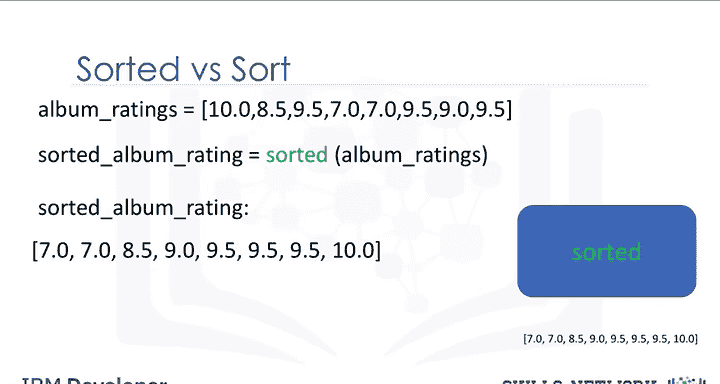

以下是几个常用内置函数的介绍：

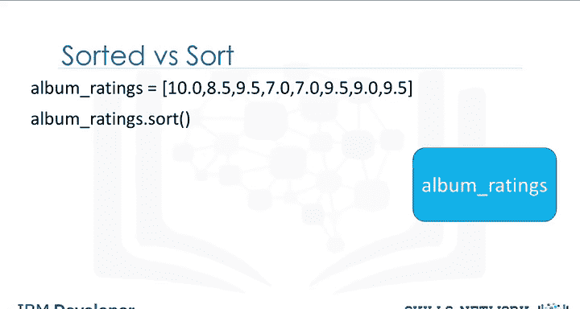

*   **`len()` 函数**：接收一个序列类型（如字符串、列表）或集合类型（如字典、集合）的输入，并返回该序列或集合的长度。
    *   **公式/代码**：`len(sequence_or_collection)`
    *   示例：对于列表 `[1, 2, 3, 4, 5, 6, 7, 8]`，`len()` 函数会确定列表中有8个元素，并返回8。

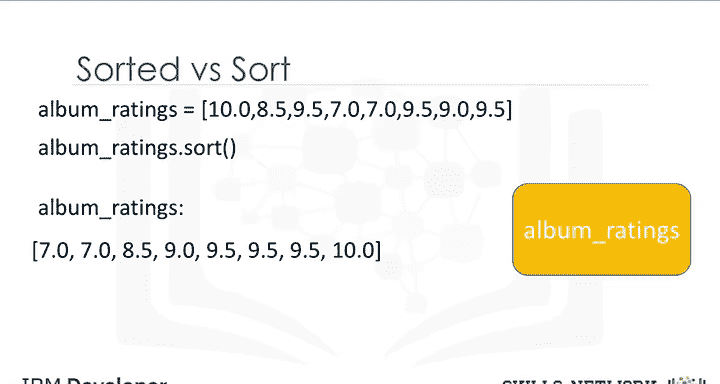

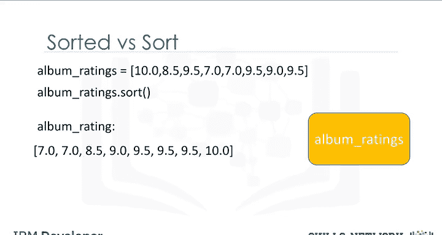

*   **`sum()` 函数**：接收一个可迭代对象（如元组、列表），并返回所有元素的总和。
    *   **公式/代码**：`sum(iterable)`
    *   示例：对于列表 `[10, 20, 30, 10]`，`sum()` 函数会计算所有元素的总和，并返回70。

*   **排序列表的两种方法**：有两种方法可以对列表进行排序。第一种是使用 `sorted()` 函数，第二种是使用列表的 `sort()` 方法。方法与函数类似。
    *   **`sorted()` 函数**：返回一个新的已排序列表或元组，不改变原列表。
        *   **代码**：`sorted_list = sorted(original_list)`
    *   **`sort()` 方法**：直接改变原列表，不创建新列表。
        *   **代码**：`original_list.sort()`

让我们用一个例子来说明两者的区别。假设我们有一个列表 `album_ratings = [10.0, 8.5, 9.5]`。

当我们对 `album_ratings` 应用 `sorted()` 函数时，会得到一个新的已排序列表 `sorted_album_rating`，而原列表 `album_ratings` 保持不变。

如果我们使用 `sort()` 方法，列表 `album_ratings` 本身会被改变，并且不会创建新的列表。

## 如何构建自己的函数 🛠️

上一节我们介绍了如何使用Python的内置函数，本节中我们来看看如何构建自己的函数。

以下是一个Python函数的例子，它返回输入值加一的结果。

```python
def add_one(a):
    b = a + 1
    return b
```

要定义一个函数，我们以关键字 `def` 开始。函数名应该能描述其功能。括号内是函数的形参 `a`，后面跟着一个冒号。接下来是一个带缩进的代码块。在这个例子中，我们将 `a` 加1并赋值给 `b`，然后返回或输出 `b` 的值。

定义函数后，我们就可以调用它了。调用 `add_one(5)`，函数会将1加到5上并返回6。我们也可以再次调用这个函数，例如 `c = add_one(10)`，那么变量 `c` 的值就是11。

让我们进一步探索。当你调用一个函数时，可以这样理解（注意：这是Python的简化模型，实际底层工作原理并非如此）：我们调用函数并给它输入值5。可以认为值5被传递给了函数。现在，函数内的命令序列开始运行。形参 `a` 的值是5，`b` 被赋值为6。然后我们返回 `b` 的值，也就是6。如果我们再次调用函数，整个过程会重新开始，我们传入一个8，执行后续操作，函数返回值9。这只是一个有帮助的类比。

让我们尝试让这个函数更复杂一些。通常，我们会在函数的前几行编写文档字符串来说明函数的功能。这个文档字符串被三个引号包围。你可以使用 `help()` 命令来显示这个文档。

一个函数可以有多个参数。例如，函数 `mult` 将两个数字相乘（即求它们的乘积）。

```python
def mult(a, b):
    return a * b
```

如果我们传入整数2和3，结果是新的整数6。如果我们传入整数10和浮点数3.14，结果是浮点数31.4。如果我们传入整数2和字符串“Michael Jackson”，字符串“Michael Jackson”会被重复两次。这是因为乘法符号也可以表示重复一个序列。如果你不小心用一个整数乘以一个字符串（而不是两个整数），你不会得到错误，而是会得到一个字符串，你的程序可能会继续运行，但之后可能因为在你期望整数的地方得到了字符串而失败。这个特性会让编码更简单，但你必须更彻底地测试你的代码。

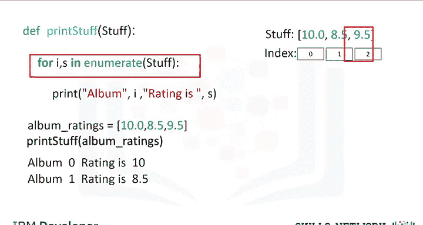

在许多情况下，一个函数可能没有 `return` 语句。在这些情况下，Python会返回一个特殊的 `None` 对象。实际上，如果你的函数没有 `return` 语句，你可以把它当作函数根本不返回任何东西。例如，函数 `MJ()` 只是打印名字“Michael Jackson”。我们调用这个函数，它就会打印出来。

让我们定义一个不执行任何任务的函数 `no_work()`。Python不允许函数体为空，所以我们可以使用关键字 `pass`，它什么都不做，但满足了函数体非空的要求。如果我们调用这个函数并打印它，函数会返回 `None`。在后台，如果没有调用 `return` 语句，Python会自动返回 `None`。

通常，函数会执行多个任务。例如，这个函数先打印一条语句，然后返回一个值。

我们也可以在函数中使用循环。例如，这个函数打印出列表或元组的值和索引。

## 可变参数与作用域 🌐

可变参数允许我们输入可变数量的元素。考虑以下函数，它的参数名前面有一个星号 `*`。当我们调用这个函数时，传入的参数会被打包成一个元组。

变量的作用域是程序中该变量可被访问的部分。在任何函数外部定义的变量被称为在全局作用域内，意味着它们在定义后可以在任何地方被访问。

在全局作用域内定义的变量称为全局变量。当我们调用一个函数时，我们就进入了一个新的作用域，即该函数的局部作用域。在函数内部定义的变量是局部变量，它们只存在于函数的作用域内。

全局作用域内的变量可以与局部作用域内的变量同名而不会冲突。如果在一个函数内部没有定义某个变量，Python会检查全局作用域。如果我们在函数内部使用 `global` 关键字定义一个变量，那么这个变量将成为全局变量。

## 总结 📝

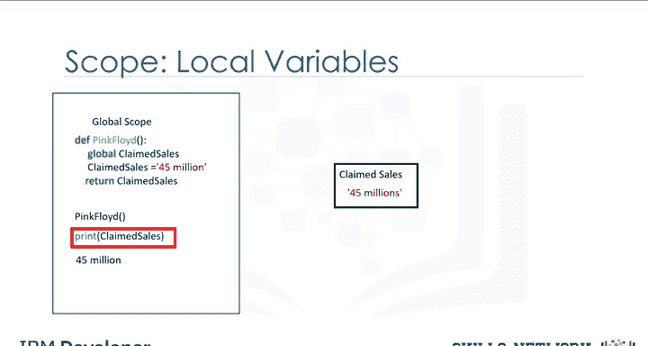

本节课中我们一起学习了Python函数的核心概念。我们了解了函数是什么，它们如何工作，以及如何使用Python的内置函数，如 `len()`、`sum()` 和 `sorted()`。更重要的是，我们学习了如何定义自己的函数，包括如何设置参数、编写函数体和使用 `return` 语句。我们还探讨了可变参数、变量的作用域（全局与局部）以及 `global` 关键字的使用。函数是构建模块化、可重用代码的基石，熟练掌握它们对你的编程之旅至关重要。关于函数还有更多可以探索的内容，建议通过实践练习来巩固这些知识。