# 063：异常处理 🛡️

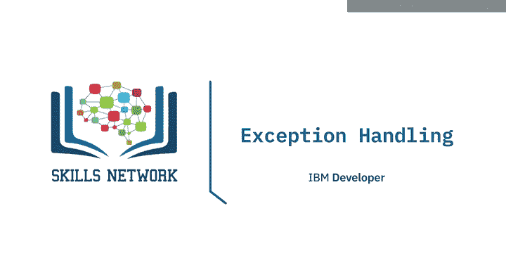

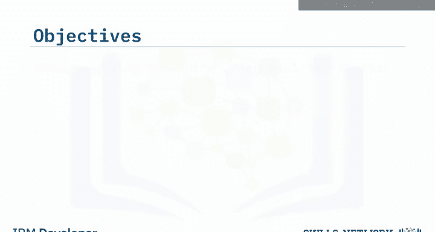

在本节课中，我们将要学习异常处理。异常处理是编程中管理运行时错误的关键技术，它能确保程序在遇到意外情况时不会崩溃，而是优雅地处理问题并继续执行。我们将解释异常处理的概念，演示其使用方法，并理解其基本原理。

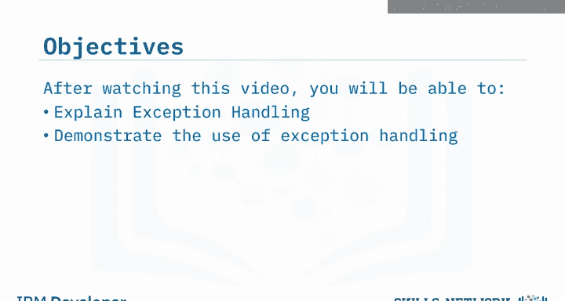

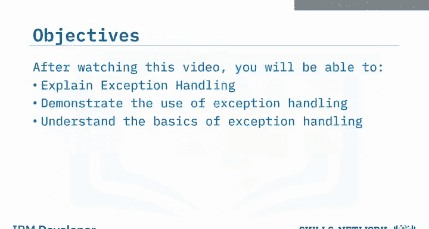

## 什么是异常处理？

你是否曾经在应该输入文本的输入框中误输入了数字？我们大多数人都曾犯过这种错误，或者是在测试程序时故意为之。但你是否知道，为什么程序会显示错误信息而不是完成并终止运行？

为了让错误信息出现，程序在后台触发了一个事件。这个事件被激活，是因为程序试图对输入的姓名进行计算，却发现输入的内容是数字而非字母。通过将这段代码包裹在异常处理器中，程序知道了如何处理这类错误，并能够输出错误信息，让程序得以继续执行。这只是请求用户输入时可能发生的众多错误之一。

## Try-Except 语句的工作原理

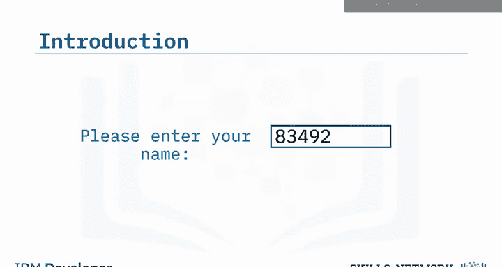

上一节我们介绍了异常处理的基本概念，本节中我们来看看 `try-except` 语句是如何工作的。

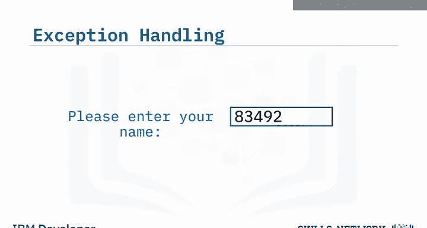

这种语句首先会尝试执行 `try` 代码块中的代码。但如果发生错误，程序会跳出 `try` 块，并开始搜索与错误匹配的异常。一旦找到处理该错误的正确异常，它就会执行相应的代码行。

例如，假设你正在编写一个打开并写入文件的程序。程序启动后，由于数据无法读取而发生了错误。因为这个错误，程序跳过了 `try` 语句下的代码行，直接执行了 `except` 语句。由于这个错误属于 IO 错误（输入/输出错误）的范畴，它就在控制台打印了“无法打开或读取文件中的数据”。

## 定义具体的异常类型

在编写简单程序时，有时我们只用一个 `except` 语句就能应付。但如果发生了未被 `IOError` 捕获的其他错误呢？如果发生这种情况，我们就需要为此添加另一个 `except` 语句。

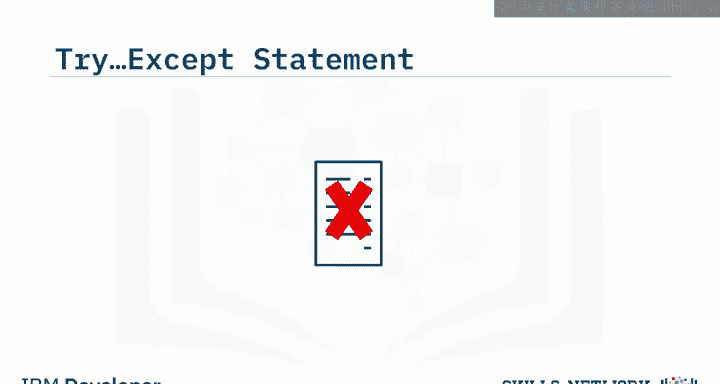

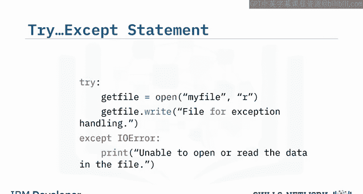

对于这个 `except` 语句，你会注意到它没有指定要捕获的错误类型。虽然这看起来是一个合理的步骤，可以让程序捕获所有错误而不终止，但这并非最佳实践。

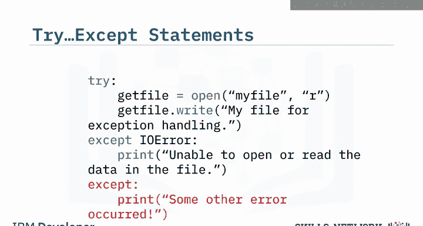

例如，假设我们的小程序只是一个超过一千行代码的大型程序中的一小部分。我们的任务是调试这个程序，因为它不断抛出错误，给用户造成困扰。在调查程序时，你发现这个错误反复出现。由于这个错误没有详细信息，你最终花费了数小时来定位和修复它。

## 添加 Else 和 Finally 语句

到目前为止，在我们的程序中，我们已经定义了如果发生错误应该打印出错误信息，但我们没有收到任何程序成功执行的通知。这时，我们可以添加一个 `else` 语句来提供这个通知。

通过添加这个 `else` 语句，它将在控制台为我们提供一个通知，表明文件写入成功。

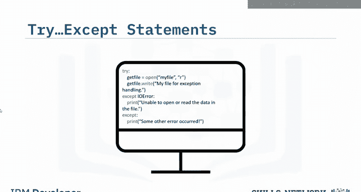

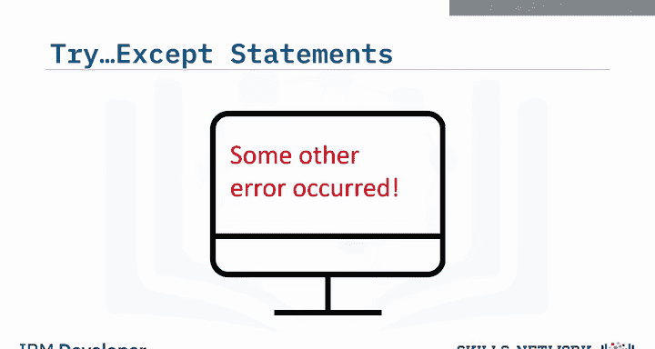

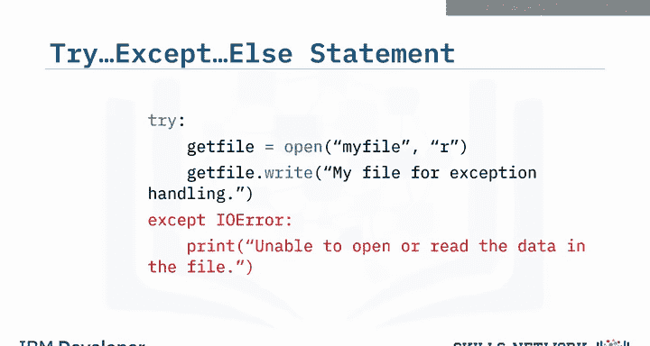

现在我们已经定义了程序正常执行或发生错误时会发生什么，对于这个例子，还需要添加最后一个语句。

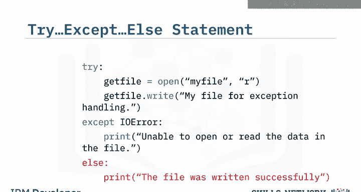

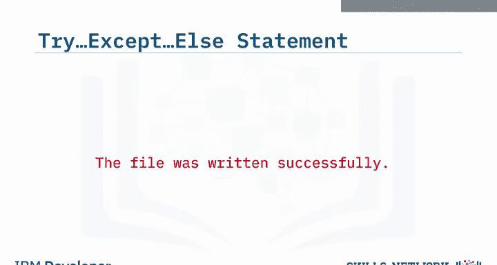

我们正在打开一个文件，最后需要做的事情是关闭文件。通过添加一个 `finally` 语句，它将告诉程序无论最终结果如何都要关闭文件，并在控制台打印“文件现已关闭”。

## 总结

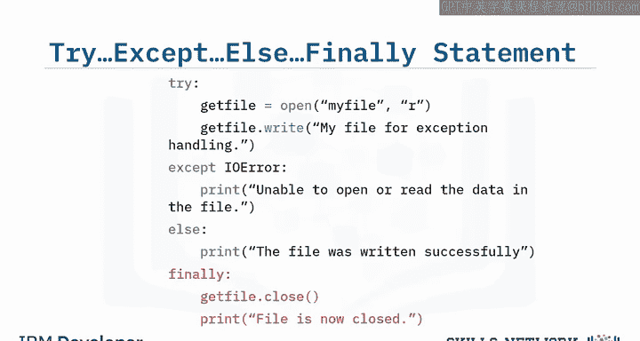

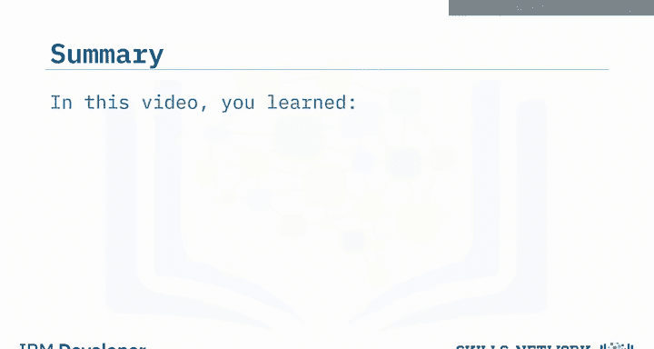

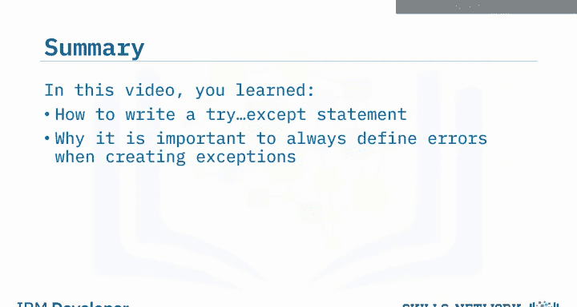

本节课中，我们一起学习了如何编写 `try-except` 语句，了解了在创建异常时始终定义具体错误类型的重要性，并掌握了如何添加 `else` 和 `finally` 语句来完善异常处理逻辑。异常处理是构建健壮、可靠程序的基础技能。