# 064：对象和类 🧱

在本节课中，我们将要学习Python中的对象和类。我们将了解什么是对象，如何创建自定义的类，以及如何通过方法来操作对象。这些概念是面向对象编程的基础，对于构建复杂的程序至关重要。

## 什么是对象？🤔

Python中有许多不同的数据类型，例如整数、浮点数、字符串、列表、字典和布尔值。在Python中，**每一种数据类型都是一个对象**。

每个对象都包含以下内容：
*   **类型**：对象的类别。
*   **内部表示**：对象在内存中的存储方式。
*   **方法**：一组用于与对象数据交互的函数。

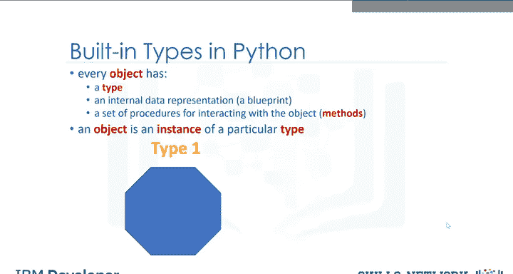

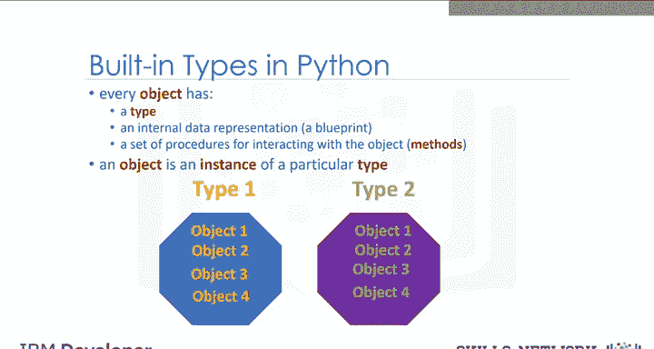

一个对象是某个特定类型的**实例**。例如，我们可以有类型1和类型2。类型1可以有多个黄色的对象，每个对象都是类型1的一个实例。同样，类型2可以有多个绿色的对象，每个对象都是类型2的实例。

让我们看几个不那么抽象的例子。


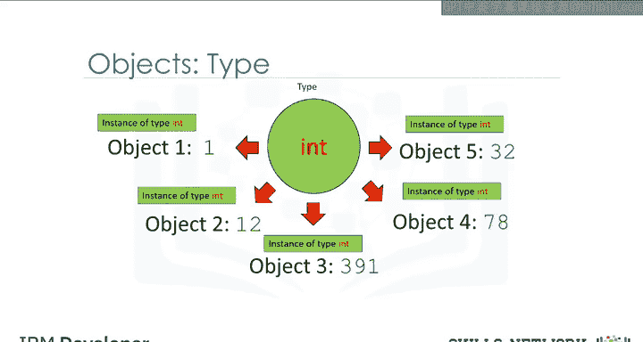

每次我们创建一个整数，我们都是在创建**整数类型的一个实例**，或者说是在创建一个**整数对象**。例如，`1`， `2`， `3`， `4`， `5` 就是五个整数类型的实例，即五个整数对象。


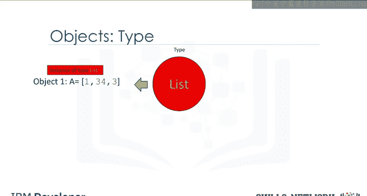

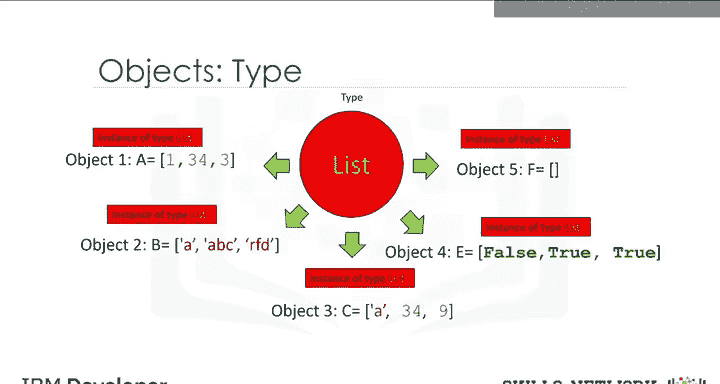

同样，每次我们创建一个列表，我们都是在创建**列表类型的一个实例**，或者说是在创建一个**列表对象**。例如，`[1, 2]`， `[3, 4, 5]`， `[6]`， `[7, 8, 9, 10]`， `[11, 12]` 就是五个列表类型的实例，即五个列表对象。


## 对象的类型与方法 🔧

我们可以使用 `type` 命令来查看对象的类型。

```python
type([1, 2, 3])   # 输出：<class 'list'>
type(5)           # 输出：<class 'int'>
type('hello')     # 输出：<class 'str'>
type({'a': 1})    # 输出：<class 'dict'>
```

一个**类**或类型的**方法**，是该类或类型的所有实例都提供的函数。方法是你与对象交互的方式。我们一直在使用方法，例如在列表上使用 `sort` 方法。

考虑列表 `ratings`，其数据是包含在列表中的一系列数字。`sort` 方法会改变对象内部的数据。我们通过在对象名称后加上一个点 `.`，然后是方法名和括号 `()` 来调用方法。

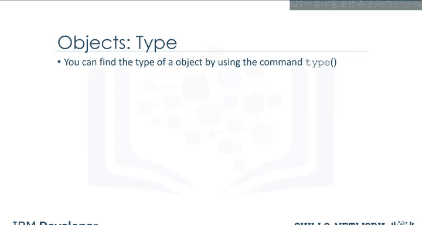

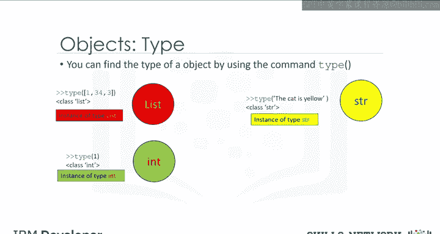

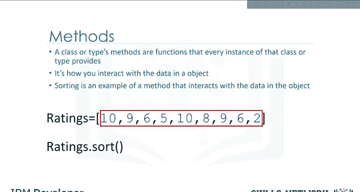

```python
ratings = [2, 5, 3, 1, 4]
ratings.sort()  # 调用 sort 方法
print(ratings)  # 输出：[1, 2, 3, 4, 5]
```

我们有一个用橙色表示的 `ratings` 列表，其数据是一系列数字。当我们调用 `sort` 方法时，这会改变对象内部包含的数据，你可以说它改变了对象的**状态**。我们还可以在列表上调用 `reverse` 方法，再次改变列表，反转对象内部序列的顺序。

在许多情况下，你不需要了解类及其方法的内部工作原理，只需要知道如何使用它们。

## 创建自定义类 🏗️

接下来，我们将介绍如何构建你自己的类。你可以在Python中创建自己的类型或类。

在本节中，你将创建一个类。这个类拥有**数据属性**和**方法**。然后，我们创建该类的**实例**或**对象**。


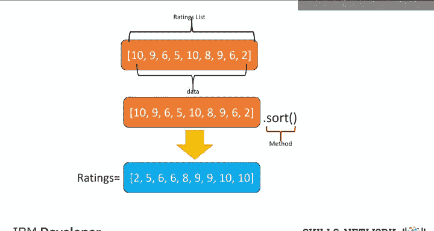

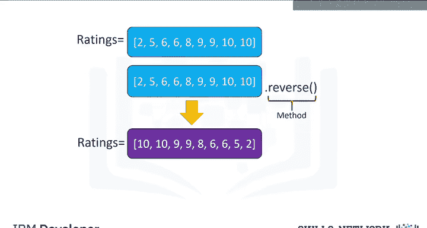

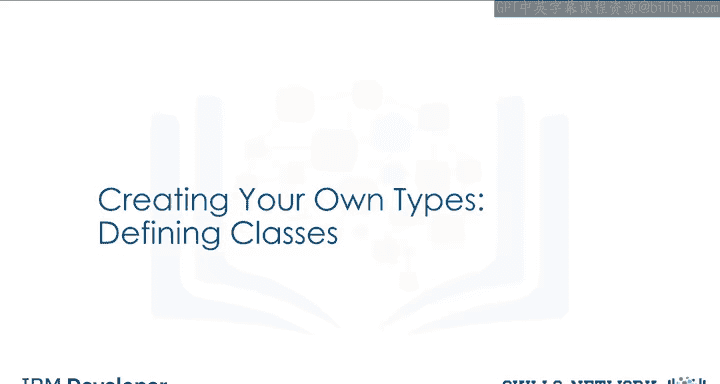

### 定义类的数据属性

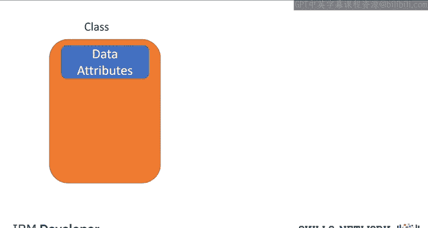

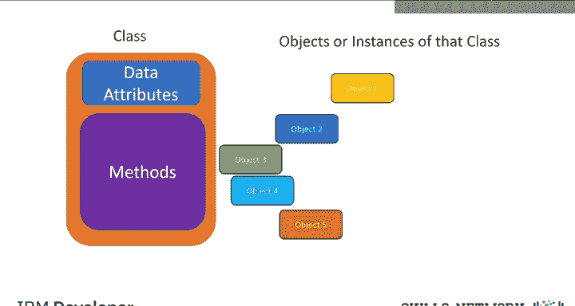

类的数据属性定义了该类。让我们创建两个类：第一个类是**圆形**，第二个类是**矩形**。

思考一下什么构成了一个圆形。观察下图，我们只需要一个**半径**来定义一个圆。我们还可以添加**颜色**，以便于后续区分该类的不同实例。因此，我们的类数据属性是 `radius` 和 `color`。


类似地，为了定义一个矩形，我们需要**高度**和**宽度**。我们同样会添加**颜色**以便区分实例。因此，数据属性是 `color`， `height` 和 `width`。


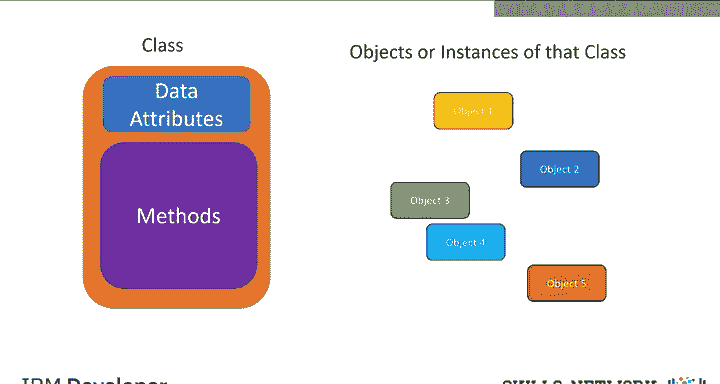

### 编写类定义

要创建 `Circle` 类，你需要包含类定义。这告诉Python你正在创建自己的类。

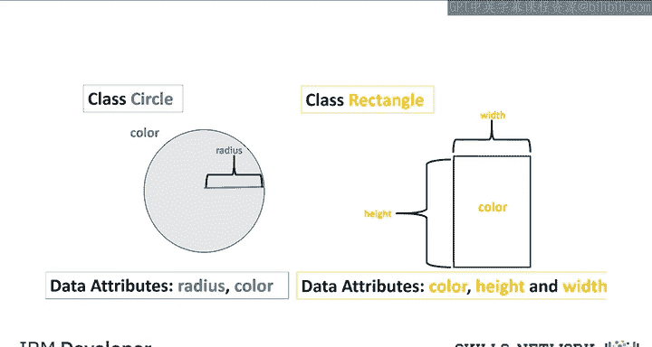

```python
class Circle(object):
    # 类的内容
```

`class` 关键字表示类定义，`Circle` 是类的名称。括号中的 `object` 表示这是该类的父类（对于本课程，你始终使用 `object`）。

对于 `Rectangle` 类，我们改变类名，但其余部分保持不变。

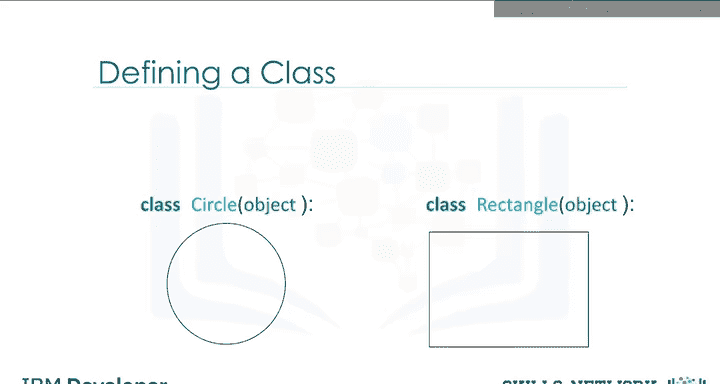

```python
class Rectangle(object):
    # 类的内容
```

类是一个蓝图，我们必须设置属性来创建对象。


我们可以创建一个 `Circle` 类型的对象实例，其颜色数据属性为红色，半径数据属性为4。我们也可以创建第二个 `Circle` 类型的对象实例，其颜色为绿色，半径为2。

同样，我们可以创建一个 `Rectangle` 类型的对象实例，其颜色为蓝色，高度和宽度数据属性均为2。第二个 `Rectangle` 类型的对象实例，其颜色为黄色，高度为1，宽度为3。

现在，我们有了 `Circle` 类的不同对象，以及 `Rectangle` 类的不同对象。


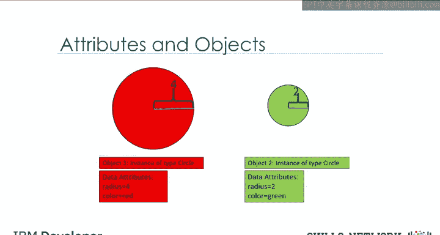

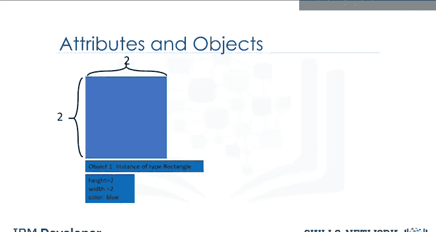

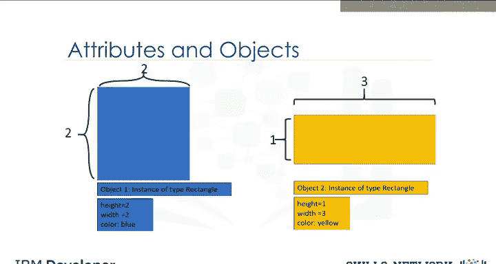

## 构建Circle类：构造函数与数据属性 ⚙️

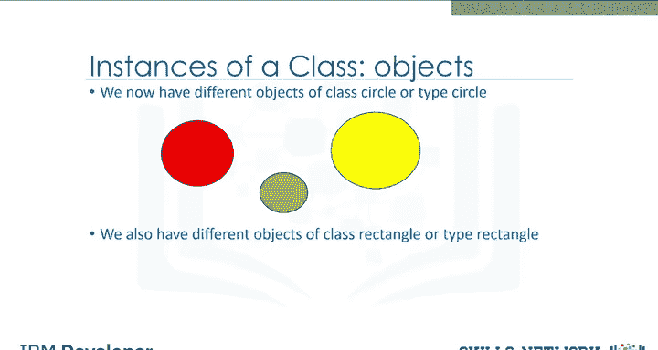

让我们继续在Python中构建 `Circle` 类。我们定义类，然后使用类构造函数为每个类实例初始化数据属性 `radius` 和 `color`。

`__init__` 函数是一个**构造函数**。它是一个特殊的函数，告诉Python你正在创建一个新类。Python中还有其他特殊函数用于创建更复杂的类。

```python
class Circle(object):
    def __init__(self, radius, color):
        self.radius = radius
        self.color = color
```

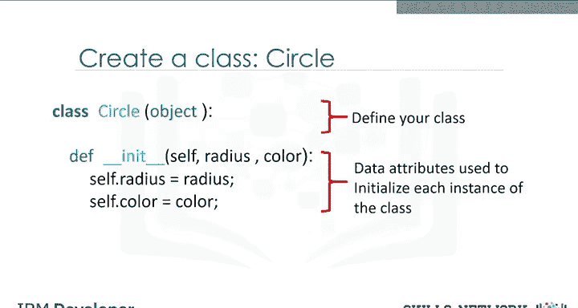

*   `self` 参数指的是新创建的类实例。
*   `radius` 和 `color` 参数用于初始化类实例的 `radius` 和 `color` 数据属性。在构造函数体内，我们可以将这些参数的值赋给 `self.radius` 和 `self.color`。

类似地，我们可以定义 `Rectangle` 类。

```python
class Rectangle(object):
    def __init__(self, color, height, width):
        self.color = color
        self.height = height
        self.width = width
```

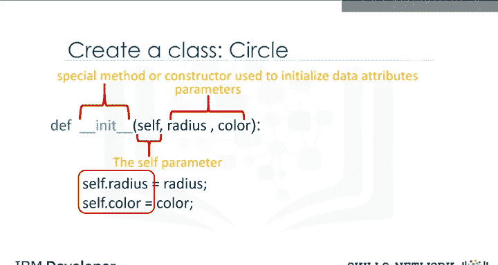

这次，类的数据属性是 `color`， `height` 和 `width`。


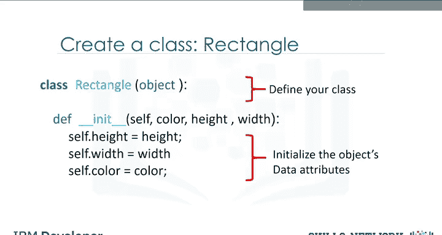

### 创建对象

创建类之后，为了创建一个 `Circle` 类的对象，我们引入一个变量，这将是对象的名称。我们通过使用**对象构造函数**来创建对象。

```python
red_circle = Circle(10, "red")
```

对象构造函数由类名以及参数（即数据属性）组成。当我们创建一个 `Circle` 对象时，我们像调用函数一样调用代码。传递给 `Circle` 构造函数的参数用于初始化新创建的 `Circle` 实例的数据属性。


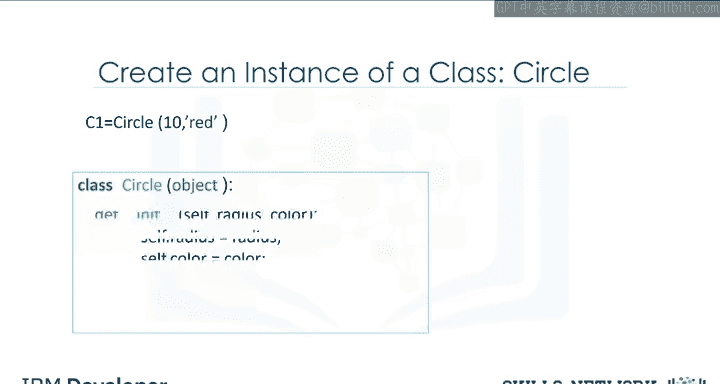

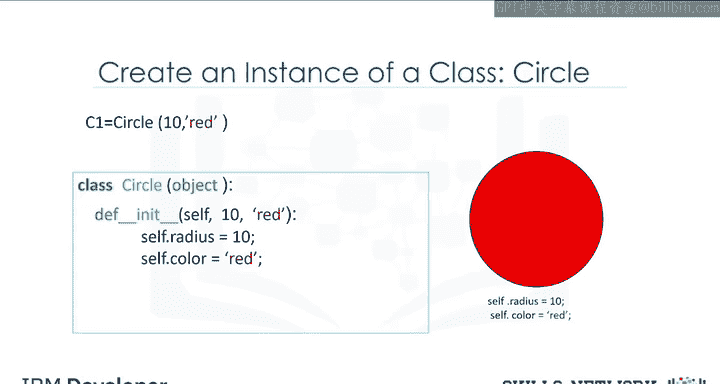

将 `self` 想象成一个包含对象所有数据属性的盒子是很有帮助的。


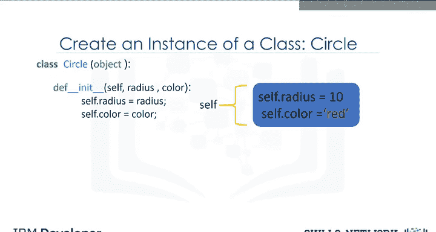

### 访问和修改数据属性

输入对象名称，后跟一个点 `.` 和数据属性名称，可以获取数据属性的值。

```python
print(red_circle.radius)  # 输出：10
print(red_circle.color)   # 输出：red
```

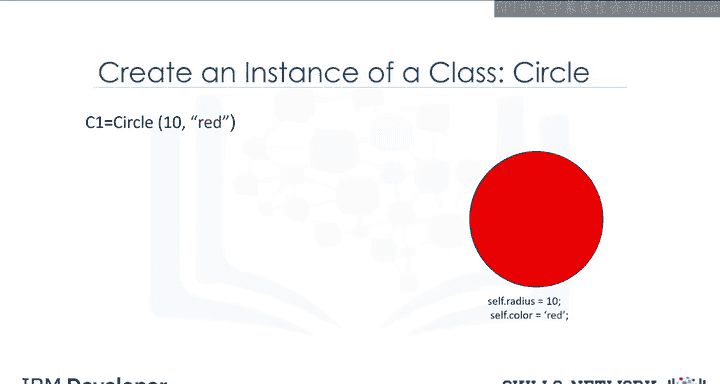

我们可以看到 `self` 参数和对象之间的关系。在Python中，我们也可以直接设置或更改数据属性：输入对象名称，后跟一个点 `.` 和数据属性名称，并将其设置为相应的值。

```python
red_circle.color = "yellow"
print(red_circle.color)   # 输出：yellow
```

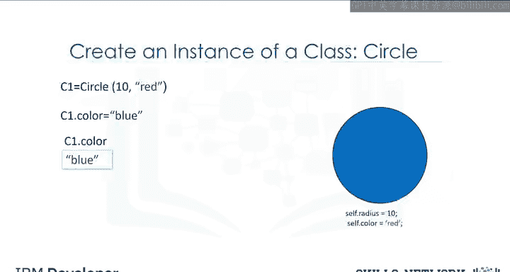

我们验证了颜色数据属性已经改变。通常，为了改变对象中的数据，我们在类中定义方法。

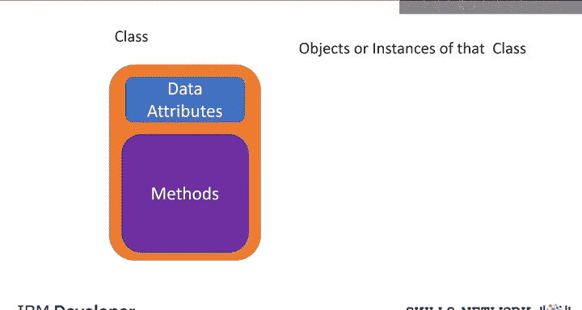

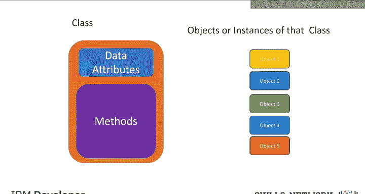

## 类的方法 🛠️

我们已经看到数据属性如何构成定义对象的数据。**方法**是与数据属性交互并改变数据属性的函数，用于更改或使用对象的数据属性。


假设我们想改变一个圆的大小，这涉及到改变 `radius` 属性。我们向 `Circle` 类添加一个名为 `add_radius` 的方法。该方法是一个需要 `self` 以及其他参数的函数。

```python
class Circle(object):
    def __init__(self, radius, color):
        self.radius = radius
        self.color = color

    def add_radius(self, r):
        self.radius = self.radius + r
```

在这个例子中，我们将一个值 `r` 加到数据属性 `radius` 上。

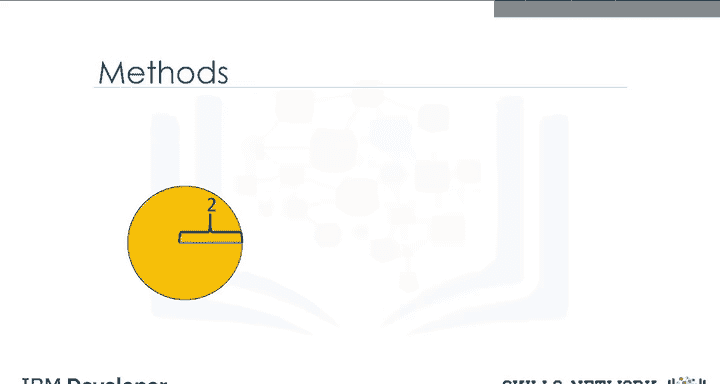

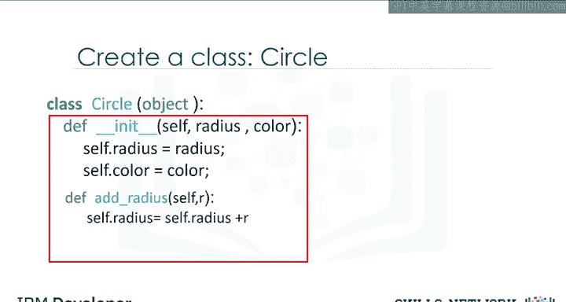

让我们看看当我们创建一个对象并调用 `add_radius` 方法时，这部分代码是如何工作的。

和之前一样，我们使用对象构造函数创建一个对象。我们向构造函数传递两个参数：半径设置为2，颜色设置为红色。

```python
my_circle = Circle(2, "red")
```

在构造函数体内，数据属性被设置。我们可以使用盒子类比来查看对象的当前状态。

我们通过添加一个点 `.`，后跟方法名和括号 `()` 来调用方法。在这种情况下，函数的参数是我们想要添加的量。

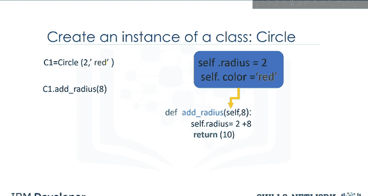

```python
my_circle.add_radius(8)
```

调用方法时，我们不需要担心 `self` 参数，就像构造函数一样，Python会为我们处理。在许多情况下，除了 `self` 之外，方法的定义中可能没有指定任何参数，因此我们在调用函数时不传递任何参数。

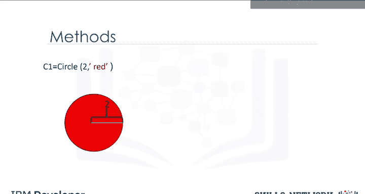

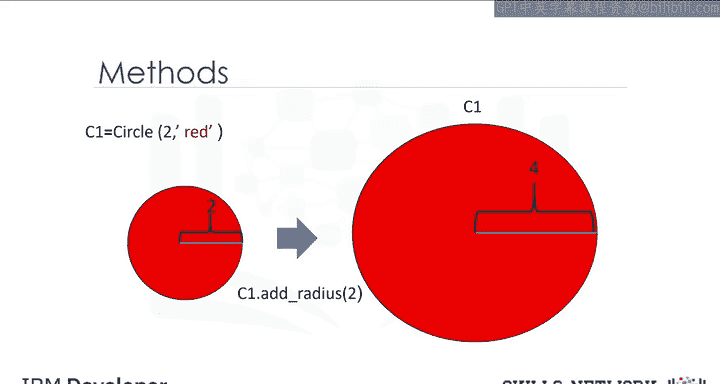

在内部，该方法以值 `8` 和正确的 `self` 对象被调用。该方法为 `self.radius` 分配一个新值。


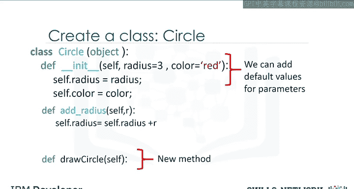

这改变了对象，特别是 `radius` 数据属性。当我们调用 `add_radius` 方法时，它通过改变 `radius` 数据属性的值来改变对象。


## 实践与总结 📝

我们可以在类构造函数的参数中添加默认值。在实验部分，我们还会创建一个名为 `draw_circle` 的方法。

在实验中，我们可以使用构造函数创建一个新的 `Circle` 类型对象，颜色为红色，半径为3。我们可以访问数据属性 `radius` 和 `color`。最后，我们可以使用 `draw_circle` 方法来绘制圆形。

类似地，我们可以创建一个新的 `Circle` 类型对象，访问其数据属性，并使用 `draw_circle` 方法绘制它。

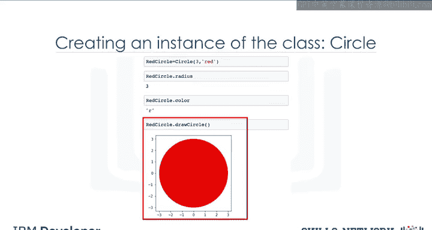

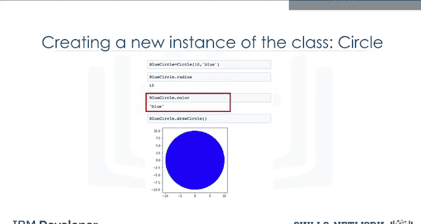

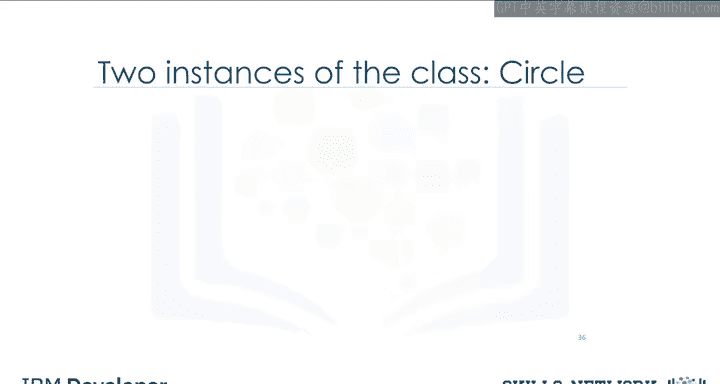

总结一下，我们创建了一个名为 `red_circle` 的 `Circle` 类对象，其半径属性为3，颜色属性为红色。


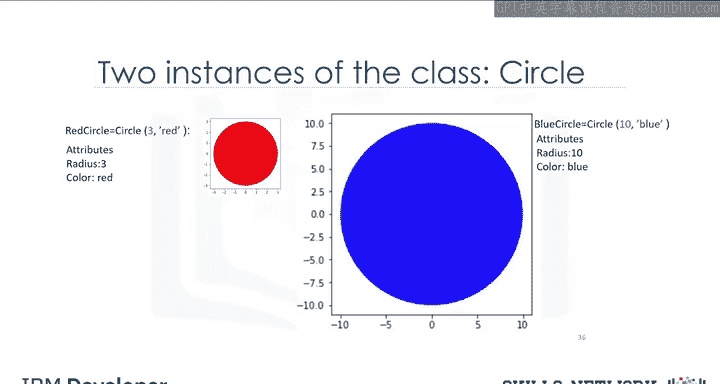

我们还创建了一个名为 `blue_circle` 的 `Circle` 类对象，其半径属性为10，颜色属性为蓝色。


在实验中，我们有一个类似的 `Rectangle` 类。我们可以使用构造函数创建一个新的 `Rectangle` 类型对象，访问其高度、宽度和颜色的数据属性，并使用 `draw_rectangle` 方法绘制矩形。

所以，我们有一个**类**，而**对象**是该类的实现或实例化。例如，我们可以创建两个 `Circle` 类的对象或两个 `Rectangle` 类的对象。

`dir()` 函数对于获取与类相关的数据属性和方法列表非常有用。将你感兴趣的对象作为参数传递，返回值是该对象数据属性的列表。


被下划线包围的属性是供内部使用的，你不需要担心它们。那些看起来常规的属性才是你应该关注的，这些是对象的方法和数据属性。

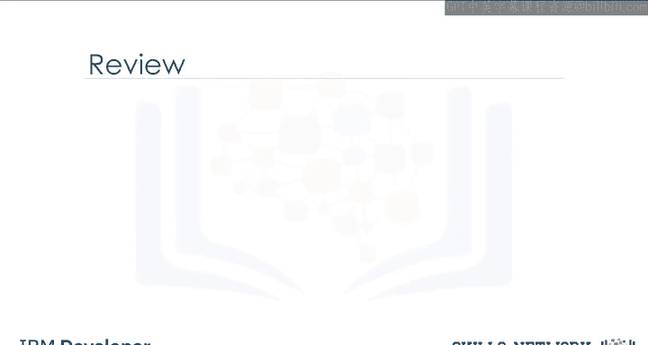

关于Python中的对象，你还可以做更多事情。请查看 Python.org 获取更多信息。


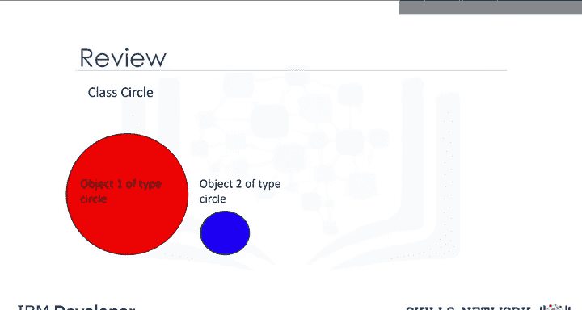

## 本节课总结 📚

在本节课中，我们一起学习了Python中对象和类的核心概念。我们了解到：
1.  Python中的所有数据类型都是对象，每个对象都有类型、内部表示和方法。
2.  对象是某个类（类型）的实例。
3.  我们可以使用 `class` 关键字定义自己的类，并通过 `__init__` 构造函数初始化对象的数据属性。
4.  方法是定义在类中的函数，用于操作对象的数据属性。
5.  我们可以创建类的多个实例（对象），每个实例都有自己的数据。
6.  使用 `dir()` 函数可以查看对象的所有属性和方法。

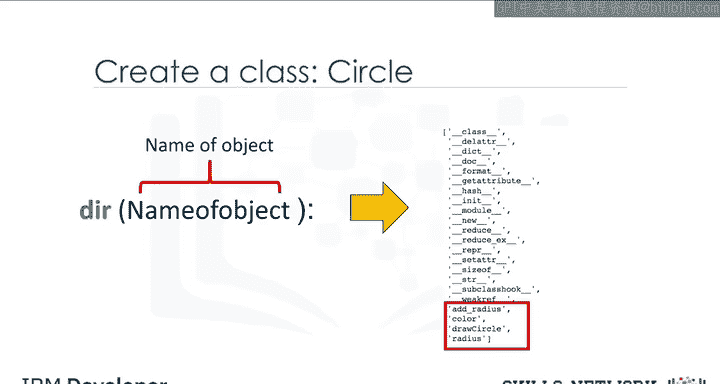

掌握这些面向对象编程的基础知识，将帮助你更好地组织代码，构建更复杂、更模块化的应用程序。