# 065：使用open函数读取文件 📂

在本节课程中，我们将学习如何使用Python内置的`open`函数来创建文件对象，并从TXT文件中获取数据。我们将了解如何打开文件、读取内容以及正确关闭文件。

## 使用open函数打开文件

我们将使用Python的`open`函数来获取一个文件对象。然后，我们可以对该对象应用方法来读取文件中的数据。

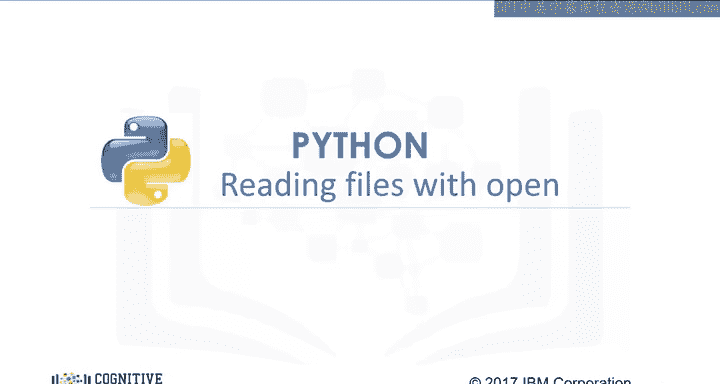

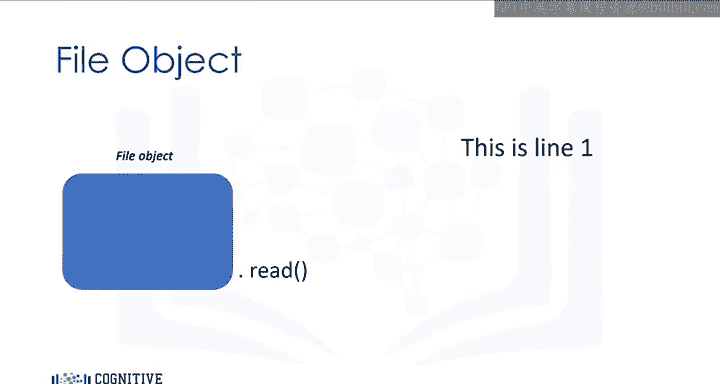

以下是打开名为`example1.txt`文件的方法。我们使用`open`函数，第一个参数是文件路径，由文件名和文件目录组成。第二个参数是模式，常用的值包括`'r'`表示读取，`'w'`表示写入，`'a'`表示追加。在本例中，我们将使用`'r'`进行读取。最终，我们获得一个文件对象。

```python
file1 = open('example1.txt', 'r')
```

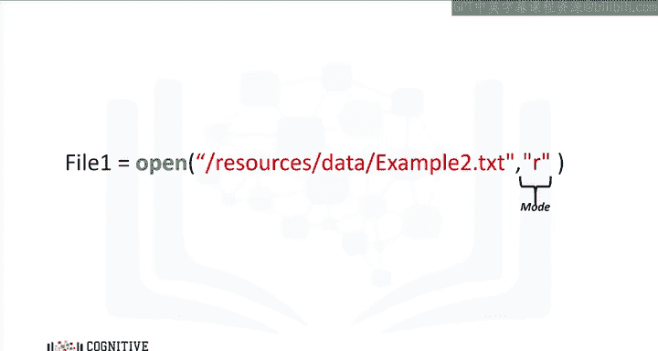

## 获取文件信息与关闭文件

现在，我们可以使用文件对象来获取文件的信息。我们可以使用数据属性`.name`来获取文件名，结果是一个包含文件名的字符串。我们还可以使用数据属性`.mode`来查看对象的模式，这里会显示`'r'`，代表读取。

你应该始终使用方法`.close()`来关闭文件对象。但有时这可能会显得繁琐，因此让我们使用`with`语句。使用`with`语句打开文件是更好的做法，因为它会自动关闭文件。

```python
with open('example1.txt', 'r') as file1:
    # 在此缩进块中执行操作
```

## 读取文件内容

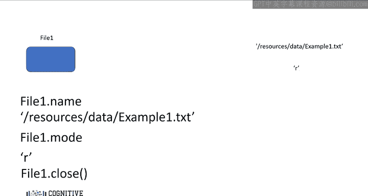

上一节我们介绍了如何打开文件，本节中我们来看看如何读取其内容。代码将运行缩进块中的所有内容，然后关闭文件。这段代码读取文件`example1.txt`。我们可以使用文件对象`file1`。代码将执行缩进块中的所有操作，然后在缩进结束时关闭文件。

方法`.read()`将文件的值作为一个字符串存储在变量`file_stuff`中。你可以打印文件内容。你可以检查文件是否已关闭，但你不能在缩进块外读取它，不过你仍然可以在缩进块外打印文件内容。

我们可以打印文件内容，将会看到以下输出。

```python
with open('example1.txt', 'r') as file1:
    file_stuff = file1.read()
    print(file_stuff)
```

当我们检查原始字符串时，会看到`\n`。这是Python用来表示换行的方式。

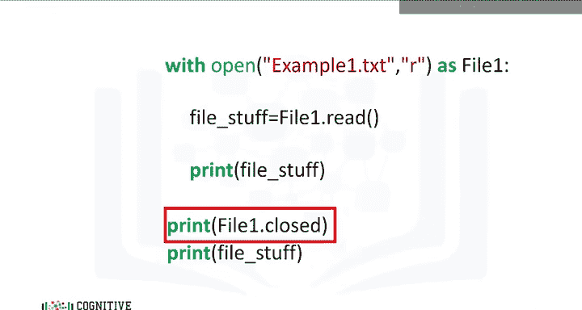

## 逐行读取文件内容

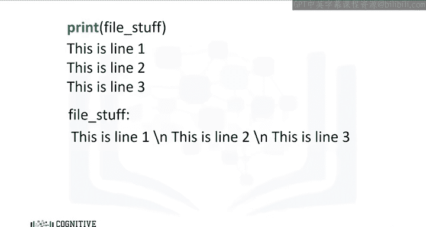

我们可以使用方法`.readlines()`将每一行输出为列表中的一个元素。第一行对应列表中的第一个元素，第二行对应第二个元素，依此类推。

```python
with open('example1.txt', 'r') as file1:
    file_stuff = file1.readlines()
    print(file_stuff)
```

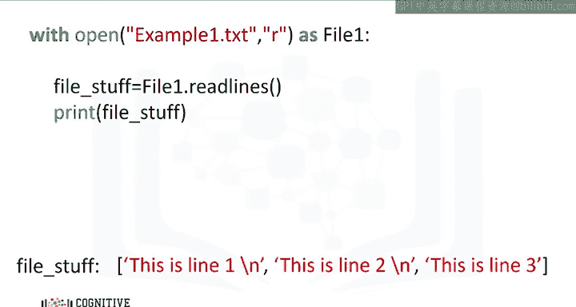

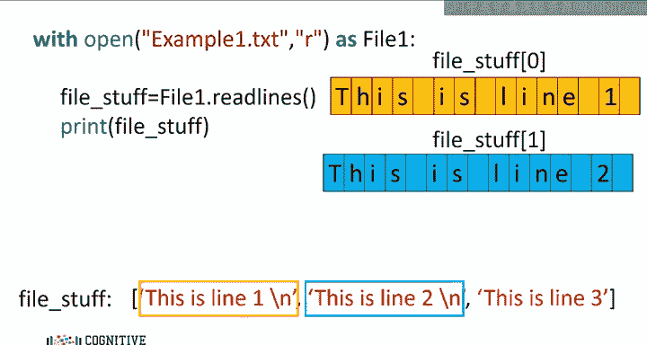

我们可以使用方法`.readline()`来读取文件的第一行。如果我们运行这个命令，它会将第一行存储在变量`file_stuff`中，然后打印第一行。

```python
with open('example1.txt', 'r') as file1:
    file_stuff = file1.readline()
    print(file_stuff)
```

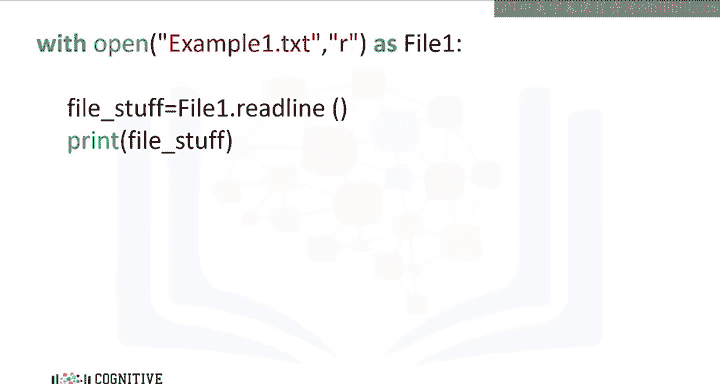

我们可以使用`.readline()`方法两次。第一次调用时，它会将第一行保存在变量`file_stuff`中，然后打印第一行。第二次调用时，它会将第二行保存在变量`file_stuff`中，然后打印第二行。

```python
with open('example1.txt', 'r') as file1:
    file_stuff = file1.readline()
    print(file_stuff)
    file_stuff = file1.readline()
    print(file_stuff)
```

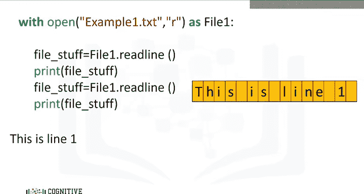

我们可以使用循环来逐行打印每一行，如下所示。

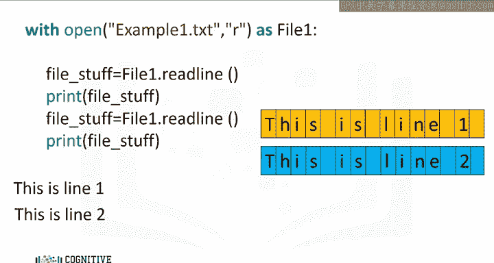

```python
with open('example1.txt', 'r') as file1:
    for line in file1:
        print(line)
```

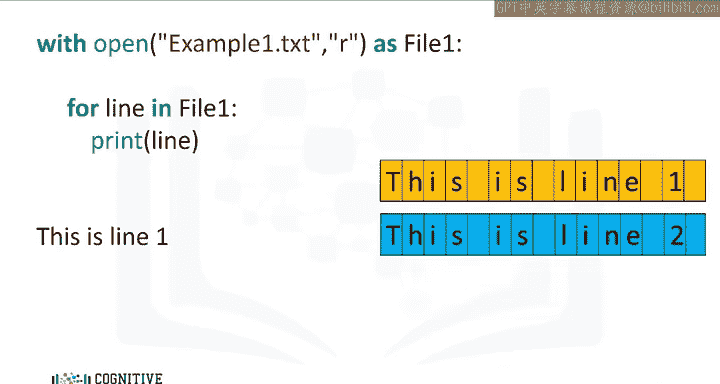

## 按字符数读取

让我们将字符串中的每个字符表示为一个网格。我们可以指定想要从字符串中读取的字符数，作为方法`.read()`的参数。

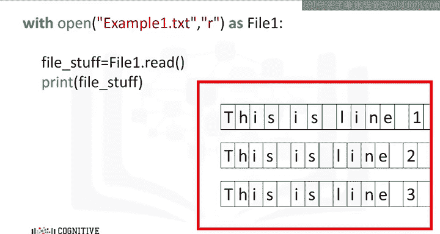

```python
with open('example1.txt', 'r') as file1:
    print(file1.read(4))
```

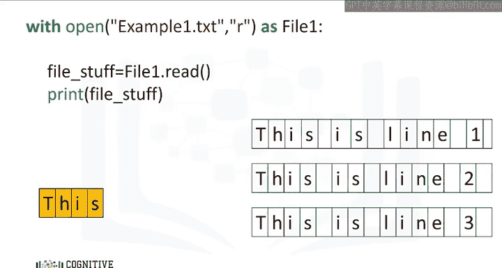

当我们在方法`.read()`中使用参数`4`时，我们会打印出文件中的前四个字符。

每次我们调用该方法，都会在文本中前进。如果我们使用参数`16`调用该方法，会打印出前16个字符，然后是换行符。如果我们第二次调用该方法，会打印出接下来的五个字符。最后，如果我们最后一次调用该方法，参数为`9`，则会打印出最后九个字符。

请查看实验部分，以获取更多关于方法和其他文件类型的示例。

## 总结

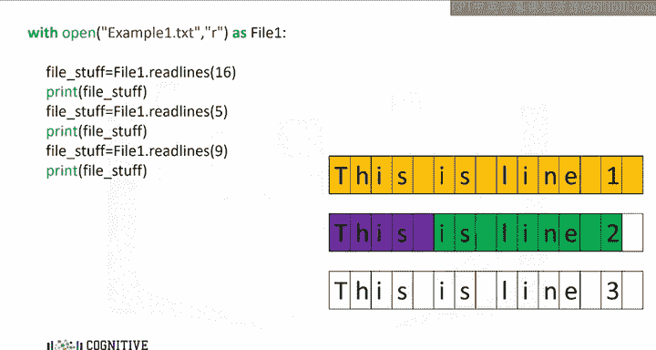

本节课中我们一起学习了如何使用Python的`open`函数读取文件。我们涵盖了打开文件、获取文件信息、使用`with`语句自动管理文件关闭、以及使用`.read()`、`.readline()`和`.readlines()`等不同方法读取文件内容。我们还学习了如何按指定字符数读取文件。掌握这些基础操作是进行文件处理和数据分析的重要第一步。