# 066：使用open函数写入文件 📝

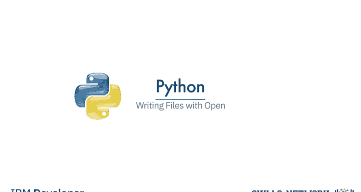

在本节课中，我们将学习如何使用Python的`open`函数向文件中写入数据。我们将涵盖创建新文件、向文件写入文本、追加内容以及复制文件等核心操作。

## 概述


上一节我们介绍了如何使用`open`函数读取文件。本节中，我们来看看如何使用相同的函数向文件中写入数据。写入文件是数据持久化存储的基础，对于保存程序输出、日志记录等任务至关重要。

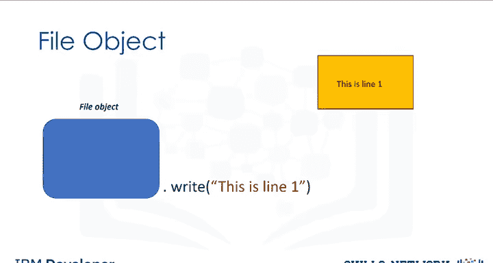

## 使用open函数写入文件

我们可以使用Python的`open`函数获取一个文件对象，并创建一个文本文件。然后，我们可以对该文件对象应用`write`方法写入数据，最终文本将被写入到文件中。

以下是创建并写入文件的基本步骤：

1.  **创建文件对象**：使用`open`函数，并指定模式参数为`'w'`（写入）。
2.  **写入数据**：对文件对象调用`write`方法。
3.  **关闭文件**：使用`with`语句自动管理文件关闭，或手动调用`close`方法。

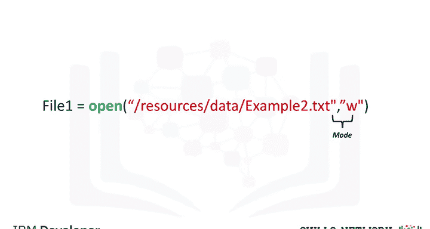

## 创建并写入新文件

我们可以按如下方式创建文件`example2.txt`。我们使用`open`函数，第一个参数是文件路径（由文件名和目录组成）。如果该文件已存在于目录中，它将被覆盖。我们将模式参数设置为`'w'`以进行写入。最后，我们获得文件对象。与之前一样，我们使用`with`语句，代码将运行缩进块中的所有内容，然后关闭文件。我们创建文件对象`file1`。

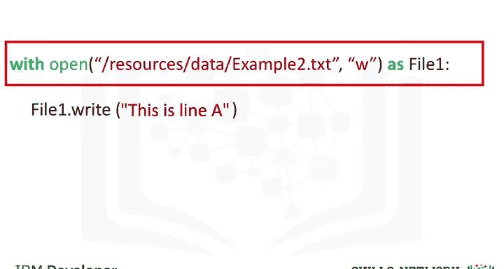

```python
with open('example2.txt', 'w') as file1:
    file1.write('This is line A\n')
```

我们使用`open`函数。这将在您的目录中创建一个文件`example2.txt`。我们使用`write`方法将数据写入文件。该方法的参数是我们希望输入到文件中的文本。

## 连续写入与写入列表

如果我们连续多次使用`write`方法，每次调用时它都会向文件写入内容。第一次调用时，我们将写入`"this is line A"`，并使用`\n`表示换行。第二次调用该方法时，它将写入`"this is line B"`。然后文件将被关闭。

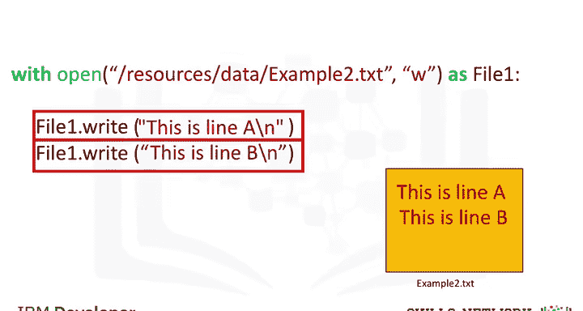

```python
with open('example2.txt', 'w') as file1:
    file1.write('This is line A\n')
    file1.write('This is line B\n')
```

我们也可以将列表中的每个元素写入文件。

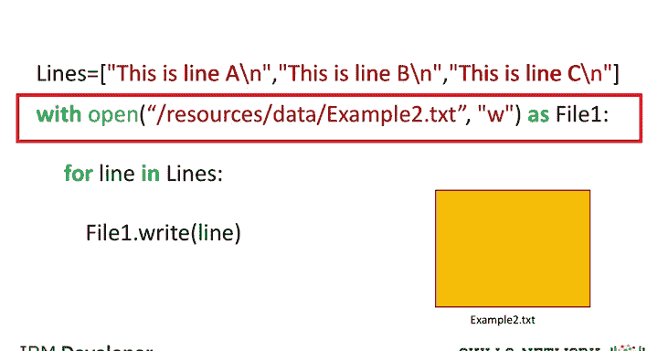

与之前一样，我们使用`with`命令和`open`函数创建一个文件。列表`lines`包含三个文本元素。我们使用`for`循环读取列表`lines`的每个元素，并将其传递给变量`line`。

```python
lines = ['Line 1\n', 'Line 2\n', 'Line 3\n']
with open('example2.txt', 'w') as file1:
    for line in lines:
        file1.write(line)
```

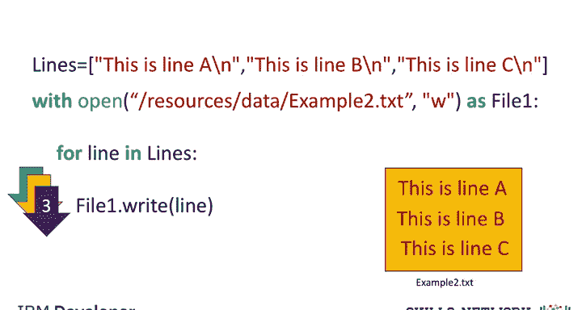

循环的第一次迭代将列表的第一个元素写入文件`example2`。第二次迭代写入列表的第二个元素，依此类推。循环结束时，文件将被关闭。

## 向现有文件追加内容

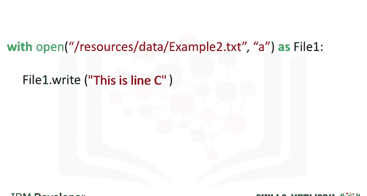

我们可以将模式设置为`'a'`（小写）来进行追加。这不会创建新文件，而是使用现有文件。如果我们调用`write`方法，它只会写入现有文件，然后添加`"this is line C"`，接着关闭文件。

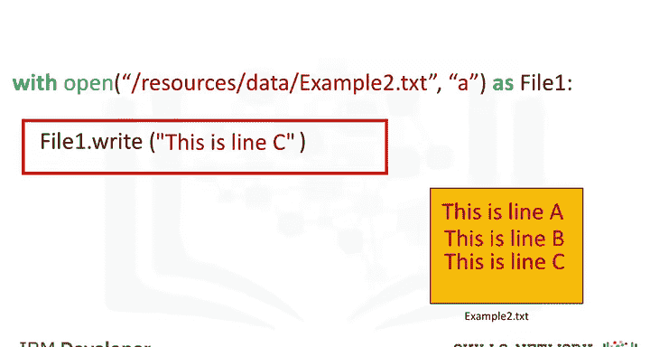

```python
with open('example2.txt', 'a') as file1:
    file1.write('This is line C\n')
```

## 复制文件内容

我们可以按如下方式将一个文件复制到一个新文件。首先，我们读取文件`example1.txt`，并通过文件对象`read_file`与之交互。然后，我们创建一个新文件`example3.txt`，并使用文件对象`write_file`与之交互。

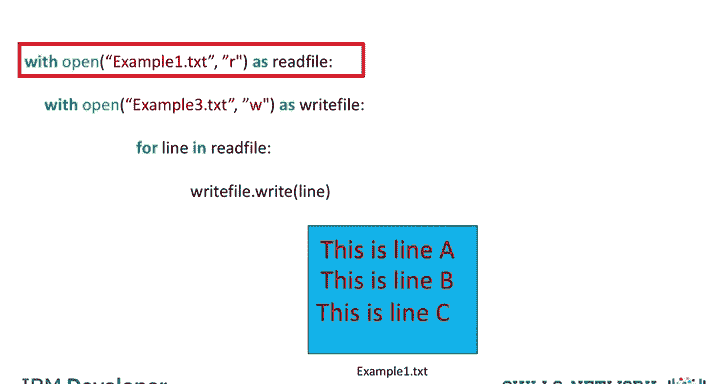

```python
with open('example1.txt', 'r') as read_file:
    with open('example3.txt', 'w') as write_file:
        for line in read_file:
            write_file.write(line)
```

`for`循环从文件对象`read_file`中取出一行，并使用文件对象`write_file`将其存储到文件`example3.txt`中。第一次迭代复制第一行，第二次迭代复制第二行，直到到达文件末尾。然后两个文件都被关闭。

## 总结

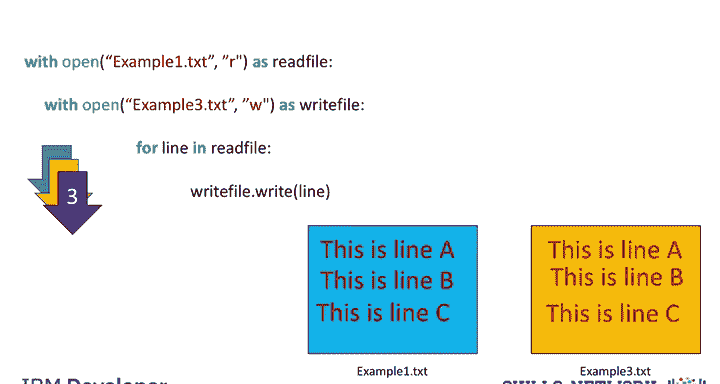

本节课中我们一起学习了如何使用Python的`open`函数进行文件写入操作。我们掌握了创建新文件（模式`'w'`）、向文件写入字符串或列表内容、向现有文件追加数据（模式`'a'`）以及复制文件内容的方法。记住使用`with`语句可以自动、安全地管理文件的打开和关闭。请查看实验部分以获取更多示例。