生成式人工智能工程：13：使用Pandas加载数据 📊

在本节课中，我们将要学习如何使用Python的Pandas库来加载和处理数据。Pandas是一个功能强大的数据分析库，它提供了便捷的数据结构，使我们能够高效地操作结构化数据。

---


### 什么是依赖库？

依赖库或库是预先编写好的代码，用于帮助解决问题。在本视频中，我们将介绍Pandas，这是一个用于数据分析的流行库。

### 导入Pandas库

我们可以使用以下命令导入Pandas库或依赖项。我们以`import`命令开始，后跟库的名称。

```python
import pandas
```

现在，我们可以访问大量预构建的类和函数。这假设该库已安装在我们的实验环境中。所有必要的库都已预先安装。

### 加载CSV文件

假设我们想使用Pandas的内置函数`read_csv`来加载一个CSV文件。CSV是一种用于存储数据的典型文件类型。

我们只需输入单词`pandas`，然后是一个点`.`和函数名及其所有输入参数。

```python
pandas.read_csv('file_path.csv')
```

### 使用别名简化代码

频繁输入`pandas`可能很繁琐。我们可以使用`as`语句来缩短库的名称。在这种情况下，我们使用标准缩写`pd`。

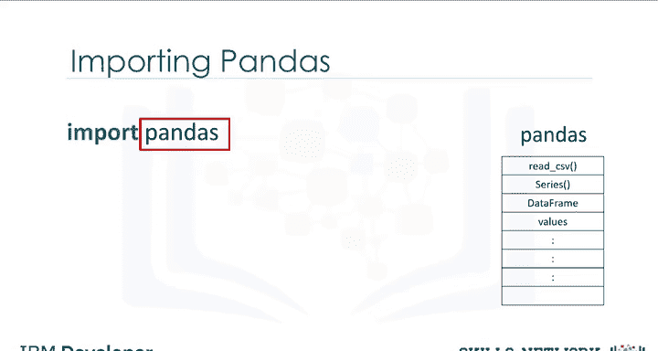

```python
import pandas as pd
```

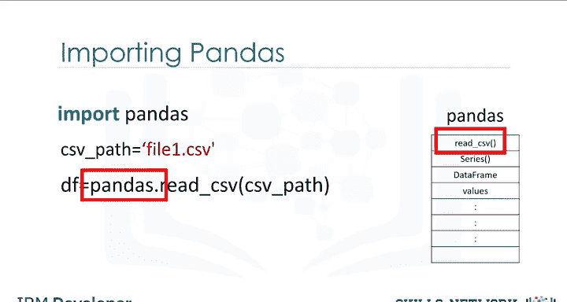

现在，我们输入`pd`和一个点`.`，后跟我们想要使用的函数名。在本例中，是`read_csv`。

```python
pd.read_csv('file_path.csv')
```

我们并不局限于缩写`pd`。例如，我们可以使用术语`banana`。但在本视频的其余部分，我们将坚持使用`pd`。

### 深入理解代码

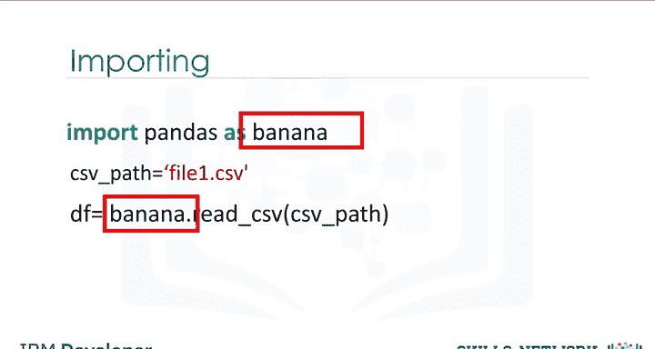

Pandas允许您使用**数据框**来处理数据。让我们详细了解一下从CSV文件到数据框的过程。

```python
path = 'file_path.csv'
df = pd.read_csv(path)
```

变量`path`存储了CSV文件的路径。它被用作`read_csv`函数的参数。结果存储在变量`df`中，这是数据框的缩写。

### 查看数据

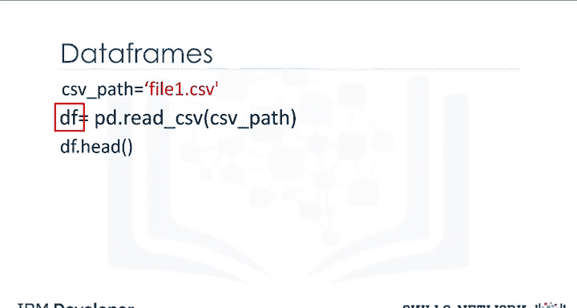

现在我们有了数据框中的数据，就可以对其进行操作了。我们可以使用`head`方法来检查数据框的前五行。

```python
df.head()
```

### 加载Excel文件

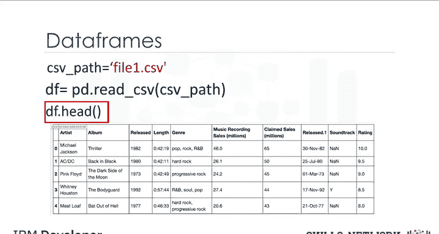

加载Excel文件的过程类似。我们使用Excel文件的路径和`read_excel`函数。结果也是一个数据框。

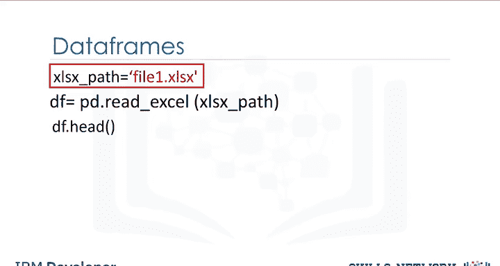

```python
df_excel = pd.read_excel('file_path.xlsx')
```

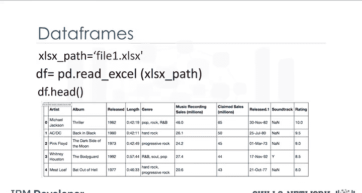

### 理解数据框结构

数据框由行和列组成。我们可以从字典创建数据框。字典的键对应列标签，值是列表，对应行数据。

然后，我们使用`DataFrame`函数将字典转换为数据框。

```python
data = {'Column1': [1, 2, 3], 'Column2': ['A', 'B', 'C']}
df_from_dict = pd.DataFrame(data)
```

我们可以清楚地看到表格与字典之间的直接对应关系：键对应表头，值列表对应行。

### 选择数据列

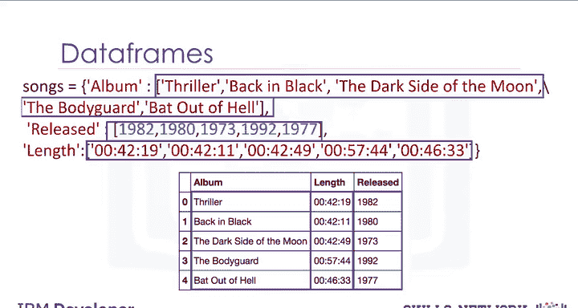

我们可以创建一个仅包含一列的新数据框。只需输入数据框名称（本例中为`df`）和用双括号括起来的列标题名。

```python
new_df_single = df[['Column_Name']]
```

结果是一个由原始列组成的新数据框。

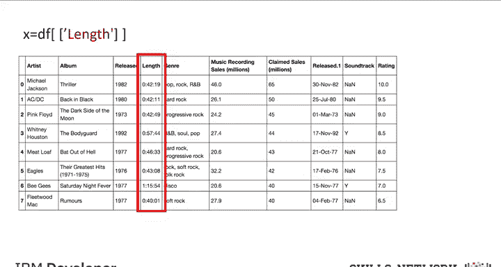

您也可以对多列执行相同的操作。只需输入数据框名称（本例中为`df`）和用双括号括起来的多个列标题名。

```python
new_df_multi = df[['Column1', 'Column2']]
```

结果是一个由指定列组成的新数据框。

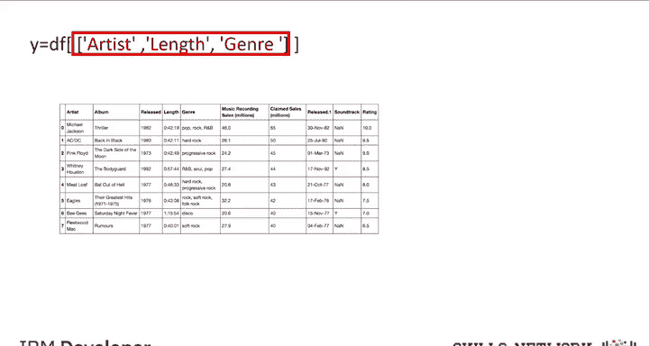

---

### 总结

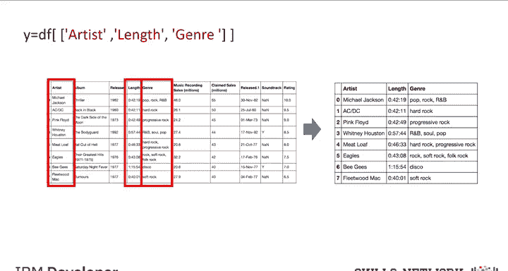

本节课中，我们一起学习了Pandas库的基础知识。我们了解了如何导入Pandas库，如何使用`read_csv`和`read_excel`函数加载CSV和Excel文件，以及如何创建和操作数据框。我们还学习了如何查看数据的前几行，以及如何从数据框中选择特定的列。这些技能是进行数据分析和处理的重要基础。