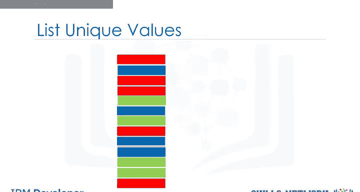
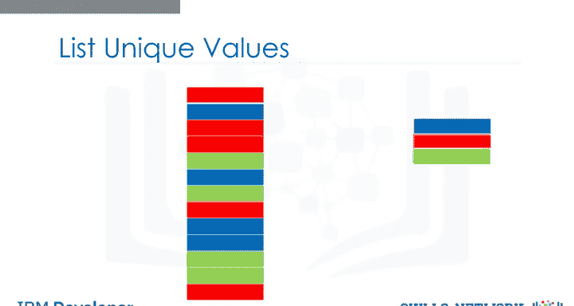
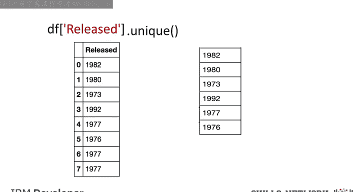
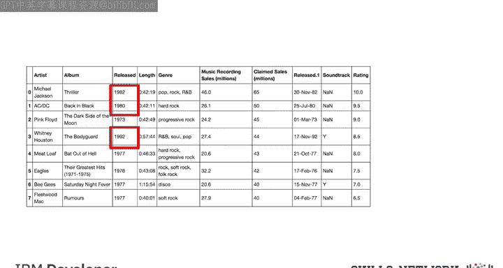
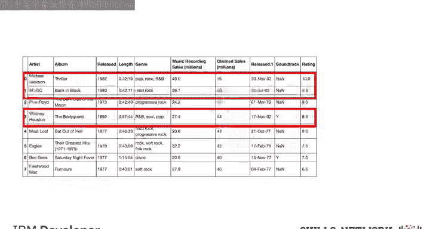
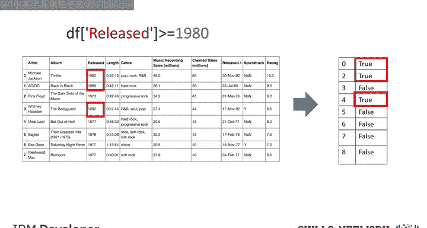
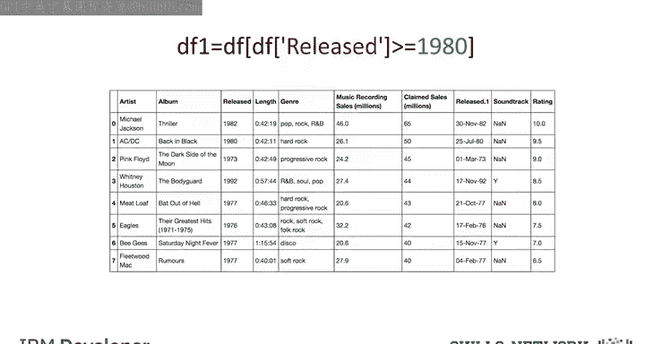
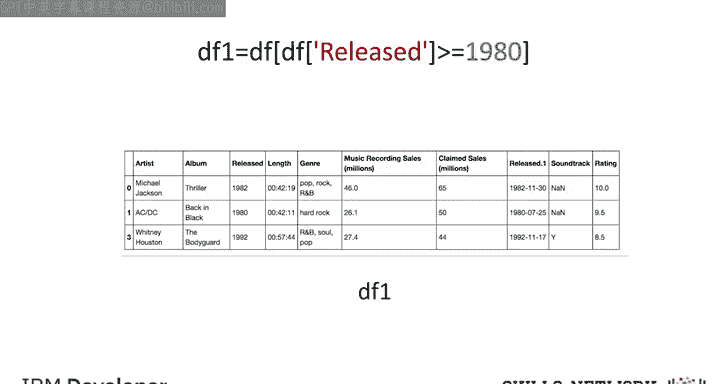
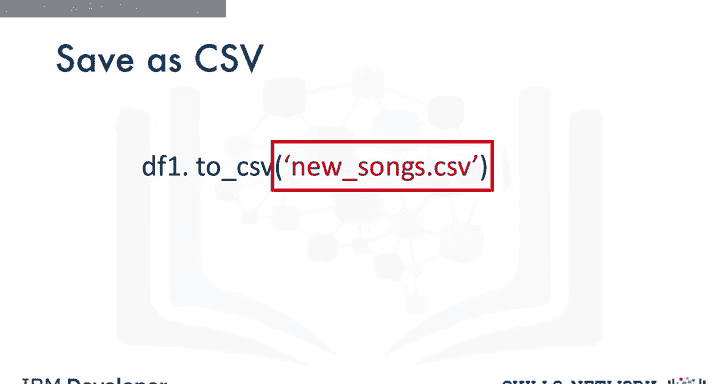

# 068：Pandas数据处理与保存 📊

在本节课中，我们将学习如何使用Pandas库处理和保存数据。我们将重点介绍如何从数据框中提取唯一值、基于条件筛选数据，以及将处理后的结果保存到文件中。

## 数据处理基础


上一节我们介绍了数据框的基本概念，本节中我们来看看如何对数据框中的数据进行实际操作。

当我们拥有一个数据框时，我们可以处理其中的数据，并将结果保存为其他格式。


考虑一堆由13个不同颜色方块组成的堆叠。我们可以看到其中有三种独特的颜色。

假设你想找出数据框某一列中有多少个唯一元素。这可能要困难得多，因为数据可能不是13个元素，而是数百万个。




## 提取唯一值

Pandas提供了`unique`方法来确定数据框某一列中的唯一元素。




假设我们想确定数据集中专辑的唯一发行年份。

我们输入数据框的名称，然后在方括号内输入列名`released`。接着我们应用`unique`方法。结果就是`released`列中的所有唯一元素。

以下是实现此操作的代码示例：

```python
unique_years = df['released'].unique()
```




## 基于条件筛选数据

假设我们想创建一个新的数据库，其中包含1980年代及以后的歌曲。我们可以查看`released`列，筛选出发行年份在1979年之后的歌曲，然后选择对应的行。




我们可以在Pandas中用一行代码完成这个操作，但让我们先分解步骤。




在Pandas中，我们可以对整个数据框使用不等式运算符。结果是一个布尔值序列。

对于我们的案例，我们只需指定`released`列以及“晚于1979年”的不等式条件。结果是一个布尔值序列。当条件为真时，结果为`True`，否则为`False`。

以下是创建布尔掩码的代码：

```python
condition = df['released'] > 1979
```



## 创建新数据框


我们可以在一行代码中选择指定的列。我们只需使用数据框的名称，并在方括号中放入前面提到的不等式条件，然后将其赋值给变量`DF1`。

现在我们就有了一个新的数据框，其中每张专辑的发行年份都在1979年之后。

```python
DF1 = df[df['released'] > 1979]
```




## 保存数据

我们可以使用`to_csv`方法保存新的数据框。参数是CSV文件的名称。请确保包含`.csv`扩展名。


还有其他函数可以将数据框保存为其他格式。

以下是保存数据框的代码：

```python
DF1.to_csv('albums_after_1979.csv')
```



## 总结


本节课中我们一起学习了Pandas数据处理与保存的核心操作。我们首先学习了如何使用`unique()`方法提取数据列中的唯一值。接着，我们探讨了如何基于条件（例如不等式`df['released'] > 1979`）创建布尔掩码来筛选数据行。然后，我们利用这个布尔掩码从原始数据框中筛选出符合条件的行，创建了一个新的数据框`DF1`。最后，我们使用`to_csv()`方法将处理后的新数据框保存为CSV文件，以便后续使用或分析。这些是使用Pandas进行数据清洗和预处理的基础且重要的技能。