# 069：一维NumPy数组入门 🧮

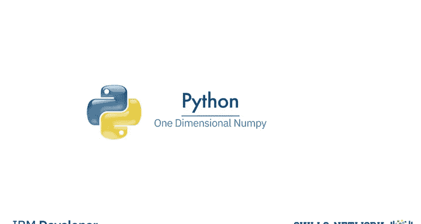

在本节课中，我们将学习一维NumPy数组的基础知识。NumPy是用于科学计算的核心库，它提供了高性能的多维数组对象和工具。掌握NumPy是学习数据科学、机器学习和生成式AI的重要基础。

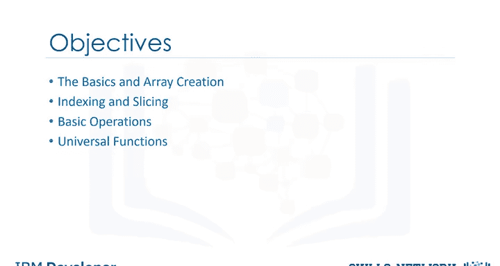

NumPy是一个用于科学计算的库，它包含许多有用的函数。NumPy相比纯Python代码，在速度和内存使用上具有显著优势。NumPy同时也是Pandas库的基础。

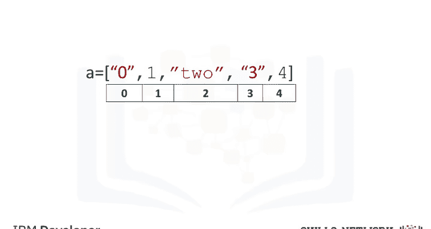

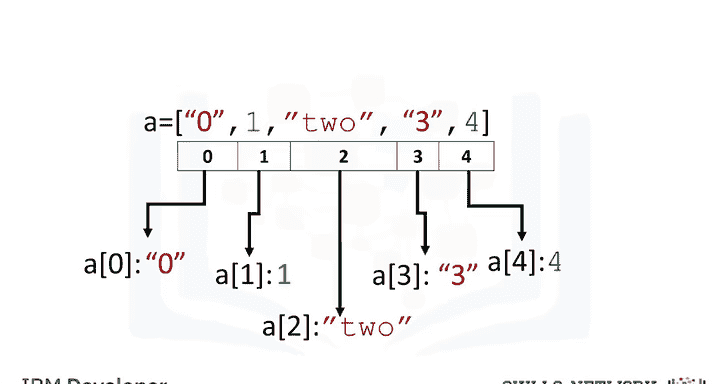

---

## 数组创建与基本属性

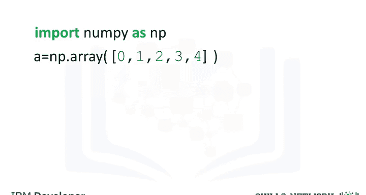

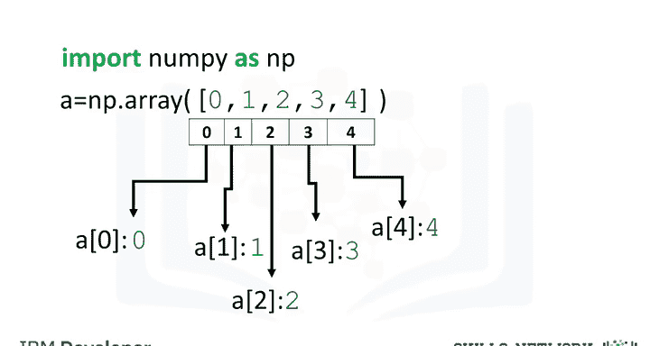

上一节我们介绍了NumPy的重要性，本节中我们来看看如何创建NumPy数组以及其基本属性。

Python列表是一种可以存储和访问数据的容器，每个元素都与一个索引相关联。我们可以使用方括号访问每个元素，如下所示：
```python
L = [1, 2, 3, 4, 5]
print(L[0]) # 输出 1
```

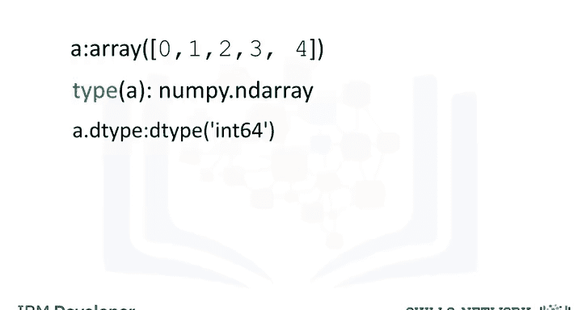

NumPy数组（或ND数组）与列表类似。它的大小通常是固定的，并且每个元素都是相同类型（例如整数）。我们可以通过首先导入NumPy，然后将列表转换为NumPy数组。我们按如下方式转换列表：
```python
import numpy as np
a = np.array([0, 1, 2, 3, 4])
```
我们可以通过索引访问数据。与列表一样，我们可以使用整数和方括号访问每个元素：
```python
print(a[0]) # 输出 0
```

数组 `a` 的存储方式如下。如果我们检查数组的类型，会得到 `numpy.ndarray`。由于NumPy数组包含相同类型的数据，我们可以使用属性 `dtype` 来获取数组元素的数据类型。在本例中，是64位整数：
```python
print(a.dtype) # 输出 dtype('int64')
```

以下是数组 `a` 的一些基本属性：
*   **`size`**：数组中元素的数量。因为有五个元素，结果是 `5`。
*   **`ndim`**：表示数组维度的数量，或数组的秩。在本例中，是 `1`。
*   **`shape`**：一个整数元组，表示数组在每个维度上的大小。对于一维数组，形状是 `(5,)`。

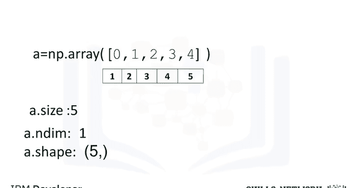

我们可以用实数创建一个NumPy数组。当我们检查数组的类型时，得到 `numpy.ndarray`。如果我们检查属性 `dtype`，会看到 `float64`，因为元素不是整数。还有许多其他属性，可以查阅 `numpy.org`。

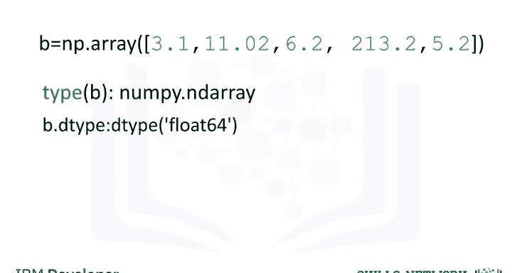


---

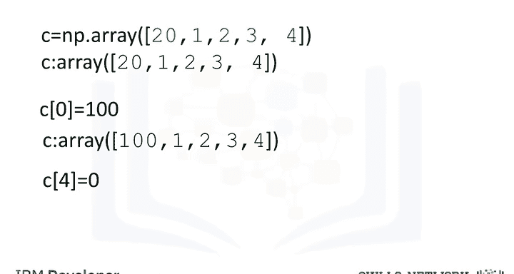

## 索引与切片

上一节我们学习了如何创建数组，本节中我们来看看如何访问和修改数组中的元素。

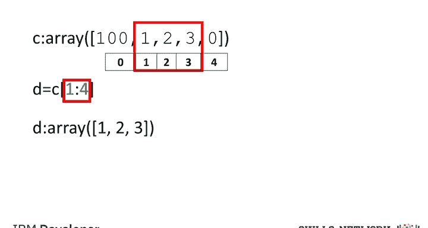

我们可以按如下方式将数组的第一个元素更改为100：
```python
a[0] = 100
```
数组的第一个值现在是100。我们可以按如下方式更改数组的第五个元素：
```python
a[4] = 0
```
第五个元素现在是0。

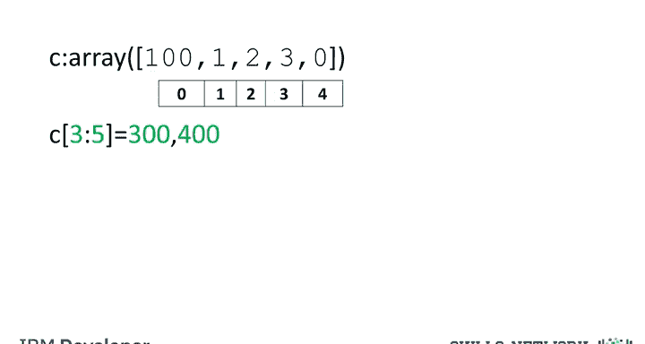

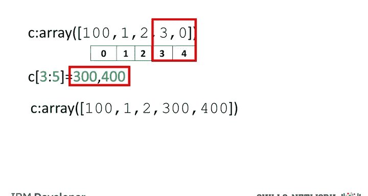

与列表和元组类似，我们可以对NumPy数组进行切片。数组的元素对应以下索引。我们可以选择索引1到3（不包括3）的元素，并将其分配给一个新的NumPy数组 `c`，如下所示：
```python
c = a[1:4]
```
这些元素确实对应于索引。与列表一样，我们不计算与最后一个索引对应的元素。

我们可以按如下方式将对应的索引分配给新值：
```python
a[1:4] = [200, 300, 400]
```
数组 `a` 现在有了新值。有关NumPy用法的更多示例，请参阅实验或 `numpy.org`。


---

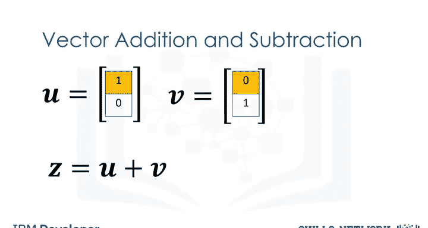

## 基本数组运算

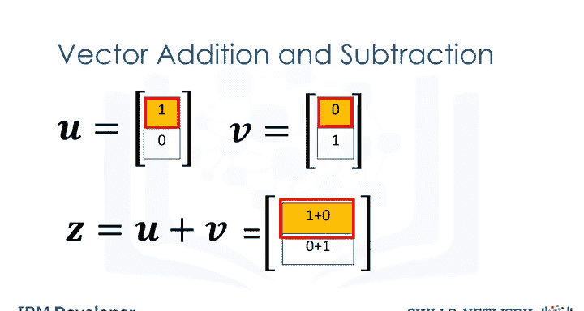

NumPy使得在数据科学中常用的许多操作变得更加容易。与常规Python相比，这些相同的操作在NumPy中通常计算速度更快，并且需要更少的内存。让我们在一维数组的背景下回顾其中一些操作。为了使内容更有趣，我们将在欧几里得向量的背景下研究许多操作。

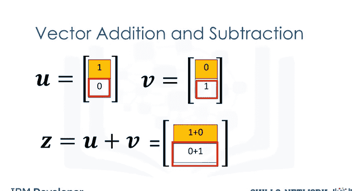

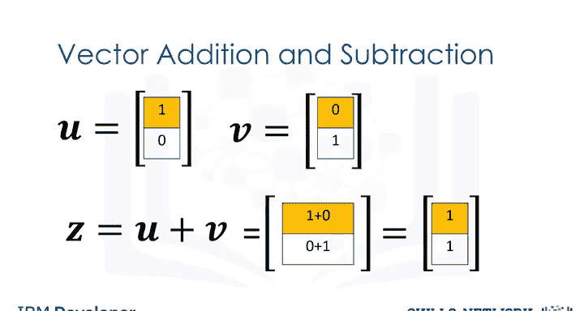

### 向量加法

向量加法是数据科学中广泛使用的操作。考虑具有两个元素的向量 `u`。元素由不同的颜色区分。类似地，考虑具有两个分量的向量 `v`。在向量加法中，我们创建一个新向量 `z`。`z` 的第一个分量是向量 `u` 和 `v` 的第一个分量之和。类似地，第二个分量是 `u` 和 `v` 的第二个分量之和。这个新向量 `z` 现在是向量 `u` 和 `v` 的线性组合。

用线段或箭头表示向量加法是有帮助的。第一个向量用红色表示。第二个向量用蓝色表示。当我们添加向量 `u` 和 `v` 时，我们得到新向量 `z`。我们添加第一个分量（水平方向）和第二个分量（垂直方向）。在添加向量时，使用“首尾相接法”很有帮助，即将向量 `v` 的尾部放在向量 `u` 的尖端。新向量 `z` 通过连接第一个向量 `u` 的基部和第二个向量 `v` 的尾部来构建。

以下三行代码将添加两个列表并将结果放入列表 `z` 中：
```python
u = [1, 0]
v = [0, 1]
z = []
for n, m in zip(u, v):
    z.append(n + m)
```

我们也可以用一行NumPy代码执行向量加法：
```python
import numpy as np
u = np.array([1, 0])
v = np.array([0, 1])
z = u + v
```
对两个列表执行向量加法需要多行代码，如屏幕右侧所示。此外，NumPy代码运行速度会快得多。如果你有大量数据，这一点很重要。

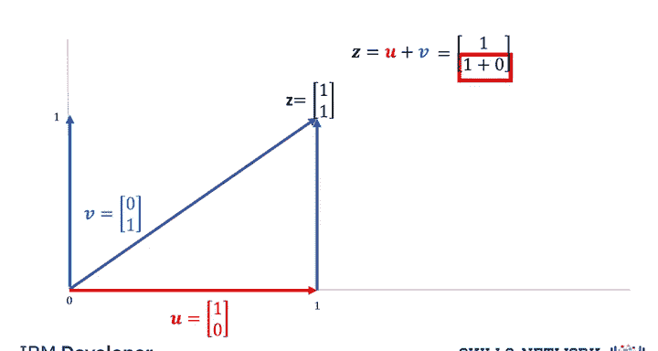

### 向量减法

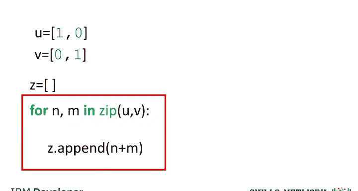

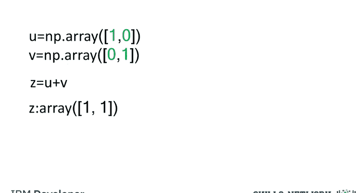

我们也可以通过将加号改为减号来执行向量减法。对两个列表执行向量减法需要多行代码，如屏幕右侧所示。
```python
# NumPy方式
z = u - v
```

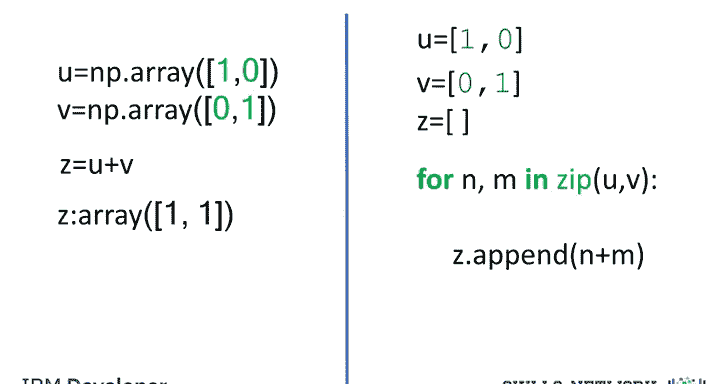

### 标量乘法

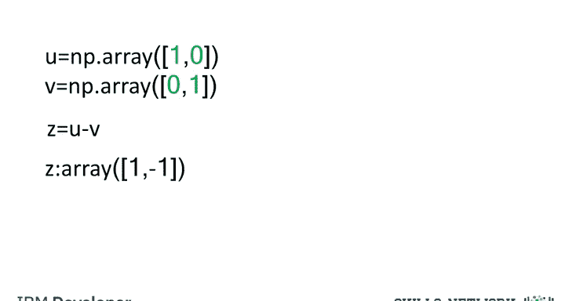

向量与标量的乘法是另一个常用操作。考虑向量 `y`。每个分量由不同颜色指定。我们简单地将向量乘以一个标量值，在本例中是2。向量的每个分量都乘以2。在本例中，每个分量都加倍。

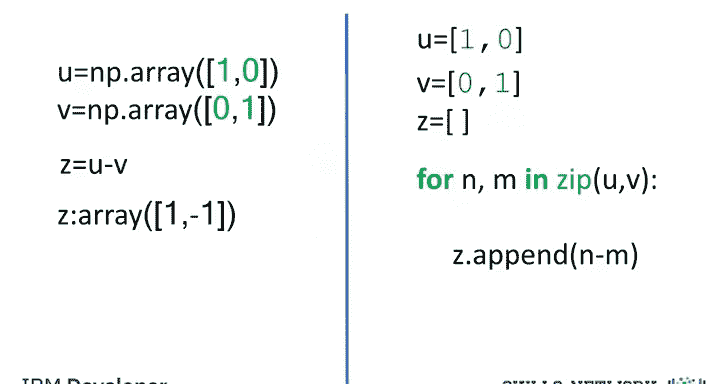

我们可以使用线段或箭头来可视化这个过程。原始向量 `y` 是紫色的。将其乘以标量值2后，向量被拉伸了两个单位，如红色所示。新向量在每个方向上都变长了两倍。

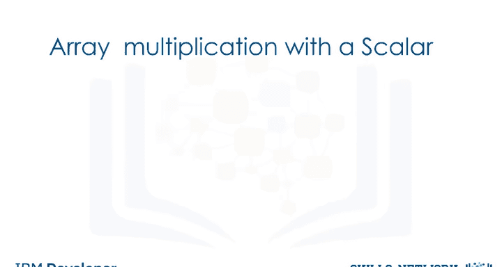

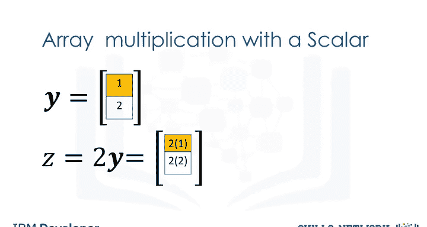

使用NumPy，向量与标量的乘法只需要一行代码：
```python
y = np.array([1, 1])
z = 2 * y
```
使用Python列表执行相同任务需要多行代码，如屏幕右侧所示。此外，该操作也会慢得多。

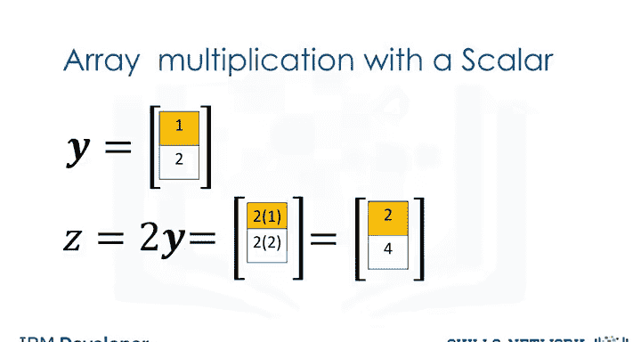

### 哈达玛积（逐元素乘法）

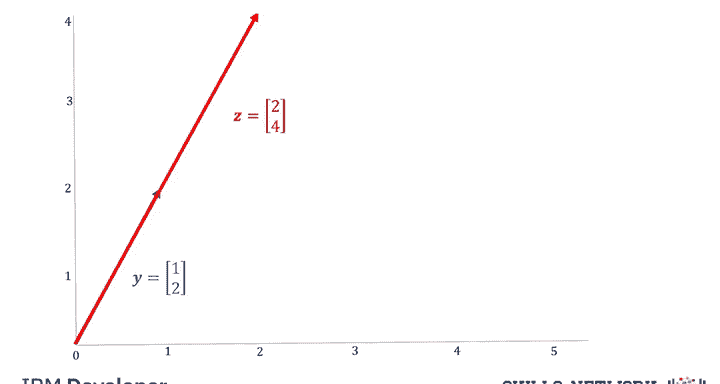

哈达玛积是数据科学中另一个广泛使用的操作。考虑以下两个向量 `u` 和 `v`。`u` 和 `v` 的哈达玛积是一个新向量 `z`。`z` 的第一个分量是 `u` 和 `v` 的第一个元素的乘积。类似地，第二个分量是 `u` 和 `v` 的第二个元素的乘积。结果向量由 `u` 和 `v` 的逐元素乘积组成。

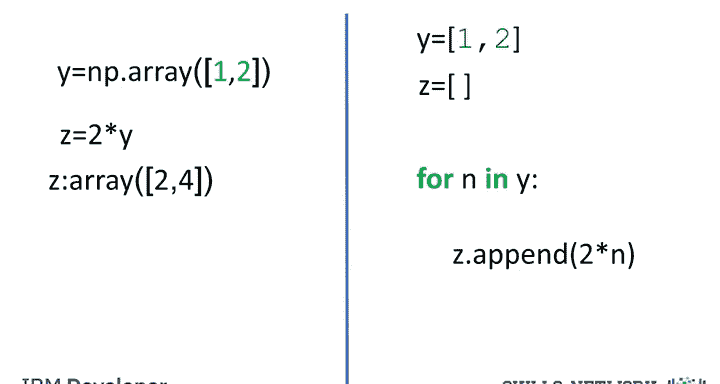

我们也可以用一行NumPy代码执行哈达玛积：
```python
u = np.array([1, 2])
v = np.array([3, 2])
z = u * v
```
对两个列表执行哈达玛积需要多行代码，如屏幕右侧所示。

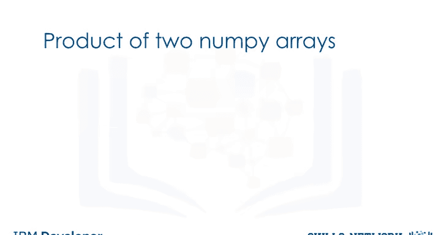

### 点积

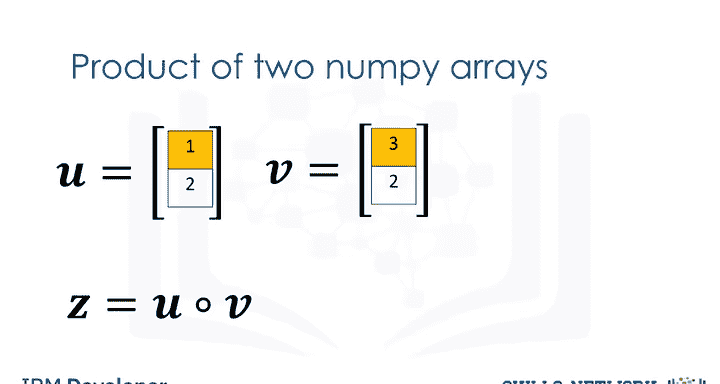

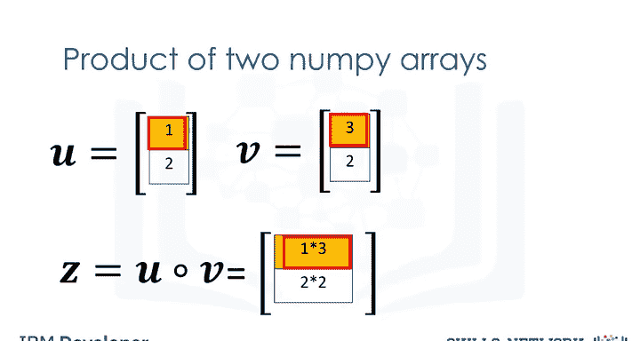

点积是数据科学中另一个广泛使用的操作。考虑向量 `u` 和 `v`。点积是由以下项给出的单个数字，表示两个向量的相似程度。我们将 `v` 和 `u` 的第一个分量相乘。然后我们将第二个分量相乘并将结果相加。结果是一个数字，表示两个向量的相似程度。

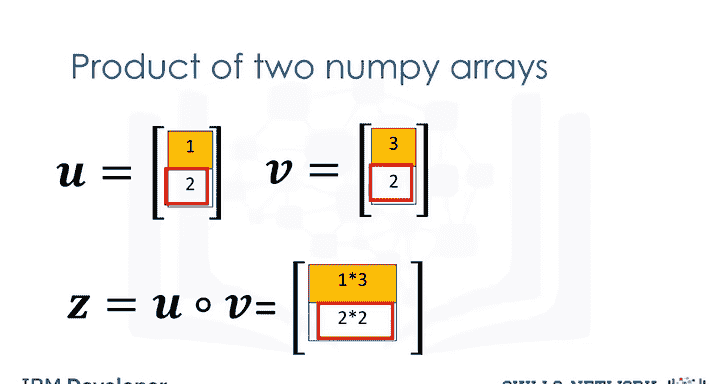

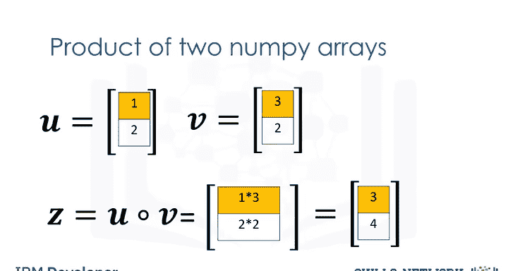

我们也可以使用NumPy函数 `dot` 执行点积，并将其赋值给变量 `result`，如下所示：
```python
result = np.dot(u, v)
```

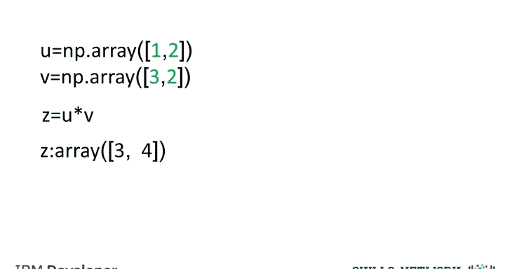

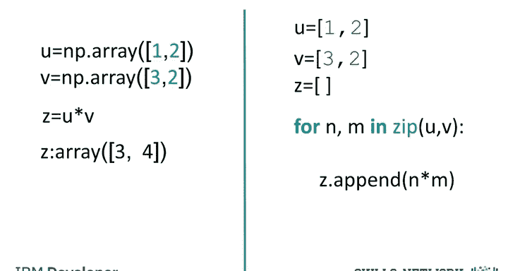

---

## 广播与通用函数

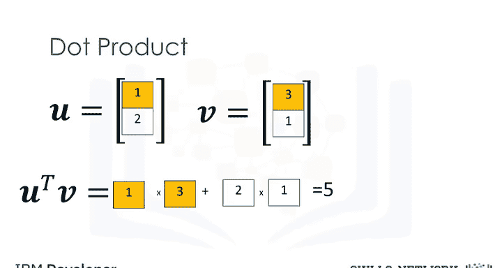

上一节我们介绍了基本的向量运算，本节中我们来看看NumPy的两个强大特性：广播和通用函数。

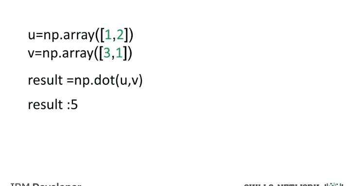

考虑数组 `u`。该数组包含以下元素。如果我们向数组添加一个标量值，NumPy会将该值添加到每个元素。这个属性被称为广播。
```python
u = np.array([1, 2, 3, -1])
z = u + 1 # 结果为 [2, 3, 4, 0]
```

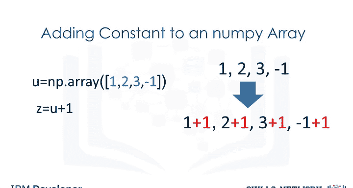

通用函数是在ND数组上操作的函数。我们可以将通用函数应用于NumPy数组。考虑数组 `a`。我们可以使用方法 `mean` 计算 `a` 中所有元素的平均值。这对应于所有元素的平均值。在本例中，结果是 `0`。
```python
a = np.array([1, -1, 1, -1])
mean_a = a.mean() # 结果为 0.0
```


还有许多其他函数。例如，考虑NumPy数组 `b`。我们可以使用方法 `max` 找到最大值。我们看到最大值是 `5`。因此，方法 `max` 返回 `5`。
```python
b = np.array([1, 2, 3, 4, 5])
max_b = b.max() # 结果为 5
```

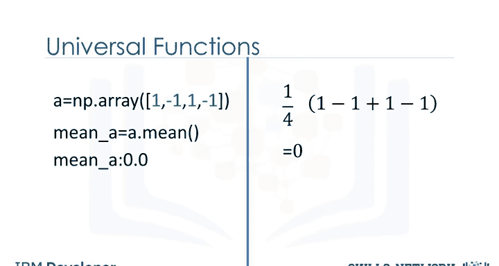

我们可以使用NumPy创建将NumPy数组映射到新NumPy数组的函数。让我们在屏幕左侧实现一些代码，并使用屏幕右侧来演示发生了什么。我们可以按如下方式访问NumPy中的 `pi` 值：
```python
np.pi
```
我们可以以弧度创建以下NumPy数组 `x`。这个数组对应以下向量。我们可以将函数 `sin` 应用于数组 `x` 并将值赋给数组 `y`。这会将正弦函数应用于数组中的每个元素。这对应于将正弦函数应用于向量的每个分量。结果是一个新数组 `y`，其中每个值对应于对数组 `x` 中的每个元素应用正弦函数。

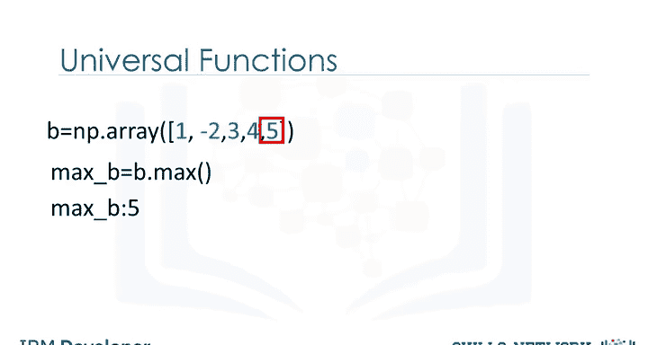

用于绘制数学函数的一个有用函数是 `linspace`。`linspace` 在指定间隔内返回均匀间隔的数字。我们指定序列的起点、序列的终点。参数 `num` 表示要生成的样本数，在本例中为 `5`，样本之间的间隔是 `1`。
```python
np.linspace(-2, 2, num=5) # 结果为 [-2., -1., 0., 1., 2.]
```

如果我们将参数 `num` 改为 `9`，我们会在从 `-2` 到 `2` 的区间内得到 `9` 个均匀间隔的数字。结果是后续样本之间的差是 `0.5`，而不是之前的 `1`。

我们可以使用函数 `linspace` 从区间 `0` 到 `2π` 生成 `100` 个均匀间隔的样本。我们可以使用NumPy函数 `sin` 将数组 `x` 映射到新数组 `y`。我们可以导入库 `pyplot` 作为 `plt` 来帮助我们绘制函数。由于我们使用的是Jupyter笔记本，我们使用命令 `%matplotlib inline` 来显示绘图。以下命令绘制一个图形。第一个输入对应于水平轴或x轴的值。第二个输入对应于垂直轴或y轴的值。
```python
import numpy as np
import matplotlib.pyplot as plt
%matplotlib inline

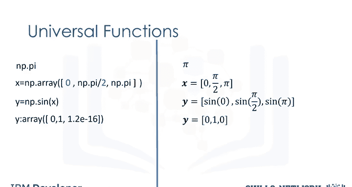

x = np.linspace(0, 2*np.pi, num=100)
y = np.sin(x)
plt.plot(x, y)
```

关于NumPy，你还可以做更多事情。请查看 `numpy.org` 上的实验以获取更多信息。

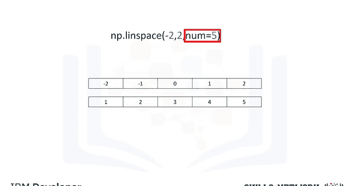

---

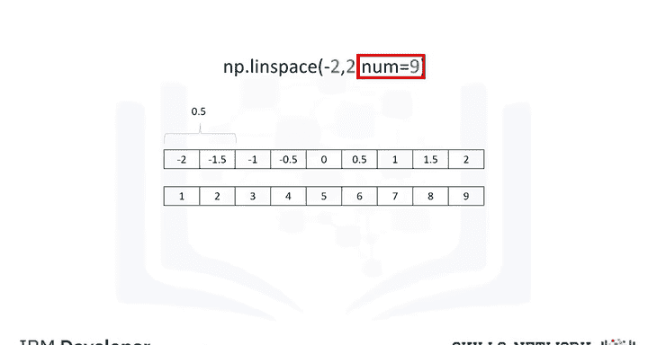

## 总结

本节课中我们一起学习了一维NumPy数组的基础知识。我们首先介绍了如何从Python列表创建NumPy数组，并了解了数组的基本属性，如 `dtype`、`size`、`ndim` 和 `shape`。接着，我们探讨了如何通过索引和切片来访问及修改数组元素。

然后，我们深入学习了NumPy中高效的数组运算，包括向量加法、减法、标量乘法、哈达玛积和点积，这些操作在数据科学中至关重要。最后，我们介绍了NumPy的两个强大特性：广播（允许标量与数组进行运算）和通用函数（可对整个数组执行数学运算），并演示了如何使用 `linspace` 和绘图功能。

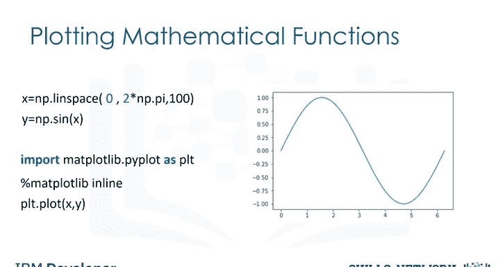

NumPy是进行高效数值计算的基石，熟练掌握它将为后续学习更复杂的数据分析和机器学习概念打下坚实基础。