# 070：二维NumPy数组 🧮

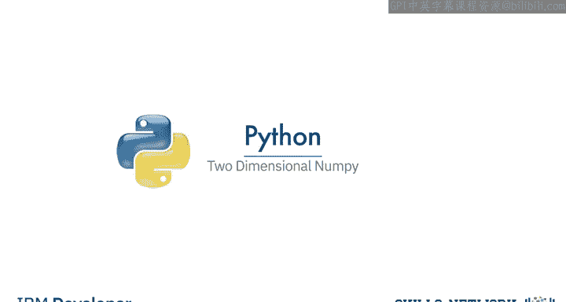

在本节课中，我们将要学习如何创建和使用二维NumPy数组。我们将涵盖二维数组的基础知识、创建方法、索引与切片操作，以及基本的数学运算。

## 概述

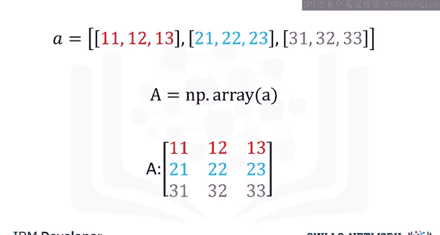

NumPy允许我们创建多维数组。本节将重点介绍二维数组，但NumPy同样可以构建更高维度的数组。二维数组可以直观地理解为矩阵，它由行和列组成。

## 二维数组的创建与属性

我们可以从嵌套列表创建二维NumPy数组。每个嵌套列表对应矩阵的一行。

考虑列表 `A`，它包含三个大小相等的嵌套列表：
```python
A = [[11, 12, 13], [21, 22, 23], [31, 32, 33]]
```
我们可以将其转换为NumPy数组：
```python
import numpy as np
A = np.array(A)
```

将NumPy数组可视化为矩形阵列有助于理解。行对应嵌套列表，列对应每个列表中的元素。

### 数组属性

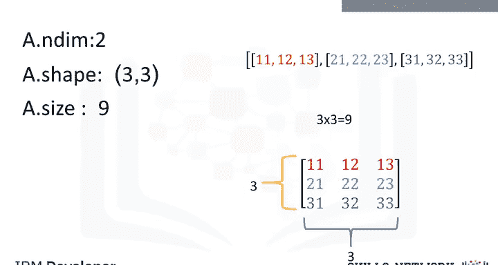

我们可以使用以下属性来了解数组的结构：

*   **`ndim`**：获取数组的轴数或维度数，也称为秩。对于二维数组，秩为2。
*   **`shape`**：返回一个元组，表示数组的形状。第一个元素是行数，第二个元素是列数。对于数组 `A`，`shape` 为 `(3, 3)`。
*   **`size`**：返回数组中元素的总数。对于数组 `A`，`size` 为 9（3行 × 3列）。

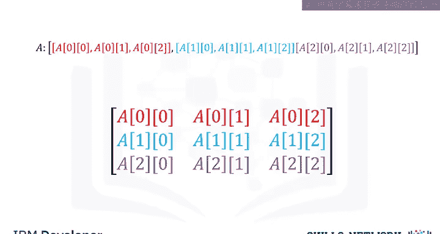

按照惯例，第一个轴（轴0）对应行，第二个轴（轴1）对应列。

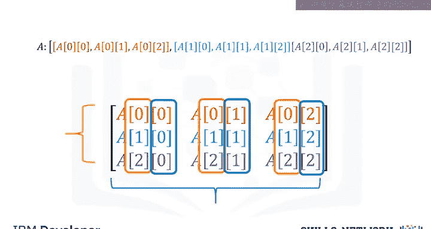

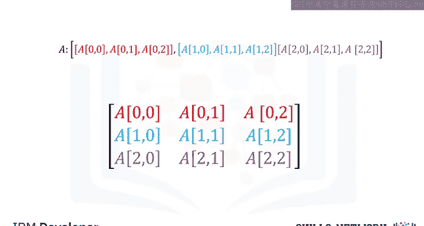

## 二维数组的索引与切片

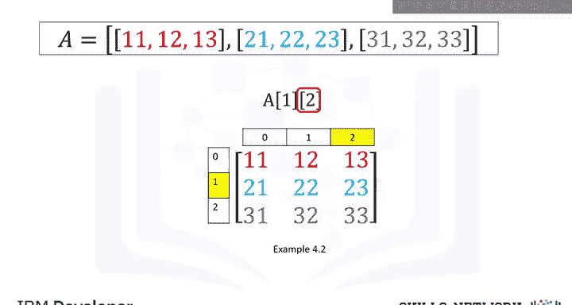

上一节我们介绍了数组的创建和属性，本节中我们来看看如何访问和选取数组中的特定元素。

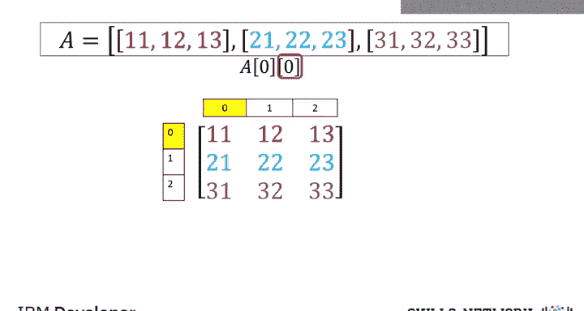

我们可以使用方括号来访问数组的不同元素。第一个索引对应行，第二个索引对应列。

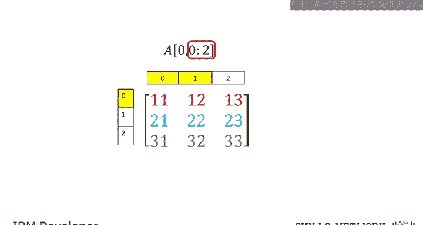

### 访问单个元素

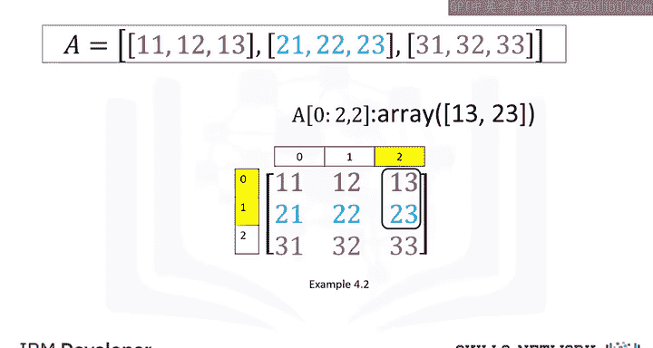

考虑数组 `A`：
```python
# 访问第二行，第三列的元素（索引从0开始）
element = A[1, 2]  # 值为 23

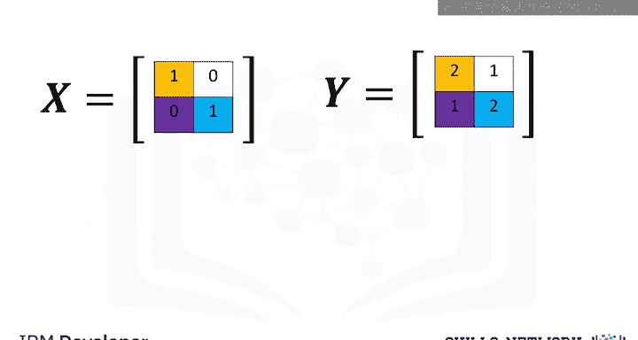

# 访问第一行，第一列的元素
element = A[0, 0]  # 值为 11
```

### 切片操作

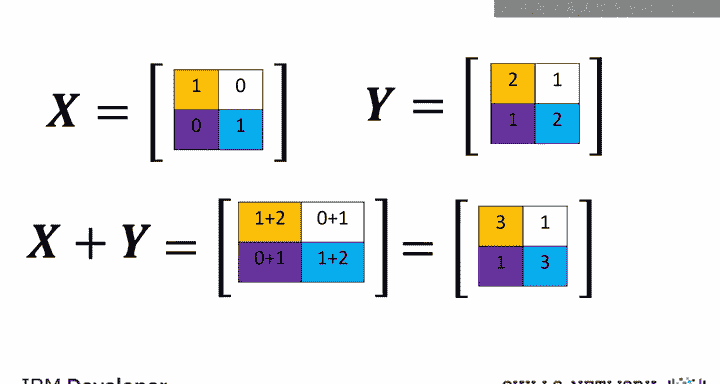

我们也可以对二维数组进行切片，选取子数组。

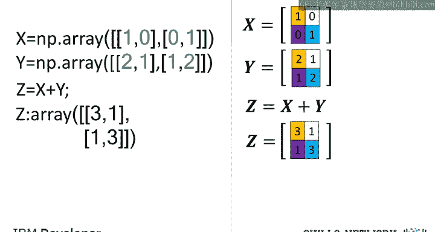


以下是切片操作的示例：

*   `A[0, 0:2]`：选取第一行的前两列。
*   `A[0:2, 2]`：选取前两行的最后一列。

## 二维数组的基本运算

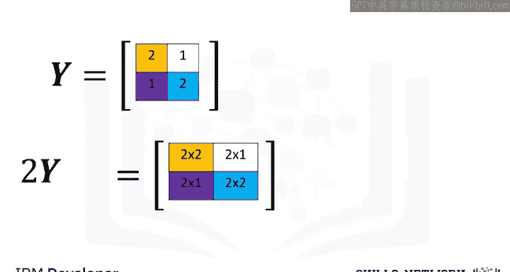

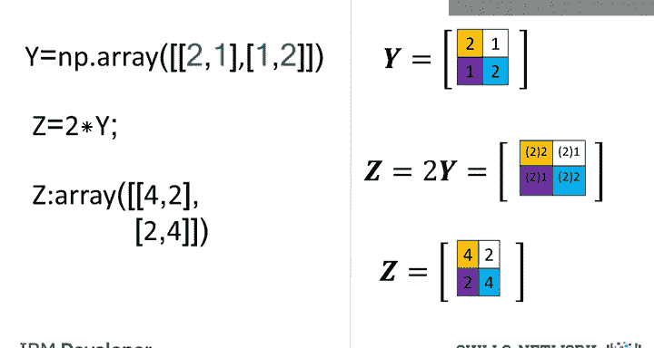

了解了如何访问数组元素后，本节我们将探讨二维数组的基本数学运算，包括加法、标量乘法和元素乘法。


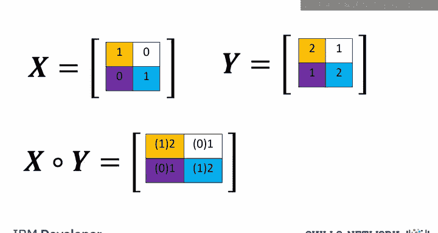

### 数组加法

两个相同形状的数组相加，等同于矩阵加法，即对应位置的元素相加。
```python
X = np.array([[1, 0], [0, 1]])
Y = np.array([[2, 1], [1, 2]])
Z = X + Y  # Z = [[3, 1], [1, 3]]
```

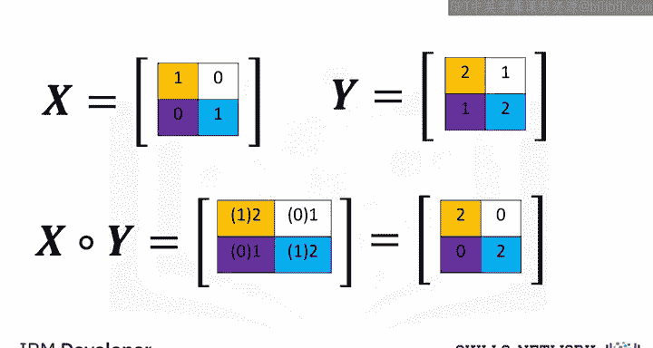

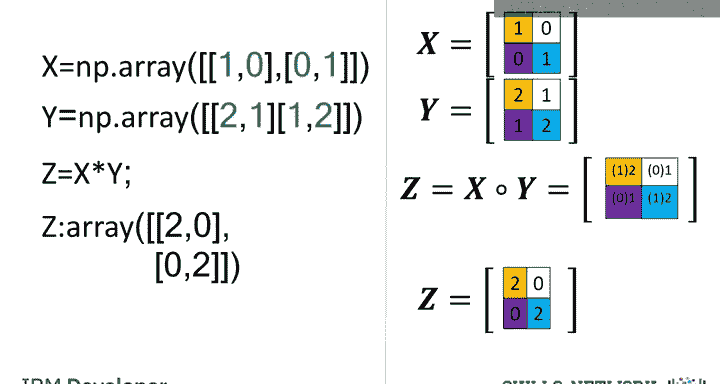

### 标量乘法

将数组乘以一个标量，等同于将矩阵中的每个元素都乘以该标量。
```python
Y = np.array([[2, 1], [1, 2]])
Z = 2 * Y  # Z = [[4, 2], [2, 4]]
```

### 元素乘法（哈达玛积）

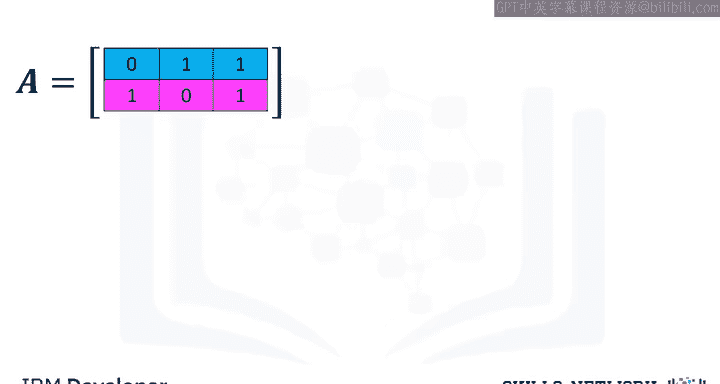

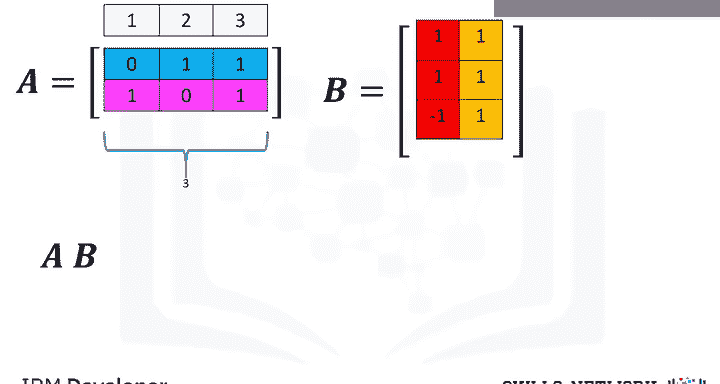

两个相同形状的数组相乘，执行的是元素级别的乘法，即哈达玛积。
```python
X = np.array([[1, 0], [0, 1]])
Y = np.array([[2, 1], [1, 2]])
Z = X * Y  # Z = [[2, 0], [0, 2]]
```

## 矩阵乘法

除了元素级别的运算，NumPy也支持真正的矩阵乘法。矩阵乘法的规则是：第一个矩阵的列数必须等于第二个矩阵的行数。

考虑矩阵 `A` 和 `B`：
```python
A = np.array([[0, 1, 1], [1, 0, 1]])
B = np.array([[1, 1], [1, 1], [-1, 1]])
```
在NumPy中，使用 `dot` 函数或 `@` 运算符进行矩阵乘法：
```python
C = np.dot(A, B)
# 或
C = A @ B
# 结果 C = [[0, 2], [0, 2]]
```
新矩阵 `C` 中第 `i` 行第 `j` 列的元素，是矩阵 `A` 的第 `i` 行与矩阵 `B` 的第 `j` 列的点积。

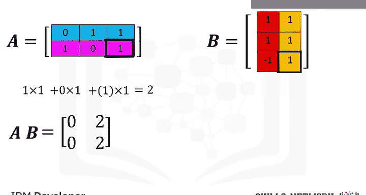

## 总结

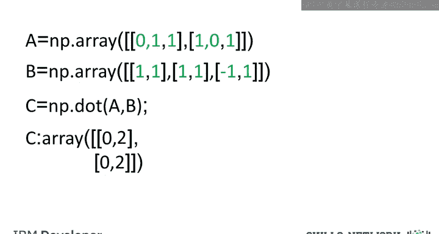

本节课中我们一起学习了二维NumPy数组的核心知识。我们首先学习了如何从嵌套列表创建二维数组，并理解了 `shape`、`ndim`、`size` 等关键属性。接着，我们掌握了通过索引和切片来访问数组元素的方法。最后，我们探讨了二维数组的基本运算，包括数组加法、标量乘法、元素乘法（哈达玛积）以及真正的矩阵乘法。掌握这些基础是进行更复杂科学计算和数据分析的重要前提。NumPy的功能远不止于此，建议访问 [numpy.org](https://numpy.org) 以探索更多可能性。