# 071：简单API（第1部分）📡

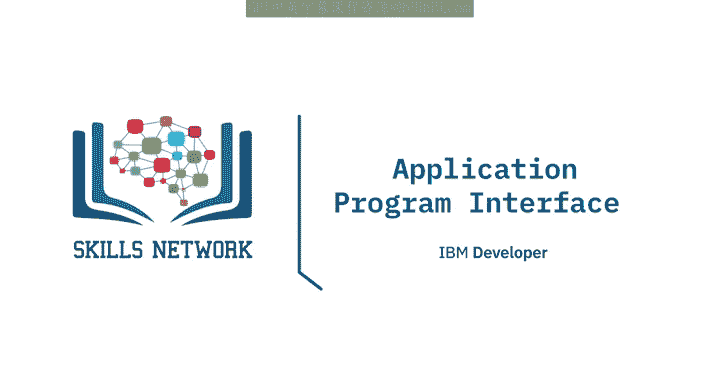

在本节课中，我们将学习应用程序接口，简称API。我们将了解API是什么、API库、REST API（包括请求和响应），并通过一个使用Pycoin Gecko的实例来加深理解。

## 什么是API？🤔

API允许两个软件组件相互通信。例如，你有一个程序、一些数据以及其他软件组件。你可以通过API，利用输入和输出来与其他软件进行通信。就像调用函数一样，你无需了解API的内部工作原理，只需知道其输入和输出即可。

## API库示例：Pandas 🐼

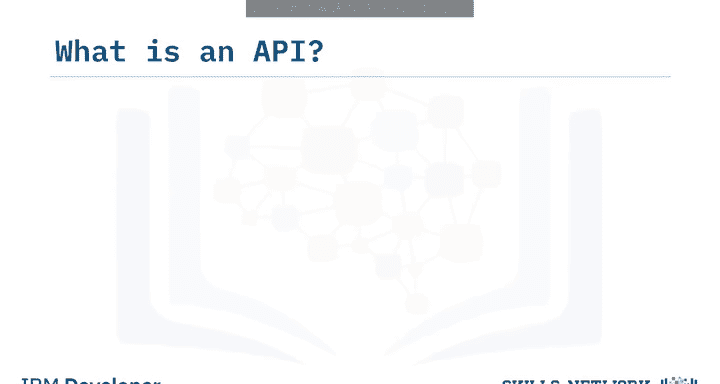


Pandas实际上是一组软件组件，其中许多甚至不是用Python编写的。你有一些数据和一组软件组件。我们通过Pandas API与其他软件组件通信，从而处理数据。

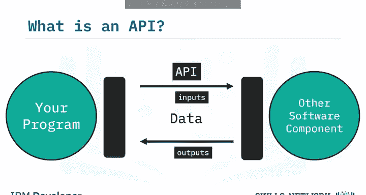

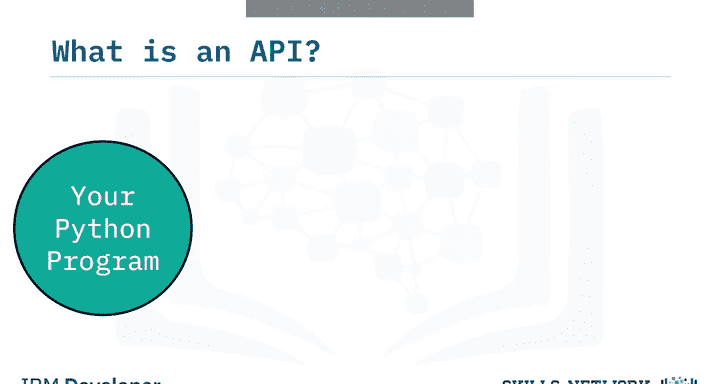

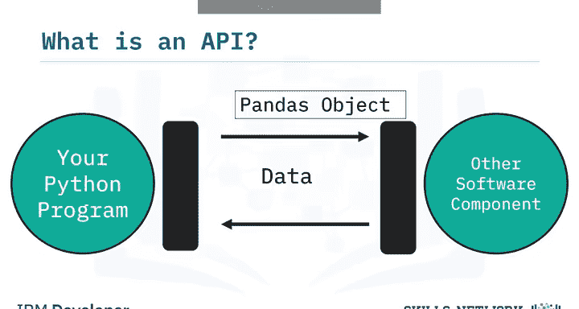

让我们清理一下图示。当你创建一个字典，然后使用DataFrame构造函数创建一个Pandas对象时，用API术语来说，这就是一个**实例**。字典中的数据被传递给Pandas API。然后，你使用这个DataFrame与API进行通信。

以下是使用Pandas API的典型流程：

*   当你调用 `head()` 方法时，DataFrame会与API通信，显示数据框的前几行。
*   当你调用 `mean()` 方法时，API会计算平均值并返回结果。

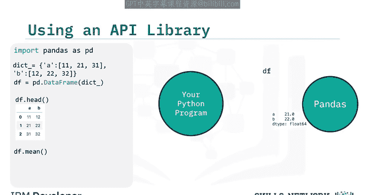

## REST API 🌐

REST API是另一种流行的API类型。它们允许你通过互联网进行通信，从而利用存储、访问更多数据、人工智能算法等资源。REST代表**表征状态转移**。

在REST API中，你的程序被称为**客户端**。API与你通过互联网调用的**Web服务**进行通信。通信有一套关于输入（即**请求**）和输出（即**响应**）的规则。

以下是REST API中的一些常见术语：

*   **客户端**：指你或你的代码。
*   **资源**：指Web服务。
*   **端点**：客户端通过它来找到服务（我们将在下一节详细讨论）。
*   **请求**：客户端发送给资源的信息。
*   **响应**：资源（Web服务）发送给客户端的回复。

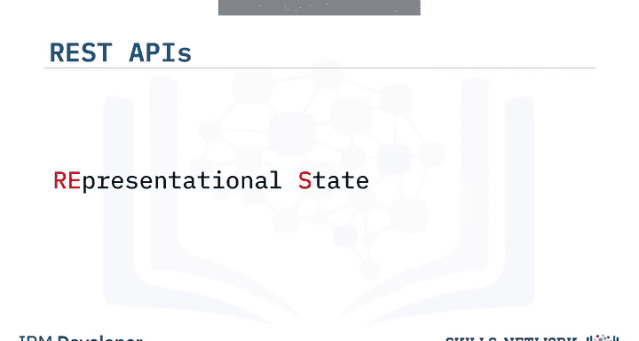

HTTP方法是互联网上传输数据的一种方式。

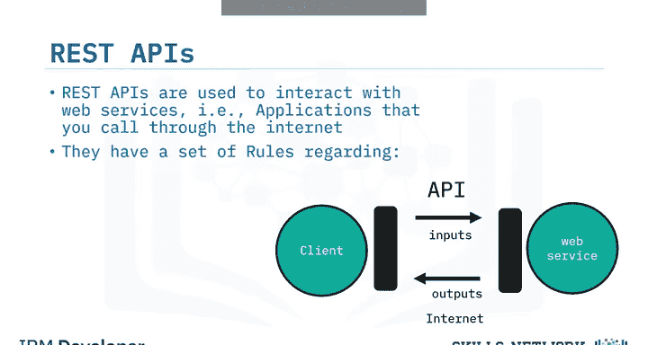

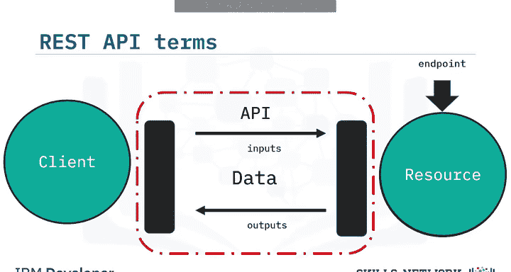

## 通过REST API发送请求与接收响应 🔄

通过发送**请求**来告诉REST API要做什么。请求通常通过HTTP消息进行通信，该消息通常包含一个文件，其中包含我们希望服务执行的操作指令。这个操作通过互联网传输到Web服务，然后服务执行该操作。

类似地，Web服务通过HTTP消息返回**响应**，信息通常通过文件返回，并传输回客户端。

## 实践示例：使用Pycoin Gecko获取加密货币数据 💹

加密货币数据非常适合用于API，因为它不断更新，对加密货币交易至关重要。我们将使用Pycoin Gecko（CoinGecko API的Python客户端或封装器）来获取每分钟更新的数据。我们使用这个封装器是因为它易于使用，让你可以专注于数据收集任务。我们还将介绍Pandas中处理时间序列数据的函数。

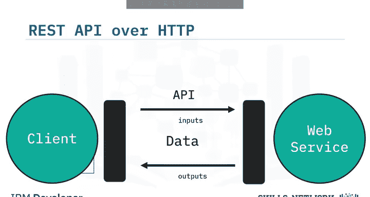

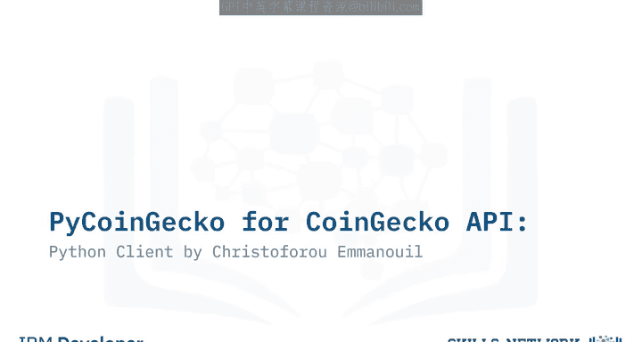

使用Pycoin Gecko收集数据很简单，步骤如下：

1.  安装并导入库。
2.  创建一个客户端对象。
3.  使用函数请求数据。

例如，在以下函数中，我们获取过去30天比特币兑美元的数据：

```python
# 示例代码：获取比特币价格数据
data = client.get_coin_market_chart_by_id(id='bitcoin', vs_currency='usd', days=30)
```

在这种情况下，我们的响应是一个JSON文件，表示为Python的嵌套列表字典，包含价格、市值和总交易量等信息，其中包含Unix时间戳和当时的价格。我们只对价格感兴趣，因此我们将使用键 `'price'` 来选取价格数据。

为了简化操作，我们可以将嵌套列表转换为具有`timestamp`和`price`两列的数据框。时间戳列难以理解，我们将使用Pandas的 `to_datetime()` 函数将其转换为更易读的格式。

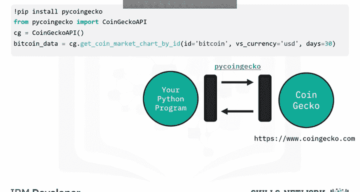

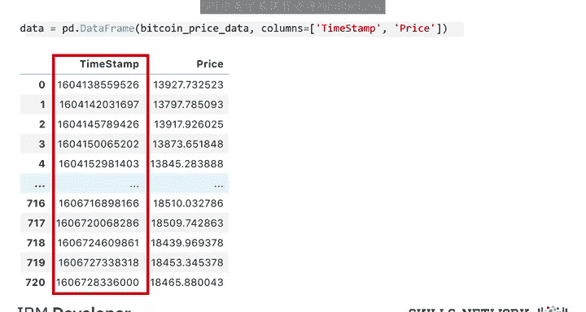

使用 `to_datetime()` 函数可以创建可读的时间数据。输入是时间戳列，时间单位设置为毫秒。我们将输出附加到新的 `date` 列。

现在，我们想创建一个K线图。为了获取每日K线的数据，我们将按日期分组，找出每天的最低、最高、开盘和收盘价。最后，我们将使用Plotly创建K线图并进行绘制。

现在，我们可以通过打开HTML文件并点击标签页左上角的“信任HTML”来查看K线图。它看起来应该类似这样。

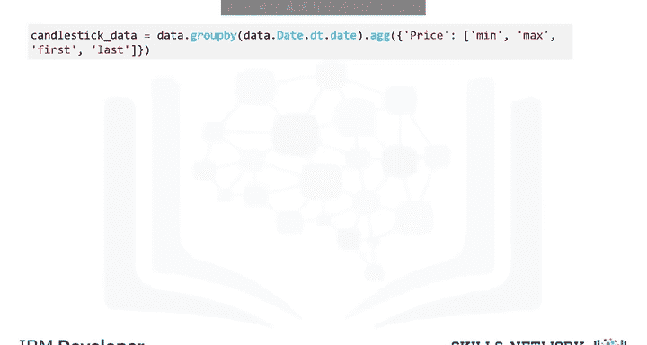

## 总结 📝

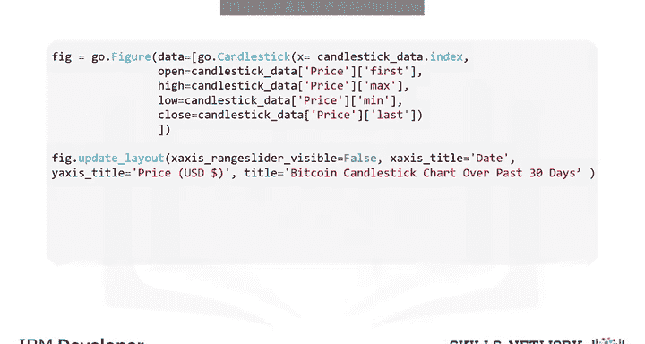

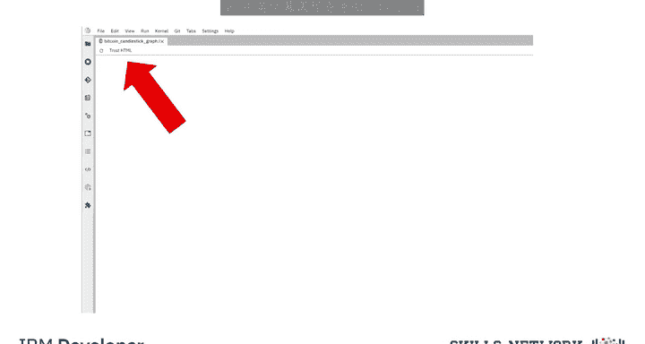


本节课中，我们一起学习了API的基础知识。我们了解了API如何作为软件组件间的通信桥梁，探讨了API库（如Pandas）和REST API的工作原理，包括客户端、资源、端点、请求和响应等核心概念。最后，我们通过一个使用Pycoin Gecko API获取并可视化比特币价格数据的实际例子，将理论应用于实践。