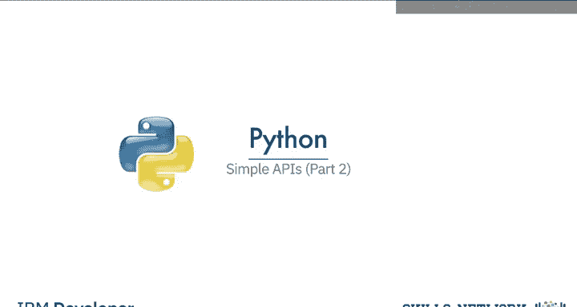
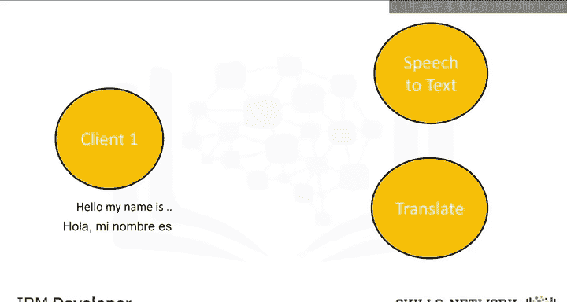
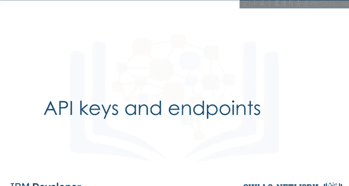
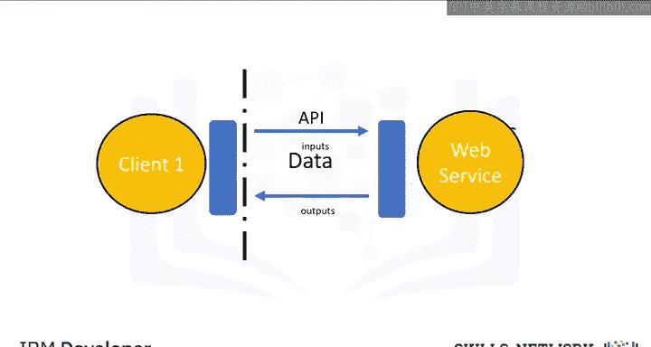
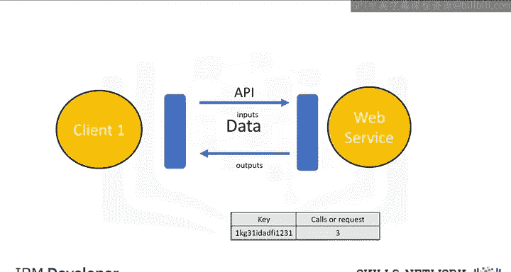
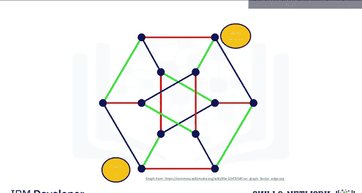

# 072：简单API（第2部分）🔌

在本节课中，我们将学习如何使用具备人工智能能力的应用程序接口。我们将通过一个具体示例，展示如何将音频文件转录为文本，再将文本翻译成另一种语言。整个过程将涉及两个IBM Watson API的调用。

上一节我们介绍了API的基本概念，本节中我们来看看如何实际调用两个具体的AI服务API。

## 概述：音频转录与翻译流程 🎤➡️📝➡️🌍

我们将按照以下步骤构建一个简单的AI应用：
1.  使用Watson语音转文本API转录一个音频文件。
2.  使用Watson语言翻译API将得到的文本翻译成另一种语言。

在API调用中，你需要向API发送一份音频文件的副本。这种操作通常被称为 **POST请求**。随后，API会在后台处理音频，并将说话内容的文本转录发送回来。这个返回过程可以理解为API发起了一个 **GET请求**。接着，我们将希望翻译的文本发送给第二个API。该API会翻译文本，并将译文返回给你。在本例中，我们将实现从英语到西班牙语的翻译。

在开始实践之前，我们需要先了解两个核心概念：API密钥和端点。

## API密钥与端点 🔑

首先，我们来回顾API密钥和端点。它们是访问API的凭证和地址。

### API密钥

API密钥是访问API的一种方式。它是一个独特的字符串，API通过它来识别和授权你的身份。通常，你的首次API调用就需要包含这个密钥，以便获得访问权限。

**核心概念**：`API_KEY = "your_unique_secret_string_here"`

在许多API服务中，每次调用都可能产生费用。因此，就像保护你的密码一样，你应该对API密钥保密。

### 端点

端点就是服务所在的位置。它用于在互联网上定位API，就像一个网址。

**核心概念**：`ENDPOINT_URL = "https://api.serviceprovider.com/v1/action"`

## Watson 服务介绍 🤖

接下来，我们简要了解一下本教程将用到的两个IBM Watson服务。

### Watson语音转文本

这项服务能够将音频和语音转换为书面文本。它适用于从客户服务对话到媒体内容字幕等多种场景。

### Watson翻译

这项服务提供动态的文本翻译功能，支持在多种语言之间进行快速、准确的翻译。

---

本节课中我们一起学习了如何利用API密钥和端点来访问AI服务，并概述了通过组合Watson语音转文本和Watson翻译API，实现从音频到跨语言文本的完整流程。理解这些基本组件是构建更复杂AI应用的第一步。