生成式人工智能工程：19：REST API：HTTP请求（第1部分）🚀

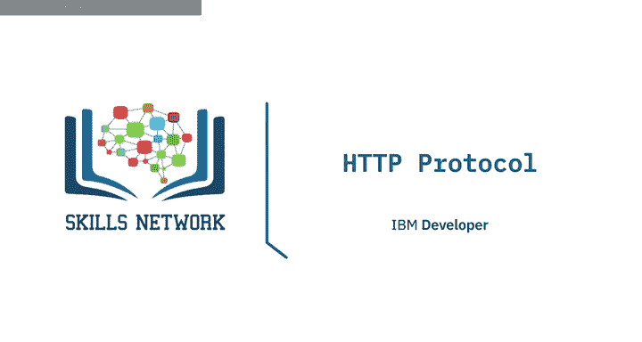

在本节课中，我们将要学习HTTP协议的基础知识，特别是统一资源定位符（URL）、HTTP请求与响应的结构，以及常见的HTTP方法和状态码。理解这些概念是使用REST API进行数据交互的关键。

上一节我们简要介绍了REST API。HTTP协议可以被视为通过网络传输信息的通用协议。这包括了多种类型的REST API。回想一下，REST API的工作原理是发送一个请求，而这个请求是通过HTTP消息进行通信的。

HTTP消息通常包含一个JSON文件。当你（客户端）访问一个网页时，你的浏览器会向托管该页面的服务器发送一个HTTP请求。服务器会尝试查找所需的资源，默认情况下是`index.html`。如果你的请求成功，服务器会在一个HTTP响应中将对象发送给客户端。这个响应包含了诸如资源类型、资源长度等信息。

下图中的表格代表了Web服务器中存储的资源列表，在这个例子中，是一个HTML文件、一个PNG图像和一个文本文件。当请求信息时，Web服务器会发送所请求的信息，也就是其中一个文件。

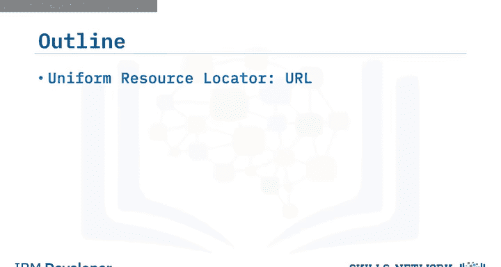

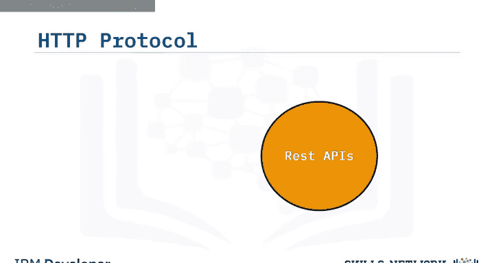

统一资源定位符（URL）是在网络上查找资源最常用的方式。我们可以将URL分解为三个部分。

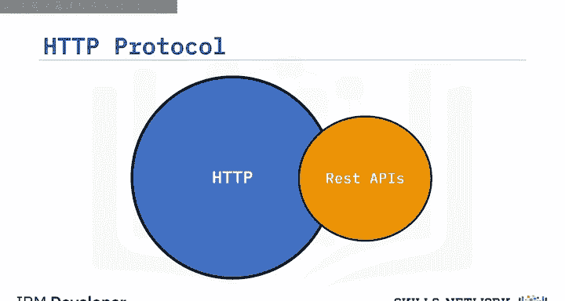

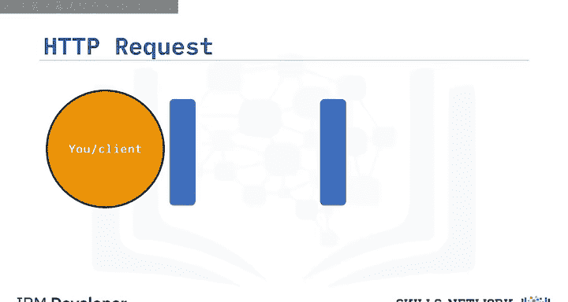

以下是URL的三个组成部分：

1.  **协议**：这是使用的协议。对于本实验，它始终是 `http://`。
2.  **网络地址或基础URL**：这用于定位资源。例如 `www.ibm.com` 或 `www.gitlab.com`。
3.  **路径**：这是资源在Web服务器上的具体位置。例如 `/images/ibm-logo.png`。

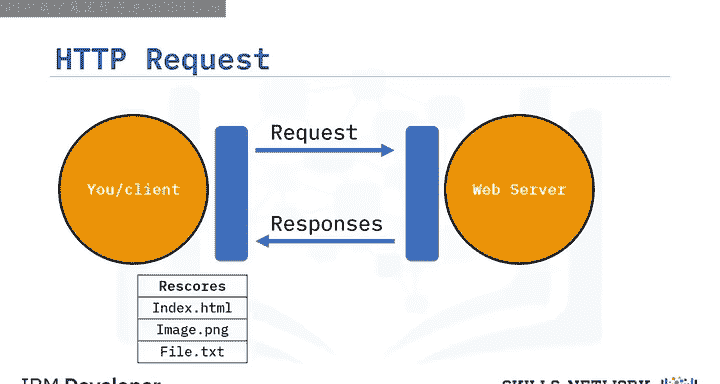

让我们回顾一下请求和响应的过程。以下是一个使用GET请求方法的请求消息示例。我们还可以使用其他HTTP方法。

在起始行中，我们有GET方法。这是一个HTTP方法。在这个例子中，它请求文件 `index.html`。

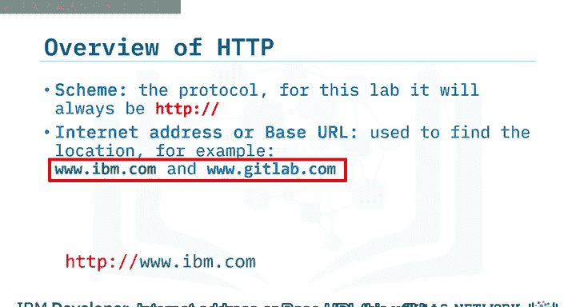

请求头通过HTTP请求传递附加信息。在GET方法中，请求头是空的。有些请求包含一个请求体，我们稍后会看到一个请求体的例子。

下面的表格代表了响应。响应起始行包含版本号，后跟一个描述性短语。在这个例子中，是 `HTTP/1.0`，状态码 `200`（表示成功），以及描述短语 `OK`。我们稍后会详细介绍状态码。响应头包含额外信息。最后，响应体包含请求的文件，在这个例子中是一个HTML文档。

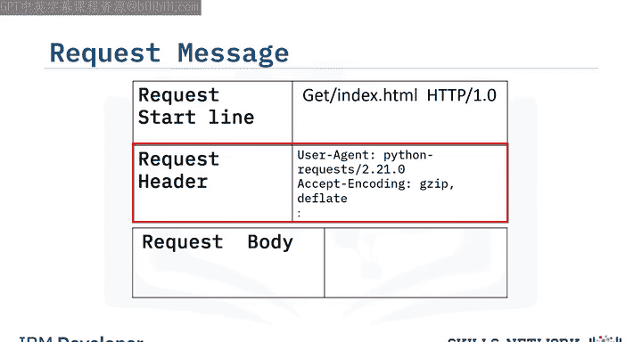

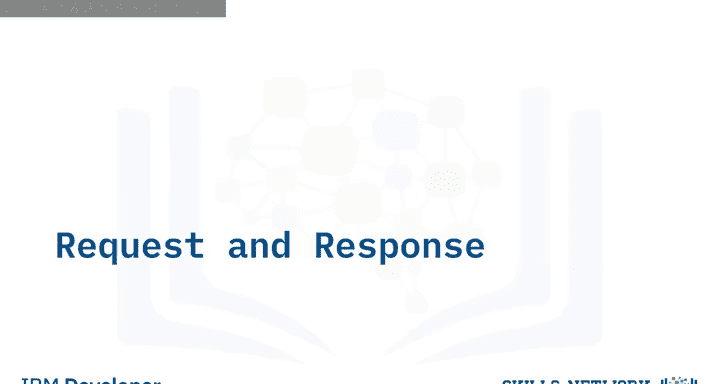

现在，让我们看看其他状态码。

状态码的前缀表示其类别。例如，100系列是信息性响应，200系列是成功响应，400系列表示客户端错误，500系列表示服务器错误。

以下是几个状态码示例：

*   **100**：一切正常，继续。
*   **200**：请求成功。
*   **401**：请求未授权。
*   **501**：服务器不支持请求的功能。

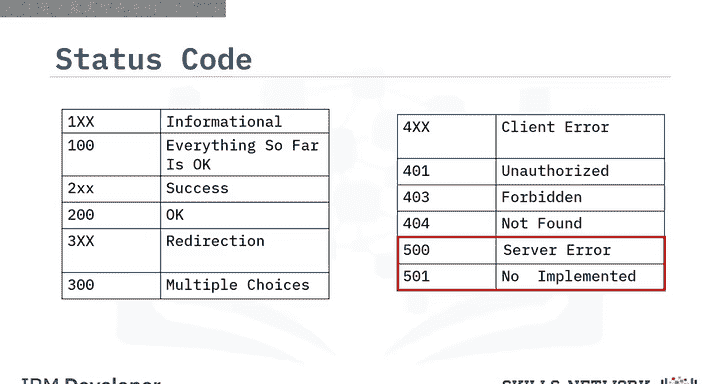

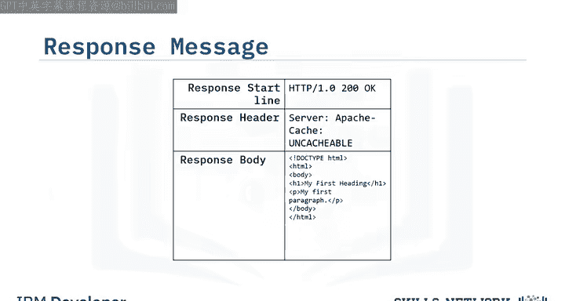

当发起一个HTTP请求时，会发送一个HTTP方法，它告诉服务器要执行什么操作。

以下是几种常见的HTTP方法：

*   **GET**：从服务器检索数据。
*   **POST**：向服务器发送数据。
*   **PUT**：更新服务器上的资源。
*   **DELETE**：删除服务器上的资源。

在下一个视频中，我们将使用Python来应用**GET方法**（从服务器检索数据）和**POST方法**（向服务器发送数据）。

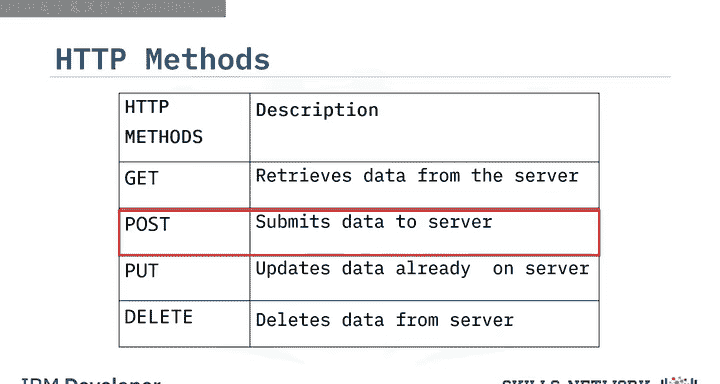

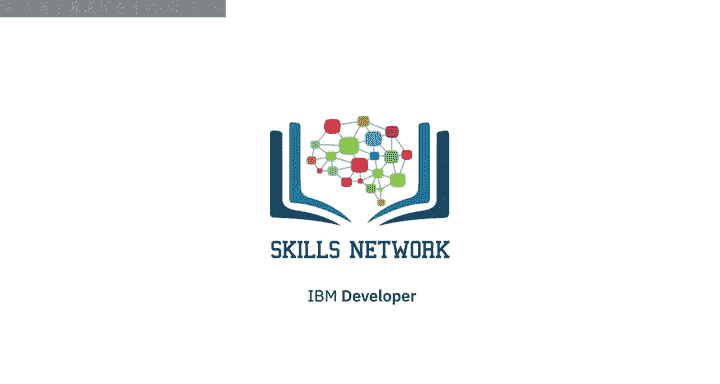

本节课中我们一起学习了HTTP协议的核心组成部分。我们了解了URL的结构，分析了HTTP请求和响应的格式，认识了常见的HTTP方法（如GET和POST）以及状态码的分类和含义。这些知识是理解和使用REST API进行网络通信的基础。在下一节，我们将动手使用Python来实践这些HTTP请求。